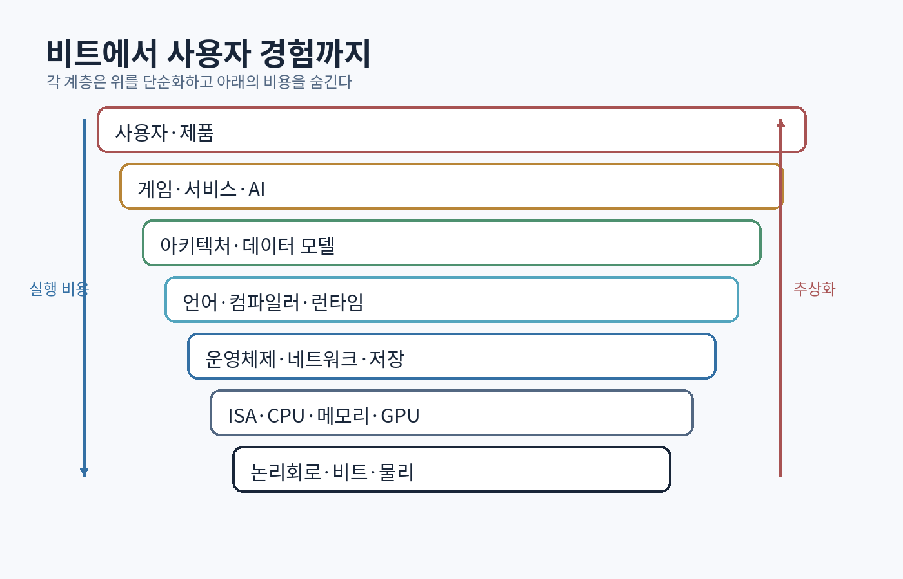

# 머리말: ‘최고의 프로그래머’라는 목표를 정확히 정의하기

이 책은 특정 언어의 문법을 빠르게 훑는 책이 아니다. 컴퓨터를 한 층씩 내려가며 이해하고, 다시 위로 올라오면서 **문제·데이터·추상화·실행 비용·실패 조건을 동시에 볼 수 있는 프로그래머**를 만드는 장기 교과서다.

사용자가 원하는 표현은 “최고로 똑똑한 프로그래머”다. 그러나 실무에서 최고 수준을 가르는 것은 기억한 API 수가 아니다. 다음 능력들이 결합되어야 한다.

1. 문제를 모호한 요구사항에서 검증 가능한 명세로 바꾼다.
2. 추상화를 사용할 때 그 아래에서 실제로 일어나는 일을 설명한다.
3. 객체 수명, 동시성, 네트워크, 저장장치 같은 실패 경계를 먼저 찾는다.
4. 정답을 추측하지 않고 실험·측정·증명으로 좁힌다.
5. 작은 시스템을 끝까지 완성하고, 결과를 읽을 수 있는 문서로 남긴다.
6. 새로운 기술이 등장해도 역사적 계보와 기본 원리로 빠르게 해석한다.

> **똑똑한 프로그래머는 모든 것을 아는 사람이 아니라, 모르는 것을 정확하게 표시하고 가장 싼 실험으로 불확실성을 줄이는 사람이다.**

## 이 책 한 권의 범위

책은 다음 연결을 끊지 않는다.

```text
수학적 계산 가능성
→ 불 대수와 논리회로
→ 명령어 집합과 CPU
→ 메모리 계층과 운영체제
→ 프로그래밍 언어와 컴파일러
→ 알고리즘과 데이터 구조
→ 네트워크·데이터베이스·분산 시스템
→ 소프트웨어 아키텍처·테스트·성능·보안
→ 그래픽스·게임 엔진·AI 시스템
```


{#fig-full-stack}

 반대로 연결을 이해하면 새로운 프레임워크나 언어가 나타나도 다음 질문으로 분석할 수 있다.

- 이 추상화는 어떤 비용을 숨기는가?
- 데이터는 어디에 있고 누가 소유하는가?
- 순서와 시간은 어떻게 정의되는가?
- 실패하면 어떤 상태가 남는가?
- 정확성을 어떻게 검증할 수 있는가?
- 규모가 열 배가 되면 무엇이 먼저 무너지는가?

## 책이 약속하는 것과 약속하지 않는 것

이 책을 **읽기만** 해서 최고가 되는 일은 없다. 프로그래밍은 수행 능력이다. 피아노 교본을 읽었다고 연주자가 되지 않는 것과 같다.

대신 이 책은 다음을 제공한다.

- 컴퓨터 역사와 핵심 논문의 계보
- 비트부터 분산 시스템까지 이어지는 정신 모델
- C++20 중심의 풍부한 코드 예제
- Python·의사 어셈블리·SQL·HLSL 보조 예제
- 실패하는 코드와 고친 코드
- 250개 이상의 연습·설계·구현 과제
- 52주 학습 일정과 4개의 최종 프로젝트
- 논문 읽기 질문과 기술 면접 질문
- 실제로 컴파일되는 동반 실습 코드

책의 핵심 장과 실습을 완수하면 “무슨 기술을 써봤다”가 아니라 다음을 증명할 수 있다.

> **작은 컴퓨터를 에뮬레이션하고, 언어를 해석하며, 동시성·저장·네트워크를 포함한 시스템을 설계하고, 게임 루프와 렌더링까지 측정 가능한 방식으로 구현할 수 있다.**

## 학습 방법: 네 번 통과한다

### 1회차 — 지도를 만든다

처음에는 세부를 모두 외우지 않는다. 각 장의 핵심 질문, 계층 관계, 낯선 용어를 표시한다. 장 끝의 “60초 설명”을 자신의 말로 적는다.

### 2회차 — 예제를 닫고 재구현한다

코드를 읽는 것과 작성하는 것은 다른 능력이다. 예제를 실행한 뒤 책을 닫고 빈 파일에서 다시 작성한다. 컴파일 오류를 피하지 말고 해석한다.

### 3회차 — 요구사항을 바꾼다

예제의 크기, 입력, 실패 조건, 자료형을 바꾼다. 정상 경로보다 경계 조건을 먼저 만든다.

예:

- 8비트 덧셈기를 16비트로 바꾼다.
- 단일 스레드 큐를 다중 생산자 환경으로 바꾼다.
- 메모리 안의 키-값 저장소에 충돌 복구를 추가한다.
- 게임 상태 머신에 중단 가능한 공격과 무적 프레임을 추가한다.

### 4회차 — 측정하고 설명한다

성능, 메모리, 오류율을 기록한다. “빠르다” 대신 실험 조건과 수치를 적는다. 설계 선택을 3분 안에 설명하고, 반대 선택의 장단점도 말한다.

## 지식의 네 등급

| 등급 | 상태 | 판정 질문 |
|---|---|---|
| 0 | 들어본 적 없음 | 용어를 정의하지 못함 |
| 1 | 인식 | 설명을 들으면 이해하지만 재현하지 못함 |
| 2 | 설명 | 자신의 말과 작은 예로 설명 가능 |
| 3 | 구현 | 빈 프로젝트에서 구현하고 테스트 가능 |
| 4 | 판단 | 조건에 따라 여러 설계의 트레이드오프를 비교 가능 |
| 5 | 창조·교육 | 새 문제에 적용하고 타인의 설계를 리뷰 가능 |

“공부했다”는 표현 대신 각 주제의 등급을 기록한다. 취업 가능한 기반은 핵심 주제에서 평균 3, 강점 분야에서 4 이상이다.

## 학습 기록 양식

```text
날짜:
장/주제:
내가 세운 가설:
직접 구현한 것:
처음 실패한 이유:
도구로 확인한 증거:
수정한 설계:
성능/정확성 수치:
60초 설명:
다음 복습일: +1일 / +7일 / +30일
```

## 읽기 전에 설치할 도구

- Git
- CMake 3.24 이상
- C++20 컴파일러: MSVC, Clang 또는 GCC
- Python 3
- 디버거: Visual Studio Debugger, LLDB 또는 GDB
- AddressSanitizer·UndefinedBehaviorSanitizer
- 정적 분석: clang-tidy 또는 동등 도구
- 선택: Linux 환경 또는 WSL, Wireshark, SQLite, RenderDoc, Unreal Engine

도구 버전은 바뀐다. 이 책은 특정 버튼 위치보다 **명령을 재현하고 출력의 의미를 해석하는 능력**을 목표로 한다.

# 전체 학습 지도

| 부 | 핵심 질문 | 대표 산출물 |
|---|---|---|
| I. 역사와 계산 | 컴퓨터는 어떤 문제를 해결하려고 발전했는가? | 사건·아이디어 연결 연표 |
| II. 비트와 하드웨어 | `0`과 `1`이 어떻게 명령을 실행하는가? | 8비트 CPU 에뮬레이터 |
| III. 운영체제 | 여러 프로그램이 한 컴퓨터를 어떻게 안전하게 공유하는가? | 메모리·스케줄링 실험 |
| IV. 언어와 컴파일러 | 텍스트가 기계어가 되는 동안 무슨 일이 일어나는가? | 작은 언어와 바이트코드 VM |
| V. 알고리즘 | 정확성과 비용을 어떻게 증명하는가? | 알고리즘 실험 보고서 |
| VI. 데이터와 분산 | 시간이 하나가 아닌 세계에서 상태를 어떻게 맞추는가? | WAL 키-값 저장소·복제 모델 |
| VII. 아키텍처 | 변경을 어디에 가두어야 하는가? | 모듈화된 게임/서비스 코어 |
| VIII. 품질과 성능 | 어떻게 틀렸음을 빨리 발견하고 병목을 증명하는가? | 테스트·프로파일링 보고서 |
| IX. 보안과 신뢰성 | 공격자와 고장이 있는 세계에서 무엇을 보장하는가? | 위협 모델과 실패 주입 |
| X. 게임·그래픽스·AI | 실시간 시스템은 여러 기초를 어떻게 결합하는가? | 미니 엔진 또는 액션 데모 |

## 첫 번째 원칙: 역사에서 ‘왜’를 찾는다

컴퓨터 역사는 오래된 제품 이름을 외우는 과목이 아니다. 저장 프로그램 방식, 운영체제, 고급 언어, 관계형 데이터베이스, 인터넷 프로토콜은 각각 이전 방식의 구체적인 한계를 해결하려고 등장했다. 그 배경을 알면 기술의 장점뿐 아니라 설계의 경계도 보인다.

## 두 번째 원칙: 추상화를 존중하되 신뢰하지 않는다

좋은 추상화는 사고량을 줄인다. 하지만 성능·정확성·보안 문제가 생기면 아래 계층으로 내려갈 수 있어야 한다.

```text
"벡터에 원소를 추가했다"
→ 용량이 충분했는가?
→ 재할당이 일어났는가?
→ 기존 포인터와 반복자가 무효화되었는가?
→ 할당기가 어느 스레드에서 잠금을 잡았는가?
→ 캐시 미스와 메모리 대역폭은 어떠한가?
```

## 세 번째 원칙: 완성한 시스템이 이해의 증거다

교재의 마지막 목표는 지식을 많이 나열하는 것이 아니다. 다음 네 프로젝트를 점진적으로 완성하는 것이다.

1. **Tiny-8**: 8비트 CPU와 어셈블러
2. **Mori**: 표현식 언어, 파서, 바이트코드 VM
3. **StoneKV**: 로그 기반 키-값 저장소와 충돌 복구
4. **Apex Runtime**: 고정 시간 게임 루프, 핸들, 작업 시스템, 이벤트, 렌더 추출

이 프로젝트들은 서로 분리되어 보이지만 결국 같은 질문으로 수렴한다.

- 상태는 어떻게 표현되는가?
- 명령은 어떤 순서로 적용되는가?
- 실패 전후의 불변식은 무엇인가?
- 데이터와 코드는 어느 계층에 배치되는가?
- 비용을 어떻게 측정하는가?

이제 계산이 기계가 되기 전의 역사부터 시작한다.
