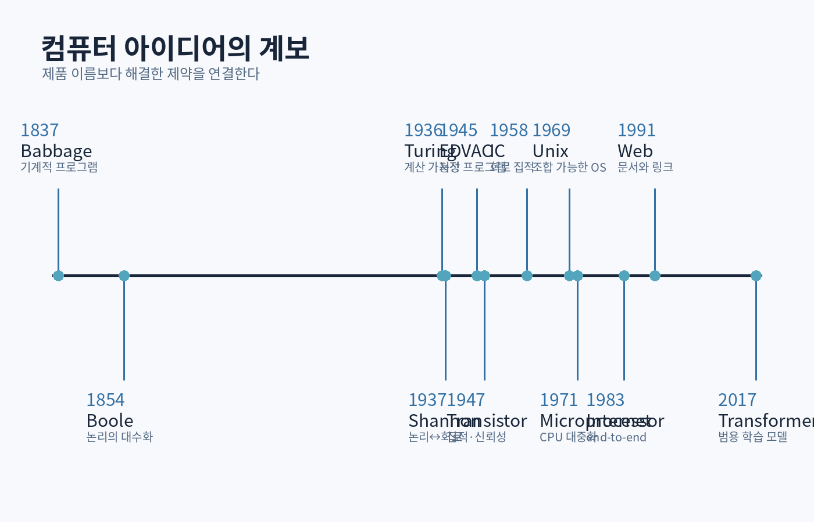

# 제1부 — 계산의 역사와 프로그래머의 정신 모델

{#fig-history}

# 1장. 컴퓨터 이전의 계산: 도구, 표, 알고리즘

## 1.1 계산은 원래 사람의 직업이었다

‘Computer’는 처음부터 기계를 뜻하지 않았다. 천문·항해·측량·탄도 계산을 반복 수행하는 사람을 가리키던 말이었다. 이 사실은 컴퓨터의 본질을 잘 보여준다. 컴퓨터는 생각을 대신하는 신비한 상자가 아니라, **명확한 규칙으로 분해된 절차를 반복 실행하는 장치**다.

초기 계산 도구는 세 가지 문제를 해결했다.

- 사람의 작업 기억이 작다.
- 긴 계산에서 실수가 누적된다.
- 같은 계산을 여러 번 반복해야 한다.

주판은 자릿값을 물리적 위치로 외부화했다. 로그표는 곱셈을 덧셈으로 바꾸는 수학적 변환을 미리 계산해 두었다. 계산자는 자신의 머릿속이 아니라 **표현과 절차**에 지능을 분산했다.

### 프로그래머에게 남은 교훈

오늘날 라이브러리, 인덱스, 캐시, 미리 계산된 테이블도 같은 원리다.

```cpp
// 매 프레임 sin을 반복 계산하는 대신 제한된 조건에서 표를 사용할 수 있다.
class SinLookup {
public:
    explicit SinLookup(std::size_t samples) : table_(samples) {
        for (std::size_t i = 0; i < samples; ++i) {
            const double angle = 2.0 * std::numbers::pi * i / samples;
            table_[i] = std::sin(angle);
        }
    }

    double approximate(double normalizedTurn) const {
        normalizedTurn -= std::floor(normalizedTurn);
        const auto index = static_cast<std::size_t>(normalizedTurn * table_.size())
                         % table_.size();
        return table_[index];
    }
private:
    std::vector<double> table_;
};
```

이 선택에는 항상 교환이 있다. 계산 시간을 줄이는 대신 메모리와 근사 오차를 사용한다. 최고 수준의 프로그래머는 ‘최적화 기법’을 외우기 전에 **무엇을 미리 계산하고 무엇을 실행 중 계산할지**를 판단한다.

## 1.2 파스칼과 라이프니츠: 연산을 기계 구조로 바꾸다

17세기 기계식 계산기는 톱니바퀴의 위치를 숫자로, 회전을 덧셈과 자리올림으로 대응시켰다. 핵심은 숫자가 물질이 된 것이 아니라, **표현 규칙과 물리 상태 사이에 일관된 대응**이 생긴 것이다.

프로그래밍도 동일하다.

```text
현실의 체력 → 정수 필드 health
피격 → health = max(0, health - damage)
사망 → health == 0이라는 불변식과 상태 전환
```

표현을 선택하는 순간 가능한 연산과 오류의 종류가 정해진다. 체력을 부호 없는 정수로 만들면 음수가 없다는 장점이 있지만, 잘못된 뺄셈이 큰 양수로 언더플로할 수 있다. 모델은 현실을 그대로 담지 않는다. 모델은 필요한 질문에 답하기 위해 현실을 제한한다.

## 1.3 자카드 직기와 천공 카드: 데이터가 제어가 되다

천공 카드의 구멍 패턴은 직조기의 동작을 제어했다. 동일한 기계가 카드만 바꾸어 다른 무늬를 만들 수 있었다. 여기서 중요한 전환은 **기계의 구조와 실행할 명령을 분리**한 것이다.

현대 시스템에서 같은 아이디어는 여러 형태로 반복된다.

- 실행 파일과 CPU
- 셰이더 바이트코드와 GPU
- 데이터 주도 게임플레이 설정
- SQL 쿼리와 데이터베이스 엔진
- CI 설정 파일과 빌드 실행기

다만 “모든 것을 데이터로 만들자”는 결론은 잘못이다. 데이터 형식도 하나의 언어이며, 검증·버전 관리·디버깅 도구가 필요하다.

## 1.4 배비지와 러브레이스: 범용 기계의 설계

찰스 배비지의 해석기관 구상은 저장, 연산, 제어, 입출력에 대응하는 구성요소를 포함했다. 에이다 러브레이스의 주석은 기계가 숫자 계산을 넘어, 규칙으로 표현 가능한 기호를 다룰 수 있다는 관점을 보여준다.

이 지점에서 ‘프로그램’은 단순한 숫자 입력이 아니라 다음 요소를 갖기 시작한다.

- 명령 순서
- 반복
- 조건
- 중간 결과 저장
- 재사용 가능한 조작 단위

### 사고 실험

게임의 전투 콤보를 데이터로 정의한다고 하자.

```json
{
  "name": "light_combo_1",
  "duration_ms": 480,
  "damage": 20,
  "cancel_window": [280, 410],
  "next": ["light_combo_2", "dodge"]
}
```

이것은 단순 데이터인가, 프로그램인가? 실행기가 조건과 상태 전이를 해석한다면 사실상 작은 언어다. 따라서 다음이 필요하다.

- 문법 또는 스키마
- 유효성 검사
- 실행 의미
- 오류 위치
- 버전 호환
- 테스트

## 1.5 알고리즘은 코드보다 오래간다

‘알고리즘’이라는 말은 알콰리즈미의 이름에서 유래한 것으로 알려져 있지만, 절차적 계산은 훨씬 오래되었다. 유클리드 호제법은 구현 언어가 바뀌어도 본질이 유지된다.

```cpp
constexpr int gcd(int a, int b) {
    a = std::abs(a);
    b = std::abs(b);
    while (b != 0) {
        const int remainder = a % b;
        a = b;
        b = remainder;
    }
    return a;
}
```

이 코드의 핵심은 문법이 아니라 불변식이다.

```text
gcd(a, b) == gcd(b, a mod b)
```

반복이 끝날 때 `b == 0`이고, 그때 `a`가 최대공약수다. 좋은 프로그래머는 코드 줄을 따라가는 것에서 멈추지 않고, **각 반복에서 무엇이 보존되는지** 찾는다.

<div class="exercise">

### 1장 연습

1. 십진수 자릿값과 배열 인덱스의 공통점을 설명하라.
2. 계산 시간을 메모리로 바꾸는 사례를 세 가지 찾고, 언제 손해가 되는지 적어라.
3. 콤보 JSON에 순환 참조가 생겼을 때 검출하는 알고리즘을 설계하라.
4. 유클리드 호제법의 종료 이유를 자연어로 증명하라.
5. 현실의 ‘아이템’을 데이터 구조로 모델링할 때 잃어버리는 정보를 다섯 가지 적어라.

</div>

# 2장. 논리와 계산 가능성: 무엇을 기계적으로 풀 수 있는가

## 2.1 불 대수: 참과 거짓을 계산 대상으로 만들다

조지 불은 논리 명제를 대수적 연산으로 다루는 체계를 발전시켰다. 이후 클로드 섀넌은 스위치와 릴레이 회로가 불 대수로 분석될 수 있음을 보였다. 스위치가 열렸는지 닫혔는지를 `0`과 `1`로 대응하면, 논리식이 실제 회로가 된다. 섀넌의 연구 계보는 디지털 논리의 핵심 연결고리다. [[Shannon 1938/1949 자료](https://archive.org/details/bstj28-1-59)]

기본 연산은 단순하다.

| A | B | `A AND B` | `A OR B` | `A XOR B` |
|---:|---:|---:|---:|---:|
| 0 | 0 | 0 | 0 | 0 |
| 0 | 1 | 0 | 1 | 1 |
| 1 | 0 | 0 | 1 | 1 |
| 1 | 1 | 1 | 1 | 0 |

하지만 이 단순한 연산의 조합으로 덧셈기, 비교기, 메모리, CPU를 만들 수 있다.

### 반가산기

```text
sum   = A XOR B
carry = A AND B
```

```cpp
struct HalfAdderResult {
    bool sum;
    bool carry;
};

constexpr HalfAdderResult half_add(bool a, bool b) {
    return {a != b, a && b};
}
```

문법적으로는 하찮아 보이지만, 이 함수는 논리식·진리표·회로라는 세 표현이 동일한 의미를 가진다는 사실을 보여준다.

## 2.2 명제, 술어, 사양

프로그램의 정확성도 논리로 표현할 수 있다.

```cpp
int clamp_health(int value) {
    return std::clamp(value, 0, 100);
}
```

사전조건과 사후조건:

```text
입력: value는 모든 int 가능
출력: 0 <= result <= 100
추가 성질:
  value < 0   → result == 0
  0<=value<=100 → result == value
  value > 100 → result == 100
```

이런 성질은 테스트 케이스의 목록보다 강하다. 테스트는 몇 입력을 확인하지만, 사양은 모든 입력에 대해 요구를 말한다.

## 2.3 튜링 기계: 계산 절차의 최소 모델

앨런 튜링은 1936년 논문에서 유한한 규칙, 상태, 읽고 쓸 수 있는 테이프를 가진 추상 기계를 정의했다. 목적은 실제 컴퓨터 설계가 아니라 ‘기계적으로 계산 가능하다’는 말의 의미를 엄밀하게 만드는 것이었다. [[Turing 1936](https://www.cs.virginia.edu/~robins/Turing_Paper_1936.pdf)]

튜링 기계의 구성:

- 무한하다고 가정한 테이프
- 현재 한 칸을 읽고 쓰는 헤드
- 유한한 상태 집합
- `(현재 상태, 읽은 기호)`에서 `(쓸 기호, 이동, 다음 상태)`로 가는 규칙

현대 컴퓨터는 무한 테이프가 없지만, 추상화의 목적은 물리적 세부를 제거하고 계산의 경계를 연구하는 데 있다.

### 작은 상태 기계

짝수 개의 `1`을 가진 비트열을 판정하는 기계:

```cpp
enum class ParityState { Even, Odd };

constexpr bool has_even_ones(std::string_view bits) {
    ParityState state = ParityState::Even;
    for (char bit : bits) {
        if (bit == '1') {
            state = (state == ParityState::Even)
                  ? ParityState::Odd
                  : ParityState::Even;
        } else if (bit != '0') {
            throw std::invalid_argument("binary input required");
        }
    }
    return state == ParityState::Even;
}
```

이 함수는 입력 길이와 무관하게 두 상태만 필요하다. 반면 괄호 중첩 깊이를 무제한으로 검사하려면 스택 같은 추가 기억장치가 필요하다. 문제를 푸는 데 필요한 기억의 종류는 계산 모델과 직접 연결된다.

## 2.4 보편 기계와 프로그램을 데이터로 보는 관점

보편 튜링 기계는 다른 기계의 설명과 입력을 받아 그 기계를 모사할 수 있다. 현대식으로 말하면, 하나의 하드웨어가 프로그램 파일을 데이터로 읽어 여러 작업을 수행한다.

이 아이디어는 다음의 공통 기반이다.

- 에뮬레이터
- 가상 머신
- 인터프리터
- JIT 컴파일러
- 플러그인 시스템
- 셰이더 컴파일러

프로그램과 데이터의 경계가 문맥에 따라 바뀐다는 점은 강력하지만 보안 위험도 만든다. 문자열을 SQL이나 셸 명령으로 해석하면, 신뢰할 수 없는 데이터가 프로그램이 될 수 있다.

## 2.5 정지 문제: 모든 버그를 자동으로 판정할 수 없는 이유

어떤 프로그램과 입력이 주어졌을 때 그 프로그램이 끝나는지 항상 판정하는 일반 알고리즘은 존재하지 않는다. 이는 도구가 쓸모없다는 말이 아니다. 모든 경우를 완벽히 판정할 수 없다는 뜻이다.

정적 분석기는 다음 중 하나를 선택한다.

- 일부 버그를 놓친다.
- 안전한 코드도 의심한다.
- 분석 가능한 언어·패턴을 제한한다.
- 사용자가 불변식이나 주석을 제공하게 한다.

이 한계를 이해하면 도구를 맹신하거나 무시하지 않는다. **도구가 보장하는 범위와 가정을 읽는다.**

## 2.6 복잡도: 계산 가능과 현실적 계산은 다르다

문제가 계산 가능해도 필요한 시간이 우주의 수명보다 길 수 있다. 따라서 프로그래머는 두 질문을 구분한다.

1. 답을 계산할 수 있는가?
2. 주어진 자원 안에서 계산할 수 있는가?

게임 AI의 경로 탐색, 컴파일러 최적화, 스케줄링은 완벽한 최적해보다 제한 시간 내 좋은 해가 중요할 수 있다.

<div class="paper">

### 논문 읽기: Turing 1936

처음부터 수식을 모두 이해하려 하지 말고 다음 질문에 답한다.

1. 튜링은 왜 ‘사람이 종이에 기호를 쓰는 계산’을 분석했는가?
2. 기계의 상태가 유한해야 하는 이유는 무엇인가?
3. 보편 기계가 현대 소프트웨어에 남긴 관점은 무엇인가?
4. 계산 불가능성은 실무 도구의 한계와 어떻게 연결되는가?

</div>

# 3장. 전자식 컴퓨터와 저장 프로그램 방식

## 3.1 릴레이에서 진공관으로

기계식·전기기계식 장치는 물리적 이동 때문에 속도와 내구성에 한계가 있었다. 진공관을 스위치로 사용한 전자식 계산기는 움직이는 부품 없이 빠르게 상태를 바꿀 수 있었다. ENIAC은 1943년에 개발이 시작되어 1946년 공개되었고, 약 18,000개의 진공관을 사용한 대형 전자식 계산 시스템이었다. [[Computer History Museum](https://www.computerhistory.org/timeline/computers/)]

하지만 빠른 연산만으로 충분하지 않았다. 프로그램 변경을 위해 케이블과 스위치를 다시 구성하는 작업이 필요했다. 연산 장치는 빨라도 **프로그램을 준비하는 과정**이 병목이었다.

## 3.2 저장 프로그램: 명령과 데이터를 같은 기억장치에

1945년 EDVAC 보고서 초안은 연산 장치, 제어 장치, 기억 장치, 입출력이라는 구조와 명령을 기억장치에 저장하는 관점을 널리 전파했다. [[von Neumann 1945](https://web.mit.edu/STS.035/www/PDFs/edvac.pdf)]

저장 프로그램 구조의 장점:

- 프로그램 변경이 배선 변경보다 빠르다.
- 프로그램을 복사·저장·전송할 수 있다.
- 프로그램이 다른 프로그램을 생성하거나 수정할 수 있다.
- 조건 분기와 반복을 일반적으로 표현할 수 있다.

위험:

- 코드와 데이터가 같은 메모리에 있어 코드 주입과 손상이 가능하다.
- 명령과 데이터가 같은 경로를 공유해 병목이 생길 수 있다.
- 자기 수정 코드는 이해와 최적화를 어렵게 한다.

## 3.3 명령어를 해석하는 최소 CPU

가상의 8비트 CPU를 생각하자.

```text
레지스터: A, B, PC, FLAGS
메모리: 256 바이트
명령:
  0x10 imm  → A = imm
  0x11 addr → A = memory[addr]
  0x12 addr → memory[addr] = A
  0x20 imm  → A = A + imm
  0x30 addr → PC = addr
  0x31 addr → if A == 0 then PC = addr
  0xFF      → halt
```

실행 루프:

```cpp
while (!halted) {
    const std::uint8_t opcode = memory[pc++]; // fetch
    switch (opcode) {                        // decode
        case 0x10: a = memory[pc++]; break;  // execute
        case 0x20: a = static_cast<std::uint8_t>(a + memory[pc++]); break;
        case 0x30: pc = memory[pc]; break;
        case 0x31: {
            const auto target = memory[pc++];
            if (a == 0) pc = target;
            break;
        }
        case 0xFF: halted = true; break;
        default: throw InvalidOpcode{opcode};
    }
}
```

현대 CPU는 훨씬 복잡하지만, 기본 정신 모델은 유지된다.

```text
fetch → decode → execute → state update
```

## 3.4 폰 노이만 병목을 정확히 이해하기

‘CPU와 메모리 사이가 느리다’는 한 문장만 외우면 부족하다. 실제 성능은 계층적이다.

- 레지스터
- L1/L2/L3 캐시
- DRAM
- SSD·네트워크 저장소

CPU는 다음 명령을 예측하고, 데이터를 미리 가져오며, 여러 명령을 겹쳐 실행한다. 프로그램의 데이터 배치와 접근 패턴이 중요해진다.

```cpp
struct ParticleAoS {
    float x, y, z;
    float vx, vy, vz;
    float lifetime;
    std::uint32_t color;
};

struct ParticleSoA {
    std::vector<float> x, y, z;
    std::vector<float> vx, vy, vz;
    std::vector<float> lifetime;
};
```

위 두 표현 중 어느 것이 항상 빠른 것은 아니다. 위치만 대량 갱신한다면 SoA가 연속 접근과 SIMD에 유리할 수 있다. 한 입자를 여러 필드와 함께 처리한다면 AoS가 단순하고 지역성이 좋을 수 있다. 측정해야 한다.

## 3.5 명령어와 의미의 계층

같은 소스 코드도 여러 표현을 거친다.

```text
C++ 표현식
→ 컴파일러 중간 표현
→ 기계 명령
→ 마이크로-연산
→ 회로의 전압 상태 변화
```

각 계층은 아래의 세부를 숨기고 위에 안정적인 모델을 제공한다. 버그나 성능 문제가 생겼을 때 어느 계층까지 내려갈지 판단하는 능력이 시스템 프로그래밍의 핵심이다.

<div class="lab">

### 미니 프로젝트: Tiny-8 1단계

1. 256바이트 메모리와 레지스터를 가진 CPU 클래스를 만든다.
2. `LOAD_IMM`, `ADD_IMM`, `STORE`, `JUMP`, `JZ`, `HALT`를 구현한다.
3. 잘못된 명령어와 메모리 범위를 검사한다.
4. 각 사이클의 `PC`, opcode, A를 추적 로그로 출력한다.
5. 1부터 10까지 더하는 프로그램을 바이트 배열로 작성한다.

통과 기준: 프로그램을 보지 않고 fetch-decode-execute 루프를 다시 작성하고, 분기 명령의 `PC` 증가 순서를 설명할 수 있다.

</div>

# 4장. 트랜지스터, 집적회로, 마이크로프로세서

## 4.1 더 작고 신뢰할 수 있는 스위치

1947년 트랜지스터의 발명은 진공관보다 작고 낮은 전력으로 신호를 증폭·스위칭할 수 있는 길을 열었다. 이후 집적회로는 여러 소자를 하나의 기판에 결합했다. 노벨상 자료는 트랜지스터와 집적회로가 현대 정보기술의 기반이 된 계보를 정리한다. [[Nobel Prize — integrated circuit history](https://www.nobelprize.org/prizes/physics/2000/kilby/lecture/)]

프로그래머가 반도체 물리를 깊게 알 필요는 없지만 다음 현실은 알아야 한다.

- 연산에는 전력과 열이 든다.
- 데이터 이동은 종종 연산보다 비싸다.
- 트랜지스터 수 증가가 단일 스레드 속도 증가로 자동 변환되지 않는다.
- 병렬성은 공짜가 아니며 동기화와 통신 비용이 있다.

## 4.2 집적도가 소프트웨어를 바꾸다

하드웨어 가격과 크기가 감소하면서 컴퓨터의 사용자가 연구소에서 기업, 개인, 휴대기기 사용자로 확대되었다. 규모의 변화는 소프트웨어의 목적을 바꾸었다.

| 시대 | 주요 제약 | 소프트웨어의 중심 문제 |
|---|---|---|
| 초기 대형기 | 기계 시간이 희소 | 처리량, 배치 작업 |
| 시분할 | 여러 사용자가 공유 | 격리, 스케줄링, 대화형 사용 |
| 개인용 컴퓨터 | 제한된 메모리·CPU | 사용성, 로컬 앱 |
| 인터넷 | 부분 실패·지연 | 프로토콜, 분산 상태 |
| 모바일 | 전력·무선·센서 | 배터리, 권한, 반응성 |
| 클라우드·AI | 거대한 규모와 가속기 | 자동화, 병렬성, 비용·신뢰성 |

좋은 설계는 시대의 제약에 대한 응답이다. 과거의 해결책을 맥락 없이 복제하면 안 된다.

## 4.3 마이크로프로세서와 범용성

1971년 공개된 Intel 4004 계열은 CPU 기능을 단일 칩에 통합한 초기 상용 마이크로프로세서의 대표 사례다. [[Computer History Museum — Intel 4004](https://www.computerhistory.org/revolution/digital-logic/12/285)]

범용 프로세서의 장점은 동일한 하드웨어가 소프트웨어 변경으로 여러 기능을 수행한다는 것이다. 반면 특정 작업은 전용 회로나 GPU, NPU가 훨씬 효율적일 수 있다.

### 범용성과 전문화의 반복

```text
범용 CPU
↔ 그래픽 전용 GPU
↔ 범용 GPU 컴퓨팅
↔ 행렬 연산 전용 AI 가속기
↔ 프로그래머블 셰이더·컴퓨트 파이프라인
```

최고 수준의 프로그래머는 “CPU가 좋다” 또는 “GPU가 빠르다”라고 말하지 않는다. 작업의 병렬성, 메모리 접근, 지연 요구, 개발 비용을 비교한다.

## 4.4 무어의 법칙을 신화로 만들지 않는다

무어의 관찰은 집적회로의 부품 수가 일정 기간에 빠르게 증가한 산업적 추세를 설명했다. 그것은 물리 법칙도, 모든 소프트웨어가 자동으로 빨라진다는 약속도 아니다.

성능 향상의 경로는 다음처럼 변화했다.

- 클럭 증가
- 더 깊은 파이프라인
- 명령 수준 병렬성
- 캐시 확대
- SIMD
- 멀티코어
- GPU와 전용 가속기
- 칩렛과 이기종 시스템

따라서 현대 프로그래머는 직렬 알고리즘만 알아서는 부족하지만, 모든 것을 스레드로 바꾸는 것도 답이 아니다.

## 4.5 에너지와 데이터 이동

대규모 시스템에서 중요한 질문:

```text
연산을 어디에서 할 것인가?
데이터를 옮길 것인가, 계산을 데이터 가까이 보낼 것인가?
정확도를 낮추고 처리량을 얻을 수 있는가?
캐시할 가치가 있는가?
```

게임 엔진의 리소스 스트리밍, 데이터베이스의 인덱스, ML의 배치 처리도 결국 데이터 이동을 관리하는 문제다.

# 5장. Unix, 네트워크, 개인용 컴퓨터, 오픈소스와 웹

## 5.1 운영체제는 하드웨어 공유의 정책이다

초기 컴퓨터에서는 한 작업이 기계를 독점했다. 시분할 시스템은 여러 사용자와 프로그램이 CPU, 메모리, 저장장치를 공유하게 만들었다. 운영체제는 단순한 드라이버 모음이 아니라 **자원 공유의 규칙과 보호 경계**다.

Unix는 작은 도구, 텍스트 스트림, 파일 중심 인터페이스, 프로세스 조합이라는 강력한 관습을 남겼다. Unix의 기원은 1969년 Bell Labs의 작업으로 거슬러 올라간다. [[Dennis Ritchie memorial, Princeton](https://www.cs.princeton.edu/~bwk/dmr.html)]

### 파이프라인 사고

```bash
cat server.log | grep ERROR | sort | uniq -c | sort -nr
```

각 도구는 제한된 일을 하고, 표준 입력과 출력이라는 공통 인터페이스로 결합된다. 이 구조는 모듈성과 재사용의 장점이 있지만, 구조화된 데이터 손실·오류 처리·성능 문제도 생길 수 있다.

## 5.2 네트워크: 지연과 부분 실패가 등장하다

한 프로세스 안에서는 함수 호출이 성공하거나 예외를 던지는 시점이 비교적 명확하다. 네트워크에서는 다음을 구분하기 어렵다.

- 요청이 도착하지 않았다.
- 요청은 처리되었지만 응답이 사라졌다.
- 상대가 느리다.
- 상대가 죽었다.
- 네트워크가 분리되었다.

이 때문에 재시도는 단순하지 않다.

```text
결제 요청 전송
→ 서버가 결제를 완료
→ 응답 패킷 유실
→ 클라이언트가 재시도
→ 중복 결제 위험
```

해결에는 멱등성 키, 트랜잭션, 중복 제거, 상태 조회 같은 설계가 필요하다.

## 5.3 개인용 컴퓨터와 상호작용

개인용 컴퓨터는 사용자가 프로그래머가 아니어도 직접 기계를 조작하게 했다. 그래픽 사용자 인터페이스, 마우스, 실시간 피드백은 소프트웨어의 품질 기준을 바꾸었다.

배치 작업에서는 총 처리 시간이 중요하지만, 대화형 시스템에서는 **꼬리 지연과 프레임 안정성**이 중요하다.

```text
평균 프레임 60 FPS라도
100프레임마다 100ms 멈추면 사용자는 끊김을 느낀다.
```

따라서 평균뿐 아니라 p95, p99, 최악 조건을 본다.

## 5.4 오픈소스: 코드뿐 아니라 협업 프로토콜

오픈소스의 가치는 무료 코드에만 있지 않다. 공개 저장소는 다음을 드러낸다.

- 변경의 역사
- 설계 논쟁
- 버그 보고
- 리뷰 기준
- 릴리스와 호환성 정책

똑똑한 프로그래머가 되려면 완성된 코드만 읽지 말고, 중요한 변경의 커밋·이슈·리뷰를 읽어야 한다. 왜 단순한 해결책이 거절되었는지 보면 실제 제약을 배운다.

## 5.5 웹과 클라우드: 컴퓨터가 서비스가 되다

웹은 하이퍼텍스트 문서에서 시작해 애플리케이션 플랫폼으로 확장되었다. 클라우드는 서버를 없앤 것이 아니라 서버의 생성·배포·측정·교체를 API로 만들었다.

새로운 추상화에도 오래된 질문이 남는다.

- 상태는 어디에 있는가?
- 장애 시 누가 복구하는가?
- 비용은 사용량과 어떻게 연결되는가?
- 관찰 가능한 정보는 충분한가?
- 공급자 종속을 감수할 이유가 있는가?

## 5.6 AI 시대의 프로그래머

코드 생성 도구는 문법 작성 비용을 낮춘다. 그만큼 다음 능력의 가치가 올라간다.

- 요구사항의 모순 발견
- 생성 코드의 수명·보안·동시성 검증
- 성능 측정
- 테스트 전략
- 시스템 경계 설계
- 근거가 있는 기술 선택

AI가 낸 코드는 증거가 아니다. 컴파일, 테스트, 정적 분석, 벤치마크, 문서 검토를 통과해야 한다.

<div class="check">

### 제1부 통과 기준

- 저장 프로그램 방식의 장점과 보안·성능 비용을 설명한다.
- 계산 가능성과 현실적 계산 비용을 구분한다.
- 프로그램과 데이터의 경계가 문맥에 따라 바뀌는 사례를 세 가지 든다.
- 하드웨어 변화가 운영체제·네트워크·사용자 인터페이스를 어떻게 바꾸었는지 연결한다.
- 기술의 장점만이 아니라 그 기술이 해결하려던 이전 제약을 말한다.

</div>
