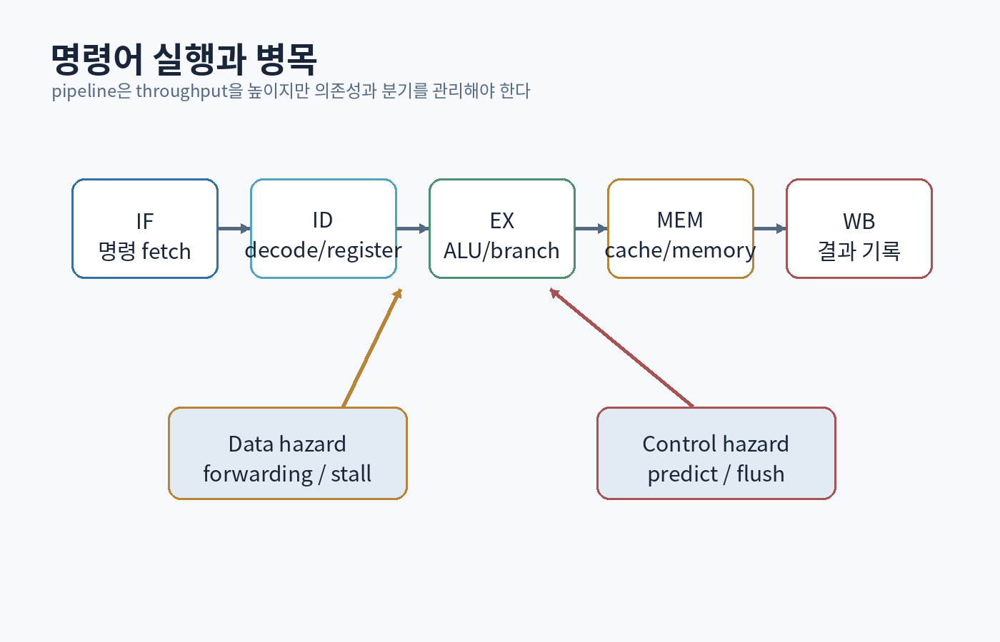
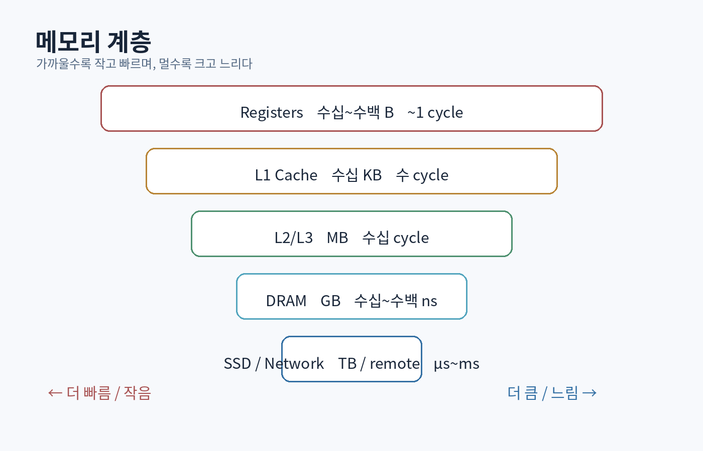

# 제2부 — 비트에서 CPU까지

{#fig-cpu-pipeline}

{#fig-memory-hierarchy}

# 6장. 수 표현: 같은 비트가 다른 의미가 되는 법

## 6.1 비트는 의미가 없다

비트열 `11111111`은 그 자체로 숫자 `255`가 아니다. 해석 규칙에 따라 다음이 될 수 있다.

- 부호 없는 8비트 정수 `255`
- 2의 보수 부호 있는 정수 `-1`
- 색상 채널의 최대값
- 명령어 `HALT`
- 문자 인코딩의 일부
- 여덟 개의 불리언 플래그

프로그래밍의 많은 오류는 값을 잘못 계산해서가 아니라 **비트의 해석 규칙을 혼동해서** 생긴다.

## 6.2 이진수와 자릿값

십진수 `507`은 다음과 같다.

```text
5×10² + 0×10¹ + 7×10⁰
```

이진수 `101101₂`는 다음과 같다.

```text
1×2⁵ + 0×2⁴ + 1×2³ + 1×2² + 0×2¹ + 1×2⁰ = 45
```

비트 연산을 이해하려면 암산보다 구조를 본다.

```cpp
constexpr bool is_power_of_two(std::uint32_t x) {
    return x != 0 && (x & (x - 1)) == 0;
}
```

2의 거듭제곱은 비트가 하나만 켜져 있다. `x - 1`은 그 비트를 끄고 아래 비트를 모두 켜므로 AND 결과가 0이다.

## 6.3 2의 보수와 오버플로

N비트 부호 있는 정수의 범위:

```text
-2^(N-1) ... 2^(N-1)-1
```

8비트라면 `-128 ... 127`이다. 2의 보수에서 `-x`는 비트를 반전하고 1을 더해 얻을 수 있다.

```text
  00000101  = 5
  11111010  = 비트 반전
+        1
-----------
  11111011  = -5
```

C++에서 부호 없는 정수 연산은 모듈러 산술로 정의되지만, 부호 있는 정수 오버플로는 일반적으로 미정의 동작이다. 컴파일러는 “오버플로가 일어나지 않는다”는 가정으로 최적화할 수 있다.

```cpp
bool add_overflow(std::int32_t a, std::int32_t b, std::int32_t& out) {
    const std::int64_t wide = static_cast<std::int64_t>(a) + b;
    if (wide < std::numeric_limits<std::int32_t>::min() ||
        wide > std::numeric_limits<std::int32_t>::max()) {
        return true;
    }
    out = static_cast<std::int32_t>(wide);
    return false;
}
```

최고 수준의 프로그래머는 “컴퓨터는 알아서 넘친다”가 아니라 언어 표준의 의미와 기계의 동작을 구분한다.

## 6.4 고정소수점과 부동소수점

실수는 무한히 많지만 비트는 유한하다. 따라서 대부분의 실수는 정확히 표현되지 않는다.

IEEE 754 이진 부동소수점은 대략 다음 구조다.

```text
부호 × 유효숫자 × 2^지수
```

`0.1`은 이진수에서 유한하게 끝나지 않으므로 근사값으로 저장된다.

```cpp
std::cout << std::setprecision(20) << (0.1 + 0.2) << '\n';
```

금액처럼 정확한 소수 단위가 중요하면 정수 최소 단위나 십진 형식을 사용한다.

```cpp
struct Money {
    std::int64_t cents;
};
```

게임 물리에서는 부동소수점을 사용하지만, 결정적 리플레이나 네트워크 동기화에서는 플랫폼·연산 순서·최적화 차이가 누적될 수 있다.

## 6.5 NaN, 무한대, 비교

부동소수점에는 일반 숫자 외에 `+∞`, `-∞`, `NaN`이 있다. `NaN`은 자기 자신과도 같지 않다.

```cpp
const double x = std::numeric_limits<double>::quiet_NaN();
assert(!(x == x));
assert(std::isnan(x));
```

다음 비교는 상황에 따라 잘못될 수 있다.

```cpp
bool nearly_equal(double a, double b, double epsilon) {
    return std::abs(a - b) <= epsilon;
}
```

절대 오차만 보면 큰 값에서 부적절하고, 상대 오차만 보면 0 근처에서 부적절하다.

```cpp
bool nearly_equal(double a, double b,
                  double absEps = 1e-12,
                  double relEps = 1e-9) {
    const double diff = std::abs(a - b);
    if (diff <= absEps) return true;
    return diff <= relEps * std::max(std::abs(a), std::abs(b));
}
```

그러나 물리 충돌 판정, 금융, 기하 알고리즘은 각 도메인의 오차 모델이 필요하다. 범용 `epsilon` 하나로 모든 문제를 해결할 수 없다.

## 6.6 엔디언과 직렬화

멀티바이트 값의 바이트 순서는 플랫폼이나 프로토콜에 따라 다르다.

```text
0x12345678
big-endian:    12 34 56 78
little-endian: 78 56 34 12
```

메모리 구조체를 그대로 파일이나 네트워크에 쓰면 다음 문제가 생긴다.

- 엔디언
- 패딩과 정렬
- 컴파일러·ABI 차이
- 버전 변경
- 포인터와 런타임 전용 필드

명시적 직렬화가 필요하다.

```cpp
void write_u32_be(std::vector<std::byte>& out, std::uint32_t value) {
    out.push_back(static_cast<std::byte>((value >> 24) & 0xFF));
    out.push_back(static_cast<std::byte>((value >> 16) & 0xFF));
    out.push_back(static_cast<std::byte>((value >> 8) & 0xFF));
    out.push_back(static_cast<std::byte>(value & 0xFF));
}
```

<div class="exercise">

### 6장 연습

1. `0x80`을 `uint8_t`와 `int8_t`로 해석하라.
2. 8비트 덧셈에서 carry와 signed overflow를 각각 판정하라.
3. 16.16 고정소수점 타입을 만들고 곱셈 시 중간 폭을 설명하라.
4. `float` 값을 직접 equality 비교해도 안전한 사례와 위험한 사례를 구분하라.
5. 파일 포맷에 버전, 길이, 체크섬을 넣는 이유를 설명하라.

</div>

# 7장. 조합 논리: 덧셈기와 ALU를 만들다

## 7.1 게이트에서 함수로

조합 논리는 현재 입력만으로 출력이 결정된다. 과거 상태를 기억하지 않는다.

대표 회로:

- NOT, AND, OR, XOR
- 멀티플렉서
- 디코더
- 비교기
- 가산기
- ALU

### 전가산기

전가산기는 `a`, `b`, 이전 자리의 `carryIn`을 받아 합과 `carryOut`을 만든다.

```text
sum = a XOR b XOR carryIn
carryOut = (a AND b) OR (carryIn AND (a XOR b))
```

```cpp
struct FullAdderResult {
    bool sum;
    bool carry;
};

constexpr FullAdderResult full_add(bool a, bool b, bool carryIn) {
    const bool axb = a != b;
    return {
        axb != carryIn,
        (a && b) || (carryIn && axb)
    };
}
```

## 7.2 리플 캐리 가산기와 지연

N비트 덧셈기는 전가산기를 연결해 만들 수 있다. 하지만 높은 자리의 결과는 낮은 자리 carry가 전달될 때까지 기다려야 한다. 회로의 논리적 정확성뿐 아니라 **신호 전파 지연**이 성능을 결정한다.

소프트웨어에서도 의존성 사슬이 동일한 문제를 만든다.

```cpp
for (std::size_t i = 1; i < values.size(); ++i) {
    values[i] += values[i - 1]; // prefix sum: 이전 결과에 의존
}
```

병렬화하려면 알고리즘 구조를 바꿔야 한다. 단순히 스레드를 추가할 수 없다.

## 7.3 멀티플렉서: 조건 선택의 하드웨어

2:1 멀티플렉서:

```text
out = (!select AND a) OR (select AND b)
```

고급 언어의 조건식도 결국 데이터 선택과 제어 흐름으로 내려간다.

```cpp
int selected = condition ? a : b;
```

컴파일러는 분기 명령을 만들 수도 있고, 조건부 이동이나 마스크 연산을 사용할 수도 있다. 어떤 것이 빠른지는 분기 예측 가능성과 데이터 비용에 따라 다르다.

## 7.4 ALU 설계

간단한 ALU는 opcode에 따라 연산을 선택한다.

```cpp
enum class AluOp : std::uint8_t {
    Add, Subtract, And, Or, Xor, ShiftLeft, ShiftRight, Compare
};

struct AluResult {
    std::uint8_t value;
    bool zero;
    bool carry;
    bool negative;
};
```

정확한 ALU 구현에서는 다음을 구분한다.

- 결과 비트
- unsigned carry/borrow
- signed overflow
- zero flag
- negative flag

예를 들어 8비트 `127 + 1`은 unsigned carry가 없지만 signed overflow가 있다.

## 7.5 카르노 맵과 최소화의 교훈

논리식 최소화는 게이트 수와 지연을 줄일 수 있다. 하지만 실무에서는 무조건 최소 표현이 최선이 아니다.

- 읽기 쉬운 표현
- 검증 가능한 구조
- 타이밍 제약
- 전력
- 재사용 가능한 모듈
- 합성 도구가 수행하는 최적화

소프트웨어에서도 짧은 코드가 빠르거나 좋은 코드라는 보장은 없다. 최적화의 목적 함수를 먼저 정의해야 한다.

<div class="lab">

### 미니 프로젝트: 8비트 ALU

- 덧셈·뺄셈·AND·OR·XOR·shift를 구현한다.
- 모든 65,536개 입력 조합을 자동 테스트한다.
- carry와 signed overflow를 별도 검증한다.
- 기준 구현과 비트 단위 구현을 differential test한다.

</div>

# 8장. 순차 논리: 시간과 기억이 들어오다

## 8.1 상태는 과거의 압축이다

순차 논리는 현재 입력뿐 아니라 이전 상태에 따라 출력이 달라진다. 래치와 플립플롭은 한 비트를 기억하고, 레지스터는 여러 비트를 저장한다.

상태는 과거 전체를 저장하지 않는다. 미래 행동을 결정하는 데 필요한 정보만 압축한다.

```cpp
enum class DoorState { Closed, Opening, Open, Closing, Fault };
```

문이 과거에 받은 모든 명령을 저장하지 않아도 현재 상태와 센서 정보로 다음 행동을 정할 수 있다.

## 8.2 클럭과 동기식 설계

동기식 회로에서는 상태가 클럭 경계에서 갱신된다. 이를 소프트웨어 정신 모델로 옮기면 “읽기 단계와 쓰기 단계 분리”가 된다.

나쁜 예:

```cpp
for (auto& boid : boids) {
    boid.position += compute_velocity(boid, boids) * dt;
}
```

앞에서 갱신된 개체가 뒤 개체의 계산에 영향을 줄 수 있다. 동일한 프레임의 이전 상태를 기준으로 계산하려면 스냅샷이나 double buffering을 사용한다.

```cpp
std::vector<State> next(states.size());
for (std::size_t i = 0; i < states.size(); ++i) {
    next[i] = simulate(states[i], states, dt);
}
states.swap(next);
```

## 8.3 유한 상태 기계

FSM은 다음으로 정의된다.

- 상태 집합
- 입력 집합
- 전이 함수
- 시작 상태
- 선택적으로 출력 함수

게임의 플레이어 상태를 단순 enum과 거대한 switch로 만들 수 있지만, 전이 규칙과 부수 효과가 늘면 분리해야 한다.

```cpp
struct Transition {
    State from;
    Event event;
    State to;
    Guard guard;
    Action action;
};
```

핵심은 패턴 이름이 아니라 다음을 명확히 하는 것이다.

- 어떤 전이가 허용되는가?
- 전이 우선순위는 무엇인가?
- 한 이벤트가 여러 전이를 일으킬 수 있는가?
- 상태 진입·탈출 부수 효과는 어디에 있는가?
- 애니메이션과 게임 규칙은 어떻게 분리되는가?

## 8.4 메타안정성과 소프트웨어의 경계 입력

비동기 신호가 클럭 경계 근처에서 바뀌면 회로가 안정적인 0/1로 즉시 결정되지 못할 수 있다. 하드웨어는 동기화 회로를 사용한다.

소프트웨어에도 비슷한 경계 문제가 있다.

- 다른 스레드가 동시에 값을 변경
- 파일이 읽는 동안 교체
- 네트워크 메시지가 상태 전환 중 도착
- 객체가 콜백 실행 중 파괴

핵심은 외부 변화가 내부 불변식을 깨지 않도록 **명시적 경계와 동기화 지점**을 만드는 것이다.

## 8.5 디바운싱과 중복 이벤트

물리 버튼은 한 번 눌러도 짧은 시간 여러 번 on/off될 수 있다. 소프트웨어 이벤트도 중복되거나 재전송될 수 있다.

```cpp
class Debouncer {
public:
    bool update(bool raw, std::chrono::milliseconds dt) {
        if (raw == candidate_) {
            stableFor_ += dt;
        } else {
            candidate_ = raw;
            stableFor_ = std::chrono::milliseconds{0};
        }
        if (stableFor_ >= threshold_ && stable_ != candidate_) {
            stable_ = candidate_;
            return true;
        }
        return false;
    }
private:
    bool stable_{};
    bool candidate_{};
    std::chrono::milliseconds stableFor_{};
    std::chrono::milliseconds threshold_{20};
};
```

분산 시스템의 중복 메시지 처리에도 동일한 질문이 등장한다. 이벤트가 한 번만 온다고 가정할 것인가, 여러 번 와도 결과가 같도록 만들 것인가?

# 9장. 명령어 집합, 어셈블리, 호출 규약

## 9.1 ISA는 하드웨어와 소프트웨어의 계약

Instruction Set Architecture는 프로그램이 볼 수 있는 기계의 인터페이스다.

- 레지스터
- 명령어와 인코딩
- 주소 지정 방식
- 메모리 모델
- 예외와 인터럽트
- 권한 수준

RISC-V는 공개된 ISA 사양을 제공하며, 구현의 미세 구조와 소프트웨어 계약을 분리한다. [[RISC-V Ratified Specifications](https://riscv.org/specifications/ratified/)]

## 9.2 어셈블리를 배우는 이유

어셈블리 자체를 대규모로 작성하기 위해서가 아니다.

- 컴파일러가 무엇을 생성했는지 본다.
- 호출 비용과 데이터 이동을 이해한다.
- 디버거에서 스택을 추적한다.
- 원자 연산과 메모리 순서를 이해한다.
- SIMD와 성능 문제를 분석한다.

가상 RISC 명령:

```asm
load  r1, [r0 + 8]
addi  r1, r1, 1
store [r0 + 8], r1
```

고급 언어의 `object.count++`가 load-modify-store라는 여러 단계일 수 있음을 보여준다. 여러 스레드가 동시에 실행하면 원자성이 없다.

## 9.3 스택 프레임

함수 호출은 대개 다음 정보를 관리한다.

- 반환 주소
- 저장해야 할 레지스터
- 지역 변수
- 인수 전달
- 스택 정렬

```cpp
int square_plus(int x, int y) {
    const int squared = x * x;
    return squared + y;
}
```

최적화가 꺼져 있으면 스택 프레임이 명확히 보일 수 있지만, 최적화 후 함수가 inline되거나 값이 레지스터에만 존재할 수 있다. 소스 수준의 ‘변수’가 항상 런타임 메모리 위치를 갖는 것은 아니다.

## 9.4 ABI와 호출 규약

서로 다른 컴파일 단위와 언어가 호출되려면 다음을 합의해야 한다.

- 인수를 어느 레지스터/스택에 둘지
- 반환값 위치
- 어떤 레지스터를 호출자가 보존할지
- 이름 장식
- 구조체 배치와 정렬
- 예외 전파

C 인터페이스가 FFI에서 자주 사용되는 이유는 단순하고 안정적인 ABI 관습 때문이다.

```cpp
extern "C" int apex_add(int a, int b);
```

하지만 `extern "C"`는 C++ 객체 수명과 예외 문제를 자동 해결하지 않는다. 경계에서는 POD 형태, 명시적 소유권, 오류 코드를 설계하는 편이 안전하다.

## 9.5 시스템 호출과 권한 전환

사용자 프로그램은 일반적으로 디스크나 네트워크 장치를 직접 제어하지 않는다. 운영체제에 시스템 호출을 요청한다. 이 경계는 보호와 추상화를 제공하지만 비용이 있다.

많은 작은 I/O 호출보다 버퍼링이 중요한 이유:

```cpp
// 개념적 예시: 한 글자씩 기록하는 것보다 버퍼를 모아 쓰는 편이 보통 효율적이다.
std::string buffer;
buffer.reserve(64 * 1024);
for (const auto& record : records) {
    buffer += serialize(record);
}
file.write(buffer.data(), static_cast<std::streamsize>(buffer.size()));
```

# 10장. 파이프라인, 비순차 실행, 분기 예측

## 10.1 한 명령이 끝날 때까지 기다리지 않는다

명령 실행을 단계로 나누면 여러 명령을 겹쳐 처리할 수 있다.

```text
Fetch → Decode → Execute → Memory → Write-back
```

세탁을 예로 들면 한 빨래의 세탁·건조·정리가 모두 끝나기 전에 다음 빨래의 세탁을 시작한다. 지연 시간은 그대로일 수 있지만 처리량이 증가한다.

## 10.2 데이터 의존성

```asm
add r1, r2, r3
mul r4, r1, r5
```

두 번째 명령은 첫 번째 결과가 필요하다. CPU는 forwarding, stall, 재배치로 처리한다. 컴파일러와 프로그래머도 의존성 사슬을 줄일 수 있다.

```cpp
// 긴 누적 의존성
for (float x : values) sum += x;

// 여러 누적기를 사용하면 일부 CPU에서 더 많은 병렬성을 노릴 수 있다.
float s0 = 0, s1 = 0, s2 = 0, s3 = 0;
for (std::size_t i = 0; i + 3 < values.size(); i += 4) {
    s0 += values[i];
    s1 += values[i + 1];
    s2 += values[i + 2];
    s3 += values[i + 3];
}
float sum = s0 + s1 + s2 + s3;
```

부동소수점 합의 연산 순서가 바뀌므로 결과의 마지막 비트가 달라질 수 있다. 성능과 재현성의 교환이다.

## 10.3 분기 예측

CPU는 조건 결과를 기다리지 않고 어느 경로가 실행될지 예측한다. 예측이 맞으면 파이프라인을 유지하고, 틀리면 잘못 실행한 작업을 버린다.

```cpp
for (int value : values) {
    if (value >= threshold) {
        sum += value;
    }
}
```

데이터가 정렬되어 조건 결과가 일정하면 예측이 쉬울 수 있다. 무작위면 실패가 늘 수 있다. 그러나 branchless 변환이 항상 빠른 것은 아니다. 불필요한 연산, SIMD 가능성, 컴파일러 생성 코드를 측정해야 한다.

## 10.4 비순차 실행과 ‘보이는 순서’

CPU는 의존성이 없는 명령을 프로그램 순서와 다르게 실행할 수 있다. 단일 스레드에서는 결과가 언어가 정의한 것처럼 보이게 유지한다. 다중 스레드에서는 메모리 모델과 동기화가 필요하다.

```cpp
// 두 변수에 대한 일반 load/store만으로 다른 스레드와 순서를 합의할 수 없다.
data = 42;
ready = true;
```

다른 스레드가 `ready`를 보고 `data`를 안전하게 읽으려면 atomics와 happens-before 관계를 설계해야 한다. 이는 14장에서 다룬다.

## 10.5 SIMD

한 명령으로 여러 데이터를 처리한다.

```text
scalar: a0+b0, a1+b1, a2+b2, a3+b3를 각각 실행
SIMD:   [a0 a1 a2 a3] + [b0 b1 b2 b3]
```

SIMD에 유리한 조건:

- 동일 연산을 많은 데이터에 적용
- 연속적이고 정렬된 데이터
- 분기가 적음
- 데이터 간 의존성이 적음

불리한 조건:

- 포인터 추적
- 불규칙한 분기
- 작은 작업량
- gather/scatter가 많은 구조

# 11장. 메모리 계층, 캐시, 가상 메모리

## 11.1 메모리는 하나가 아니다

프로그래머가 보는 연속 주소 공간 아래에는 여러 계층이 있다.

```text
레지스터 → L1 → L2 → L3 → DRAM → SSD → 원격 저장소
```

아래로 갈수록 대체로 용량은 커지고, 지연은 길어지고, 바이트당 비용은 낮아진다. 성능은 연산 수만이 아니라 데이터가 어느 계층에서 오는지에 좌우된다.

## 11.2 캐시 라인과 공간 지역성

CPU 캐시는 보통 한 바이트가 아니라 고정 크기 라인 단위로 데이터를 가져온다. 인접 데이터를 곧 사용할 가능성이 높다는 가정을 활용한다.

```cpp
// 행 우선 저장된 2차원 배열에서 행 순회가 연속 접근이다.
for (std::size_t row = 0; row < height; ++row) {
    for (std::size_t col = 0; col < width; ++col) {
        sum += image[row * width + col];
    }
}
```

열부터 순회하면 stride가 커져 캐시 효율이 나빠질 수 있다.

## 11.3 시간 지역성

최근 사용한 데이터는 다시 사용할 가능성이 높다. 캐시, 메모이제이션, 객체 풀은 시간 지역성을 활용한다. 그러나 캐시에는 무효화와 일관성 문제가 생긴다.

```cpp
std::optional<Result> cached;
Version cachedVersion{};

const Result& get_result(const Input& input, Version version) {
    if (!cached || cachedVersion != version) {
        cached = recompute(input);
        cachedVersion = version;
    }
    return *cached;
}
```

캐시 키가 실제 입력의 모든 변화를 반영하지 않으면 오래된 결과를 반환한다.

## 11.4 캐시 친화적 데이터 구조

연결 리스트는 삽입이 O(1)이라는 설명만으로 배열보다 빠르다고 결론낼 수 없다. 노드가 메모리에 흩어져 있으면 캐시 미스와 할당 비용이 크다.

```cpp
struct Node {
    int value;
    Node* next;
};
```

연속 벡터의 O(n) 이동이 실제로 더 빠를 수 있다. Big-O는 입력 크기에 따른 성장률을 설명하지만 상수, 메모리 계층, 분기, 병렬성까지 표현하지 않는다.

## 11.5 거짓 공유

서로 다른 스레드가 다른 변수에 쓰더라도 같은 캐시 라인에 있으면 캐시 일관성 트래픽이 발생할 수 있다.

```cpp
struct Counters {
    alignas(64) std::atomic<std::uint64_t> a{0};
    alignas(64) std::atomic<std::uint64_t> b{0};
};
```

`64`는 모든 플랫폼에서 보장되는 캐시 라인 크기가 아니다. 플랫폼 정보와 실제 프로파일링이 필요하다. 정렬을 추가하면 메모리 사용량도 증가한다.

## 11.6 가상 메모리

프로세스는 일반적으로 물리 메모리 주소가 아니라 가상 주소를 사용한다. 페이지 테이블이 가상 페이지를 물리 프레임에 매핑한다.

장점:

- 프로세스 격리
- 연속적인 주소 공간 추상화
- 공유 메모리와 메모리 매핑 파일
- 필요할 때 페이지를 가져오는 demand paging
- copy-on-write

비용:

- 주소 변환
- TLB miss
- 페이지 폴트
- 과도한 메모리 사용 시 스래싱

## 11.7 스택과 힙을 정확히 말하기

“스택은 빠르고 힙은 느리다”는 지나친 단순화다.

스택 할당은 보통 포인터 조정으로 싸고 수명이 lexical scope와 연결된다. 힙 할당은 크기·수명·스레드가 다양하며 메타데이터, 동기화, 파편화 비용이 있다. 그러나 큰 객체를 스택에 두면 스택 오버플로가 생길 수 있고, arena allocator는 힙 기반이면서 매우 빠를 수 있다.

핵심 질문:

- 객체의 수명은 무엇인가?
- 누가 소유하는가?
- 크기가 런타임에 결정되는가?
- 한꺼번에 해제할 수 있는가?
- 여러 스레드가 할당하는가?

## 11.8 메모리 대역폭과 Roofline 사고

연산 성능이 충분해도 데이터를 공급하지 못하면 빨라지지 않는다. Roofline 모델은 달성 가능한 연산 성능을 peak compute와 메모리 대역폭×operational intensity 중 작은 값으로 제한해 생각한다. [[Williams, Waterman, Patterson 2009](https://people.eecs.berkeley.edu/~kubitron/cs252/handouts/papers/RooflineVyNoYellow.pdf)]

```text
Attainable performance
= min(Peak compute,
      Memory bandwidth × Operations per byte)
```

최적화 질문:

- 같은 데이터를 재사용해 연산 집약도를 높일 수 있는가?
- 데이터 크기를 줄일 수 있는가?
- 불필요한 메모리 왕복을 제거할 수 있는가?
- 배치 처리로 locality를 높일 수 있는가?

<div class="lab">

### 미니 프로젝트: 메모리 계층 실험

1. 배열 크기를 L1, L2, L3, DRAM 범위로 바꾸며 순차 읽기 시간을 측정한다.
2. stride를 1, 2, 4, 8, 16…으로 바꾼다.
3. 연결 리스트와 벡터의 합산 시간을 비교한다.
4. 두 스레드 카운터를 같은 캐시 라인과 분리된 라인에 배치해 비교한다.
5. 평균뿐 아니라 여러 반복의 중앙값과 p95를 기록한다.

측정에는 release build, 워밍업, 고정된 입력, 결과 사용을 포함해 컴파일러가 작업을 제거하지 못하게 해야 한다.

</div>
