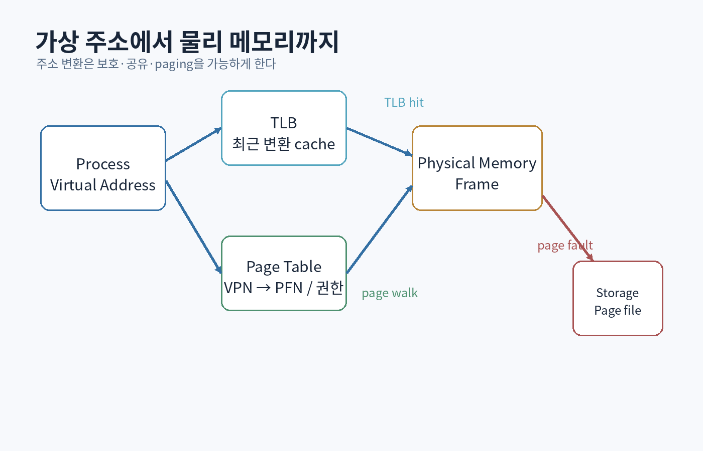

# 제3부 — 운영체제, 메모리, 동시성

{#fig-virtual-memory}

# 12장. 운영체제의 역할: 추상화와 보호

## 12.1 운영체제는 무엇을 관리하는가

운영체제를 “컴퓨터를 켰을 때 보이는 화면”으로 이해하면 핵심을 놓친다. 커널의 중심 역할은 다음과 같다.

- CPU 시간 분배
- 가상 주소 공간 제공
- 장치 접근 중재
- 파일과 지속 저장 추상화
- 프로세스와 권한 격리
- 통신과 동기화 수단 제공
- 실패와 인터럽트 처리

운영체제는 하드웨어를 편리하게 보이게 하는 **추상화**이면서, 여러 주체가 자원을 공유할 때 서로 침범하지 못하게 하는 **보호 메커니즘**이다.

## 12.2 프로세스와 스레드

프로세스는 일반적으로 다음을 가진 실행 환경이다.

- 가상 주소 공간
- 열린 파일과 핸들
- 보안 자격 증명
- 하나 이상의 스레드

스레드는 프로세스 주소 공간을 공유하면서 별도의 다음 상태를 가진다.

- program counter
- 레지스터
- 스택
- 스케줄링 상태

공유 메모리는 통신이 빠르지만 데이터 경쟁을 만든다. 프로세스 격리는 강하지만 통신과 복사가 더 비쌀 수 있다.

## 12.3 사용자 모드와 커널 모드

모든 코드가 임의의 장치와 메모리에 접근할 수 있다면 한 프로그램의 버그가 전체 시스템을 파괴한다. CPU 권한 수준과 가상 메모리는 사용자 프로그램을 제한한다.

시스템 호출은 사용자 모드에서 커널 모드의 서비스를 요청하는 경계다.

```text
사용자 코드
→ syscall 진입
→ 인수 검증
→ 커널 객체/드라이버 작업
→ 결과 복사 또는 매핑
→ 사용자 모드 복귀
```

경계에서는 신뢰 수준이 바뀐다. 커널은 사용자 포인터, 길이, 권한을 검증해야 한다. 일반 애플리케이션에서도 API 경계는 동일하게 생각한다.

## 12.4 인터럽트와 예외

- **인터럽트**: 장치나 타이머 같은 외부 사건
- **예외**: 현재 명령 실행에서 발생한 사건, 예: 페이지 폴트, 0으로 나눔

운영체제는 현재 실행을 잠시 중단하고 핸들러로 제어를 옮긴다. 인터럽트 문맥에서는 긴 작업이나 blocking을 피하고, 후속 작업을 큐에 넘기는 설계가 흔하다.

게임 엔진의 입력 콜백에서도 비슷한 원칙이 유용하다.

```cpp
// 콜백에서 복잡한 게임 상태를 직접 변경하기보다 이벤트를 큐에 넣는다.
void on_raw_input(const RawInput& input) {
    inputQueue.push(normalize(input));
}
```

## 12.5 계층적 운영체제 설계

Dijkstra의 THE multiprogramming system은 기능을 계층으로 배치하고 각 층에 독립적인 추상화를 두는 방식을 설명했다. 논리적 건전성을 검증하기 위해 계층 구조가 중요했다. [[Dijkstra 1968](https://www.cs.utexas.edu/~EWD/transcriptions/EWD01xx/EWD196.html)]

현대 설계에 적용:

```text
하드웨어
→ 인터럽트·문맥 전환
→ 메모리·스케줄러
→ 파일·네트워크
→ 런타임·프레임워크
→ 애플리케이션
```

계층은 무조건 좋은 것이 아니다. 지나친 층은 데이터 복사, 간접 호출, 이해 비용을 만든다. 계층의 목적은 **변경과 추론의 범위를 제한**하는 것이다.

# 13장. 스케줄링, 시간, 반응성

## 13.1 스케줄러가 해결하는 문제

실행 가능한 작업이 CPU보다 많을 때 어떤 작업을 언제 실행할지 정한다.

평가 기준:

- 처리량
- 평균 대기 시간
- 응답 시간
- 공정성
- deadline 충족
- 우선순위 역전 방지
- 에너지 효율

한 기준을 개선하면 다른 기준이 나빠질 수 있다.

## 13.2 선점과 문맥 전환

선점형 스케줄러는 타이머 인터럽트 등으로 실행 중 스레드를 멈추고 다른 스레드를 실행할 수 있다. 문맥 전환에는 레지스터 저장·복원, 캐시와 TLB 영향, 스케줄러 비용이 있다.

따라서 스레드를 많이 만든다고 병렬성이 자동 증가하지 않는다.

```text
작업 시간 5μs
스케줄링·큐·동기화 오버헤드 10μs
→ 병렬화가 오히려 손해
```

작업 시스템은 작은 작업을 적절한 크기로 묶고 worker 수를 제한한다.

## 13.3 실시간의 의미

실시간 시스템은 단순히 빠른 시스템이 아니다. **정해진 시간 제약 안에서 결과를 제공하는 시스템**이다.

- hard real-time: deadline 위반이 안전 실패
- soft real-time: 위반이 품질 저하

게임은 대체로 soft real-time이다. 평균 5ms인 작업이 가끔 60ms 걸리는 것이 평균 8ms로 안정적인 작업보다 나쁠 수 있다.

## 13.4 고정 시간 스텝

물리 시뮬레이션을 가변 `dt`로만 실행하면 프레임 속도에 따라 결과가 달라지고 큰 `dt`에서 불안정해질 수 있다.

```cpp
constexpr double fixedDt = 1.0 / 60.0;
double accumulator = 0.0;

auto previous = clock::now();
while (running) {
    const auto now = clock::now();
    double frameDt = seconds(now - previous);
    previous = now;

    frameDt = std::min(frameDt, 0.25); // 긴 멈춤 후 spiral 방지
    accumulator += frameDt;

    while (accumulator >= fixedDt) {
        process_inputs();
        simulate(fixedDt);
        accumulator -= fixedDt;
    }

    const double alpha = accumulator / fixedDt;
    render_interpolated(alpha);
}
```

주의:

- 시뮬레이션이 실시간보다 느리면 업데이트가 계속 쌓이는 spiral of death가 생긴다.
- 입력을 어느 tick에 적용하는지 정의해야 한다.
- 렌더 interpolation과 시뮬레이션 상태를 분리해야 한다.
- 결정성은 고정 dt만으로 보장되지 않는다.

## 13.5 타이머와 시계

시스템에는 여러 시간 개념이 있다.

- wall clock: 날짜와 시간, 변경될 수 있음
- monotonic clock: 경과 시간 측정, 뒤로 가지 않아야 함
- CPU time: 프로세스가 실제 CPU를 사용한 시간
- game time: 일시정지·배속이 적용된 논리 시간
- network time: 원격 노드와 동기화된 추정 시간

경과 시간 측정에는 monotonic clock을 사용한다.

```cpp
using clock = std::chrono::steady_clock;
const auto start = clock::now();
do_work();
const auto elapsed = clock::now() - start;
```

# 14장. 동시성의 기본: 경쟁, 원자성, happens-before

## 14.1 동시성과 병렬성

- 동시성: 여러 작업의 진행이 겹쳐 구조적으로 상호작용함
- 병렬성: 여러 작업이 실제로 동시에 실행됨

단일 코어에서도 비동기 I/O와 이벤트 루프는 동시성을 가진다. 병렬성은 성능 수단이고, 동시성은 시스템 구조와 정확성 문제다.

## 14.2 데이터 경쟁

C++에서 한 메모리 위치를 여러 스레드가 동시에 접근하고, 적어도 하나가 쓰기이며 적절한 동기화가 없으면 데이터 경쟁이고 프로그램 동작은 미정의다.

```cpp
int counter = 0;

void worker() {
    for (int i = 0; i < 100000; ++i) {
        ++counter; // read-modify-write, 원자적이지 않음
    }
}
```

`volatile`은 해결책이 아니다. `volatile`은 주로 특별한 메모리 접근의 최적화 제약과 관련되고, 스레드 간 원자성과 순서를 제공하지 않는다.

## 14.3 mutex와 불변식

mutex는 단순히 한 줄을 보호하는 것이 아니라 **공유 상태의 불변식을 보호**한다.

```cpp
class Inventory {
public:
    bool transfer_to(Inventory& other, ItemId id) {
        if (this == &other) return false;
        std::scoped_lock lock(mutex_, other.mutex_);
        auto it = std::find(items_.begin(), items_.end(), id);
        if (it == items_.end()) return false;
        other.items_.push_back(*it);
        items_.erase(it);
        return true;
    }
private:
    std::mutex mutex_;
    std::vector<ItemId> items_;
};
```

두 mutex를 일정하지 않은 순서로 잠그면 deadlock이 생길 수 있다. `std::scoped_lock`은 여러 mutex의 deadlock 회피 잠금 알고리즘을 사용한다.

## 14.4 조건 변수

조건 변수는 “이벤트를 저장하는 객체”가 아니다. 깨어남은 허위일 수 있고, 신호 전에 대기하지 않았으면 신호가 보존되지 않을 수 있다. 항상 predicate와 함께 사용한다.

```cpp
std::unique_lock lock(mutex);
cv.wait(lock, [&] { return stopping || !queue.empty(); });
```

predicate가 진짜 상태다. 조건 변수는 상태가 바뀌었을 가능성을 알린다.

## 14.5 atomics와 메모리 순서

```cpp
std::atomic<bool> ready{false};
int data = 0;

// producer
data = 42;
ready.store(true, std::memory_order_release);

// consumer
if (ready.load(std::memory_order_acquire)) {
    assert(data == 42);
}
```

release store를 acquire load가 관찰하면 이전 쓰기들이 consumer에서 보이도록 happens-before 관계가 형성된다.

모든 atomics를 `seq_cst`로 쓰면 이해는 쉬울 수 있지만 비용과 설계 의도를 고려해야 한다. 반대로 약한 메모리 순서는 증명 없이 사용하면 위험하다.

## 14.6 선형화 가능성

동시 객체의 각 연산이 호출과 반환 사이의 한 시점에 원자적으로 일어난 것처럼 설명될 수 있으면 선형화 가능하다고 한다. Herlihy와 Wing의 논문은 동시 객체 정확성을 순차 사양과 연결하는 기준을 제시했다. [[Herlihy & Wing 1990](https://cs.brown.edu/people/mph/HerlihyW90/p463-herlihy.pdf)]

lock-free 큐를 구현할 때 단순히 “크래시하지 않는다”로 충분하지 않다. enqueue와 dequeue 결과가 어떤 순차 실행과 일치하는지 보여야 한다.

## 14.7 deadlock, livelock, starvation

- deadlock: 서로가 가진 자원을 기다리며 영원히 멈춤
- livelock: 계속 움직이지만 진전하지 못함
- starvation: 특정 작업이 계속 기회를 얻지 못함

deadlock의 전형적 필요 조건:

- 상호 배제
- 점유하며 대기
- 비선점
- 순환 대기

한 조건을 깨는 정책을 설계한다. 예: 전역 잠금 순서, try-lock과 rollback, 메시지 전달로 공유 제거.

<div class="lab">

### 미니 프로젝트: bounded blocking queue

요구사항:

- 다중 생산자·다중 소비자
- 최대 용량
- `push`는 공간이 생길 때까지 대기
- `pop`은 원소가 생길 때까지 대기
- 종료 시 대기 중 스레드를 깨움
- 종료 후 push 정책 명시
- ThreadSanitizer로 검사

통과 기준: mutex가 보호하는 불변식과 두 조건 변수의 predicate를 문장으로 설명한다.

</div>

# 15장. 메모리 관리: 수명, 소유권, 할당기, 가비지 컬렉션

## 15.1 주소와 객체는 다르다

메모리 주소에 비트가 존재한다고 객체가 살아 있는 것은 아니다. C++에서 객체 수명은 생성 규칙으로 시작하고 소멸로 끝난다. 수명이 끝난 객체의 주소가 여전히 숫자로 남아 있어도 접근하면 잘못이다.

```cpp
Enemy* dangling = nullptr;
{
    Enemy enemy;
    dangling = &enemy;
}
// enemy 수명 종료
dangling->update(); // 미정의 동작
```

## 15.2 소유권을 API에 드러낸다

```cpp
std::unique_ptr<Texture> load_texture(Path path); // 소유권 반환
void draw(const Texture& texture);                // 빌린 참조
Texture* find_texture(Id id);                     // nullable 비소유 관찰자
```

함수 시그니처가 소유권을 완전히 증명하지는 않지만 의도를 전달한다.

### shared_ptr 남용

`shared_ptr`는 “수명을 생각하기 싫을 때” 쓰는 포인터가 아니다.

비용과 위험:

- 원자적 참조 카운트 비용 가능
- 해제 시점이 분산됨
- 순환 참조
- 소유 구조가 불명확
- 실시간 스레드에서 마지막 해제 비용 발생

명확한 단일 소유가 가능하면 `unique_ptr`를 우선한다.

## 15.3 RAII

자원 획득을 객체 수명에 결합한다.

```cpp
class File {
public:
    explicit File(const char* path)
        : handle_(std::fopen(path, "rb")) {
        if (!handle_) throw std::runtime_error("open failed");
    }
    ~File() { std::fclose(handle_); }

    File(const File&) = delete;
    File& operator=(const File&) = delete;

    File(File&& other) noexcept
        : handle_(std::exchange(other.handle_, nullptr)) {}

    File& operator=(File&& other) noexcept {
        if (this != &other) {
            if (handle_) std::fclose(handle_);
            handle_ = std::exchange(other.handle_, nullptr);
        }
        return *this;
    }
private:
    std::FILE* handle_{};
};
```

실무에서는 직접 구현보다 표준·플랫폼 wrapper를 사용하되, 이동과 소멸 규칙을 설명할 수 있어야 한다.

## 15.4 할당기의 역할

일반 heap allocator는 다양한 크기와 수명을 처리한다. 특정 패턴에는 전문 할당기가 유리하다.

### arena/linear allocator

```cpp
class LinearArena {
public:
    explicit LinearArena(std::size_t size) : storage_(size) {}

    void* allocate(std::size_t bytes, std::size_t alignment) {
        void* current = storage_.data() + offset_;
        std::size_t space = storage_.size() - offset_;
        if (std::align(alignment, bytes, current, space) == nullptr) {
            throw std::bad_alloc{};
        }
        const auto aligned = static_cast<std::byte*>(current);
        offset_ = static_cast<std::size_t>(aligned - storage_.data()) + bytes;
        return aligned;
    }

    void reset() noexcept { offset_ = 0; }
private:
    std::vector<std::byte> storage_;
    std::size_t offset_{};
};
```

장점: 빠른 bump allocation, 전체 일괄 해제.

제약: 개별 해제 어려움, 소멸자 처리, arena보다 오래 사는 포인터 금지, 정렬.

## 15.5 객체 풀과 generation handle

주소를 직접 외부에 주면 컨테이너 이동과 슬롯 재사용 문제가 생긴다. index와 generation을 조합한 핸들은 오래된 참조를 검출할 수 있다.

```cpp
struct Handle {
    std::uint32_t index;
    std::uint32_t generation;
};

struct Slot {
    std::optional<Enemy> value;
    std::uint32_t generation{};
};
```

삭제할 때 generation을 증가시키면 이전 핸들은 더 이상 일치하지 않는다.

## 15.6 가비지 컬렉션

GC는 “메모리 관리가 없다”가 아니라 도달 가능성 분석과 회수 정책을 런타임이 수행한다.

대표 방식:

- reference counting
- tracing mark-and-sweep
- generational GC
- moving/compacting GC

교환:

- 프로그래머의 수명 부담 감소
- pause와 처리량 비용
- 메모리 여유 필요
- finalizer와 외부 자원 문제
- 객체 이동과 포인터 규칙

GC 언어에서도 파일, 소켓, 락은 deterministic cleanup이 필요하다.

## 15.7 메모리 안전 언어와 소유권

Rust는 소유권·대여·수명 규칙으로 GC 없이 많은 메모리 안전성을 컴파일 시점에 보장하려 한다. 공식 문서는 ownership을 메모리 관리 규칙의 집합으로 설명한다. [[Rust Book — Ownership](https://doc.rust-lang.org/book/ch04-01-what-is-ownership.html)]

C++ 개발자에게 Rust는 단지 새 문법이 아니라 다음 질문을 강제하는 훈련이다.

- 이 값의 소유자는 누구인가?
- 참조가 원본보다 오래 살 수 있는가?
- mutable alias가 존재하는가?
- 스레드 사이로 보내도 안전한가?

# 16장. 파일 시스템, 저장장치, 충돌 일관성

## 16.1 파일은 바이트 배열 이상이다

파일 시스템은 다음을 관리한다.

- 이름과 디렉터리
- 파일 메타데이터
- 공간 할당
- 캐시
- 권한
- 충돌 복구
- 동시 접근

애플리케이션이 `write()`를 성공했다고 해서 데이터가 즉시 비휘발성 매체에 안전하게 기록되었다는 뜻은 아닐 수 있다. 사용자 버퍼, 커널 페이지 캐시, 장치 캐시를 거친다.

## 16.2 원자적 교체 패턴

설정 파일을 직접 덮어쓰다가 프로세스가 죽으면 일부만 기록된 파일이 남을 수 있다.

더 안전한 개념적 절차:

```text
1. 같은 파일 시스템에 임시 파일 생성
2. 전체 내용 기록
3. 필요 시 flush/fsync
4. 임시 파일을 대상 이름으로 atomic rename
5. 필요 시 디렉터리 메타데이터 flush
```

플랫폼과 파일 시스템의 보장 범위를 확인해야 한다.

## 16.3 write-ahead log

상태를 변경하기 전에 변경 의도를 로그에 기록한다.

```text
로그 기록 → 로그 지속성 확보 → 데이터 페이지 변경 → commit 표시
```

충돌 후 로그를 재생하거나 미완료 작업을 되돌린다. 데이터베이스의 ARIES는 WAL, fine-grained locking, partial rollback을 결합한 대표 복구 알고리즘이다. [[Mohan et al. 1992](https://db.csail.mit.edu/madden/html/aries.pdf)]

## 16.4 체크섬과 손상 검출

길이와 구조가 맞더라도 비트가 손상될 수 있다. 체크섬은 오류를 검출하지만 복구나 보안을 자동 제공하지 않는다.

- CRC: 우발적 전송 오류 검출에 강함
- cryptographic hash: 충돌 저항 등 보안 성질
- MAC: 비밀 키를 이용한 무결성과 인증

문제에 맞는 도구를 선택한다.

## 16.5 append-only와 compaction

append-only 로그는 순차 쓰기와 복구가 단순하지만 계속 커진다. 최신 상태만 남기는 compaction이 필요하다.

```text
put A=1
put B=2
put A=3
remove B
```

최종 상태는 `A=3`뿐이다. compaction 중에도 읽기·쓰기를 허용하려면 세대, snapshot, atomic file replacement가 필요하다.

<div class="lab">

### 미니 프로젝트: StoneKV 1단계

- `put(key,value)`, `get(key)`, `remove(key)`
- 메모리 map + append-only log
- 각 record에 magic, version, length, checksum
- 시작 시 로그 재생
- 파일 중간이 잘린 crash 사례 처리
- 임시 파일 기반 compaction

테스트:

1. 임의 위치에서 파일을 자른다.
2. 마지막 record checksum을 손상시킨다.
3. 동일 key를 여러 번 갱신한다.
4. 10,000개 무작위 작업을 기준 map과 비교한다.

</div>
