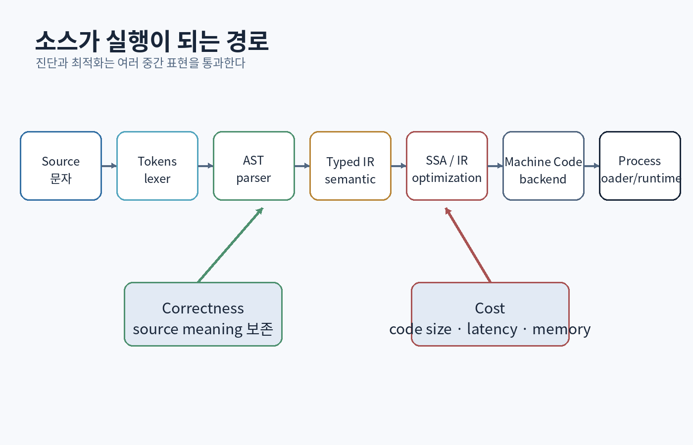

# 제4부 — 프로그래밍 언어와 컴파일러

{#fig-compiler-pipeline}

# 17장. 프로그래밍 언어는 사고 도구이자 계약이다

## 17.1 언어는 기계에 명령하는 문법 이상이다

프로그래밍 언어는 다음을 함께 정의한다.

- 어떤 값을 표현할 수 있는가
- 연산의 의미는 무엇인가
- 오류는 언제 발견되는가
- 메모리와 자원은 어떻게 관리되는가
- 모듈과 이름은 어떻게 결합되는가
- 동시 실행의 순서는 무엇으로 보장되는가

같은 알고리즘도 언어의 의미에 따라 버그와 비용이 달라진다.

```python
x = 2**100  # Python 정수는 필요에 따라 커질 수 있다.
```

```cpp
std::uint64_t x = ...; // 고정 폭, 오버플로 의미를 고려해야 한다.
```

따라서 “어느 언어가 최고인가?”보다 다음을 묻는다.

- 실패 비용이 큰가?
- 지연과 메모리 제약이 있는가?
- 배포 환경은 무엇인가?
- 런타임과 도구 생태계가 필요한가?
- 팀이 안전하게 유지할 수 있는가?

## 17.2 패러다임은 배타적인 종교가 아니다

### 명령형

상태를 순서대로 변경한다.

```cpp
for (Enemy& enemy : enemies) {
    enemy.position += enemy.velocity * dt;
}
```

### 함수형

값 변환, 불변성, 합성에 초점을 둔다.

```cpp
const auto alive = enemies
    | std::views::filter([](const Enemy& e) { return e.health > 0; });
```

### 객체지향

상태와 동작을 객체 경계에 묶고 동적 다형성을 사용할 수 있다.

### 데이터 지향

대량 데이터의 배치와 처리 흐름을 하드웨어 비용에 맞춘다.

### 이벤트·데이터플로

변화와 의존 관계를 중심으로 실행을 조직한다.

좋은 시스템은 한 패러다임을 모든 문제에 강요하지 않는다. 경계와 비용에 맞추어 조합한다.

## 17.3 값 의미론과 참조 의미론

```cpp
struct Vec3 { float x, y, z; };
Vec3 a{1,2,3};
Vec3 b = a; // 독립된 값 복사
```

값 의미론은 지역적 추론이 쉽다. 복사 비용이 크거나 공유 정체성이 필요하면 참조를 사용한다.

```cpp
std::shared_ptr<Player> playerA = registry.get(id);
std::shared_ptr<Player> playerB = playerA; // 같은 객체 정체성 공유
```

공유 정체성에는 alias, 수명, 동시성 문제가 따라온다. 작은 값 타입은 가능하면 값으로 표현하고, 공유는 명시적으로 제한하는 편이 좋다.

## 17.4 정적 타입과 동적 타입

정적 타입 시스템은 실행 전에 일부 잘못된 프로그램을 거절한다. 동적 언어는 런타임 값과 빠른 변화에 유연하다.

타입 시스템은 “강하다/약하다” 한 축으로만 비교하기 어렵다.

- 명시적/추론
- nominal/structural
- nullable/non-null
- algebraic data type
- ownership/lifetime
- effect와 exception 추적
- dependent type

타입은 증명의 일부지만 모든 비즈니스 규칙을 자동 보장하지 않는다.

```cpp
using UserId = std::uint64_t;
using OrderId = std::uint64_t;

void cancel_order(OrderId id);
```

두 alias는 같은 타입이므로 `UserId`를 실수로 전달할 수 있다. 강한 타입 wrapper가 필요할 수 있다.

```cpp
template<class Tag>
struct StrongId {
    std::uint64_t value;
    friend auto operator<=>(const StrongId&, const StrongId&) = default;
};
struct UserTag;
struct OrderTag;
using UserId = StrongId<UserTag>;
using OrderId = StrongId<OrderTag>;
```

## 17.5 오류 모델

- 예외
- 오류 코드
- `expected<T,E>` 형태
- nullable/optional
- panic/abort
- effect system

어떤 방식이든 다음을 명확히 한다.

- 실패가 예상 가능한가?
- 호출자가 복구할 수 있는가?
- 오류 문맥을 잃지 않는가?
- 자원 정리가 보장되는가?
- 실시간·ABI 경계에 적합한가?

# 18장. 이름, 스코프, 바인딩, 클로저

## 18.1 이름은 값을 저장하는 상자가 아니다

언어마다 이름과 객체의 관계가 다르다. Python의 공식 실행 모델은 이름이 블록에 바인딩되고 가장 가까운 enclosing scope에서 해석되는 규칙을 설명한다. [[Python Language Reference](https://docs.python.org/3/reference/executionmodel.html)]

```python
x = [1, 2]
y = x
y.append(3)
# x와 y는 같은 리스트 객체를 참조한다.
```

C++ 값 복사와 혼동하면 안 된다.

## 18.2 lexical scope

```cpp
int x = 1;
{
    int x = 2;
    std::cout << x; // 2
}
std::cout << x; // 1
```

이름 해석 규칙은 컴파일러의 symbol table과 연결된다. shadowing은 제한된 범위에서는 유용하지만 큰 함수에서 오류를 만들 수 있다.

## 18.3 클로저와 캡처 수명

```cpp
std::function<int()> bad() {
    int value = 42;
    return [&] { return value; }; // 지역 변수 참조가 수명 종료 후 남음
}
```

수정:

```cpp
std::function<int()> good() {
    int value = 42;
    return [value] { return value; };
}
```

하지만 값 캡처도 객체 크기와 복사 비용이 있다. `this` 캡처는 객체 수명 문제를 만든다. 비동기 작업에서는 소유권 정책을 명시한다.

```cpp
std::weak_ptr<Service> weak = shared_from_this();
executor.post([weak] {
    if (auto self = weak.lock()) {
        self->poll();
    }
});
```

이 구조가 항상 최선은 아니다. 서비스 수명을 executor가 소유하도록 설계를 바꾸는 편이 더 단순할 수 있다.

## 18.4 동적 디스패치와 정적 디스패치

```cpp
struct Shape {
    virtual ~Shape() = default;
    virtual double area() const = 0;
};
```

동적 다형성은 런타임 타입에 따라 동작을 선택한다. 장점은 열린 확장과 안정된 인터페이스다. 비용은 간접 호출, 객체 배치, 수명 복잡성, 최적화 제한일 수 있다.

정적 다형성:

```cpp
template<class Shape>
double doubled_area(const Shape& shape) {
    return shape.area() * 2.0;
}
```

코드 증가와 컴파일 시간, ABI 문제를 고려해야 한다.

# 19장. 렉싱과 파싱: 텍스트를 구조로 바꾸다

## 19.1 컴파일러의 첫 단계

```text
소스 텍스트
→ 토큰
→ 구문 트리(AST)
→ 의미 분석
→ 중간 표현
→ 최적화
→ 기계 코드/바이트코드
```

### 입력 예

```text
let damage = base * 2 + bonus;
```

토큰:

```text
LET IDENT(damage) EQUAL IDENT(base) STAR NUMBER(2)
PLUS IDENT(bonus) SEMICOLON
```

## 19.2 lexer

```cpp
enum class TokenKind {
    End, Number, Identifier, Plus, Minus, Star, Slash,
    LeftParen, RightParen, Equal, Semicolon, Let, Invalid
};

struct Token {
    TokenKind kind;
    std::string_view lexeme;
    std::size_t offset;
};
```

`string_view`는 원본 소스보다 오래 살 수 없다. lexer 결과가 소스 수명을 넘으면 문자열을 소유하거나 source buffer를 함께 보존해야 한다.

## 19.3 문법과 우선순위

간단한 표현식 문법:

```text
expression → addition
addition   → multiply (("+" | "-") multiply)*
multiply   → unary (("*" | "/") unary)*
unary      → ("-" unary) | primary
primary    → NUMBER | IDENT | "(" expression ")"
```

recursive descent parser:

```cpp
ExprPtr parse_addition() {
    auto left = parse_multiply();
    while (match(TokenKind::Plus) || match(TokenKind::Minus)) {
        const Token op = previous();
        auto right = parse_multiply();
        left = std::make_unique<BinaryExpr>(op, std::move(left), std::move(right));
    }
    return left;
}
```

## 19.4 오류 보고가 언어 품질을 결정한다

`syntax error` 한 줄은 불충분하다. 좋은 진단은 다음을 포함한다.

- 파일·줄·열
- 실제 토큰
- 기대한 토큰
- 관련 소스 범위
- 회복 후 추가 오류 탐지

```text
combat.rule:12:18: error: ')' expected after expression
  damage = base * (2 + bonus;
                  ^
```

파서는 첫 오류에서 중단하거나, semicolon 같은 synchronization token까지 건너뛰어 계속 분석할 수 있다.

## 19.5 AST 설계

상속 기반:

```cpp
struct Expr { virtual ~Expr() = default; };
struct NumberExpr : Expr { double value; };
struct BinaryExpr : Expr { Token op; ExprPtr left, right; };
```

variant 기반:

```cpp
struct Number { double value; };
struct Binary;
using Expr = std::variant<Number, Variable, std::unique_ptr<Binary>>;
```

선택 기준:

- 노드 종류와 연산 중 무엇이 자주 추가되는가?
- 메모리 배치가 중요한가?
- 방문자와 pattern matching 도구가 있는가?
- 오류 위치와 타입 정보는 어디에 둘 것인가?

<div class="lab">

### 미니 프로젝트: Mori 언어 1단계

지원 문법:

```text
let x = 10;
let y = x * 2 + 3;
print y;
```

요구사항:

- offset·line·column을 가진 토큰
- 우선순위 파서
- AST pretty-printer
- 정의되지 않은 이름 오류
- 30개 parser test
- 임의 표현식을 생성해 parse→print→parse round trip 검사

</div>

# 20장. 의미 분석과 타입 시스템

## 20.1 문법적으로 맞아도 의미가 틀릴 수 있다

```text
let x = unknown + 1;
```

파싱은 가능하지만 `unknown`이 정의되지 않았다. 의미 분석은 다음을 수행한다.

- 이름 해석
- 타입 검사
- 중복 선언
- 접근 제어
- 제어 흐름 검사
- 상수 평가

## 20.2 symbol table과 scope stack

```cpp
class Resolver {
    std::vector<std::unordered_map<std::string, Symbol>> scopes_;
public:
    void begin_scope() { scopes_.emplace_back(); }
    void end_scope() { scopes_.pop_back(); }

    bool declare(std::string name, Symbol symbol) {
        return scopes_.back().emplace(std::move(name), symbol).second;
    }
};
```

해시맵은 평균적 조회가 빠르지만, 안정적 진단 순서와 작은 scope에서는 다른 구조가 더 단순할 수 있다.

## 20.3 타입 규칙

```text
Γ ⊢ e1 : Number    Γ ⊢ e2 : Number
----------------------------------
Γ ⊢ e1 + e2 : Number
```

이 표기는 환경 Γ에서 두 피연산자가 Number면 합도 Number라는 규칙을 뜻한다. 타입 검사기는 규칙을 코드로 구현한다.

```cpp
Type check(const BinaryExpr& expr) {
    const Type left = check(*expr.left);
    const Type right = check(*expr.right);
    if (left != Type::Number || right != Type::Number) {
        report(expr.location, "numeric operands required");
        return Type::Error;
    }
    return Type::Number;
}
```

## 20.4 null과 sum type

`null`이 모든 참조 타입에 섞이면 호출자가 매번 존재 여부를 추론해야 한다.

```cpp
std::optional<Player> find_player(Id id);
```

성공과 실패 이유를 구분하려면:

```cpp
using LoadResult = std::expected<Asset, LoadError>;
```

여러 가능한 상태는 `variant`로 모델링할 수 있다.

```cpp
using ConnectionState = std::variant<Disconnected, Connecting, Connected, Failed>;
```

illegal state를 표현하기 어렵게 만드는 것이 타입 설계의 목표다.

## 20.5 타입 추론의 경계

타입 추론은 반복을 줄이지만 API 경계와 복잡한 표현식에서는 명시적 타입이 의도를 더 잘 전달할 수 있다.

```cpp
auto result = compute(); // 타입이 중요한데 이름만으로 알기 어려울 수 있음
```

좋은 변수명과 함수 크기, IDE 정보가 함께 필요하다.

# 21장. 인터프리터, 바이트코드, 가상 머신

## 21.1 AST interpreter

```cpp
Value evaluate(const Expr& expr, Environment& env) {
    return std::visit(Overloaded{
        [&](const Number& n) -> Value { return n.value; },
        [&](const Variable& v) -> Value { return env.lookup(v.name); },
        [&](const std::unique_ptr<Binary>& b) -> Value {
            return apply(b->op, evaluate(*b->left, env), evaluate(*b->right, env));
        }
    }, expr.node);
}
```

장점: 구현이 직접적이고 디버깅이 쉽다.

단점: 포인터 추적, 재귀, 노드별 dispatch 비용.

## 21.2 바이트코드

표현식 `1 + 2 * 3`:

```text
PUSH_CONST 1
PUSH_CONST 2
PUSH_CONST 3
MUL
ADD
HALT
```

stack VM:

```cpp
while (running) {
    switch (read_opcode()) {
        case Op::PushConst: stack.push(read_constant()); break;
        case Op::Add: {
            const auto b = pop();
            const auto a = pop();
            stack.push(a + b);
            break;
        }
        case Op::Halt: running = false; break;
    }
}
```

## 21.3 stack VM과 register VM

- stack VM: 명령 인코딩이 단순하고 compact
- register VM: 명령 수가 줄 수 있으나 encoding과 compiler가 복잡

성능은 dispatch, 메모리 접근, 최적화, 캐시 구조에 따라 달라진다.

## 21.4 GC와 VM

VM의 값에 문자열·배열·함수가 들어가면 수명 관리가 필요하다. 처음에는 `shared_ptr`로 단순화할 수 있지만, 순환 클로저와 성능을 다루려면 tracing GC나 arena 전략을 배운다.

## 21.5 JIT의 생각법

자주 실행되는 바이트코드를 기계어로 컴파일하면 interpreter dispatch 비용을 줄이고 runtime 정보를 이용한 특수화가 가능하다.

하지만 JIT에는 다음 비용이 있다.

- 컴파일 시간
- executable memory 보안
- deoptimization
- 코드 캐시
- 플랫폼별 backend
- 디버깅과 프로파일링

모든 스크립트가 JIT을 필요로 하는 것은 아니다.

# 22장. 컴파일러 IR, SSA, 최적화

## 22.1 중간 표현을 두는 이유

여러 소스 언어와 여러 대상 CPU를 직접 연결하면 조합이 폭발한다.

```text
C++ ─┐
Rust ├→ 공통 IR → x86-64
Swift┘          → ARM64
                → RISC-V
```

LLVM은 언어와 대상 사이의 분석·변환을 지원하는 공통 저수준 표현을 중심으로 설계되었다. [[Lattner & Adve 2004](https://llvm.org/pubs/2004-01-30-CGO-LLVM.pdf)]

## 22.2 control-flow graph

basic block은 중간에 분기 없이 순차 실행되는 명령 묶음이다. 블록 사이의 분기 관계가 CFG다.

```text
entry
  │
  ▼
condition ─false→ else
  │true             │
  ▼                 ▼
then ─────────────→ merge
```

도달 가능성, dominator, loop, dataflow 분석의 기반이다.

## 22.3 SSA

Static Single Assignment에서는 각 변수 버전이 한 번만 정의된다.

```text
x1 = 1
if cond:
  x2 = 2
else:
  x3 = 3
x4 = phi(x2, x3)
```

SSA는 def-use 관계와 최적화를 단순하게 한다. Cytron 등의 연구는 SSA와 control dependence graph의 효율적 계산을 정리했다. [[Cytron et al. 1991](https://www.cs.utexas.edu/~pingali/CS380C/2010/papers/ssaCytron.pdf)]

## 22.4 대표 최적화

### constant folding

```text
3 * 4 → 12
```

### dead code elimination

결과가 관찰되지 않는 계산 제거.

### common subexpression elimination

같은 표현을 반복 계산하지 않음.

### inlining

호출 경계를 제거해 추가 최적화를 가능하게 하지만 코드 크기를 늘린다.

### loop invariant code motion

루프 안에서 변하지 않는 계산을 밖으로 이동.

## 22.5 as-if rule과 관찰 가능한 동작

C++ 구현은 표준이 정의한 관찰 가능한 동작이 같다면 내부 실행을 바꿀 수 있다. 미정의 동작이 위험한 이유는 컴파일러가 불가능하다고 가정한 상황에서 예상과 크게 다른 코드를 생성할 수 있기 때문이다.

```cpp
int f(int x) {
    return x + 1 > x;
}
```

부호 있는 overflow가 없다는 가정 아래 컴파일러는 거의 항상 true로 단순화할 수 있다.

## 22.6 최적화 컴파일에서 디버깅

- 변수 제거·합성
- 명령 재배치
- inline
- tail call
- frame pointer 생략

소스 한 줄과 기계 명령의 대응이 흐려진다. release-only 버그는 다음으로 접근한다.

- sanitizer build
- 최적화 단계 이분
- 최소 재현
- assembly/IR 확인
- data race 검사
- undefined behavior 점검

<div class="lab">

### 미니 프로젝트: Mori 언어 2단계

1. AST를 stack bytecode로 컴파일한다.
2. constant pool과 local variable slot을 둔다.
3. jump와 conditional jump로 `if`, `while`을 구현한다.
4. bytecode verifier가 stack underflow와 잘못된 jump를 거절하게 한다.
5. constant folding과 dead code 제거를 각각 한 개 구현한다.
6. AST interpreter와 VM의 결과를 differential test한다.

</div>

# 23장. C++를 시스템 언어로 이해하기

## 23.1 C++의 힘과 위험

C++는 다음을 함께 제공한다.

- 값 타입과 직접 메모리 배치
- 추상화와 generic programming
- 수동·자동 자원 관리
- zero-overhead를 지향하는 추상화
- 기존 C·플랫폼 API와의 상호운용

대신 객체 수명, alias, UB, 빌드 모델, ABI를 이해해야 한다. 현재 작업 초안은 C++ 요구사항을 정의하는 표준 문서의 공개 초안으로 확인할 수 있다. [[C++ working draft](https://eel.is/c%2B%2Bdraft/full)]

## 23.2 객체 수명과 RAII가 중심이다

문법보다 다음 질문이 먼저다.

- 객체는 어디서 만들어지는가?
- 누가 소유하는가?
- 복사와 이동은 가능한가?
- 실패 경로에서 소멸자가 실행되는가?
- 비소유 참조는 소유자보다 오래 남는가?

## 23.3 Rule of Zero

자원 소유를 표준 타입에 맡기면 직접 소멸자·복사·이동을 정의하지 않아도 된다.

```cpp
class Mesh {
    std::vector<Vertex> vertices_;
    std::vector<std::uint32_t> indices_;
    std::string debugName_;
};
```

직접 raw resource를 소유하면 Rule of Five를 고려한다. 가능하면 자원 wrapper 하나에만 책임을 집중한다.

## 23.4 template과 concept

```cpp
template<class T>
concept Arithmetic = std::is_arithmetic_v<T>;

template<Arithmetic T>
T lerp(T a, T b, T t) {
    return a + (b - a) * t;
}
```

그러나 정수 `t`와 overflow, 사용자 정의 numeric type의 의미는 여전히 설계해야 한다. concept는 문법적 요구를 표현하지만 도메인 의미를 자동 보장하지 않는다.

## 23.5 compilation model

header를 여러 translation unit에서 include하면 전처리 후 반복 파싱된다. template 정의가 header에 있는 이유, ODR, inline, link error를 이해해야 한다.

빌드 성능 개선:

- include dependency 줄이기
- forward declaration
- PImpl
- precompiled headers
- modules
- unity build의 장단점

## 23.6 예외 안전성

보장 수준:

- no-throw
- strong guarantee: 실패 시 상태 변화 없음
- basic guarantee: 불변식 유지, 누수 없음
- no guarantee

copy-and-swap 또는 먼저 새 상태를 준비한 뒤 commit하는 패턴이 strong guarantee에 도움이 된다.

# 24장. Rust·Python·스크립트 언어로 시야 넓히기

## 24.1 Rust: 소유권을 타입으로 검증

```rust
fn length(s: &String) -> usize {
    s.len()
}
```

`&String`은 소유권을 가져오지 않는 borrow다. mutable borrow의 배타성은 alias와 mutation의 위험을 제한한다. [[Rust Book — References and Borrowing](https://doc.rust-lang.org/book/ch04-02-references-and-borrowing.html)]

C++ 개발자가 배울 점:

- 소유권을 기본 설계 요소로 보기
- thread safety를 trait 경계로 보기
- 오류를 `Result`로 명시
- unsafe 영역을 작게 격리

## 24.2 Python: 표현력과 런타임 모델

Python은 빠른 자동화, 데이터 처리, 테스트 도구에 강하다. 모든 데이터가 객체로 표현되고 이름이 객체에 바인딩되는 모델을 이해해야 한다. [[Python Data Model](https://docs.python.org/3/reference/datamodel.html)]

성능이 필요하면 먼저 알고리즘과 I/O를 측정하고, 필요한 경계만 native extension이나 벡터화 라이브러리로 내린다.

## 24.3 스크립트와 엔진 경계

게임 엔진에서 C++와 스크립트를 나누는 기준:

C++에 적합:

- 성능 민감한 루프
- 엔진 인프라
- 메모리·스레드 제어
- 안정적인 핵심 규칙

스크립트/Blueprint에 적합:

- 콘텐츠 조합
- 빠른 반복
- 디자이너 조정
- 이벤트 연결

경계 비용:

- marshaling
- 호출 overhead
- 수명과 GC
- 디버깅
- 버전 호환

## 24.4 여러 언어를 배울 때의 원칙

새 문법을 외우는 대신 같은 문제를 비교한다.

| 질문 | C++ | Rust | Python |
|---|---|---|---|
| 소유권 | 관습·RAII·타입 | borrow checker | GC/reference count 구현 |
| 오류 | exception/expected | Result/panic | exception |
| 다형성 | template/virtual | generics/trait | duck typing/protocol |
| 동시성 | memory model 직접 | Send/Sync + ownership | runtime·multiprocessing 고려 |
| 배포 | native binary | native binary | interpreter/runtime |

각 언어의 강한 제약이 어떤 버그를 막고 어떤 비용을 만드는지 본다.

<div class="check">

### 제4부 통과 기준

- 소스가 토큰·AST·IR·기계 코드로 변하는 흐름을 설명한다.
- 작은 표현식 파서를 빈 파일에서 작성한다.
- 값 의미론과 공유 정체성의 장단점을 비교한다.
- closure capture 수명 버그를 찾아 고친다.
- SSA의 phi가 필요한 이유를 CFG 예로 설명한다.
- C++와 Rust의 소유권 표현 차이를 설명한다.

</div>
