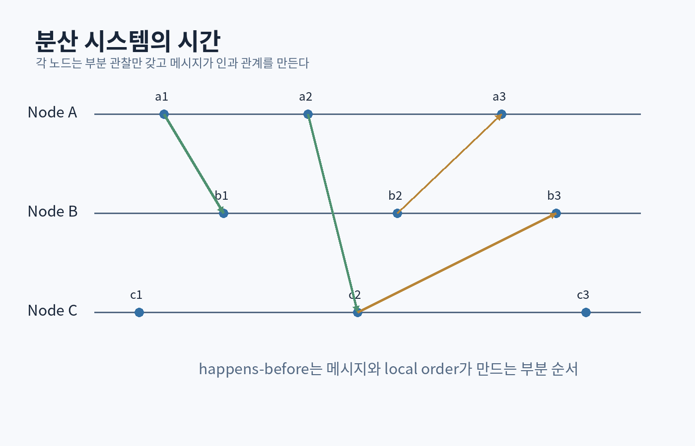

# 제6부 — 네트워크, 데이터베이스, 분산 시스템

{#fig-distributed-time}

# 31장. 네트워크 계층과 프로토콜 설계

## 31.1 네트워크 프로그래밍의 첫 법칙: 원격 호출은 함수 호출이 아니다

함수 호출은 같은 프로세스의 메모리와 제어 흐름 안에서 일어난다. 원격 호출에는 다음이 추가된다.

- 직렬화
- 전송 지연과 대역폭
- 패킷 손실·중복·재정렬
- 상대 프로세스 장애
- 버전 차이
- 인증과 암호화
- 부분 성공

RPC 프레임워크가 함수처럼 보이게 해도 이 성질은 사라지지 않는다.

## 31.2 계층화

개념적 인터넷 계층:

```text
Application: HTTP, DNS, 게임 프로토콜
Transport:   TCP, UDP, QUIC
Internet:    IP
Link:        Ethernet, Wi‑Fi
Physical:    전기·광·무선 신호
```

각 계층은 위에 서비스를 제공하고 아래를 사용한다. 계층은 변경 격리를 돕지만 encapsulation overhead와 중복 기능이 생긴다.

## 31.3 IP와 best effort

IP는 패킷을 목적지로 전달하려 시도하지만 신뢰성, 순서, 중복 제거를 완전히 보장하지 않는다. 애플리케이션은 필요한 성질을 transport나 자체 프로토콜에서 얻는다.

## 31.4 TCP

TCP는 byte stream, 순서, 재전송, flow control, congestion control을 제공한다. 현재 통합 사양은 RFC 9293이다. [[RFC 9293](https://www.rfc-editor.org/info/rfc9293/)]

중요한 오해:

- `send()` 한 번이 상대 `recv()` 한 번과 대응하지 않는다.
- 메시지 경계가 없다.
- 연결이 살아 보인다고 상대 애플리케이션이 정상이라는 뜻이 아니다.
- write 성공이 상대의 비즈니스 처리 완료를 의미하지 않는다.

길이 prefix framing:

```text
[4-byte big-endian length][payload]
```

수신기는 partial read를 처리해야 한다.

```cpp
bool read_exact(Socket& s, std::span<std::byte> out) {
    std::size_t offset = 0;
    while (offset < out.size()) {
        const auto n = s.read(out.subspan(offset));
        if (n == 0) return false; // EOF
        offset += n;
    }
    return true;
}
```

실제 API는 오류·interrupt·nonblocking 상태를 별도 처리한다.

## 31.5 UDP

UDP는 datagram 경계를 유지하고 연결 설정 비용이 작지만 전달·순서·중복 제거를 보장하지 않는다.

적합한 경우:

- 손실을 허용하는 실시간 상태
- 애플리케이션이 자체 reliability를 설계
- request/response가 작고 idempotent
- multicast 등

게임 네트워크에서는 모든 메시지를 동일하게 신뢰 전송하지 않는다.

```text
플레이어 위치 snapshot: 최신 값이 중요, 오래된 재전송은 무의미
아이템 구매: 반드시 처리 결과 확인, 중복 방지 필요
채팅: 순서와 전달 중요
```

## 31.6 timeout과 재시도

timeout은 상대가 실패했다는 증명이 아니라, 정해진 시간 안에 결과를 못 받았다는 사실이다.

재시도 설계:

- exponential backoff
- jitter
- 최대 횟수/전체 deadline
- idempotency key
- circuit breaker
- retry budget

모든 클라이언트가 동시에 재시도하면 장애를 확대할 수 있다.

## 31.7 end-to-end argument

Saltzer, Reed, Clark은 일부 기능은 낮은 계층에서 완전하게 제공해도 최종 정확성을 보장하지 못하며, 결국 endpoint에서 검증해야 한다는 설계 원칙을 설명했다. [[End-to-End Arguments in System Design](https://web.mit.edu/Saltzer/www/publications/endtoend/endtoend.pdf)]

예: 네트워크 각 구간의 checksum만으로 파일이 디스크·메모리·애플리케이션을 거치는 전체 경로에서 정확하다고 보장할 수 없다. 최종 애플리케이션이 전체 파일 hash를 확인할 수 있다.

# 32장. HTTP, API, 직렬화, 버전 호환

## 32.1 자원과 메서드

HTTP API를 단순 RPC 이름 모음으로 만들기보다 자원 상태와 메서드 의미를 고려한다.

```text
GET    /players/42
POST   /matches
PATCH  /profiles/42
DELETE /sessions/abc
```

멱등성은 같은 요청을 여러 번 적용해도 최종 효과가 같은 성질이다. 네트워크 재시도와 직접 연결된다.

## 32.2 상태 코드와 오류 본문

오류 응답은 기계와 사람 모두가 처리할 수 있어야 한다.

```json
{
  "code": "inventory_full",
  "message": "인벤토리 공간이 부족합니다.",
  "request_id": "req-7f2c",
  "details": { "capacity": 100 }
}
```

민감한 내부 stack trace를 외부에 노출하지 않는다.

## 32.3 직렬화 포맷

- JSON: 사람이 읽기 쉬움, 유연, 크기와 parsing 비용
- Protocol Buffers류: schema와 compact binary
- MessagePack/CBOR: binary structured data
- custom binary: 통제 가능하지만 도구·호환 부담

선택 기준:

- latency와 대역폭
- schema evolution
- 여러 언어
- 디버깅
- 보안 검증
- canonical encoding 필요 여부

## 32.4 버전 진화

호환되는 변화:

- optional field 추가
- unknown field 무시
- enum의 unknown 값 처리

위험한 변화:

- field 의미 변경
- 기존 required field 삭제
- 숫자 단위 변경
- 같은 ID 재사용

데이터에는 버전뿐 아니라 **의미의 마이그레이션 정책**이 필요하다.

## 32.5 parser 보안

비신뢰 데이터에 대해 제한한다.

- 최대 메시지 길이
- 중첩 깊이
- 문자열 길이
- collection 원소 수
- timeout
- 압축 해제 비율
- 정수 overflow

```cpp
if (declaredLength > kMaxMessageBytes) {
    return unexpected(ParseError::TooLarge);
}
```

# 33장. 관계형 모델, SQL, 인덱스

## 33.1 데이터의 논리 구조와 물리 구조를 분리하다

Codd의 관계형 모델은 데이터를 관계와 연산으로 표현하고, 응용 프로그램이 물리 저장 구조에 과도하게 결합되지 않도록 하는 방향을 제시했다. [[Codd 1970](https://www.engineering.upenn.edu/~zives/03f/cis550/codd.pdf)]

관계는 단순히 “스프레드시트 표”가 아니다. tuple의 집합, attribute, domain, key, constraint라는 수학적 모델이다.

## 33.2 key와 constraint

```sql
CREATE TABLE player (
    player_id BIGINT PRIMARY KEY,
    name TEXT NOT NULL,
    created_at TIMESTAMP NOT NULL
);

CREATE TABLE inventory_item (
    player_id BIGINT NOT NULL REFERENCES player(player_id),
    slot_no INTEGER NOT NULL,
    item_type TEXT NOT NULL,
    quantity INTEGER NOT NULL CHECK (quantity > 0),
    PRIMARY KEY (player_id, slot_no)
);
```

constraint는 문서가 아니라 데이터베이스가 강제하는 불변식이다.

## 33.3 정규화

중복 데이터를 줄이고 갱신 이상을 방지한다. 하지만 무조건 테이블을 잘게 나누는 것이 목적은 아니다. 읽기 패턴, 일관성, join 비용, 운영 복잡성을 함께 본다.

## 33.4 인덱스

B-tree index는 정렬된 key와 범위 조회에 강하다. hash index는 equality 중심일 수 있다.

복합 인덱스:

```sql
CREATE INDEX idx_event_player_time
ON event(player_id, created_at DESC);
```

왼쪽 prefix와 query 조건을 이해해야 한다.

```sql
SELECT * FROM event
WHERE player_id = ?
ORDER BY created_at DESC
LIMIT 50;
```

인덱스 비용:

- 쓰기 증가
- 저장 공간
- cache pressure
- 통계와 유지보수

## 33.5 query plan

SQL은 선언적이다. 무엇을 원하는지 말하고 optimizer가 join 순서와 access path를 선택한다. 성능 문제에서는 `EXPLAIN`과 실제 cardinality를 본다.

잘못된 통계나 상관관계는 나쁜 plan을 만들 수 있다.

## 33.6 N+1 문제

```text
플레이어 100명 조회
각 플레이어마다 아이템 쿼리 1번
→ 총 101번 round trip
```

join, batch query, prefetch를 고려한다. 그러나 거대한 join이 중복 행과 메모리 폭증을 만들 수 있어 결과 크기를 측정한다.

# 34장. 트랜잭션, 격리, 복구

## 34.1 ACID를 정확히 해석하기

- Atomicity: 전부 적용되거나 전혀 적용되지 않는 것처럼
- Consistency: 정의한 불변식을 유지; 자동 비즈니스 정확성 보장은 아님
- Isolation: 동시 트랜잭션 간 관찰 규칙
- Durability: commit된 결과가 지정한 장애 모델에서 유지

## 34.2 concurrency anomaly

### lost update

두 트랜잭션이 같은 값을 읽고 각각 갱신해 한 변경이 사라진다.

### dirty read

commit되지 않은 값을 읽는다.

### non-repeatable read

같은 행을 다시 읽었는데 값이 바뀐다.

### phantom

같은 조건 쿼리의 행 집합이 바뀐다.

### write skew

서로 다른 행을 갱신하지만 합성 불변식을 깨뜨린다.

격리 수준 이름만 외우지 말고 애플리케이션 불변식에 어떤 anomaly가 위험한지 분석한다.

## 34.3 optimistic concurrency

```sql
UPDATE player
SET coins = ?, version = version + 1
WHERE player_id = ? AND version = ?;
```

영향 행 수가 0이면 충돌이다. 재시도하거나 사용자에게 충돌을 알린다.

## 34.4 WAL과 commit

데이터 페이지보다 로그가 먼저 durable해야 recovery가 가능하다. commit 응답 시점에 어떤 장치 계층까지 지속성을 보장하는지 시스템 문서를 읽는다.

## 34.5 transaction outbox

DB 상태 변경과 메시지 발행을 원자적으로 맞추기 어렵다.

```text
DB commit 성공
→ 메시지 broker publish 전에 프로세스 crash
→ 상태는 바뀌었지만 이벤트가 없음
```

outbox table을 같은 transaction에 기록하고 별도 worker가 발행한다. consumer는 중복을 처리해야 한다.

# 35장. 분산 시간, 복제, 일관성

## 35.1 전역 시계가 없다는 문제

분산 노드의 물리 시계는 오차와 drift가 있다. 메시지 지연도 변한다. 두 사건 중 무엇이 먼저인지 항상 말할 수 없다.

Lamport는 사건 사이의 `happened-before` 관계와 logical clock을 제시했다. [[Lamport 1978](https://lamport.azurewebsites.net/pubs/time-clocks.pdf)]

정의:

- 같은 process에서 a가 b보다 먼저면 `a → b`
- a가 message send, b가 그 receive면 `a → b`
- transitive

관계가 없으면 concurrent다.

## 35.2 Lamport clock

각 process는 counter를 유지한다.

```text
local event: counter++
send: timestamp=counter
receive(t): counter=max(counter,t)+1
```

`a → b`이면 `L(a) < L(b)`지만 역은 항상 성립하지 않는다. causality를 완전히 판정하려면 vector clock 같은 더 많은 메타데이터가 필요하다.

## 35.3 복제의 목적

- availability
- read throughput
- geographic latency
- disaster recovery

복제는 데이터를 안전하게 만드는 동시에 상태 불일치 문제를 만든다.

### leader-based replication

write는 leader에, follower는 log를 복제한다.

질문:

- follower lag
- leader failure
- split brain
- acknowledged write의 durability
- read consistency

## 35.4 consistency model

- linearizable
- sequential consistency
- causal consistency
- eventual consistency
- read-your-writes
- monotonic reads

“strong/eventual” 두 단어로 끝내지 말고 클라이언트가 관찰 가능한 동작을 정의한다.

## 35.5 CAP를 오해하지 않는다

CAP는 네트워크 partition이 있을 때 atomic consistency와 availability를 동시에 항상 보장할 수 없다는 맥락의 결과다. “평소에도 세 개 중 두 개만 고른다”는 단순 구호는 부정확하다. [[Gilbert & Lynch](https://groups.csail.mit.edu/tds/papers/Gilbert/Brewer2.pdf)]

실제 설계에서는 다음을 더 본다.

- 정상 시 latency
- partition 검출 불확실성
- stale read 범위
- conflict resolution
- 복구 후 convergence
- 데이터 항목별 다른 정책

## 35.6 CRDT의 생각법

동시 갱신을 merge 가능한 상태나 연산으로 설계해 coordination 없이 수렴한다.

예: grow-only set은 union으로 merge할 수 있다.

하지만 삭제, 권한, 잔액처럼 불변식이 강한 문제는 복잡하다. CRDT는 “분산을 쉽게 하는 마법”이 아니라 merge 의미를 데이터 타입에 넣는 접근이다.

# 36장. 합의, Raft, 신뢰 가능한 서비스

## 36.1 합의 문제

여러 노드가 실패와 메시지 지연 속에서도 하나의 값 또는 명령 순서에 합의해야 한다.

안전성:

- 서로 다른 값을 동시에 결정하지 않음
- 결정된 값이 뒤집히지 않음

활성:

- 조건이 좋아지면 결국 결정

비동기 시스템에서는 실패와 지연을 완전히 구분할 수 없으므로 timeout은 추측 도구다.

## 36.2 Paxos의 핵심

Paxos는 proposer, acceptor, learner의 역할과 proposal number를 사용해 단 하나의 값만 선택되도록 한다. “Paxos Made Simple”은 합의의 안전 조건을 단계적으로 도출한다. [[Lamport 2001](https://lamport.azurewebsites.net/pubs/paxos-simple.pdf)]

실무 state machine replication에서는 여러 log entry에 반복 합의하고 leader 최적화를 사용한다.

## 36.3 Raft

Raft는 이해 가능성을 목표로 leader election, log replication, safety를 분리해 설명한다. [[Ongaro & Ousterhout 2014](https://raft.github.io/raft.pdf)]

주요 상태:

- follower
- candidate
- leader

term은 논리적 시대 번호다. 과반수 투표로 leader가 되고, leader가 log entry를 follower에 복제한다.

## 36.4 과반수의 이유

두 과반수 집합은 적어도 한 노드를 공유한다. 이 교집합이 이전 결정 정보와 새 결정의 연결에 사용된다.

5노드에서 과반수는 3. 두 개의 3노드 집합은 최소 하나를 공유한다.

## 36.5 정확한 구현의 어려움

- timer와 election split
- stale term message
- log matching
- commit index
- snapshot 설치
- membership change
- client retry와 중복 명령
- persistent state ordering

논문을 읽고 바로 production consensus를 작성하는 것은 위험하다. 검증된 구현을 사용하되, 장애 모델과 보장을 이해해야 한다.

## 36.6 신뢰성 설계

### timeout

무한 대기 방지. 너무 짧으면 오탐과 재시도 폭증.

### circuit breaker

지속 실패 대상에 요청을 잠시 차단.

### bulkhead

한 subsystem의 자원 고갈이 전체를 막지 않도록 pool과 queue를 분리.

### load shedding

과부하에서 일부 요청을 거절해 핵심 기능 보호.

### idempotency와 deduplication

재시도 안전성.

## 36.7 SLO와 error budget

신뢰성 목표는 “절대 장애 없음”이 아니라 측정 가능한 사용자 경험으로 정의한다.

```text
30일 동안 성공 요청 99.9%
p99 latency 300ms 이하
```

error budget은 변화 속도와 안정성 사이의 정책 도구다.

<div class="lab">

### 미니 프로젝트: 분산 로그 시뮬레이터

실제 네트워크 대신 deterministic event simulator를 만든다.

- 3~5 node
- message delay/drop/duplication
- logical clock
- leader election 개념
- append-only log replication
- node crash/restart
- invariant 검사: 한 index에 두 committed value 금지

모든 random seed와 event trace를 저장해 실패를 재현한다.

</div>

<div class="check">

### 제6부 통과 기준

- TCP byte stream에서 framing이 필요한 이유를 설명한다.
- timeout과 failure를 구분한다.
- 재시도에 idempotency가 필요한 사례를 설계한다.
- index가 query와 write에 미치는 영향을 비교한다.
- transaction anomaly를 실제 비즈니스 불변식과 연결한다.
- Lamport clock이 인과성을 어느 방향으로 보장하는지 말한다.
- Raft의 term, majority, commit 개념을 간단한 trace로 설명한다.

</div>
