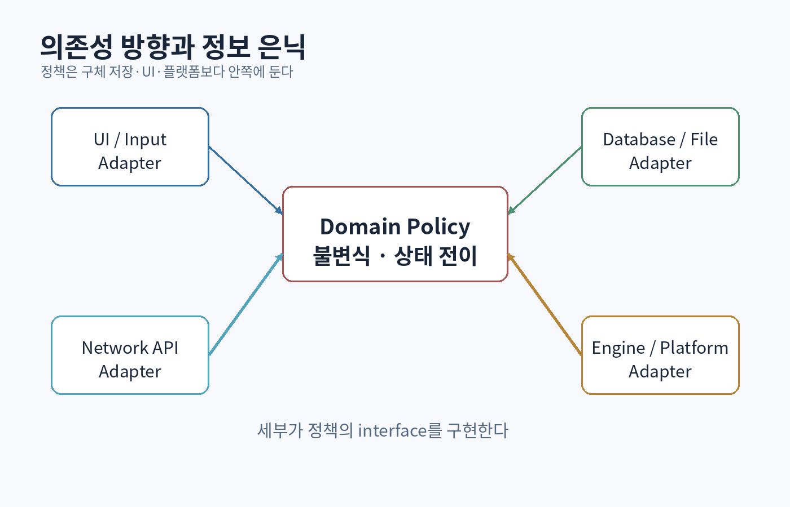

# 제7부 — 소프트웨어 아키텍처와 게임 구조

{#fig-architecture-dependencies}

# 37장. 추상화, 정보 은닉, 변경의 비용

## 37.1 아키텍처는 상자의 수가 아니다

아키텍처를 클래스 다이어그램이나 폴더 구조와 혼동하기 쉽다. 좋은 아키텍처의 목적은 **변경과 실패의 파급 범위를 줄이고, 중요한 판단을 명시적으로 만드는 것**이다.

다음 두 프로그램은 기능이 같아도 유지 비용이 다르다.

```text
프로그램 A
입력 처리 → 게임 규칙 → 저장 → 화면 출력이 한 함수에 섞임

프로그램 B
입력 해석 → 명령 → 도메인 상태 전이 → 영속화 → 표시 모델
```

B가 항상 좋은 것은 아니다. 작은 스크립트라면 A가 더 싸다. 그러나 입력 장치, 저장 방식, UI가 독립적으로 바뀌기 시작하면 경계가 필요하다. 아키텍처는 미래를 맞히는 기술이 아니라 **이미 관찰된 변경 축을 분리하는 기술**이다.

## 37.2 정보 은닉

David Parnas는 모듈을 처리 단계가 아니라, 바뀔 가능성이 있는 설계 결정에 따라 나누는 관점을 제시했다. [[Parnas 1972, On the Criteria To Be Used in Decomposing Systems into Modules](https://www.cs.umd.edu/class/spring2003/cmsc838p/Design/criteria.pdf)]

예를 들어 파일 압축 프로그램을 다음처럼 나눌 수 있다.

```text
나쁜 분해: ReadInput → BuildTable → Compress → WriteOutput
좋은 분해: ByteSource, SymbolModel, Codec, BitWriter
```

첫 구조는 실행 순서를 반영하지만 내부 자료구조가 여러 단계에 누출될 수 있다. 두 번째 구조는 입력 매체, 모델, 압축 방식, 비트 출력 형식을 각각 숨긴다.

### 숨겨야 할 결정

- 컨테이너의 구체 타입
- 파일 형식과 버전
- 캐시 정책
- 스레드 안전성 정책
- 외부 서비스 프로토콜
- 메모리 소유권
- 시간 단위와 좌표계

인터페이스가 `std::vector`를 그대로 반환하면 호출자는 저장 형식, 연속 메모리, 수정 가능성에 결합된다.

```cpp
// 내부 표현을 노출한다.
std::vector<Enemy>& enemies();

// 필요한 능력만 제공한다.
std::span<const EnemyView> enemies() const;
void spawn_enemy(EnemySpec spec);
```

그러나 추상화가 항상 복잡한 wrapper를 뜻하지 않는다. `std::span`처럼 소유하지 않는 범위를 명확히 표현하는 작은 타입도 정보 은닉이다.

## 37.3 추상화의 누수와 탈출구

모든 추상화는 일부 현실을 숨긴다. 성능이나 장애가 경계를 넘어오면 아래 계층의 지식이 필요하다.

```text
"데이터베이스에 저장했다"
→ transaction이 commit되었는가?
→ 로그가 durable media까지 flush되었는가?
→ replica에 언제 보이는가?
→ 재시도하면 중복되지 않는가?
```

좋은 API는 일반 경로를 단순하게 만들되, 진단과 고급 제어를 위한 탈출구를 제공한다.

```cpp
struct SaveOptions {
    Durability durability = Durability::Journal;
    std::chrono::milliseconds deadline{500};
};

SaveResult save(PlayerId id, const PlayerState&, SaveOptions = {});
```

## 37.4 응집도와 결합도

응집도는 한 모듈의 요소들이 하나의 목적을 향하는 정도다. 결합도는 모듈들이 서로의 세부에 의존하는 정도다.

높은 응집도:

```text
Inventory
- add_item
- remove_item
- capacity rule
- stack merge rule
```

낮은 응집도:

```text
Utils
- parse_json
- play_sound
- calculate_damage
- open_socket
- get_global_player
```

`Utils`는 이름이 아니라 책임 부재의 신호일 때가 많다.

결합은 단순한 import 수가 아니다.

- **이름 결합**: 상대 타입을 안다.
- **자료구조 결합**: 상대의 내부 레이아웃을 안다.
- **시간 결합**: 호출 순서를 알아야 한다.
- **수명 결합**: 상대가 살아 있어야 한다.
- **배포 결합**: 함께 릴리스해야 한다.
- **실패 결합**: 한쪽 실패가 다른 쪽을 멈춘다.

분산 서비스로 나누면 이름 결합은 줄어도 네트워크·배포·실패 결합은 커질 수 있다.

## 37.5 불변식이 경계를 결정한다

함께 원자적으로 지켜야 하는 데이터는 같은 경계 안에 두는 것이 쉽다.

```text
플레이어 골드 감소
아이템 소유권 증가
구매 기록 생성
```

이 세 동작이 하나의 불변식이라면 처음부터 서로 다른 서비스로 쪼개는 것은 복잡한 보상·재시도·중복 제거를 요구한다.

아키텍처 질문:

1. 반드시 함께 맞아야 하는 상태는 무엇인가?
2. 어느 시점까지 일관되어야 하는가?
3. 실패 후 어떤 중간 상태가 허용되는가?
4. 누가 복구 책임을 갖는가?

## 37.6 추상화의 가격표

모든 경계에는 비용이 있다.

| 경계 | 장점 | 비용 |
|---|---|---|
| 함수 | 지역적 추론 | 호출·간접화, 과도한 분해 |
| 클래스/모듈 | 상태와 불변식 캡슐화 | 수명·의존성 관리 |
| 프로세스 | 장애·권한 격리 | IPC, 직렬화 |
| 서비스 | 독립 배포 | 네트워크와 분산 상태 |
| 플러그인 | 확장성 | ABI·버전·보안 |

"더 분리됨"은 자동으로 "더 좋음"이 아니다. 경계가 해결하는 문제와 새로 만드는 문제를 모두 적는다.

<div class="lab">

### 실습: 한 파일 프로그램을 세 번 분해하기

작은 텍스트 RPG를 한 파일로 먼저 완성한다.

1. 입력, 규칙, 출력이 섞인 첫 버전
2. 도메인 모델과 I/O 분리
3. 저장 형식과 UI를 교체 가능한 경계로 분리

각 버전에서 다음 변경 비용을 측정한다.

- 콘솔 UI를 테스트용 scripted input으로 교체
- JSON 저장을 binary 저장으로 교체
- 독 효과를 추가
- 턴 기록 재생 기능 추가

변경한 파일 수와 테스트 수를 기록하라. 추상화의 효용을 감상으로 판단하지 않는다.

</div>

# 38장. 의존성, API, 모듈, 빌드 경계

## 38.1 의존성 방향은 정책을 보호한다

고수준 정책이 저수준 세부에 직접 의존하면 세부 변경이 전체를 흔든다.

```text
CombatRules → SQLiteInventoryRepository
```

정책이 저장 기술을 알아야 한다. 반대로 필요한 능력을 인터페이스로 표현한다.

```cpp
class InventoryStore {
public:
    virtual ~InventoryStore() = default;
    virtual std::optional<Inventory> load(PlayerId) = 0;
    virtual SaveResult save(PlayerId, const Inventory&) = 0;
};

class PurchaseService {
public:
    PurchaseService(InventoryStore& store, PriceCatalog& prices)
        : store_(store), prices_(prices) {}
    // ...
private:
    InventoryStore& store_;
    PriceCatalog& prices_;
};
```

의존성 역전은 인터페이스를 많이 만드는 기법이 아니다. **정책이 요구하는 최소 능력을 정책 쪽 언어로 정의하는 것**이다.

## 38.2 API는 가능한 상태의 집합을 설계한다

나쁜 API는 잘못된 호출 순서를 허용한다.

```cpp
Texture t;
t.set_width(1024);
t.upload();       // format과 pixels가 설정되지 않았을 수 있음
```

생성 시 불변식을 만든다.

```cpp
struct TextureDesc {
    Extent2D extent;
    PixelFormat format;
    std::span<const std::byte> initial_pixels;
};

expected<Texture, TextureError> create_texture(Device&, const TextureDesc&);
```

타입으로 단위를 구분한다.

```cpp
struct Seconds { double value; };
struct Frames  { std::uint64_t value; };
struct Meters  { float value; };
```

`float` 하나로 시간, 거리, 각도를 모두 표현하면 컴파일러가 오류를 막을 수 없다.

## 38.3 명령과 조회를 구분한다

조회는 상태를 관찰하고, 명령은 상태를 바꾼다. 둘을 구분하면 테스트와 캐시, 권한, 재시도 정책이 명확해진다.

```cpp
InventoryView query_inventory(PlayerId) const;
PurchaseResult purchase(PlayerId, ItemId, Quantity);
```

명령의 결과에는 단순 `bool`보다 도메인 오류를 담는다.

```cpp
enum class PurchaseError {
    UnknownItem,
    InsufficientFunds,
    InventoryFull,
    DuplicateRequest
};
```

## 38.4 오류는 제어 흐름의 일부다

오류 모델을 한 프로그램에서 무작위로 섞으면 호출자가 예측하기 어렵다.

- exception: 예외적 실패와 stack unwinding
- `expected<T,E>`: 예상 가능한 도메인 실패
- optional: 값 부재가 정상 상태
- status code: C ABI와 저수준 경계
- assertion: 프로그래머 불변식 위반

```cpp
auto player = repository.load(id);
if (!player) {
    return unexpected(LoadPlayerError{player.error(), id});
}
```

오류를 감싸되 원인 chain, operation, identifier를 보존한다. 로그 한 줄만 남기고 오류를 성공으로 바꾸지 않는다.

## 38.5 패키지와 빌드 그래프

소스 의존성은 빌드 시간과 배포 구조를 만든다.

```text
engine_core
├── math
├── memory
└── diagnostics

engine_runtime
├── engine_core
├── assets
└── jobs

gameplay
├── engine_runtime
└── game_data
```

순환 의존은 초기화·테스트·재사용을 어렵게 한다.

```text
A → B → C → A
```

해결법:

- 공통 추상화를 더 낮은 모듈로 이동
- callback/event로 방향 반전
- 데이터 계약을 별도 모듈로 분리
- 실제로는 하나의 응집된 모듈인지 재검토

## 38.6 안정된 인터페이스와 불안정한 구현

변화가 잦은 구현이 변화가 적은 핵심 타입을 의존하게 한다.

```text
UI, 플랫폼 입력, 저장 어댑터
        ↓
게임 규칙과 도메인 타입
```

반대로 도메인 타입이 특정 UI widget이나 DB row를 참조하면 정책이 세부에 끌려간다.

## 38.7 ABI와 플러그인

프로세스 안의 동적 플러그인은 편리하지만 C++ ABI는 컴파일러, 표준 라이브러리, 빌드 옵션에 민감하다.

안전한 경계 예:

```cpp
extern "C" {
struct PluginApiV1 {
    std::uint32_t size;
    void (*on_load)(HostApiV1*);
    void (*on_update)(double dt);
    void (*on_unload)();
};

bool get_plugin_api(std::uint32_t version, PluginApiV1* out);
}
```

- 명시적 버전
- 구조체 크기
- 할당과 해제의 같은 경계
- 예외를 ABI 밖으로 내보내지 않음
- ownership을 문서화

## 38.8 호환성은 API 설계의 일부다

SemVer 번호만으로 호환성이 생기지 않는다.

- source compatibility
- binary compatibility
- behavior compatibility
- data compatibility
- protocol compatibility

함수 signature가 같아도 timeout 기본값이나 정렬 순서가 바뀌면 행동 호환성이 깨질 수 있다.

<div class="check">

### 38장 통과 기준

- 한 모듈의 public API를 10개 이하 핵심 연산으로 줄인다.
- 모든 reference와 pointer에 소유 여부를 설명한다.
- 오류가 호출자까지 어떻게 전파되는지 trace를 그린다.
- 빌드 그래프의 순환을 제거하거나 정당화한다.
- 두 버전 사이의 source/data/behavior compatibility 표를 만든다.

</div>

# 39장. 패턴은 답이 아니라 압축된 경험이다

## 39.1 패턴 이름보다 힘을 적는다

패턴을 먼저 고르면 문제를 패턴에 맞추게 된다. 먼저 힘과 제약을 적는다.

```text
문제: 플레이어 입력을 기록하고 재생하고 싶다.
힘:
- 키보드와 패드가 같은 행동을 일으킨다.
- AI도 같은 행동을 요청할 수 있다.
- 네트워크 전송 크기가 작아야 한다.
- 모든 행동이 되돌릴 수 있는 것은 아니다.
```

이때 Command 패턴이 후보가 된다.

## 39.2 State

복잡한 조건문을 상태와 전이로 명시한다.

```cpp
enum class StateId { Idle, Run, Attack, Dodge, Stun, Dead };

enum class Event { Move, Stop, AttackPressed, DodgePressed, Hit, Died, AnimationEnd };

struct Transition {
    StateId from;
    Event event;
    StateId to;
    int priority;
};
```

상태 객체 접근:

```cpp
class PlayerState {
public:
    virtual ~PlayerState() = default;
    virtual void enter(Player&) {}
    virtual void update(Player&, Seconds) = 0;
    virtual void exit(Player&) {}
    virtual bool ignores_damage() const { return false; }
};
```

### 실패 방식

- 상태마다 다른 상태를 직접 생성해 결합 폭증
- 애니메이션 callback과 게임 상태가 서로 소유
- 모든 예외를 상태 수 증가로 해결해 state explosion
- 이동, 무기, 자세처럼 직교하는 축을 하나의 거대 상태로 합침

직교 축은 계층 상태 머신, 병렬 상태, 태그/능력 시스템으로 분리할 수 있다.

## 39.3 Command

```cpp
struct MoveCommand { Vec2 axis; };
struct AttackCommand { AbilityId ability; };
using GameCommand = std::variant<MoveCommand, AttackCommand>;

void apply(World& world, EntityId actor, const GameCommand& command);
```

값 타입 command는 직렬화·기록·재생·테스트에 유리하다. 객체지향 command는 실행 전략과 undo state를 캡슐화하기 좋다.

### 질문

- command는 의도인가, 이미 검증된 사실인가?
- 실행 시점의 상태를 읽는가, 생성 시점의 snapshot을 담는가?
- 재실행이 안전한가?
- 순서가 결과에 영향을 주는가?

## 39.4 Observer와 Event Queue

직접 호출:

```text
Health → UI
Health → Audio
Health → Quest
Health → Analytics
```

이벤트:

```text
Health --EntityDied--> EventQueue --> 여러 소비자
```

```cpp
struct EntityDied {
    EntityId victim;
    EntityId instigator;
    DamageType type;
};
```

이벤트가 결합을 줄이지만 다음 비용을 만든다.

- 흐름 추적 어려움
- 실행 순서 불명확
- 지연과 queue overflow
- stale entity reference
- 재진입과 무한 이벤트

원칙:

- 같은 call stack에서 결과가 필요하면 직접 호출을 우선
- frame 경계나 subsystem 경계를 넘으면 queue 고려
- 이벤트 schema와 ownership을 명시
- 소비 순서를 deterministic하게 정의
- debugging trace에 event ID와 producer를 기록

## 39.5 Strategy와 Policy

변하는 알고리즘을 주입한다.

```cpp
template<class BroadPhase>
class CollisionWorld {
    BroadPhase broad_phase_;
};
```

runtime polymorphism이 필요한지 compile-time policy가 필요한지 선택한다. 전략이 두 개뿐이고 바뀌지 않는다면 단순 조건문이 더 낫다.

## 39.6 Object Pool

반복 생성 비용과 주소 안정성을 제어한다.

```cpp
template<class T>
class Pool {
public:
    Handle<T> create(T value);
    bool destroy(Handle<T>);
    T* try_get(Handle<T>);
};
```

풀링의 함정:

- 이전 상태 초기화 누락
- generation 없는 stale handle
- peak 크기만큼 영구 메모리 보유
- thread contention
- 실제 allocator 병목이 아닌데 복잡성 추가

측정 전에는 기본 allocator와 값 컨테이너를 사용한다.

## 39.7 Flyweight와 데이터 공유

1만 마리 적이 동일한 mesh, animation graph, weapon definition을 복사할 필요는 없다.

```text
개체별 데이터: transform, health, current state
공유 데이터: mesh, skeleton, attack table, behavior definition
```

공유 불변 데이터와 개체 상태를 분리하면 메모리와 캐시 효율이 좋아진다.

## 39.8 Double Buffer와 Snapshot

simulation thread가 쓰는 상태를 render thread가 동시에 읽으면 data race와 tearing이 생긴다.

```text
Frame N simulation writes World B
Renderer reads immutable RenderSnapshot A
frame boundary에서 A/B 교환
```

완전한 world 복사 대신 render에 필요한 compact snapshot을 추출할 수 있다.

## 39.9 Service Locator와 전역 상태

```cpp
auto& audio = Services::get<AudioSystem>();
```

접근은 편하지만 의존성이 signature에 드러나지 않는다. 테스트에서 전역 상태를 재설정해야 하고 초기화 순서가 숨는다.

대안:

- 생성자 주입
- 명시적 context
- subsystem-owned local locator
- pure function에 필요한 값 전달

전역 서비스가 불가피하다면 읽기 전용 설정, 로깅처럼 범위를 좁히고 수명과 thread safety를 명시한다.

<div class="paper">

### 논문·고전 읽기

- Gamma et al., *Design Patterns* — 패턴 용어의 역사적 출발점
- Robert Nystrom, *Game Programming Patterns* — 게임 루프, 컴포넌트, 이벤트 큐를 공개 온라인으로 설명 [[온라인 판](https://gameprogrammingpatterns.com/)]
- Dijkstra, *Go To Statement Considered Harmful* — 구조가 인간의 추론 가능성을 어떻게 바꾸는지 읽는다. [[원문](https://www.cs.utexas.edu/users/EWD/ewd02xx/EWD215.PDF)]

패턴을 읽을 때 “어디에 쓸까?”보다 “어떤 힘을 해결하고 어떤 새 실패를 만드는가?”를 기록한다.

</div>

# 40장. 게임 아키텍처: 시간, 상태, 소유권

## 40.1 게임은 실시간 상태 전이 시스템이다

게임 프로그램의 핵심은 화면이 아니라 반복되는 상태 전이다.

```text
input 수집
→ simulation update
→ collision/physics
→ gameplay events
→ animation/audio state
→ render data extraction
→ GPU submission
```

이 순서가 불명확하면 한 frame 늦은 입력, collision 결과의 이중 적용, animation과 hit 판정 불일치가 생긴다.

## 40.2 가변 시간 스텝

```cpp
while (running) {
    const Seconds dt = timer.tick();
    process_input();
    update_world(dt);
    render();
}
```

단순하지만 `dt`가 커질 때 수치 안정성과 gameplay 감각이 달라진다. 긴 frame에서 물체가 벽을 통과하거나 damping 결과가 달라질 수 있다.

## 40.3 고정 시간 스텝

```cpp
constexpr Seconds kStep{1.0 / 60.0};
Seconds accumulator{0.0};

while (running) {
    accumulator += clamp(timer.tick(), Seconds{0.0}, Seconds{0.25});
    process_input();

    int steps = 0;
    while (accumulator >= kStep && steps < 5) {
        simulate(kStep);
        accumulator -= kStep;
        ++steps;
    }

    const double alpha = accumulator.value / kStep.value;
    render(interpolate(previous_state, current_state, alpha));
}
```

`steps` 상한은 spiral of death를 막지만, simulation이 실제 시간에서 뒤처질 수 있다. 선택을 문서화한다.

## 40.4 deterministic simulation

같은 입력이 같은 결과를 만들려면 다음을 통제해야 한다.

- update 순서
- floating-point 차이
- random seed와 호출 순서
- iteration order
- thread scheduling
- 외부 시간과 I/O

완전한 determinism이 필요하지 않은 게임도 많다. replay, lockstep networking, 자동 테스트에 필요한 범위만 정의한다.

## 40.5 World와 Entity

가장 단순한 world:

```cpp
class World {
public:
    EntityId create_entity();
    void destroy_entity(EntityId);
    void update(Seconds dt);
private:
    HandlePool<EntityRecord> entities_;
};
```

Entity는 identity일 뿐이고 데이터와 행동은 component/system에 둘 수 있다.

### 상속 기반 객체 모델

```text
GameObject
└─ Actor
   ├─ Player
   ├─ Enemy
   └─ BreakableCrate
```

장점: 직관적, virtual dispatch, 객체별 캡슐화.

문제: 다중 역할 조합, 깊은 상속, 메모리 산재, batch 처리 어려움.

### 컴포넌트 기반

```text
Entity 42
- Transform
- Health
- Combat
- CharacterController
- Renderable
```

기능 조합이 쉽지만 component 간 통신과 update 순서를 설계해야 한다.

## 40.6 ECS를 정확히 이해하기

ECS는 단순히 `Entity` 클래스에 component pointer 목록을 넣는 것이 아니다. 전형적인 data-oriented ECS는 다음을 분리한다.

- Entity: 작은 ID
- Component: 데이터
- System: 특정 component 조합을 batch 처리

```cpp
for (auto [position, velocity] : query<Position, Velocity>()) {
    position.value += velocity.value * dt;
}
```

Archetype ECS는 동일한 component 집합을 가진 entity를 같은 chunk에 모은다. Sparse-set ECS는 component type별 dense array와 sparse index를 사용한다.

비교:

| 접근 | 강점 | 약점 |
|---|---|---|
| 객체/Actor | 개별 행동, 도구 친화 | cache와 대량 처리 |
| Sparse set | 추가/삭제와 query 단순 | 여러 component join 비용 |
| Archetype | query 순회와 locality | component 구조 변경 이동 비용 |

ECS는 모든 게임에 필수가 아니다. 수십 개 복잡한 actor가 핵심이면 객체 모델이 충분할 수 있다.

## 40.7 generation handle

인덱스만 재사용하면 오래된 참조가 새 객체를 가리킨다.

```cpp
struct EntityId {
    std::uint32_t index;
    std::uint32_t generation;
};

bool valid(EntityId id) const {
    return id.index < slots_.size()
        && slots_[id.index].alive
        && slots_[id.index].generation == id.generation;
}
```

삭제 시 generation을 증가시킨다. wraparound 정책도 고려한다.

## 40.8 update 순서

숨은 update 순서는 버그를 만든다.

```text
Input → Ability → Movement → Physics → Damage → Death → Animation → RenderExtract
```

DAG로 명시할 수 있다.

```text
Movement depends on Input
Physics depends on Movement
Damage depends on PhysicsContacts
Death depends on Damage
```

순환이 생기면 같은 frame에 필요한지, 다음 frame event로 미룰지, 두 시스템을 합칠지 판단한다.

## 40.9 gameplay event와 도메인 사실

`AttackButtonPressed`는 입력 의도다. `DamageApplied`는 검증된 사실이다. 둘을 같은 event type으로 취급하지 않는다.

```cpp
struct AttackRequested { EntityId actor; AbilityId ability; };
struct DamageApplied { EntityId source; EntityId target; int amount; };
struct EntityDied { EntityId entity; EntityId killer; };
```

사실 event는 replay, analytics, quest에 쓰일 수 있지만 원본 world state의 유일한 진실과 이중화되지 않도록 한다.

## 40.10 리소스와 에셋

에셋은 파일 경로 이상의 것이다.

```text
source asset (.fbx, .png)
→ import settings
→ build/cook
→ runtime artifact
→ AssetId/content hash
→ async load
→ GPU upload
→ hot reload/version
```

런타임 객체가 파일 시스템 경로에 직접 결합되지 않도록 stable asset ID와 catalog를 둔다.

```cpp
AssetHandle<Texture> request_texture(AssetId id, LoadPriority p);
```

상태:

```text
Unloaded → Queued → LoadingCPU → UploadingGPU → Ready
                         ↘ Failed
```

## 40.11 게임 저장

메모리 객체를 그대로 dump하지 않는다.

- pointer와 vtable은 지속 가능하지 않다.
- 버전 변경에 깨진다.
- padding과 endian에 의존한다.
- 런타임 cache까지 저장된다.

저장 schema는 의미 있는 ID와 값으로 만든다.

```json
{
  "schema": 3,
  "player": {
    "level": 12,
    "position": [10.5, 0.0, -3.2],
    "inventory": [{"item":"potion_small","count":4}]
  }
}
```

migration을 순차 함수로 테스트한다.

```text
v1 → v2 → v3
```

<div class="lab">

### 최종 실습: Apex Runtime의 첫 골격

다음을 구현한다.

- generation handle 기반 entity pool
- `Transform`, `Velocity`, `Health` component
- 명시적 system update DAG
- fixed-step simulation
- frame event queue
- immutable render snapshot
- deterministic replay: seed + input command log

검증:

1. 삭제된 entity handle 접근이 실패한다.
2. 같은 seed와 command log가 같은 state hash를 만든다.
3. renderer를 끄고도 simulation test가 통과한다.
4. 1만 entity에서 update 시간을 기록한다.
5. component 저장 방식을 객체 배열과 dense array로 바꿔 비교한다.

</div>

# 41장. 데이터 지향 설계, 작업 시스템, 확장 가능한 엔진

## 41.1 코드가 아니라 데이터가 CPU를 움직인다

CPU는 명령어뿐 아니라 데이터를 기다린다. 메모리 계층에서 보았듯 연속 순회와 예측 가능한 접근은 성능에 큰 영향을 준다.

객체 배열:

```cpp
struct Enemy {
    Vec3 position;
    Vec3 velocity;
    float health;
    std::string name;
    std::vector<Item> inventory;
    virtual void update(float dt);
};
std::vector<std::unique_ptr<Enemy>> enemies;
```

이동만 업데이트해도 pointer 추적과 불필요한 필드가 cache line에 들어올 수 있다.

SoA:

```cpp
struct MovementTable {
    std::vector<Vec3> positions;
    std::vector<Vec3> velocities;
};

for (std::size_t i = 0; i < table.positions.size(); ++i) {
    table.positions[i] += table.velocities[i] * dt;
}
```

어떤 형태가 빠른지는 데이터 크기, 접근 패턴, 컴파일러, 하드웨어에 따라 측정한다.

## 41.2 hot/cold split

자주 읽는 필드와 드물게 읽는 필드를 분리한다.

```cpp
struct EnemyHot {
    Vec3 position;
    Vec3 velocity;
    std::uint16_t state;
    std::uint16_t flags;
};

struct EnemyCold {
    std::string debug_name;
    std::vector<Item> inventory;
    DialogueState dialogue;
};
```

메모리 절약이 아니라 **작업 하나에 필요한 byte 수**를 줄이는 것이 목표다.

## 41.3 batch와 branch

다형 객체를 하나씩 호출하면 branch prediction과 vectorization이 어려울 수 있다.

```cpp
for (auto& actor : actors) actor->update(dt);
```

종류별 batch:

```cpp
update_projectiles(projectiles, dt);
update_characters(characters, dt);
update_particles(particles, dt);
```

하지만 종류별 코드를 과도하게 복제하지 않는다. 성능이 필요한 hot loop와 일반 orchestration을 분리한다.

## 41.4 작업 시스템

OS thread를 기능마다 직접 만들면 core 수보다 많은 thread, context switch, 복잡한 수명 문제가 생긴다. 작업 시스템은 작은 job을 worker pool에 배치한다.

```cpp
struct JobHandle { std::uint32_t index; std::uint32_t generation; };

JobHandle schedule(JobFn fn, std::span<const JobHandle> dependencies = {});
void wait(JobHandle);
```

DAG 예:

```text
AnimationPose ─┐
AIThink ───────┼→ CharacterMovement → Physics → RenderExtract
Input ─────────┘
ParticleSim ─────────────────────────→ RenderExtract
```

## 41.5 work stealing

각 worker가 deque를 갖고 자신의 끝에서 pop, 다른 worker의 반대 끝에서 steal한다. 이는 contention을 줄이고 불균형을 완화할 수 있다.

필요한 고려:

- job granularity
- false sharing
- worker sleep/wake
- dependency counter
- exception/error handling
- shutdown
- thread affinity
- profiler correlation ID

작은 작업은 scheduling overhead보다 실행 시간이 짧을 수 있다. 여러 원소를 chunk로 묶는다.

## 41.6 기다림의 설계

worker가 dependency를 기다리며 block하면 deadlock이나 core 낭비가 생길 수 있다. help-while-waiting은 기다리는 동안 다른 ready job을 실행한다.

```cpp
void wait(JobHandle h) {
    while (!is_complete(h)) {
        if (auto job = try_get_ready_job()) execute(*job);
        else cpu_relax_or_sleep();
    }
}
```

재진입, stack 깊이, priority inversion을 검토한다.

## 41.7 frame allocator

frame 동안만 필요한 임시 데이터는 linear arena로 빠르게 할당하고 frame 끝에 한 번에 초기화할 수 있다.

```cpp
class LinearArena {
public:
    void* allocate(std::size_t bytes, std::size_t alignment);
    void reset() noexcept { offset_ = 0; }
};
```

주의:

- arena보다 오래 사는 pointer 금지
- destructor 필요한 객체 처리
- overflow 정책
- thread별 arena 또는 synchronization
- peak와 frame별 사용량 계측

## 41.8 렌더 추출

게임 world를 renderer가 직접 순회하면 subsystem 결합과 동시성 문제가 커진다.

```cpp
struct RenderInstance {
    Mat4 world;
    MeshHandle mesh;
    MaterialHandle material;
    BoundingSphere bounds;
};

struct RenderSnapshot {
    std::span<const RenderInstance> opaque;
    std::span<const LightData> lights;
    CameraData camera;
};
```

simulation이 snapshot을 만들고 renderer는 불변 입력으로 소비한다.

## 41.9 엔진과 게임의 경계

엔진은 모든 게임 규칙을 일반화하지 않는다.

엔진 후보:

- 플랫폼·창·입력 추상화
- 메모리와 diagnostics
- asset pipeline
- rendering
- jobs
- audio transport
- physics integration
- serialization primitives

게임 후보:

- damage formula
- ability rule
- quest
- item definition
- win/loss
- level flow

두 번째 게임이 없는데 첫 게임의 규칙을 추상 엔진 API로 올리면 잘못된 일반화가 쉽다.

## 41.10 편집기와 도구

좋은 엔진은 런타임만이 아니다. 개발자 iteration time을 줄인다.

- hot reload
- property inspector
- asset dependency viewer
- frame capture
- replay
- command console
- validation
- batch conversion
- crash symbolization

도구는 runtime과 같은 schema를 공유하되, editor-only dependency가 shipping binary에 들어가지 않게 빌드 경계를 나눈다.

## 41.11 아키텍처 결정 기록

ADR 예:

```text
제목: 렌더 스레드에는 World pointer를 전달하지 않는다
상태: 채택
맥락: simulation과 render 병렬화, stale pointer 문제가 있음
결정: frame마다 immutable RenderSnapshot을 추출
대안: World read lock, command stream
결과: 추출 비용 증가, renderer 테스트와 병렬성 개선
측정: 50k instance 추출 0.42ms, snapshot 4.8MB
```

결정의 이유와 관찰 조건을 보존하면 나중에 조건이 바뀌었을 때 다시 판단할 수 있다.

<div class="check">

### 제7부 통과 기준

- 모듈 경계를 실행 단계가 아니라 숨길 설계 결정으로 설명한다.
- API의 ownership, error, unit, thread safety를 문서화한다.
- 패턴을 적용하기 전 해결할 힘과 실패 모드를 적는다.
- fixed-step loop와 interpolation을 구현한다.
- generation handle로 stale reference를 검출한다.
- 객체 모델과 ECS의 데이터 접근 비용을 benchmark한다.
- job DAG와 render snapshot을 구현하고 profiler trace를 남긴다.
- 아키텍처 결정 하나를 ADR로 작성한다.

</div>
