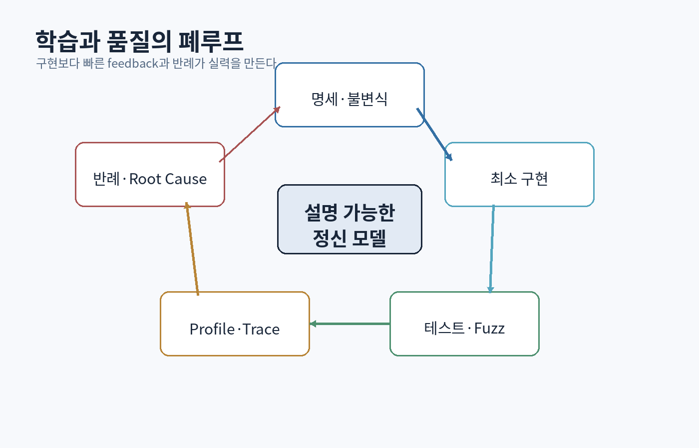

# 제8부 — 테스트, 디버깅, 성능, 기술적 의사소통

{#fig-quality-loop}

# 42장. 테스트는 예제가 아니라 불변식을 실행하는 장치다

## 42.1 테스트의 목적

테스트는 “코드가 맞다”를 증명하지 않는다. 선택한 입력과 성질에서 틀린 동작을 빠르게 발견하고, 변경 후에도 중요한 계약이 유지되는지 확인한다.

테스트가 답해야 할 질문:

- 어떤 계약을 보호하는가?
- 어떤 실패가 나면 원인을 좁힐 수 있는가?
- 실행이 결정적이고 재현 가능한가?
- 구현 세부가 아니라 관찰 가능한 행동을 확인하는가?
- 유지 비용이 보호 가치보다 작은가?

## 42.2 테스트의 층

| 층 | 대상 | 강점 | 약점 |
|---|---|---|---|
| 단위 | 함수·작은 모듈 | 빠르고 국소적 | 통합 오류를 놓침 |
| 통합 | DB·파일·네트워크 경계 | 실제 계약 검증 | 환경과 속도 |
| 시스템 | 실행 파일 전체 | 사용자 흐름 | 실패 원인 좁히기 어려움 |
| 성능 | latency·throughput·memory | 회귀와 한계 | noisy environment |
| 복구 | crash·network partition | 실패 후 상태 | 시나리오 설계 비용 |

피라미드 모양 자체보다 **가장 싼 층에서 결함을 잡고, 경계마다 실제 통합 계약을 확인하는 것**이 중요하다.

## 42.3 Arrange–Act–Assert와 Given–When–Then

```cpp
TEST(Inventory, MergesStackUntilCapacity) {
    Inventory inv(/*slots=*/2, /*stack_limit=*/10);
    inv.add(Item{"potion", 7});

    const auto result = inv.add(Item{"potion", 5});

    ASSERT_TRUE(result);
    EXPECT_EQ(inv.count("potion"), 12);
    EXPECT_EQ(inv.used_slots(), 2);
}
```

테스트 이름은 조건과 결과를 말한다. `Test1`, `Works`는 실패 보고서에서 정보를 주지 않는다.

## 42.4 경계값과 동치 분할

나이 유효 범위가 `[0, 150]`이면 대표 입력은 다음과 같다.

```text
-1, 0, 1, 149, 150, 151
```

컨테이너:

- empty
- one element
- capacity 직전/직후
- 중복 key
- 최대 크기
- 잘못된 UTF-8

시간:

- 0
- 음수
- deadline과 정확히 같음
- overflow 근처
- clock가 뒤로 이동하는 wall time

## 42.5 속성 기반 테스트

QuickCheck는 구체 예제보다 프로그램이 만족해야 할 속성을 선언하고, 많은 입력을 생성하며, 실패 입력을 작은 반례로 축소하는 접근을 대중화했다. [[Claessen & Hughes 2000](https://www.cs.tufts.edu/~nr/cs257/archive/john-hughes/quick.pdf)]

정렬의 속성:

```text
1. 결과는 비감소 순서다.
2. 결과 원소 multiset은 입력과 같다.
3. 정렬을 두 번 해도 결과가 같다.
```

의사코드:

```cpp
property("sort preserves elements", [](std::vector<int> xs) {
    auto ys = xs;
    std::sort(ys.begin(), ys.end());
    return multiset(xs) == multiset(ys);
});
```

serializer:

```text
decode(encode(x)) == x
```

행렬 inverse:

```text
M · inverse(M) ≈ I  // 역행렬이 존재하고 오차 허용 범위 내
```

## 42.6 metamorphic testing

정답 oracle을 구하기 어려울 때 입력 변환과 출력 관계를 검사한다.

- 이미지 밝기를 일정 배율로 바꾸면 평균 luminance도 대응
- 그래프 vertex 이름을 permutation해도 shortest path 비용은 동일
- 물리 world 전체를 같은 translation으로 이동해도 상대 충돌 결과는 동일
- SQL query에 결과에 영향 없는 조건을 추가해도 row set 동일

## 42.7 differential testing

같은 의미를 구현한 두 시스템을 비교한다.

```text
내 JSON parser vs 검증된 parser
새 renderer vs reference CPU renderer
최적화 알고리즘 vs 느린 명백한 구현
JIT 결과 vs interpreter 결과
```

reference가 완벽하다는 보장은 없지만 불일치가 강한 조사 신호다.

## 42.8 fuzzing

Barton Miller의 초기 UNIX utility fuzzing 연구는 무작위 입력으로 많은 프로그램의 crash와 hang을 발견했다. [[Miller et al. 1990](https://pages.cs.wisc.edu/~bart/fuzz/CS736-Projects-f1988.pdf)]

현대 coverage-guided fuzzing은 새로운 code path를 여는 입력을 보존·변형한다.

좋은 fuzz target:

```cpp
extern "C" int LLVMFuzzerTestOneInput(const std::uint8_t* data,
                                      std::size_t size) {
    Parser parser;
    const auto result = parser.parse({data, size});
    if (result) {
        auto encoded = serialize(*result);
        auto reparsed = parser.parse(encoded);
        assert(reparsed);
    }
    return 0;
}
```

제한:

- 입력 크기·시간·메모리 제한
- global state reset
- nondeterminism 제거
- sanitizer 결합
- crash input corpus 보존

## 42.9 동시성 테스트

동시성 결함은 특정 interleaving에서만 나타난다.

전략:

- 작은 deterministic scheduler
- barrier로 경쟁 window 확대
- 반복 실행과 random seed 기록
- ThreadSanitizer
- linearizability history 검사
- fault injection

```text
T1: read balance=100
T2: read balance=100
T1: write 80
T2: write 70
```

최종 70은 두 출금이 모두 성공했다는 기록과 모순될 수 있다.

## 42.10 snapshot/golden test

compiler output, UI tree, shader image를 golden file과 비교할 수 있다. 편리하지만 의도하지 않은 변경과 의도한 변경을 구분하는 사람이 필요하다.

- text는 canonical formatting
- image는 exact pixel과 perceptual metric 구분
- platform별 허용 오차
- 승인 과정에 diff 표시
- golden 갱신을 자동 성공으로 취급하지 않음

## 42.11 테스트 가능성은 설계 성질이다

시간, random, I/O를 숨은 global에서 직접 읽으면 테스트가 어렵다.

```cpp
class Matchmaker {
public:
    Matchmaker(Clock& clock, Random& random, QueueStore& store);
};
```

테스트에서는 fake clock과 seeded random을 주입한다. 이는 테스트만 위한 왜곡이 아니라 의존성을 명시하는 설계다.

<div class="lab">

### 실습: StoneKV 검증 묶음

- key/value boundary unit test
- encode/decode property test
- 느린 `std::map` reference와 differential test
- random operation sequence
- 쓰기 중 process kill 후 recovery test
- log 마지막 byte를 모든 위치에서 truncate하는 fault test
- corrupted length/checksum fuzzing
- 1만 회 반복 후 model과 state 비교

실패 시 seed, operation log, 파일 image를 저장한다.

</div>

# 43장. 디버깅: 가설을 줄이는 과학적 방법

## 43.1 디버깅의 목표는 코드 수정이 아니다

첫 목표는 관찰된 현상을 설명하는 최소 원인을 찾는 것이다. 성급한 수정은 증상을 숨기고 다른 조건에서 재발시킨다.

과정:

```text
현상 고정
→ 재현 조건 최소화
→ 가능한 원인 목록
→ 원인을 구분하는 관찰/실험
→ 범위 이분
→ root cause
→ 수정
→ 회귀 테스트와 유사 결함 탐색
```

## 43.2 좋은 버그 보고서

```text
제목: inventory save 후 재접속 시 마지막 slot이 사라짐
빌드: 1.8.42, commit a91c2d
환경: Windows 11, locale ja-JP
재현:
1. slot 31에 potion 추가
2. 즉시 종료
3. 재접속
기대: potion 유지
실제: slot 31 empty
재현율: 20/20
최초 정상: 1.8.39
첨부: save.bin, logs, video, checksum
```

“가끔 안 됨”은 조사 가능한 정보가 아니다.

## 43.3 관찰을 바꾸지 않는 관찰은 없다

로그 추가, debugger attach, optimization 변경은 timing과 memory layout을 바꿀 수 있다. Heisenbug에서는 저침습 trace, hardware watchpoint, recording debugger, crash dump가 필요하다.

## 43.4 delta debugging

실패 입력이나 변경 집합을 줄인다.

```text
1000줄 scene에서 crash
→ entity 절반 제거
→ 여전히 crash / 사라짐
→ 원인이 남은 절반인지 판단
→ 반복
```

Git bisect는 commit 범위를 이분한다.

```bash
git bisect start
git bisect bad HEAD
git bisect good v1.8.39
git bisect run ./repro_test.sh
```

자동화된 재현은 사람의 기억보다 강하다.

## 43.5 stack, heap, lifetime

crash 주소만 보지 말고 다음을 묻는다.

- 읽기/쓰기/실행 중 어떤 접근인가?
- 주소가 null, low address, freed pattern, stack인가?
- 객체를 누가 소유했는가?
- 해제 stack과 사용 stack은 무엇인가?
- race가 수명을 바꾸었는가?

AddressSanitizer는 shadow memory와 compiler instrumentation으로 out-of-bounds, use-after-free 같은 오류를 찾는다. [[Serebryany et al. 2012](https://www.usenix.org/system/files/conference/atc12/atc12-final39.pdf)]

## 43.6 undefined behavior

C++의 UB는 단순 “이상한 결과”가 아니다. compiler가 해당 상황이 없다고 가정해 변환할 수 있다.

```cpp
int overflow(int x) {
    return x + 1 > x; // signed overflow 가능성을 기준으로 추론하면 위험
}
```

도구:

- AddressSanitizer
- UndefinedBehaviorSanitizer
- ThreadSanitizer
- MemorySanitizer
- static analyzer
- compiler warnings

Debug build만 통과하는 코드는 안전하다는 뜻이 아니다. release optimization에서 UB가 드러날 수 있다.

## 43.7 core dump와 minidump

production에서 debugger를 붙일 수 없으므로 crash 당시 상태를 저장한다.

필수:

- 정확한 binary와 symbols
- build/commit ID
- thread stacks
- exception/signal
- module list
- 중요 breadcrumb
- 개인정보 최소화

symbol server와 재현 가능한 build가 없으면 dump 가치가 크게 낮아진다.

## 43.8 로그 설계

로그는 문장이 아니라 event record다.

```json
{
  "time":"2026-07-24T09:14:12.231Z",
  "level":"error",
  "event":"asset_load_failed",
  "asset_id":"char.hero.mesh",
  "request_id":"7bf2",
  "reason":"checksum_mismatch",
  "expected":"...",
  "actual":"..."
}
```

원칙:

- correlation ID
- 안정된 event name
- 구조화 field
- secret·개인정보 제외
- rate limit
- clock 종류와 timezone
- 같은 오류의 중복 stack 방지

## 43.9 metrics, logs, traces

- metrics: 집계 추세와 alert
- logs: 개별 사건의 문맥
- traces: 요청/작업의 인과 경로

게임 frame에서도 scope trace를 사용한다.

```text
Frame 13042
  GameThread 19.2ms
    AI 6.1ms
    Animation 4.8ms
  RenderThread 8.3ms
  GPU 16.5ms
```

## 43.10 분산 디버깅

원격 시스템에서는 한 로그의 순서가 전체 순서가 아니다.

기록할 것:

- request/operation ID
- retry attempt
- idempotency key
- node/region
- logical version
- deadline
- upstream/downstream latency
- result classification

wall-clock timestamp만으로 인과성을 단정하지 않는다.

## 43.11 GPU 디버깅

그래픽 오류는 CPU state, command recording, synchronization, shader, resource lifetime 중 어디서든 생긴다.

절차:

1. 문제 frame capture
2. draw/dispatch 이벤트 찾기
3. bound pipeline, descriptor, resource 확인
4. vertex/texture 중간 데이터 확인
5. shader 입력과 출력 검사
6. resource state와 synchronization 확인
7. 최소 shader/scene으로 축소

색으로 중간값을 표시하는 debug view가 유용하다.

```hlsl
return float4(normalWS * 0.5 + 0.5, 1.0);
```

<div class="check">

### 버그를 수정한 뒤 묻는 질문

- 어떤 불변식이 깨졌는가?
- 왜 기존 테스트가 잡지 못했는가?
- 같은 원인 class가 다른 곳에도 있는가?
- compiler/tooling으로 예방할 수 있는가?
- API가 잘못된 사용을 허용했는가?
- 운영 환경에서 더 빨리 관찰할 수 있는가?

</div>

# 44장. 성능 공학: 추측 대신 비용 모델과 측정

## 44.1 성능 목표를 먼저 수치화한다

“빠르게”는 요구사항이 아니다.

```text
게임: 60 FPS → frame budget 16.67ms
서버: p99 latency < 100ms at 5k req/s
로딩: cold start < 2s on target SSD
메모리: peak resident < 2GB
```

평균만 보면 tail latency와 frame spike를 숨긴다.

## 44.2 benchmark의 함정

- compiler가 결과를 제거
- debug build
- warm/cold cache 혼합
- CPU frequency 변화
- background process
- 너무 짧은 측정
- clock resolution
- allocator state
- 입력이 현실과 다름
- 여러 변수를 동시에 변경

측정 조건을 코드와 함께 version control한다.

## 44.3 latency와 throughput

- latency: 한 작업 완료 시간
- throughput: 단위 시간당 완료 수

batching은 throughput을 높이지만 대기 latency를 늘릴 수 있다. queue가 길어지면 작은 서비스 시간 증가가 tail latency를 폭발시킨다.

## 44.4 Amdahl의 법칙

프로그램의 비율 `p`만 `s`배 개선하면 전체 speedup은 다음과 같다.

```text
Speedup = 1 / ((1 - p) + p/s)
```

전체의 10%인 함수를 무한히 빠르게 해도 최대 1.11배다. Amdahl은 병렬화 논문에서 알려졌지만 모든 부분 최적화에 적용된다. [[Amdahl 1967](https://dl.acm.org/doi/10.1145/1465482.1465560)]

예:

```text
렌더링 12ms, gameplay 4ms
렌더링을 2배 빠르게 → 전체 10ms → 1.6배
 gameplay를 2배 빠르게 → 전체 14ms → 1.14배
```

## 44.5 CPU 비용 모델

살펴볼 지표:

- cycles/instructions
- IPC
- branch miss
- L1/L2/LLC miss
- memory bandwidth
- page fault
- allocation
- lock wait
- context switch

함수 시간만으로 원인을 다 알 수 없다. 같은 명령 수라도 cache miss가 많으면 느리다.

## 44.6 Roofline 모델

Roofline은 연산 집약도(`operations / byte`)와 하드웨어의 peak compute·memory bandwidth를 연결해 kernel이 계산 제한인지 대역폭 제한인지 판단한다. [[Williams, Waterman, Patterson 2009](https://crd.lbl.gov/assets/pubs_presos/roofline-hpca09.pdf)]

```text
attainable performance = min(peak compute,
                             bandwidth × arithmetic intensity)
```

대역폭 제한 kernel에 SIMD 연산 최적화만 해도 효과가 작다. 데이터 이동량을 줄여야 한다.

## 44.7 allocation

allocation 비용은 `new` 호출 시간뿐 아니다.

- allocator metadata와 lock
- cache/TLB
- fragmentation
- destructor와 free
- lifetime 추적
- GC pressure

먼저 allocation profile을 얻는다. 대응:

- reserve
- small buffer
- arena
- pool
- object reuse
- representation 축소
- bulk allocation

## 44.8 자료구조와 locality

Big-O가 같아도 constant와 메모리 접근이 다르다.

```text
1만 개에서 linear vector scan
vs
pointer-heavy tree lookup
```

vector가 cache locality로 더 빠를 수 있다. 실제 분포와 query/update 비율을 benchmark한다.

## 44.9 동시성 성능

thread 수를 늘리면 항상 빨라지지 않는다.

- sequential fraction
- synchronization
- false sharing
- load imbalance
- memory bandwidth saturation
- NUMA
- task overhead

false sharing:

```cpp
struct Counters {
    std::atomic<std::uint64_t> a;
    std::atomic<std::uint64_t> b;
};
```

서로 다른 thread가 `a`, `b`를 써도 같은 cache line이면 invalidation이 오갈 수 있다. alignment와 sharding을 실험한다.

## 44.10 GPU frame 분석

CPU와 GPU가 pipeline으로 겹쳐 실행되므로 FPS 하나로 병목을 판단하지 않는다.

- CPU game thread
- CPU render/submit thread
- GPU queue time
- present/wait

GPU 비용 후보:

- vertex/geometry 처리
- pixel shading
- overdraw
- texture bandwidth
- render target bandwidth
- shadow pass
- barrier와 queue idle
- occupancy

해상도를 크게 낮췄을 때 시간이 감소하면 pixel/bandwidth 쪽 신호다. draw를 줄였을 때 CPU submit이 개선되면 draw call 신호다. 이는 확정이 아니라 원인을 구분하는 실험이다.

## 44.11 최적화 보고서

```text
목표: 전투 scene p99 frame < 16.67ms
환경: Ryzen ..., RTX ..., 2560×1440, build ...
기준: CPU 11.2ms, GPU 18.4ms, p99 23.1ms
가설: 투명 particle overdraw가 GPU 병목
실험: particle 제거 → GPU 11.0ms
변경: half-res particle target + early opacity discard
결과: GPU 13.2ms, p99 16.0ms, visual metric ...
회귀: 6 scene capture와 screenshot test
비용: blur artifact, 18MB transient memory
```

“최적화했다”보다 재현 가능한 실험이 포트폴리오에 강하다.

<div class="lab">

### 실습: 성능 법정

한 최적화 주장마다 다음 증거를 제출한다.

1. 목표와 기준 측정
2. profiler에서 hot region
3. 비용 모델
4. 한 변수 실험
5. 반복 통계와 분포
6. 정확성 회귀
7. 새 trade-off
8. 원복 가능한 commit

증거가 없으면 최적화가 아니라 추측으로 표시한다.

</div>

# 45장. 빌드, 재현성, CI, 코드 리뷰

## 45.1 소스만으로 프로그램은 만들어지지 않는다

빌드는 다음 입력의 함수다.

```text
source + compiler + flags + dependencies + generated files
+ environment + timestamps + build scripts
```

이 입력이 기록되지 않으면 “내 컴퓨터에서 됨”을 피하기 어렵다.

## 45.2 빌드 타입

- Debug: 디버깅 정보, 낮은 최적화, assertion
- RelWithDebInfo: 최적화 + symbols
- Release/Shipping: 최종 최적화와 정책

성능은 shipping에 가까운 빌드에서 측정한다. 그러나 symbols와 build ID는 보존한다.

## 45.3 hermetic과 reproducible build

hermetic build는 선언되지 않은 외부 입력을 줄인다. reproducible build는 같은 입력에서 byte-identical output을 목표로 한다.

점검:

- dependency version lock
- compiler/toolchain version
- locale/timezone
- source path embedding
- timestamp
- archive ordering
- random seed
- network download 금지 또는 hash 검증

재현 가능한 build는 공급망 보안과 crash 분석에도 중요하다.

## 45.4 CI pipeline

```text
format/lint
→ compile matrix
→ unit test
→ sanitizer
→ integration test
→ package
→ artifact/signature
→ performance smoke
```

빠른 실패를 앞에 둔다. 모든 branch에서 2시간짜리 전체 suite만 돌리면 feedback이 늦다.

## 45.5 flaky test

flaky test는 신뢰를 파괴한다. 단순 재시도로 숨기지 않는다.

원인:

- 시간 의존
- shared global state
- port/file collision
- nondeterministic iteration
- race
- 외부 service
- resource 부족

seed와 실행 순서를 기록하고 격리한다. 삭제 대신 owner와 수정 기한을 둔다.

## 45.6 code review의 목적

review는 취향 검사가 아니다.

우선순위:

1. 요구사항과 정확성
2. 보안·수명·동시성
3. 인터페이스와 장기 변경 비용
4. 테스트와 관찰 가능성
5. 성능 증거
6. 가독성
7. 스타일은 자동 도구

좋은 comment:

```text
이 callback은 `Session`보다 오래 보관될 수 있습니다. 현재 `[&]` capture라
종료 후 use-after-free 가능성이 있습니다. `weak_ptr`로 수명을 검사하거나
subscription token이 Session destructor에서 해제되도록 할 수 있습니까?
```

나쁜 comment:

```text
별로네요. 다시 작성하세요.
```

## 45.7 작은 변경

작은 PR은 review와 bisect를 쉽게 한다. 그러나 “작은 줄 수”만 목표로 하면 기능이 불완전하게 쪼개진다.

좋은 단위:

- 하나의 관찰 가능한 행동
- 독립 테스트
- migration/compatibility 포함
- deploy/rollback 가능

## 45.8 commit의 역할

commit message:

```text
Prevent stale entity access with generation handles

Entity slots were reused by index, so delayed damage events could target a
new entity. Store and validate a generation in EntityId. Add a regression
case that destroys and reuses the same slot.
```

무엇보다 **왜**를 남긴다.

# 46장. 논문 읽기, 기술 글쓰기, 판단력

## 46.1 논문은 권위가 아니라 주장과 증거다

읽기 순서:

1. 제목·초록: 어떤 문제인가?
2. 결론: 무엇을 주장하는가?
3. 그림과 표: 증거 형태는 무엇인가?
4. introduction: 기존 방법의 한계
5. method: 가정과 알고리즘
6. evaluation: workload, baseline, metric
7. threats/limitations
8. 관련 연구와 재현 자료

수식에 막혀도 먼저 변수의 의미와 입력-출력 관계를 적는다.

## 46.2 논문 카드

```text
논문:
문제:
환경/가정:
핵심 아이디어 3문장:
보장:
비용:
baseline:
가장 강한 실험:
약한 점/누락:
내 시스템에 적용하려면 바꿀 것:
재현할 최소 실험:
```

## 46.3 원 논문과 후속 자료

블로그는 설명에 유용하지만 다음을 구분한다.

- 원 논문: 최초 주장과 평가
- 사양/RFC: 규범적 동작
- 공식 문서: 현재 API
- 구현 코드: 실제 edge case
- 후속 연구: 한계와 개선
- 실무 발표: production 조건

한 출처만으로 전체 판단을 만들지 않는다.

## 46.4 기술 문서의 구조

설계 문서:

```text
1. 문제와 비목표
2. 사용자/시스템 요구사항
3. 불변식과 실패 모델
4. 현재 구조
5. 후보 A/B/C
6. 비교 기준
7. 선택과 이유
8. migration/rollout/rollback
9. 관찰과 테스트
10. 미해결 질문
```

코드가 구현을 말하더라도 문서는 **왜 이 선택이 필요했는지**를 보존한다.

## 46.5 정확한 언어

피할 표현:

- 무조건 빠르다
- thread-safe다
- 실시간이다
- 안전하다
- exactly once다

대신 범위를 적는다.

```text
`push`는 단일 producer와 단일 consumer에서 lock-free이며,
capacity 초과 시 실패를 반환한다. object lifetime은 호출자가 보장한다.
```

## 46.6 설명은 이해 시험이다

Feynman식 설명을 기계적으로 모방하기보다 다음 네 층으로 말한다.

1. 30초 직관
2. 정확한 정의
3. 작은 예
4. 실패·한계

예: virtual memory

```text
직관: 각 프로세스에 독립 주소 공간이 있는 것처럼 보이게 한다.
정의: 가상 페이지를 page table을 통해 물리 frame/다른 상태에 매핑한다.
예: 0x... 접근 → TLB → page table → frame.
한계: page fault, TLB miss, shared mapping, overcommit 비용이 있다.
```

## 46.7 질문하는 능력

좋은 질문은 조사 비용을 낮춘다.

```text
나쁜 질문: 왜 느리죠?
좋은 질문: 1만 entity scene에서 GPU는 7ms로 유지되지만 GameThread가
4ms에서 19ms로 증가합니다. Unreal Insights에서 Animation update가
11ms입니다. 70%가 화면 밖 actor인데 tick culling 정책을 검토하려 합니다.
```

## 46.8 지식의 갱신

기술은 바뀐다. 원칙과 현재 사실을 분리한다.

```text
원칙: lifetime과 ownership은 명시되어야 한다.
현재 도구: C++ smart pointer, Rust borrow checker, GC handle 등.
```

매 학습 기록에 다음을 붙인다.

- 확인 날짜
- source version
- 변경 가능성
- 반례

<div class="check">

### 제8부 통과 기준

- 예제·속성·fuzz·differential test를 같은 모듈에 적용한다.
- 재현 가능한 bug report와 최소 repro를 만든다.
- sanitizer에서 발견된 결함의 수명 trace를 설명한다.
- Amdahl과 Roofline으로 최적화 후보를 비교한다.
- CI에서 compiler matrix, sanitizer, integration test를 실행한다.
- PR 하나를 정확성·수명·동시성·관찰 가능성 순서로 리뷰한다.
- 논문 한 편을 재현하고 주장보다 약한 결과도 정직하게 기록한다.

</div>
