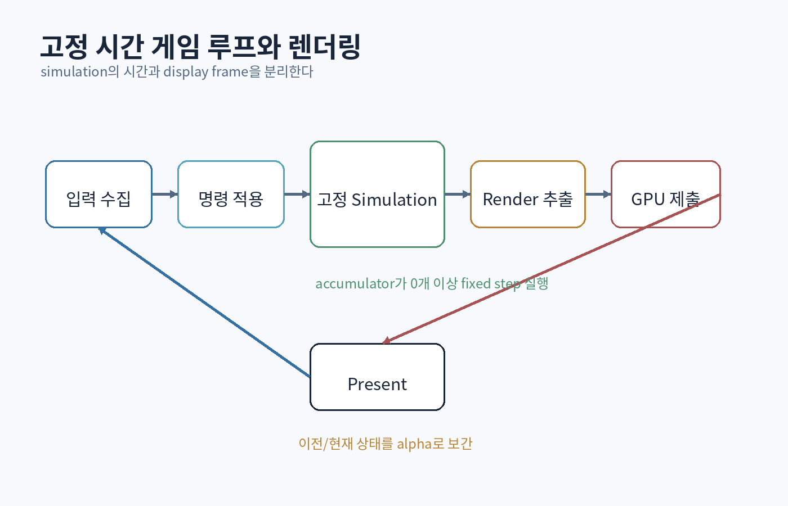

# 제10부 — 게임 엔진, 실시간 그래픽스, 네트워크 게임, AI

{#fig-game-loop}

# 50장. 실시간 게임의 통합 구조

## 50.1 프레임은 여러 시스템의 계약이다

60 FPS 게임은 평균이 아니라 대부분의 frame을 약 16.67ms 안에 완성해야 한다. CPU와 GPU는 겹쳐 실행되며, 입력·simulation·animation·physics·rendering·audio·streaming이 같은 자원과 deadline을 공유한다.

```text
Frame N CPU
Input → Gameplay → Physics → Animation → Render Extract → Submit
                       Asset streaming / jobs

Frame N-1 GPU
Shadow → Depth → Lighting → Transparencies → Post → Present
```

한 시스템이 budget을 넘으면 다른 시스템이 아무리 빨라도 frame이 늦어진다.

## 50.2 main loop의 단계

```cpp
while (!platform.should_quit()) {
    FrameInput input = platform.poll_input();
    const Seconds real_dt = clock.tick();

    simulation.accumulate(real_dt);
    while (simulation.has_step()) {
        world.apply(input.commands_for_step());
        world.fixed_update(simulation.step());
        simulation.consume_step();
    }

    const RenderSnapshot snapshot = extract_render_data(
        world, simulation.interpolation_alpha());

    renderer.render(snapshot);
    audio.update(world.audio_events());
    platform.present();
}
```

실제 엔진은 asynchronous job, multiple queue, frame-in-flight를 사용하지만 논리 단계와 ownership을 먼저 고정한다.

## 50.3 frame latency

GPU를 충분히 채우려고 여러 frame을 미리 제출하면 throughput은 좋아져도 입력-to-photon latency가 증가한다.

```text
input at CPU frame N
→ simulation N
→ render commands N
→ GPU waits behind N-2, N-1
→ display
```

competitive game은 queue depth를 제한할 수 있다. cinematic game은 throughput과 안정성을 더 우선할 수 있다.

## 50.4 subsystem 수명

초기화 순서는 종료 순서의 역방향이 되는 경우가 많다.

```text
Platform
→ Diagnostics
→ JobSystem
→ FileSystem
→ AssetSystem
→ Renderer/Audio/Physics
→ World
```

World가 renderer resource handle을 보유한다면 renderer가 먼저 종료되어서는 안 된다. RAII와 explicit shutdown fence로 GPU 사용 완료를 기다린다.

## 50.5 메모리 budget

메모리는 단일 숫자가 아니다.

- executable/code
- system heap
- ECS/world
- asset CPU data
- GPU local memory
- upload/readback
- transient render resources
- shader/PSO cache
- audio
- thread stacks

각 subsystem에 peak와 steady-state budget을 둔다. streaming은 allocation latency뿐 아니라 residency와 eviction을 관리한다.

## 50.6 asset dependency와 streaming

scene 진입 시 필요한 asset DAG:

```text
Level
├─ Terrain mesh/material/textures
├─ Character definition
│  ├─ skeleton
│  ├─ mesh
│  ├─ animations
│  └─ materials/textures
└─ audio banks
```

모든 dependency를 한 번에 동기 load하면 hitch가 생긴다. priority, request coalescing, cancellation, prefetch, fallback을 설계한다.

```cpp
AssetFuture<Mesh> mesh = assets.request<Mesh>(id, Priority::VisibleSoon);
```

`future`가 완료되기 전 world object는 placeholder나 disabled state를 사용한다. callback이 삭제된 entity를 참조하지 않도록 generation handle을 캡처한다.

## 50.7 data-driven gameplay

코드와 콘텐츠를 분리한다.

```json
{
  "id":"sword_heavy_01",
  "damage":42,
  "stamina":18,
  "startup_frames":14,
  "active_frames":5,
  "recovery_frames":22,
  "tags":["melee","heavy"]
}
```

데이터 주도 설계는 모든 규칙을 script로 옮기는 것이 아니다. schema validation, default, migration, hot reload, determinism을 함께 설계한다.

## 50.8 animation과 gameplay

animation은 시각 표현이고 gameplay는 규칙이다. 그러나 attack timing처럼 서로 연결된다.

선택:

- gameplay가 authoritative frame/time을 갖고 animation이 따라감
- animation notify가 event를 발생
- 공통 authored timeline에서 둘 다 생성

notify만 유일한 규칙이면 animation asset 변경이 gameplay를 깨뜨릴 수 있다. 중요한 판정은 검증 가능한 데이터로 추출한다.

## 50.9 physics와 gameplay

물리 엔진은 수치 근사다.

- fixed timestep
- collision layer/mask
- continuous collision detection
- trigger vs contact
- query와 simulation
- interpolation
- deterministic requirement

물리 callback 안에서 world를 즉시 크게 변경하면 solver 재진입 문제가 생길 수 있다. contact를 event로 수집하고 안전한 phase에 적용한다.

## 50.10 audio, UI, localization

이들은 후처리가 아니다.

- audio voice budget과 priority
- UI layout와 frame cost
- font atlas와 glyph streaming
- text expansion
- right-to-left
- accessibility input/remapping
- color와 subtitle

아키텍처에서 도메인 event를 통해 연결하고, renderer/game object에 직접 하드코딩하지 않는다.

# 51장. 실시간 그래픽스: 점에서 빛과 화면까지

## 51.1 rendering pipeline

전형적인 raster pipeline:

```text
vertex/index input
→ vertex shader
→ primitive assembly
→ clipping
→ rasterization
→ pixel/fragment shader
→ depth/stencil
→ blending
→ render target
```

각 단계는 고정 기능과 programmable shader의 조합이다.

## 51.2 좌표 변환

열벡터 표기 예:

```text
clip = Projection × View × Model × local
```

- local/object space
- world space
- view/camera space
- clip space
- perspective divide → NDC
- viewport transform → screen space

```hlsl
float4 world = mul(Model, float4(positionOS, 1));
float4 view  = mul(View, world);
float4 clip  = mul(Projection, view);
return clip;
```

HLSL의 `mul`과 matrix storage convention은 engine 설정에 따라 다를 수 있다. 식과 실제 메모리 layout을 구분한다.

## 51.3 homogeneous coordinate와 perspective

projection 후 clip coordinate `(x_c, y_c, z_c, w_c)`를 `w_c`로 나눈다.

```text
NDC = (x_c/w_c, y_c/w_c, z_c/w_c)
```

가까운 물체가 크게 보이는 perspective가 여기에서 나온다. `w=0`은 방향 벡터, `w=1`은 위치로 affine transform을 표현하는 데 쓰인다.

## 51.4 depth precision와 reversed-Z

perspective depth는 비선형이며 near plane 근처에 precision이 몰린다. near를 지나치게 작게 잡으면 먼 거리 z-fighting이 심해진다.

reversed-Z는 depth 범위를 반대로 쓰고 floating-point 분포를 활용해 precision을 개선할 수 있다. projection, depth clear, compare function을 함께 바꿔야 한다.

## 51.5 interpolation와 perspective correction

rasterizer는 triangle 내부의 varying을 보간한다. texture coordinate를 screen space에서 단순 선형 보간하면 원근 왜곡이 생긴다. GPU는 `1/w`를 고려한 perspective-correct interpolation을 제공한다.

## 51.6 normal과 tangent space

비균일 scale에서 normal은 model matrix 그대로 변환하면 수직성이 깨질 수 있다.

```text
normal matrix = transpose(inverse(model upper 3×3))
```

normal mapping은 tangent, bitangent, normal로 TBN basis를 만들고 texture normal을 공간 변환한다. tangent handedness와 mirrored UV를 처리한다.

## 51.7 radiometry의 최소 언어

- radiant flux: 전체 에너지율
- radiance: 방향과 면적을 고려한 빛의 밀도
- irradiance: 표면에 입사하는 면적당 flux

rendering equation은 한 점에서 나가는 radiance를 emitted light와 모든 입사 방향의 반사 적분으로 표현한다. [[Kajiya 1986](https://www.cs.northwestern.edu/~ago820/cs395/Papers/Kajiya_1986.pdf)]

```text
L_o(x, ω_o) = L_e(x, ω_o)
            + ∫ f_r(x, ω_i, ω_o) L_i(x, ω_i) (n·ω_i) dω_i
```

실시간 renderer는 이 적분을 여러 근사, precomputation, sampling으로 계산한다.

## 51.8 Lambert와 microfacet BRDF

Lambert diffuse:

```text
f_d = albedo / π
```

간단한 direct light:

```hlsl
float NdotL = saturate(dot(N, L));
float3 diffuse = albedo * NdotL;
```

현대 PBR specular는 microfacet 모델을 자주 사용한다.

```text
f_s = D(h) F(v,h) G(l,v,h) / (4 (n·l)(n·v))
```

- D: microfacet normal distribution, 예: GGX
- F: Fresnel, 예: Schlick approximation
- G: masking-shadowing

에너지 보존과 입력 범위를 검증한다.

## 51.9 metallic/roughness

- dielectric: base color는 diffuse, F0는 대략 낮은 반사율
- metal: diffuse가 거의 없고 base color가 colored specular
- roughness: highlight의 넓이와 microfacet 분포

텍스처가 어떤 색공간인지 구분한다.

```text
base color: 보통 sRGB decode 필요
normal/roughness/metallic: linear data
```

잘못된 gamma는 조명 결과를 크게 왜곡한다.

## 51.10 shadow map

light 시점의 depth를 저장하고 카메라 shading 때 비교한다.

문제:

- shadow acne
- peter panning
- aliasing
- cascade seam
- temporal shimmering

bias는 상수 하나가 아니다. depth slope, receiver geometry, resolution에 따라 trade-off가 있다.

## 51.11 forward, deferred, clustered

### Forward

각 object draw에서 light를 평가. transparency와 MSAA에 자연스럽지만 light 수가 많으면 반복 비용.

### Deferred

geometry pass에서 G-buffer를 만들고 lighting pass. 많은 light에 유리하지만 bandwidth, material 다양성, transparency 처리 비용.

### Tiled/Clustered

screen tile 또는 3D cluster별 light list를 만들고 forward/deferred shading에서 사용한다. [[Olsson et al. 2012](https://www.cse.chalmers.se/~uffe/clustered_shading_preprint.pdf)]

어떤 방식이 좋은지는 scene, platform, MSAA, material, bandwidth에 따라 다르다.

## 51.12 image-based lighting

환경 map으로 간접 조명을 근사한다.

- diffuse irradiance convolution 또는 spherical harmonics
- specular prefiltered environment
- BRDF integration LUT

roughness에 따라 다른 mip를 sample한다. probe blending과 parallax correction이 필요할 수 있다.

## 51.13 HDR와 tone mapping

lighting은 display 범위를 넘는 HDR 값으로 계산한다. exposure와 tone mapping으로 display signal에 매핑한다.

```hlsl
float3 mapped = color / (1.0 + color); // 단순 예, production curve 아님
```

자동 exposure는 luminance histogram, adaptation speed, gameplay camera cut를 고려한다. tone mapper는 색 재현과 art direction의 일부다.

## 51.14 anti-aliasing와 temporal history

- MSAA: geometry edge sampling
- FXAA/SMAA: image-space edge
- TAA: jittered sample과 history accumulation
- temporal upscaling: 낮은 내부 해상도와 history 재구성

TAA는 motion vector, depth rejection, history clamp, disocclusion 처리가 필요하다. 잘못되면 ghosting과 blur가 생긴다.

## 51.15 GPU synchronization와 자원 수명

DirectX 12 같은 explicit API에서는 command queue, resource state, descriptor, fence를 애플리케이션이 관리한다. 공식 프로그래밍 가이드는 device, command list, descriptor heap, synchronization 모델을 설명한다. [[Microsoft Direct3D 12 Programming Guide](https://learn.microsoft.com/windows/win32/direct3d12/directx-12-programming-guide)]

CPU에서 texture 객체를 파괴했어도 GPU가 이전 frame command에서 사용 중일 수 있다. fence 값과 deferred destruction queue로 안전한 시점을 결정한다.

```cpp
retire_queue.push({resource, frame_fence_value});
while (retire_queue.front().fence <= completed_fence) {
    retire_queue.pop();
}
```

## 51.16 render graph

pass가 읽고 쓰는 resource를 선언한다.

```text
DepthPrepass writes Depth
GBuffer reads Depth, writes Albedo/Normal
Lighting reads Depth/Albedo/Normal, writes HDR
ToneMap reads HDR, writes BackBuffer
```

graph compiler는 순서, barrier, transient lifetime, aliasing을 계산한다. 선언이 실제 shader/resource 사용과 다르면 correctness가 깨진다.

<div class="lab">

### 실습: 작은 CPU reference renderer

GPU API 전에 CPU에서 다음을 구현한다.

1. model/view/projection
2. triangle clipping 또는 최소 near 처리
3. barycentric rasterization
4. perspective-correct UV
5. depth buffer
6. Lambert shading
7. texture sampling
8. PNG/PPM 출력

그 뒤 GPU triangle과 결과를 비교한다. 느리지만 pipeline을 검증하는 oracle이 된다.

</div>

# 52장. 엔진 시스템: 핸들, 에셋, 렌더 그래프, 작업

## 52.1 RHI와 renderer

RHI(Render Hardware Interface)는 API 차이를 추상화할 수 있다.

```cpp
class Device {
public:
    BufferHandle create_buffer(const BufferDesc&);
    TextureHandle create_texture(const TextureDesc&);
    PipelineHandle create_graphics_pipeline(const PipelineDesc&);
};
```

추상화가 모든 API의 최소 공통분모가 되면 고급 기능을 잃는다. capability query와 extension path를 둔다.

```cpp
struct DeviceCaps {
    bool mesh_shader;
    bool ray_query;
    bool variable_rate_shading;
};
```

## 52.2 descriptor와 binding

shader가 resource를 찾는 binding model을 설계한다.

- per-draw descriptor
- material table
- bindless/global descriptor index
- root/push constants

bindless는 draw 변경을 줄이고 GPU-driven pipeline에 유리하지만 descriptor lifetime, validation, shader index safety가 중요하다.

## 52.3 PSO와 shader permutation

pipeline state는 shader와 raster/depth/blend 형식을 묶는다. 런타임 생성 hitch를 피하려면 cache와 precompile이 필요하다.

permutation 폭발:

```text
SKINNED × ALPHA_TEST × NORMAL_MAP × SHADOW × QUALITY × PLATFORM
```

독립 boolean 10개면 최대 1024 조합이다. 실제 compile-time 분기가 필요한지, dynamic branch나 data-driven material로 옮길지 판단한다.

## 52.4 render graph resource lifetime

pass 사용 구간이 겹치지 않는 transient texture는 같은 memory를 alias할 수 있다.

```text
ShadowMap: pass 1–3
BloomTemp: pass 6–8
```

하지만 resource descriptor, alignment, queue synchronization이 호환되어야 한다. graph debug view에 lifetime과 physical allocation을 표시한다.

## 52.5 GPU-driven rendering

CPU가 object마다 draw를 제출하는 대신 GPU가 visibility와 draw argument를 만든다.

```text
GPU scene buffer
→ frustum/occlusion cull compute
→ compact visible instances
→ indirect draw/mesh dispatch
```

필요:

- stable object ID
- GPU buffer update
- bounds
- indirect argument
- synchronization
- debug fallback

작은 scene에서는 complexity와 latency가 이득보다 클 수 있다.

## 52.6 texture/mesh streaming

streaming 결정 입력:

- visibility
- projected size
- camera velocity
- priority
- memory budget
- I/O bandwidth
- decode/upload budget

texture mip를 단계적으로 올리고, 부족하면 eviction한다. thrashing을 막기 위해 hysteresis와 working-set 예측을 둔다.

## 52.7 content-addressed asset

source + import settings + tool version + dependency hash로 artifact key를 만든다.

```text
artifact_key = hash(source, settings, importer_version, dependencies)
```

같은 입력이면 cache를 재사용한다. tool version 누락은 stale build를 만든다.

## 52.8 hot reload

reload 순서:

1. 새 asset을 임시 handle로 load
2. validation
3. GPU upload
4. frame-safe swap
5. 이전 resource deferred destruction
6. dependent object notification

실패하면 기존 정상 asset을 유지한다.

## 52.9 엔진 diagnostics

shipping과 개발 도구 모두를 고려한다.

- frame marker
- allocator tag
- asset request trace
- entity name/debug ID
- render graph dump
- shader source mapping
- GPU crash breadcrumb
- replay capture

관찰 가능성은 마지막에 붙이는 기능이 아니라 handle과 command에 ID를 넣는 초기 설계다.

## 52.10 플랫폼 abstraction

플랫폼별 차이를 숨기되 정확한 기능을 잃지 않는다.

```cpp
struct FileRequest {
    FileId file;
    Offset offset;
    std::span<std::byte> destination;
    IoPriority priority;
};
```

플랫폼 I/O API, alignment, cancellation이 다르면 공통 의미와 capability를 문서화한다.

# 53장. 네트워크 게임: 권위, 예측, 보간, 재현

## 53.1 네트워크는 지연된 관찰이다

클라이언트가 보는 세계는 서버의 현재가 아니다.

```text
server tick 100
packet transit
client receives at local time later
render interpolation of past snapshots
```

게임은 물리적으로 불가능한 “모두가 같은 현재를 본다” 대신 플레이 감각과 공정성의 정책을 설계한다.

## 53.2 서버 권위

클라이언트는 입력 의도를 보내고 서버가 상태를 결정한다.

```text
Client → InputCommand(seq=104, move, fire)
Server validates and simulates
Server → Snapshot(tick=550, acknowledged_input=104)
```

클라이언트가 위치와 damage 결과를 그대로 보내면 치트에 취약하다.

## 53.3 client prediction와 reconciliation

클라이언트는 서버 응답을 기다리지 않고 local input을 예측한다.

```text
1. input sequence 부여
2. local simulation
3. input history 보관
4. authoritative snapshot 수신
5. 서버 상태로 복원
6. 아직 ack되지 않은 input 재적용
```

시각적 correction은 부드럽게 보간할 수 있지만 hit 판정 같은 규칙은 authoritative state를 따른다.

## 53.4 snapshot interpolation

다른 player는 두 snapshot 사이를 보간한다.

```text
render_time = latest_server_time - interpolation_delay
```

지연 buffer는 jitter를 흡수하지만 표시 latency를 추가한다. packet loss에서는 짧은 extrapolation 후 freeze/teleport 정책을 정한다.

## 53.5 lag compensation

서버가 발사 시점의 과거 world를 재구성해 hit를 판정할 수 있다.

필요:

- position/history buffer
- client timestamp 신뢰 범위
- clock/tick mapping
- 최대 rewind
- moving collider
- exploit 제한

높은 latency player에게 무한 rewind를 허용하면 다른 사용자에게 불공정할 수 있다.

## 53.6 reliability channel

메시지마다 요구가 다르다.

| 데이터 | 정책 |
|---|---|
| input | sequence, 최근 값 반복 가능 |
| snapshot | 최신 우선, 오래된 값 폐기 |
| spawn/despawn | reliable ordered 또는 state replication |
| chat | reliable ordered |
| cosmetic event | loss 허용 가능 |
| purchase | idempotent transaction |

하나의 TCP stream에 모든 것을 넣으면 head-of-line blocking이 실시간 상태를 지연시킬 수 있다. 실제 transport의 특성과 구현 비용을 비교한다.

## 53.7 replication

전체 object를 매 tick 보내지 않는다.

- interest management
- dirty field
- delta compression
- quantization
- baseline
- prioritization
- bandwidth budget

```text
position: world cell + quantized local offset
rotation: compressed quaternion
health: 10 bits if range 0..1000
```

quantization 오차가 gameplay와 visual에 미치는 영향을 측정한다.

## 53.8 deterministic lockstep

모든 peer가 같은 input을 같은 tick에 적용한다.

장점: 작은 대역폭, 전체 state 전송 불필요.

어려움:

- determinism
- 느린 peer
- desync 검출
- join/recovery
- 치트

state hash를 주기적으로 교환하고 divergence trace를 저장한다.

## 53.9 rollback

격투 게임 등에서 remote input을 예측하고, 늦게 다른 input이 오면 과거로 rollback해 재시뮬레이션한다.

필요:

- 빠른 state snapshot/restore
- deterministic simulation
- side-effect 재생 정책
- animation/audio visual correction
- 최대 rollback window

## 53.10 네트워크 테스트

network simulator에서 다음을 조절한다.

- latency distribution
- jitter
- loss
- duplicate
- reordering
- bandwidth
- burst
- disconnect/reconnect

평균 50ms만 테스트하지 말고 변화와 tail을 재현한다.

<div class="lab">

### 실습: 2D 네트워크 이동 시뮬레이터

실제 socket 없이 event queue로 시작한다.

1. authoritative server tick
2. input sequence
3. client prediction
4. server reconciliation
5. remote snapshot interpolation
6. random delay/loss/reorder
7. error distance와 correction 통계
8. replay 가능한 seed

그 뒤 UDP transport를 붙인다. 알고리즘과 네트워크 I/O를 분리한다.

</div>

# 54장. AI와 머신러닝 시스템, AI 보조 프로그래밍

## 54.1 게임 AI의 목표

게임 AI는 인간처럼 완벽히 지능적인 존재보다 재미, 읽기 가능성, 성능, designer control을 목표로 한다.

전통적 구성:

- finite state machine
- behavior tree
- utility AI
- planner/GOAP
- navigation/pathfinding
- perception
- steering

## 54.2 behavior tree

전형적 node:

- Selector: 하나 성공할 때까지
- Sequence: 하나 실패할 때까지
- Decorator
- Action/Condition

```text
Selector
├─ Sequence [CanSeeEnemy, HasAmmo, Shoot]
├─ Sequence [LowHealth, FindCover, MoveToCover]
└─ Patrol
```

실패 방식:

- 매 tick 비싼 condition 반복
- blackboard key가 문자열과 전역 상태
- action cancellation 누락
- animation/physics completion과 수명 불일치

trace에 실행 node와 상태 전이를 기록한다.

## 54.3 utility AI

행동별 score를 계산한다.

```text
score(heal) = low_health_curve(health) × has_potion × safety
score(attack) = target_value × hit_probability × aggression
```

단순 최대값은 매 frame 행동이 흔들릴 수 있다. hysteresis, inertia, cooldown, commitment를 둔다.

## 54.4 pathfinding와 navigation

A*:

```text
f(n) = g(n) + h(n)
```

`h`가 admissible이면 최적 경로 보장에 기여한다. 게임에서는 navmesh, hierarchical path, local avoidance, dynamic obstacle을 결합한다.

경로 계산과 실제 이동 제어는 분리한다.

## 54.5 머신러닝 pipeline

ML 시스템은 model architecture만이 아니다.

```text
data collection
→ labeling/cleaning
→ train/validation split
→ training
→ evaluation
→ packaging
→ inference
→ monitoring
→ feedback
```

학습과 serving feature가 다르면 training-serving skew가 생긴다.

## 54.6 metric과 실패 비용

accuracy 하나로 판단하지 않는다.

- precision/recall
- calibration
- latency
- memory
- robustness
- subgroup performance
- false positive/negative 비용

추천·moderation·anti-cheat는 잘못된 판정의 사용자 비용과 이의 제기 절차를 설계한다.

## 54.7 inference in real-time systems

frame 안에서 inference하려면 budget을 정한다.

- model size
- batch
- CPU/GPU/NPU
- quantization
- asynchronous result
- stale result 허용
- fallback

AI 결과가 늦게 오거나 실패했을 때 gameplay thread가 block되지 않도록 한다.

## 54.8 생성형 AI 보조 프로그래밍

AI 도구는 코드 생성, 설명, test 아이디어, 문서 초안에 유용할 수 있다. 그러나 output은 검증되지 않은 제안이다.

사용 절차:

```text
작은 명세
→ 생성
→ compile/static analysis
→ unit/property/fuzz test
→ security/lifetime review
→ benchmark
→ 사람이 ownership
```

특히 확인할 것:

- 존재하지 않는 API
- 오래된 문법/사양
- UB와 race
- exception/error 누락
- 입력 검증
- 라이선스와 provenance 정책
- benchmark 없는 성능 주장

## 54.9 AI에게 맡기면 안 되는 판단

- 최종 보안 승인
- 사용자의 권리와 피해가 걸린 자동 결정
- production credential 처리
- 이해하지 못한 unsafe/crypto code 병합
- test를 통과시키기 위한 assertion 삭제
- 출처 확인 없는 논문 주장

AI가 속도를 높일수록 review와 실험의 중요성이 커진다.

## 54.10 AI 시대의 강한 프로그래머

도구가 코드를 더 쉽게 만들면 가치가 이동한다.

- 문제 정의
- 시스템 경계
- 불변식
- 실험 설계
- 결함 해석
- trade-off
- 사용자 영향
- 여러 계층 연결

이 책의 하드웨어·OS·언어·분산·보안 지식은 생성된 코드가 왜 틀릴 수 있는지 판단하는 기반이다.

<div class="check">

### 제10부 통과 기준

- frame pipeline과 CPU/GPU latency를 trace로 설명한다.
- asset request부터 GPU residency까지 수명을 설계한다.
- CPU reference rasterizer와 GPU 결과를 비교한다.
- PBR의 D/F/G 항과 색공간을 설명한다.
- render graph의 resource dependency와 barrier를 검증한다.
- prediction/reconciliation simulator를 구현한다.
- behavior tree와 utility AI의 흔들림·취소 문제를 해결한다.
- AI 생성 코드에 sanitizer, property test, benchmark를 적용한다.

</div>
