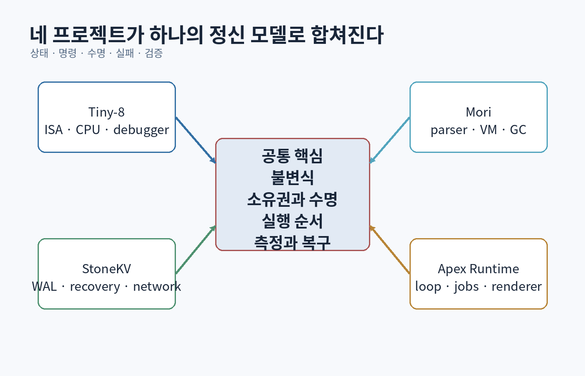

# 제11부 — 네 개의 종합 프로젝트와 52주 수련 과정

{#fig-capstones}

# 55장. 프로젝트 I — Tiny-8: 비트에서 CPU까지

## 55.1 목적

Tiny-8은 8비트 가상 컴퓨터다. 목표는 실제 CPU를 흉내 내는 것이 아니라 다음 연결을 손으로 확인하는 것이다.

```text
bit pattern
→ instruction decode
→ register/ALU
→ memory read/write
→ control flow
→ assembler
→ program execution
```

## 55.2 최소 사양

### 데이터

- 8-bit word
- 256-byte memory
- register `A`, `B`
- program counter `PC`
- stack pointer `SP`
- flags: Zero, Carry, Negative

### instruction 예

| opcode | mnemonic | 의미 |
|---:|---|---|
| `0x00` | `NOP` | 아무 일도 하지 않음 |
| `0x10 imm` | `LDA #imm` | A에 즉시값 |
| `0x11 addr` | `LDA addr` | memory에서 A |
| `0x12 addr` | `STA addr` | A를 memory에 저장 |
| `0x20` | `ADD B` | A = A + B |
| `0x21` | `SUB B` | A = A - B |
| `0x30 addr` | `JMP addr` | 무조건 분기 |
| `0x31 addr` | `JZ addr` | Zero이면 분기 |
| `0x40 addr` | `CALL addr` | return address push 후 분기 |
| `0x41` | `RET` | pop PC |
| `0xFF` | `HALT` | 정지 |

## 55.3 상태와 한 단계 실행

```cpp
struct CpuState {
    std::uint8_t a{};
    std::uint8_t b{};
    std::uint8_t pc{};
    std::uint8_t sp{0xFF};
    bool zero{};
    bool carry{};
    bool negative{};
    std::array<std::uint8_t, 256> memory{};
    bool halted{};
};

enum class StepError {
    InvalidOpcode,
    StackOverflow,
    StackUnderflow
};

expected<void, StepError> step(CpuState& cpu);
```

fetch–decode–execute를 명시한다.

```cpp
const auto opcode = cpu.memory[cpu.pc++];
switch (opcode) {
case 0x10:
    cpu.a = cpu.memory[cpu.pc++];
    update_flags(cpu, cpu.a);
    break;
// ...
}
```

`pc++`의 wraparound 정책, stack 영역, invalid opcode에서 상태 변경 여부를 문서화한다.

## 55.4 ALU와 flag

8비트 덧셈:

```cpp
const std::uint16_t wide =
    static_cast<std::uint16_t>(cpu.a) + cpu.b;
cpu.a = static_cast<std::uint8_t>(wide);
cpu.carry = wide > 0xFF;
cpu.zero = cpu.a == 0;
cpu.negative = (cpu.a & 0x80) != 0;
```

signed overflow flag를 추가한다면 carry와 의미가 다르다.

## 55.5 assembler

입력:

```asm
start:
    LDA #10
    STA 0xF0
loop:
    LDA 0xF0
    SUB B
    STA 0xF0
    JZ done
    JMP loop
done:
    HALT
```

두 pass:

1. label 주소 수집
2. instruction encoding과 label resolve

오류:

- duplicate label
- undefined label
- operand 범위
- program overflow
- 잘못된 addressing mode

## 55.6 debugger

기능:

- register 표시
- memory dump
- single step
- breakpoint
- disassembly
- watch address
- execution trace

```text
PC=08 A=03 B=01 Z=0 C=0 N=0 | SUB B
```

## 55.7 검증

- 각 opcode unit test
- random instruction sequence와 reference interpreter 비교
- assembler encode 후 disassemble round-trip
- stack boundary
- PC wrap/invalid program
- deterministic trace hash

## 55.8 확장

- memory-mapped I/O
- timer interrupt
- 16-bit address
- simple pipeline timing model
- cache simulator
- Tiny-8용 C 비슷한 compiler backend

## 55.9 포트폴리오 산출물

- ISA 사양 PDF/Markdown
- emulator와 assembler
- debugger 영상
- sample program 5개
- test report
- “실제 ISA와 다른 점” 분석

<div class="check">

### Tiny-8 합격 기준

빈 저장소에서 4주 안에 다시 구현할 수 있고, `CALL/RET`, signed/unsigned flag, assembler relocation을 whiteboard에서 설명할 수 있다.

</div>

# 56장. 프로젝트 II — Mori: 작은 언어와 바이트코드 VM

## 56.1 목적

Mori는 다음 pipeline을 가진 작은 동적 언어다.

```text
source
→ tokens
→ AST
→ semantic checks
→ bytecode
→ VM
```

문법을 만드는 것보다 scope, lifetime, error, execution cost를 연결하는 것이 목적이다.

## 56.2 언어 예

```text
fn fib(n) {
    if n < 2 { return n; }
    return fib(n - 1) + fib(n - 2);
}

let total = 0;
for x in [1, 2, 3, 4] {
    total = total + x;
}
print(total);
```

최소 기능:

- number, bool, string, nil
- variable와 lexical scope
- arithmetic/comparison
- if/while/for
- function와 closure
- array/map
- runtime error와 stack trace

## 56.3 lexer

```cpp
enum class TokenKind {
    Identifier, Number, String,
    Let, Fn, If, Else, While, Return,
    Plus, Minus, Star, Slash,
    Equal, EqualEqual,
    LeftParen, RightParen,
    LeftBrace, RightBrace,
    End
};

struct Token {
    TokenKind kind;
    std::string_view lexeme;
    SourceSpan span;
};
```

문자열 escape, UTF-8 identifier 정책, 숫자 overflow, comment를 정의한다.

## 56.4 parser

expression precedence:

```text
assignment
→ equality
→ comparison
→ term (+ -)
→ factor (* /)
→ unary
→ call
→ primary
```

Pratt parser나 recursive descent를 사용할 수 있다.

```cpp
ExprId parse_expression(int min_binding_power);
```

오류 하나에서 멈추지 않고 statement boundary까지 synchronization해 여러 진단을 낼 수 있다.

## 56.5 AST와 source span

```cpp
struct BinaryExpr {
    ExprId left;
    TokenKind op;
    ExprId right;
    SourceSpan span;
};
```

AST node를 `unique_ptr` tree로 시작하고, 이후 arena + ID 방식과 memory/performance를 비교한다.

## 56.6 scope와 closure

```text
fn make_counter() {
    let n = 0;
    fn next() {
        n = n + 1;
        return n;
    }
    return next;
}
```

`n`은 outer function return 후에도 살아야 한다. upvalue/cell로 승격한다.

질문:

- capture by value/reference 의미
- mutable capture
- cycle과 GC
- closure environment layout

## 56.7 bytecode

stack machine 예:

```text
CONSTANT 2
CONSTANT 3
ADD
PRINT
HALT
```

opcode:

```cpp
enum class Op : std::uint8_t {
    Constant, Add, Sub, Mul, Div,
    LoadLocal, StoreLocal,
    Jump, JumpIfFalse, Loop,
    Call, Return, Closure,
    GetUpvalue, SetUpvalue
};
```

bytecode verifier는 jump target, stack depth, constant index를 확인한다.

## 56.8 VM

```cpp
struct CallFrame {
    FunctionHandle function;
    std::size_t ip;
    std::size_t base;
};

class Vm {
    std::vector<Value> stack_;
    std::vector<CallFrame> frames_;
};
```

오류 시 source line과 call stack을 복원한다.

## 56.9 value representation

초기:

```cpp
using Value = std::variant<Nil, bool, double, ObjectHandle>;
```

확장 실험:

- tagged union
- NaN boxing
- reference counting
- mark-sweep GC

각 구현의 크기, branch, 안전성, portability를 benchmark한다.

## 56.10 garbage collection

mark-sweep:

```text
roots: VM stack, globals, open upvalues
mark reachable object graph
sweep unmarked objects
```

tri-color invariant를 공부하고 incremental GC가 mutation barrier를 요구하는 이유를 설명한다.

## 56.11 compiler 최적화

먼저 correctness.

- constant folding
- dead code after return
- local slot reuse
- peephole
- inline cache

최적화 전후 bytecode와 benchmark를 보존한다.

## 56.12 fuzz와 differential test

- lexer/parser fuzz
- AST pretty-print → parse round-trip
- interpreter와 VM 결과 비교
- random expression과 Python/reference evaluator 비교
- invalid bytecode verifier test

## 56.13 포트폴리오 산출물

- 언어 사양
- REPL
- parser diagnostic screenshot
- bytecode disassembler
- debugger step
- GC trace
- benchmark
- fuzz corpus와 발견 버그

<div class="check">

### Mori 합격 기준

새 문법 하나를 lexer부터 VM까지 추가하고, scope·stack·GC에 미치는 영향을 설명하며, 잘못된 프로그램에 안정적인 diagnostic을 제공한다.

</div>

# 57장. 프로젝트 III — StoneKV: 저장, 충돌 복구, 네트워크

## 57.1 목적

StoneKV는 append-only log 기반 key-value 저장소다. 이 프로젝트는 “메모리 map에 값을 넣는 것”과 “충돌 후에도 약속한 상태를 보존하는 것”의 차이를 보여준다.

## 57.2 외부 API

```cpp
class StoneKv {
public:
    expected<std::optional<Bytes>, Error> get(ByteView key) const;
    expected<void, Error> put(ByteView key, ByteView value);
    expected<void, Error> erase(ByteView key);
    expected<void, Error> checkpoint();
};
```

계약:

- key/value 최대 크기
- overwrite 의미
- process crash 후 durability
- concurrent call 정책
- file corruption 처리

## 57.3 log record

```text
magic | version | type | sequence | key_len | value_len | payload | checksum
```

모든 정수의 endian과 최대 범위를 정의한다. checksum은 accidental corruption 탐지이며 공격자에 대한 MAC이 아니다.

```cpp
struct RecordHeader {
    std::uint32_t magic;
    std::uint16_t version;
    std::uint8_t type;
    std::uint64_t sequence;
    std::uint32_t key_length;
    std::uint32_t value_length;
    std::uint32_t checksum;
};
```

구조체를 그대로 disk에 쓰면 padding과 endian 문제가 생긴다. field별 encoding을 사용한다.

## 57.4 write path

```text
validate
→ encode record
→ append
→ flush policy
→ in-memory index update
→ acknowledge
```

index를 먼저 바꾸고 append가 실패하면 memory와 disk가 다르다. acknowledge 전에 어떤 단계가 완료되어야 하는지 durability level을 정의한다.

## 57.5 recovery

시작 시 log를 앞에서 읽는다.

- valid record 적용
- sequence 확인
- checksum 확인
- 마지막 partial record는 truncate 가능
- 중간 corruption은 fail/repair 정책

```text
valid valid valid partial EOF
```

마지막 partial은 crash 흔적일 수 있다. 중간 checksum 오류를 무시하고 계속 가면 잘못된 길이로 이후 record 경계를 잃을 수 있다.

## 57.6 index

메모리 index는 key에서 최신 record offset을 가리킨다.

```cpp
std::unordered_map<std::string, FileOffset> index;
```

대용량에서는 key copy와 memory를 줄이기 위해 hash + key verification, sorted index, B-tree/LSM을 탐구한다.

## 57.7 compaction

append-only log는 obsolete record가 쌓인다.

```text
old log 읽기
→ live latest records만 new log에 쓰기
→ flush
→ atomic manifest/rename
→ old log 삭제
```

compaction 중 crash와 concurrent write를 처리한다. generation별 segment와 manifest를 사용할 수 있다.

## 57.8 transaction 확장

multi-key atomic batch:

```text
BEGIN tx=7
PUT a=1 tx=7
PUT b=2 tx=7
COMMIT tx=7
```

recovery는 commit된 transaction만 적용한다. record ordering과 flush를 검증한다.

## 57.9 network server

protocol:

```text
length | request_id | opcode | key | value
```

요구:

- partial read/write
- message limit
- timeout/deadline
- per-connection backpressure
- idempotency request ID
- graceful shutdown

worker thread가 storage mutation 순서를 어떻게 결정하는지 명시한다.

## 57.10 replication simulator

실제 consensus 전에 leader와 follower log 복제를 deterministic simulator로 만든다.

- delay/drop/duplicate
- node crash/restart
- leader term
- majority commit
- client retry
- state hash

논문을 복사해 production DB를 만들려는 것이 아니라 분산 불변식을 실험한다.

## 57.11 성능

benchmark:

- sequential put
- random get
- value size 분포
- `fsync` per operation vs batch
- recovery time
- compaction amplification
- p50/p95/p99

throughput만 높이고 data loss 계약을 약하게 바꾸지 않는다.

## 57.12 포트폴리오 산출물

- on-disk format 사양
- crash matrix
- fuzz target
- recovery proof sketch
- benchmark report
- packet capture/protocol 문서
- incident runbook

<div class="check">

### StoneKV 합격 기준

모든 byte 위치에서 write interruption을 주입해 recovery 결과를 model과 비교하고, `put` 성공 응답이 정확히 어떤 durability를 의미하는지 설명한다.

</div>

# 58장. 프로젝트 IV — Apex Runtime: 미니 게임 엔진 코어

## 58.1 목적

Apex는 상용 엔진 대체가 아니다. 앞의 지식을 하나의 실시간 시스템으로 통합한다.

핵심:

- fixed-step world
- generation handles
- component storage
- job DAG
- event queue
- asset pipeline
- render extraction
- CPU reference renderer 또는 D3D12 frontend
- replay와 profiler

## 58.2 저장소 구조

```text
Apex/
├─ CMakeLists.txt
├─ engine/
│  ├─ core/
│  ├─ platform/
│  ├─ jobs/
│  ├─ assets/
│  ├─ world/
│  ├─ render/
│  └─ diagnostics/
├─ game/
├─ tools/
├─ tests/
└─ docs/
```

의존 방향:

```text
core ← jobs/assets/world/render
platform ← executable adapters
engine ← game
```

순환을 CI에서 검사할 수 있다.

## 58.3 core

- strong IDs와 units
- `expected` error
- logging
- assertion
- arena
- handle pool
- span/view
- hash
- serialization primitives

모든 core utility를 직접 만들 필요는 없다. 표준 라이브러리를 감싸는 이유가 있을 때만 만든다.

## 58.4 world

최소 component:

```cpp
struct Transform { Vec3 position; Quat rotation; Vec3 scale; };
struct Velocity { Vec3 linear; };
struct Health { int current; int maximum; };
struct Renderable { MeshHandle mesh; MaterialHandle material; };
```

system:

- input
- movement
- lifetime
- damage/death
- render extraction

world update 중 구조 변경은 command buffer로 frame-safe phase에 적용할 수 있다.

## 58.5 jobs

- worker pool
- ready queue/deque
- dependency counter
- wait/help
- deterministic single-thread mode
- trace events

correctness test를 single-thread mode에서 먼저 만들고, parallel mode와 state hash를 비교한다.

## 58.6 assets

source importer는 별도 tool이다.

```text
source PNG/OBJ/JSON
→ importer
→ versioned runtime blob
→ content hash cache
→ runtime async load
```

runtime은 느슨한 text parser보다 검증된 cooked format을 읽는다.

## 58.7 renderer 단계

단계 A:

- headless `RenderSnapshot`
- command list를 text로 출력

단계 B:

- CPU software rasterizer

단계 C:

- DirectX 12 triangle, mesh, depth, texture, camera

단계 D:

- render graph와 PBR subset

단계 E:

- GPU profiling와 async streaming

한 단계가 test 가능해진 뒤 다음으로 간다.

## 58.8 replay

기록:

```text
build/schema version
initial seed
fixed timestep
input command per tick
external event
periodic state hash/snapshot
```

재생이 갈라지는 첫 tick을 찾아 component별 hash를 비교한다.

## 58.9 profiler

CPU scope:

```cpp
TRACE_SCOPE("MovementSystem");
```

기록:

- thread
- begin/end timestamp
- frame/tick
- job parent
- entity count
- allocator bytes

Chrome trace JSON 같은 형식으로 내보낼 수 있다. GPU marker와 correlation한다.

## 58.10 demo game

작은 arena action demo:

- player 이동/회피/공격
- 100~10,000 enemy scale mode
- health/damage/death
- simple AI
- asset hot reload
- debug UI
- replay
- performance scene

콘텐츠 양보다 엔진 시스템과 검증이 중요하다.

## 58.11 문서

필수:

- build/run
- architecture map
- ownership/lifetime
- frame pipeline
- asset state machine
- threading model
- error model
- benchmark
- known limitations
- ADR
- video

## 58.12 평가 rubric

| 항목 | 1 | 3 | 5 |
|---|---|---|---|
| 정확성 | 수동 실행 | 자동 test | fuzz/fault/model 검증 |
| 수명 | raw pointer 혼재 | handle/RAII | async/GPU 수명 trace |
| 구조 | 전역 결합 | 모듈 경계 | 변경 실험과 ADR |
| 성능 | FPS 주장 | profiler 수치 | 비용 모델·회귀 gate |
| 문서 | 설명 없음 | README | 사양·실험·한계 |

# 59장. 52주 학습 일정

## 운영 원칙

주당 10~15시간 기준이다. 시간보다 산출물과 통과 기준을 우선한다.

```text
이론 30%
구현 45%
테스트/디버깅 15%
설명/문서 10%
```

매주:

- 월: 읽기와 문제 정의
- 화/수: 구현
- 목: test와 실패 주입
- 금: profiler/debugger
- 주말: 문서, 복습, 공개 가능한 commit

## 1–4주: 계산과 C++ 재기초

| 주 | 주제 | 산출물 |
|---:|---|---|
| 1 | 진법, bit, signed integer, overflow | bit 실험 20개 |
| 2 | 포인터, 참조, lifetime, RAII | ownership kata |
| 3 | vector invalidation, copy/move, smart pointer | container test |
| 4 | 함수·class·error model·unit test | 작은 library |

통과:

- 가상 소멸자와 UB 설명
- `vector` 재할당 반례
- ASan/UBSan 실행
- ownership diagram

## 5–8주: 논리회로와 Tiny-8

| 주 | 주제 | 산출물 |
|---:|---|---|
| 5 | Boolean algebra, gate, adder | ALU test |
| 6 | register, FSM, ISA | Tiny-8 spec |
| 7 | emulator | opcode suite |
| 8 | assembler/debugger | sample programs |

## 9–12주: 컴퓨터 구조와 운영체제

- cache/TLB benchmark
- assembly reading
- process/thread
- virtual memory
- scheduler
- file I/O와 page cache

산출물: cache stride report, syscall trace, simple allocator.

## 13–18주: 언어와 Mori

| 주 | 내용 |
|---:|---|
| 13 | lexer와 source span |
| 14 | parser와 AST |
| 15 | scope와 semantic analysis |
| 16 | bytecode와 VM |
| 17 | function/closure |
| 18 | GC, fuzz, benchmark |

## 19–22주: 알고리즘

- correctness invariant
- sorting/searching
- hash/tree/heap
- graph/A*
- randomized and probabilistic
- cache-aware benchmark

매 구현에 느린 reference와 property test를 붙인다.

## 23–28주: StoneKV

| 주 | 내용 |
|---:|---|
| 23 | binary format와 parser |
| 24 | append log와 index |
| 25 | recovery/fault injection |
| 26 | compaction |
| 27 | network protocol |
| 28 | benchmark와 문서 |

## 29–32주: 네트워크와 분산

- TCP framing
- UDP simulator
- timeout/retry/idempotency
- logical clocks
- Raft simulator
- overload/backpressure

## 33–36주: 아키텍처와 품질

- information hiding
- API redesign
- state/command/event
- data-oriented comparison
- property/fuzz/differential test
- CI/code review/ADR

## 37–42주: Apex core

| 주 | 내용 |
|---:|---|
| 37 | project skeleton, core types |
| 38 | handle pool, component storage |
| 39 | fixed loop, update DAG |
| 40 | job system |
| 41 | asset pipeline |
| 42 | replay/profiler |

## 43–47주: 그래픽스

- math and coordinate
- CPU rasterizer
- D3D12 initialization
- mesh/depth/texture
- PBR and shadow
- render graph/profiling

## 48–49주: 네트워크 게임·AI

- prediction simulator
- behavior tree/utility AI
- pathfinding
- asynchronous AI result

## 50주: 보안과 신뢰성

- threat model
- parser fuzz
- signed artifacts
- backup/restore
- chaos scenario

## 51주: 포트폴리오 정리

- README
- architecture diagram
- demo video
- Japanese technical summary
- benchmark table
- issue list
- release artifact

## 52주: 모의 면접과 재구현

- C++ lifetime 30문제
- system design 5문제
- algorithm 10문제
- project deep dive
- 빈 저장소에서 핵심 3시간 재구현
- 약점 지도와 다음 26주 계획

## 일정이 밀릴 때

범위를 줄이고 품질 기준은 유지한다.

```text
기능 10개, test 없음  <  기능 3개, 사양·test·profiling 있음
```

D3D12 고급 효과보다 Tiny-8, Mori, StoneKV의 정확성 검증을 먼저 끝낸다.

# 60장. 취업 포트폴리오, 면접, 평생 학습

## 60.1 저장소는 사고의 증거다

채용 담당자가 5분 안에 볼 수 있게 한다.

```text
README 첫 화면
- 한 문장 목적
- 60초 영상/GIF
- 핵심 기술 5개
- build/run
- 가장 어려운 문제와 수치
- architecture 그림
```

## 60.2 프로젝트 설명 구조

```text
문제
제약
내 책임
선택한 설계
대안
실패와 수정
검증
수치 결과
남은 한계
```

사용한 기술 목록보다 판단을 보여준다.

## 60.3 C++ 면접

필수 축:

- object lifetime
- virtual destructor
- copy/move
- RAII
- smart pointer
- container invalidation
- const and value category
- template/type erasure
- thread/data race/atomic
- memory model
- cache and allocation
- error handling

정의를 말한 뒤 작은 코드와 실패를 설명한다.

## 60.4 알고리즘 면접

과정:

1. 입력·출력·제약 확인
2. 작은 예
3. brute force
4. invariant
5. 자료구조 선택
6. complexity
7. code
8. edge test
9. 개선

침묵 속 정답보다 추론을 공유한다.

## 60.5 시스템 설계 면접

```text
requirements
→ scale와 SLO
→ data model/API
→ invariants
→ high-level architecture
→ critical path
→ failure/recovery
→ consistency/security
→ observability
→ trade-offs
```

처음부터 microservice 수를 그리지 않는다.

## 60.6 프로젝트 deep dive 예상 질문

Tiny-8:

- flag와 signed overflow
- assembler 두 pass
- interrupt 추가 시 상태

Mori:

- closure lifetime
- GC root
- parser recovery
- bytecode verifier

StoneKV:

- 성공 응답의 durability
- partial write
- compaction crash
- checksum 한계

Apex:

- entity handle
- frame order
- job dependency
- asset/GPU lifetime
- render snapshot 비용

## 60.7 일본 게임사 지원용 문서

직무경력서에는 결과와 범위를 적는다.

```text
C++20 기반 미니 런타임에서 generation handle과 fixed-step simulation을 설계.
10만 entity stale-reference test와 deterministic replay를 구현했으며,
SoA 전환으로 movement update를 X ms에서 Y ms로 개선(환경 ...).
```

수치는 실제 측정값만 사용한다.

## 60.8 논문과 구현의 연결

포트폴리오에 “논문을 읽었다”가 아니라 다음을 보여준다.

```text
주장: clustered shading은 light assignment를 3D cluster로 제한한다.
재현: 1k lights scene에서 naive forward와 GPU time 비교.
차이: 내 구현은 ... 기능을 생략.
결과: ...
한계: target GPU와 scene에 한정.
```

## 60.9 T자형 전문성

넓은 기반:

- hardware/OS
- language/algorithm
- network/storage
- architecture/test/security

깊은 축 하나:

- graphics/engine
- compilers
- distributed storage
- security
- performance
- ML systems

모든 분야를 같은 깊이로 파려고 하지 않는다. 기반은 연결을 위해, 전문성은 희소한 문제를 해결하기 위해 쌓는다.

## 60.10 최고 수준의 습관

- 모르는 것을 정확히 쓴다.
- 주장마다 관찰 또는 근거를 붙인다.
- 실패를 재현 가능한 자산으로 바꾼다.
- 작은 시스템을 끝낸다.
- 자신의 abstraction 아래를 정기적으로 내려간다.
- 남의 코드를 읽고 review한다.
- 사용자의 손실을 기술 선택에 포함한다.
- 매년 오래된 기본서를 다시 읽는다.

## 60.11 마지막 시험

다음 질문에 자료 없이 답하고 구현한다.

1. bit가 instruction이 되는 과정을 Tiny-8 trace로 설명한다.
2. virtual memory와 cache가 C++ 자료구조 성능에 미치는 영향을 설명한다.
3. closure를 VM과 heap lifetime으로 설명한다.
4. WAL과 transaction commit의 순서를 failure trace로 설명한다.
5. TCP retry가 duplicate side effect를 만드는 사례를 해결한다.
6. state pattern과 ECS를 다른 문제로 구분한다.
7. CPU/GPU frame 병목을 실험으로 구분한다.
8. 비신뢰 asset parser의 위협 모델을 작성한다.
9. AI가 생성한 concurrent C++ 코드를 검증한다.
10. 자신의 프로젝트에서 틀린 설계 하나와 그것을 발견한 증거를 설명한다.

> **최고 수준은 책을 다 읽었다는 상태가 아니다. 새로운 문제를 만났을 때 역사·수학·기계·소프트웨어·사람의 관점으로 분해하고, 검증 가능한 시스템을 다시 세울 수 있는 상태다.**
