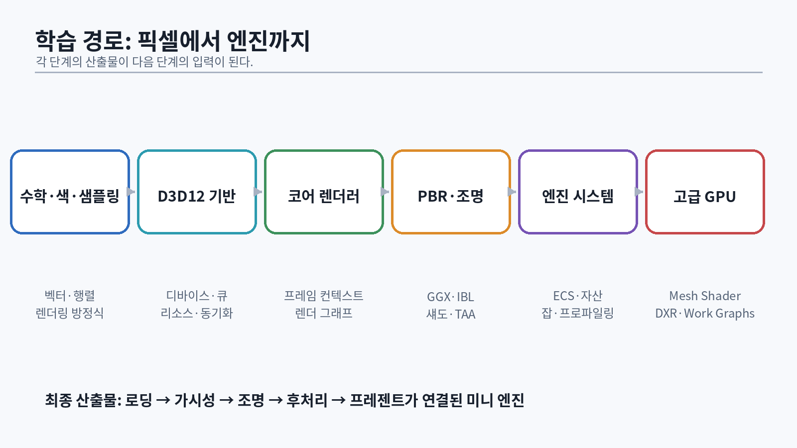

# 서문: 이 책의 목표와 한계

이 교재의 목표는 **DirectX 12를 호출할 줄 아는 사람**이 아니라, 렌더러와 게임 엔진의 구조를 설계하고 성능 문제를 측정하며 논문을 구현으로 번역할 수 있는 엔지니어를 만드는 것이다. 학습 순서는 수학, GPU 실행 모델, Direct3D 12, HLSL, 렌더러 아키텍처, 물리 기반 셰이딩, 그림자와 시간적 재구성, 엔진 시스템, GPU 드리븐 렌더링, DXR 순서다.

Direct3D 12는 드라이버가 대신 처리하던 명령 기록, 리소스 상태, 동기화, 메모리와 descriptor 관리의 상당 부분을 애플리케이션에 노출한다. 그래서 API 호출 순서만 외우면 작은 데모는 만들 수 있어도 엔진은 만들 수 없다. Microsoft의 프로그래밍 가이드도 D3D12의 핵심을 명시적 work submission과 리소스 관리로 설명한다 [@microsoft-d3d12-guide].

{#fig-learning-map width=95%}

::: {.warning}
**책 한 권을 읽는 행위만으로 마스터가 되지는 않는다.** 이 책에서 말하는 “마스터”는 다음을 의미한다.

1. 설명을 보지 않고 핵심 시스템을 다시 구현한다.
2. PIX 캡처와 수치로 병목을 증명한다.
3. 논문의 가정과 엔진의 제약 사이에서 근사와 트레이드오프를 선택한다.
4. 코드 리뷰에서 객체 수명, 동기화, GPU hazard, bandwidth 비용을 지적한다.
5. 실패한 구현을 재현하고 원인을 문서화한다.
:::

이 책의 모든 예제를 그대로 따라 한 뒤 변형 과제를 수행하면 **주니어에서 강한 미들급으로 성장하기 위한 기반**을 갖출 수 있다. 상용 AAA 엔진의 시니어 그래픽스 엔지니어 수준은 여러 프로젝트의 출시, 하드웨어별 최적화, 크래시와 회귀 대응 경험까지 필요하다.

# 1. 최종 산출물

학습이 끝났을 때 다음 결과물이 있어야 한다.

- Win32 창과 DXGI flip-model swap chain
- debug layer, GPU-based validation, DRED 설정
- graphics/copy/compute queue와 frames-in-flight
- buffer/texture upload, descriptor allocator, resource state tracker
- mesh, material, texture, camera, scene 시스템
- Forward+ 또는 clustered deferred 렌더링
- GGX 기반 metallic/roughness PBR과 IBL
- directional light, cascaded shadow map, PCF
- HDR, exposure, tone mapping, bloom
- motion vector와 TAA history rejection
- render graph와 transient resource aliasing
- CPU job system과 multithreaded command recording
- GPU culling과 ExecuteIndirect 또는 mesh shader 경로
- 선택 과제: DXR reflection/shadow + temporal denoising
- PIX 캡처, 성능 예산표, 기술 문서, 3분 데모 영상

Microsoft의 공식 `DirectX-Graphics-Samples`는 Hello World 샘플부터 MiniEngine, ray tracing, HDR 예제를 제공한다. 이 책의 코드는 공식 샘플을 복사하는 대신, 같은 개념을 더 작은 계층으로 분해해 직접 재구축하도록 설계했다 [@microsoft-d3d12-samples].

# 2. 선수 지식 진단

다음 항목을 설명하거나 구현하지 못한다면 해당 절을 건너뛰지 않는다.

| 영역 | 통과 기준 |
|---|---|
| C++ | RAII, move, `ComPtr`, `span`, `vector` 무효화, 스레드 안전성을 설명한다. |
| 수학 | dot/cross, basis, 행렬 합성, view/projection, quaternion을 코드로 쓴다. |
| 시스템 | stack/heap, cache line, atomic, mutex, condition variable를 구분한다. |
| GPU | vertex/pixel/compute shader, wave, occupancy, bandwidth를 설명한다. |
| 디버깅 | assertion, HRESULT, debug layer, capture, binary search를 사용한다. |

C++ 기반이 약하면 이전에 제공된 C++ 재구축 교재를 먼저 완료한다. 이 책은 메모리와 수명 개념을 다시 설명하지만, 문법 입문서 역할까지 하지는 않는다.

# 3. 개발 환경

권장 환경은 다음과 같다.

- Windows 11 64-bit
- Visual Studio 2022의 최신 안정 채널
- Desktop development with C++ workload
- Windows SDK
- CMake 3.28 이상
- Git
- PIX on Windows
- RenderDoc 보조 사용
- DirectX Shader Compiler(DXC)
- DirectX 12 Agility SDK

Agility SDK는 애플리케이션이 운영체제에 내장된 D3D12 런타임만 기다리지 않고 더 최신 기능을 배포할 수 있게 한다 [@microsoft-agility]. Shader Model 6 계열은 DXC를 사용한다 [@microsoft-dxc; @microsoft-hlsl]. 다만 기능 지원은 SDK 버전만이 아니라 GPU, 드라이버, `CheckFeatureSupport` 결과에 의해 결정된다.

## 3.1 저장소 구조

```text
Dx12StudyEngine/
├─ CMakeLists.txt
├─ cmake/
├─ external/
├─ assets/
├─ shaders/
├─ src/
│  ├─ App/
│  ├─ Core/
│  ├─ Platform/Win32/
│  ├─ Renderer/D3D12/
│  ├─ Renderer/FrameGraph/
│  ├─ World/
│  └─ Tools/
├─ tests/
└─ docs/
```

`Renderer/D3D12` 바깥의 코드가 `ID3D12Resource*`를 직접 보지 않게 한다. 초기에는 번거롭지만, 나중에 render graph와 테스트를 넣을 때 경계가 큰 차이를 만든다.

## 3.2 디버그 빌드의 기본 설정

디바이스를 만들기 전에 debug layer와 DRED를 켠다. GPU-based validation은 느리므로 매 프레임 실행하는 개발 빌드가 아니라, 재현 장면이나 CI smoke test에 선택적으로 사용한다.

```cpp
void EnableD3D12Diagnostics(bool gpuValidation)
{
#if defined(_DEBUG)
    Microsoft::WRL::ComPtr<ID3D12Debug> debug;
    if (SUCCEEDED(D3D12GetDebugInterface(IID_PPV_ARGS(&debug)))) {
        debug->EnableDebugLayer();

        if (gpuValidation) {
            Microsoft::WRL::ComPtr<ID3D12Debug1> debug1;
            if (SUCCEEDED(debug.As(&debug1))) {
                debug1->SetEnableGPUBasedValidation(TRUE);
                debug1->SetEnableSynchronizedCommandQueueValidation(TRUE);
            }
        }
    }

    Microsoft::WRL::ComPtr<ID3D12DeviceRemovedExtendedDataSettings1> dred;
    if (SUCCEEDED(D3D12GetDebugInterface(IID_PPV_ARGS(&dred)))) {
        dred->SetAutoBreadcrumbsEnablement(D3D12_DRED_ENABLEMENT_FORCED_ON);
        dred->SetPageFaultEnablement(D3D12_DRED_ENABLEMENT_FORCED_ON);
        dred->SetBreadcrumbContextEnablement(D3D12_DRED_ENABLEMENT_FORCED_ON);
    }
#endif
}
```

DRED는 GPU page fault와 마지막 실행 지점을 조사할 수 있게 한다 [@microsoft-dred]. 이 설정은 “나중에” 붙이는 기능이 아니라 첫 삼각형부터 들어가야 한다.

# 4. 학습 방법: 읽기보다 재구현

각 장은 다음 네 번의 통과를 전제로 한다.

1. **이해 통과**: 개념을 그림과 식으로 설명한다.
2. **복사 통과**: 예제를 직접 입력하고 실행한다.
3. **회상 통과**: 책을 닫고 최소 버전을 다시 작성한다.
4. **변형 통과**: 요구사항을 바꾸거나 실패 사례를 의도적으로 만든다.

예를 들어 resource barrier를 공부했다면 정상 전환만 구현하지 않는다. barrier를 제거해 debug layer 경고를 확인하고, 잘못된 queue 동기화로 간헐적 깨짐을 만든 뒤 fence를 추가해 수정한다. “정답 코드”만 본 사람과 디버깅한 사람의 면접 답변은 다르다.

## 4.1 실험 노트 형식

```text
가설:
측정 환경:
변경 전 CPU/GPU frame time:
변경 내용:
변경 후 결과:
부작용:
PIX 캡처 위치:
다음 실험:
```

성능 수치는 GPU, 드라이버, 해상도, 장면, 빌드 옵션 없이 의미가 없다. 모든 수치에는 조건을 붙인다.

# 5. 40주 권장 일정

| 주차 | 핵심 산출물 |
|---:|---|
| 1–4 | 벡터·행렬·카메라·색공간 테스트 프로그램 |
| 5–8 | Win32 창, device, swap chain, triangle |
| 9–12 | frames-in-flight, upload, descriptors, mesh |
| 13–16 | texture, material, normal mapping, PBR |
| 17–20 | IBL, light culling, shadow, HDR |
| 21–24 | motion vector, TAA, bloom, transparency |
| 25–28 | render graph, transient memory, multithreading |
| 29–32 | ECS, animation, asset pipeline, streaming |
| 33–36 | GPU culling, indirect, mesh shader 선택 |
| 37–38 | DXR 또는 고급 raster 선택 과제 |
| 39–40 | PIX 최적화, 문서, 영상, 포트폴리오 정리 |

주당 10시간 미만이라면 일정을 늘린다. 핵심은 마감일이 아니라 **각 마일스톤의 통과 조건**이다.

# 6. 표기 규칙과 좌표계

이 책은 설명에서 다음 규칙을 사용한다.

- 오른손 좌표계 개념을 먼저 설명한 뒤 DirectX의 실제 projection 설정을 명시한다.
- 수식은 열벡터를 기준으로 `clip = P · V · M · local`로 적는다.
- HLSL 코드에서는 `mul(matrix, vector)` 또는 프로젝트 표준에 맞춘 한 가지 관례만 사용한다.
- CPU와 GPU가 같은 행렬 layout을 해석하는지 unit test로 확인한다.
- 각 shader entry point는 stage와 Shader Model을 파일명 또는 빌드 규칙에 포함한다.

행렬 관례를 섞으면 결과가 “거의 맞는” 상태로 보여 디버깅이 더 어렵다. 좌표계와 storage order는 코딩 스타일 문제가 아니라 데이터 계약이다.

# 7. 코드 품질 기준

이 책의 예제는 교육을 위해 작은 단위로 구성하지만 다음 원칙을 유지한다.

- 모든 COM 객체는 `Microsoft::WRL::ComPtr`로 소유한다.
- HRESULT는 즉시 검사하고 호출 위치를 포함해 예외 또는 오류로 변환한다.
- GPU 객체에는 debug name을 부여한다.
- 프레임마다 heap allocation을 하지 않는다.
- 리소스 수명과 마지막 fence 값을 함께 추적한다.
- shader compile 오류에는 include stack과 target profile을 출력한다.
- 시스템 간 통신은 raw pointer 장기 보관보다 handle 또는 명시적 소유권을 사용한다.
- 최적화 전에 검증 가능한 기준 구현을 만든다.

::: {.exercise}
**시작 과제**

1. 빈 Git 저장소를 만들고 위 디렉터리 구조를 구성한다.
2. CMake preset으로 `Debug`, `RelWithDebInfo`, `Release`를 만든다.
3. `docs/experiment-template.md`를 작성한다.
4. Visual Studio에서 PIX GPU capture를 시작할 수 있는지 확인한다.
5. 자신의 GPU 이름, feature level, shader model, raytracing tier, mesh shader tier를 출력하는 작은 도구의 설계를 적는다.
:::
