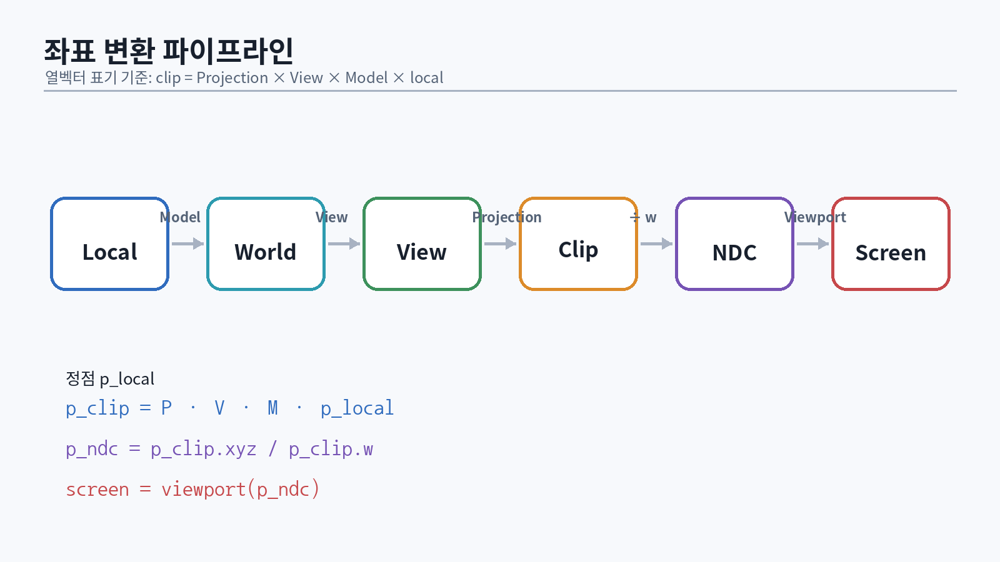
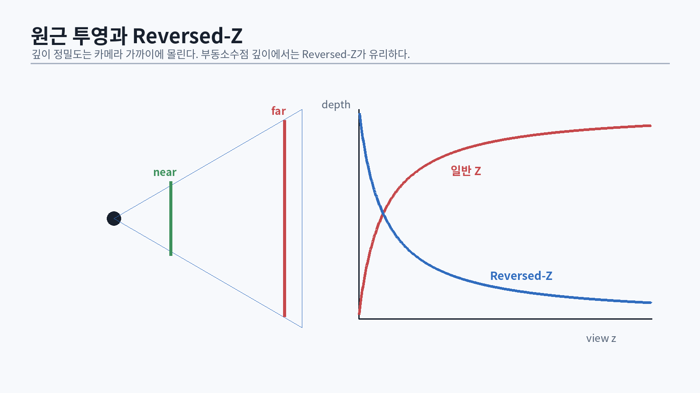

# 8. 벡터: 위치, 방향, 면적

벡터는 숫자 묶음이 아니라 **기하학적 의미를 가진 양**이다. 같은 `(1, 2, 3)`이라도 위치, 방향, 색, 속도, 법선일 수 있다. 연산이 같아 보여도 변환 규칙은 다르다.

## 8.1 점과 방향의 차이

동차좌표에서 점은 $w=1$, 방향은 $w=0$으로 둔다.

$$
\mathbf{p}' = M \begin{bmatrix}x\\y\\z\\1\end{bmatrix},\qquad
\mathbf{v}' = M \begin{bmatrix}x\\y\\z\\0\end{bmatrix}
$$

따라서 translation은 점에는 적용되지만 방향에는 적용되지 않는다. 이 구분을 타입 수준에서 표현하면 버그가 줄어든다.

```cpp
struct Point3 { float x, y, z; };
struct Dir3   { float x, y, z; };

[[nodiscard]] Point3 operator+(Point3 p, Dir3 d) noexcept {
    return {p.x + d.x, p.y + d.y, p.z + d.z};
}

[[nodiscard]] Dir3 operator-(Point3 a, Point3 b) noexcept {
    return {a.x - b.x, a.y - b.y, a.z - b.z};
}
```

실전에서는 `XMFLOAT3`나 자체 SIMD 타입 하나를 쓰더라도 API 경계에서 의미를 이름으로 드러낸다. `positionWS`, `normalVS`, `velocityPixels`처럼 공간과 단위를 접미사로 붙인다.

## 8.2 내적

$$
\mathbf{a}\cdot\mathbf{b} = a_xb_x+a_yb_y+a_zb_z
= \|\mathbf a\|\|\mathbf b\|\cos\theta
$$

내적의 주요 용도는 다음과 같다.

- 두 방향의 각도 관계
- 평면 앞뒤 판정
- 벡터를 축에 투영
- Lambert 조명의 $\max(0, \mathbf n\cdot\mathbf l)$
- back-face, cone, spotlight 판정

```cpp
float Dot(Float3 a, Float3 b) noexcept {
    return a.x * b.x + a.y * b.y + a.z * b.z;
}

float ProjectLength(Float3 v, Float3 unitAxis) noexcept {
    assert(std::abs(Length(unitAxis) - 1.0f) < 1e-3f);
    return Dot(v, unitAxis);
}
```

정규화되지 않은 벡터를 사용하면 cosine으로 해석할 수 없다. `dot` 결과가 `[-1, 1]`을 벗어난다고 바로 clamp하기 전에 입력 길이를 검사한다.

## 8.3 외적과 좌표계 방향

외적은 두 벡터에 수직인 벡터를 만든다.

$$
\mathbf a\times\mathbf b =
\begin{bmatrix}
a_yb_z-a_zb_y\\
a_zb_x-a_xb_z\\
a_xb_y-a_yb_x
\end{bmatrix}
$$

외적 순서를 바꾸면 부호가 바뀐다. 카메라 basis를 만들 때 이 차이가 좌우 반전이나 뒤집힌 winding으로 나타난다.

```cpp
Float3 Cross(Float3 a, Float3 b) noexcept {
    return {
        a.y * b.z - a.z * b.y,
        a.z * b.x - a.x * b.z,
        a.x * b.y - a.y * b.x
    };
}
```

삼각형 면적은 $\frac{1}{2}\| (b-a)\times(c-a)\|$이다. 이 값이 작으면 퇴화 삼각형으로 간주할 수 있다.

## 8.4 안전한 정규화

```cpp
std::optional<Float3> Normalize(Float3 v, float epsilon = 1e-8f) noexcept {
    const float len2 = Dot(v, v);
    if (len2 <= epsilon) {
        return std::nullopt;
    }
    const float inv = 1.0f / std::sqrt(len2);
    return Float3{v.x * inv, v.y * inv, v.z * inv};
}
```

`normalize(0)`은 NaN을 만들 수 있다. NaN은 비교에서 예상과 다르게 동작하고 render target 전체로 전파될 수 있다. HLSL 디버그 빌드에서는 `isfinite` 검사를 넣거나 NaN이 보라색으로 보이게 한다.

```hlsl
float3 SafeNormalize(float3 v)
{
    float len2 = dot(v, v);
    return len2 > 1e-12 ? v * rsqrt(len2) : float3(0, 0, 1);
}
```

::: {.exercise}
1. 점과 방향을 구분한 최소 수학 라이브러리를 만든다.
2. dot, cross, normalize의 property test를 작성한다.
3. 임의 벡터 `a`, `b`에 대해 `dot(cross(a,b), a) ≈ 0`을 검증한다.
4. NaN이 render target에서 어떻게 전파되는지 compute shader로 확인한다.
:::

# 9. 행렬과 변환 합성

{#fig-coordinate-pipeline width=96%}

행렬은 공간 사이의 선형 변환을 표현한다. translation까지 포함하기 위해 4×4 동차행렬을 사용한다. 중요한 것은 행/열 우선 저장 방식보다 **벡터를 어느 쪽에 곱하고 어떤 순서로 합성하는지**다.

## 9.1 기본 변환

열벡터 관례에서 translation 행렬은 다음과 같다.

$$
T = \begin{bmatrix}
1&0&0&t_x\\
0&1&0&t_y\\
0&0&1&t_z\\
0&0&0&1
\end{bmatrix}
$$

scale과 회전도 같은 방식으로 합성한다.

$$
M = T R S
$$

점에는 오른쪽부터 적용되므로 실제 순서는 scale → rotate → translate다.

## 9.2 normal matrix

비균일 scale이 포함된 모델 행렬에 법선을 그대로 곱하면 법선이 표면에 수직이지 않게 된다. 법선은 모델 행렬의 상단 3×3 역전치로 변환한다.

$$
N = (M_{3\times3}^{-1})^T
$$

```hlsl
float3 normalWS = normalize(mul((float3x3)gNormalMatrix, input.normalOS));
```

실시간 엔진에서는 rigid transform이나 uniform scale이라는 불변식을 보장해 inverse-transpose 비용을 줄일 수 있다. 그러나 그 전제는 material/mesh import 단계에서 검증해야 한다.

## 9.3 CPU–GPU 행렬 계약

DirectXMath는 Windows에 최적화된 벡터·행렬 연산을 제공한다 [@microsoft-directxmath]. CPU 구조체를 constant buffer에 그대로 복사할 때는 HLSL packing과 row/column-major 해석을 함께 확인한다.

```cpp
struct alignas(256) ObjectConstants {
    DirectX::XMFLOAT4X4 model;
    DirectX::XMFLOAT4X4 normal;
};
```

`alignas(256)`만으로 모든 원소가 256바이트 간격이 되는 것은 아니다. CBV 시작 주소가 `D3D12_CONSTANT_BUFFER_DATA_PLACEMENT_ALIGNMENT`에 맞도록 upload ring에서 offset을 정렬한다.

```cpp
constexpr std::uint64_t AlignUp(std::uint64_t value,
                                std::uint64_t alignment) noexcept
{
    return (value + alignment - 1) & ~(alignment - 1);
}
```

## 9.4 역행렬을 피하는 설계

매 프레임 수천 개 오브젝트의 inverse를 계산하는 대신 다음 전략을 사용한다.

- transform 변경 시 world와 inverse-world를 함께 갱신
- rigid transform은 transpose로 inverse rotation 계산
- 카메라 view는 pose에서 직접 구성
- 계층 transform은 dirty flag로 필요한 서브트리만 갱신
- shader에 필요한 행렬만 전달

행렬 계산은 연산량보다 cache miss와 데이터 이동이 더 큰 문제가 되기도 한다.

::: {.exercise}
1. `Scale → Rotate → Translate`와 `Translate → Rotate → Scale`의 결과를 시각화한다.
2. 비균일 scale을 적용한 구에 잘못된 normal transform과 올바른 normal matrix를 비교한다.
3. CPU에서 한 점을 변환한 결과와 HLSL에서 변환한 결과를 readback으로 비교한다.
:::

# 10. 좌표 공간과 카메라

게임 렌더러는 한 프레임 안에서 여러 공간을 오간다.

- object/local space: mesh 자체 좌표
- world space: 장면 공통 좌표
- view space: 카메라 기준 좌표
- clip space: projection 후, perspective divide 전
- NDC: `xyz / w` 후 정규화된 좌표
- screen space: viewport와 픽셀 좌표
- tangent space: normal map의 지역 basis
- light space: shadow map을 위한 광원 좌표

공간이 다른 벡터를 더하거나 dot하면 수학적으로 의미가 없다. HLSL 변수명에 `WS`, `VS`, `TS`, `CS`를 붙인다.

## 10.1 Look-at 카메라의 함정

카메라 위치 `eye`, 목표 `target`, 상향 힌트 `upHint`로 basis를 만든다.

```cpp
Float3 forward = Normalize(target - eye).value();
Float3 right   = Normalize(Cross(upHint, forward)).value();
Float3 up      = Cross(forward, right);
```

`forward`와 `upHint`가 거의 평행하면 외적 길이가 0에 가까워진다. editor camera는 pitch를 제한하거나 대체 up axis를 선택해야 한다.

## 10.2 카메라 jitter

TAA에서는 projection의 subpixel offset을 프레임마다 바꾼다. jitter는 렌더 해상도 기준 픽셀 단위에서 NDC 단위로 변환한다.

```cpp
Float2 JitterPixelsToNdc(Float2 j, std::uint32_t width, std::uint32_t height)
{
    return {
        2.0f * j.x / static_cast<float>(width),
       -2.0f * j.y / static_cast<float>(height)
    };
}
```

motion vector에는 jittered 위치와 unjittered 위치를 혼동하지 않는다. 보통 현재/이전 clip position에 동일한 정책을 적용하고, TAA resolve에서 jitter 차이를 보정한다.

# 11. Quaternion과 회전 보간

Euler angle은 UI 입력에는 편하지만 회전 합성과 보간의 내부 표현으로는 취약하다. Quaternion은 단위 quaternion일 때 회전을 표현한다.

$$
q = (x, y, z, w),\qquad \|q\|=1
$$

## 11.1 곱셈 순서

Quaternion 곱은 교환법칙이 성립하지 않는다. `qWorld = qParent * qLocal`인지 반대인지는 수학 라이브러리 관례에 따라 달라진다. 단위 테스트로 확정한다.

## 11.2 Nlerp와 Slerp

`nlerp`는 빠르고 작은 각도에서 충분히 좋다.

```cpp
Quat Nlerp(Quat a, Quat b, float t)
{
    if (Dot(a, b) < 0.0f) {
        b = -b; // 같은 회전을 나타내는 antipodal quaternion 보정
    }
    return Normalize(a * (1.0f - t) + b * t);
}
```

`q`와 `-q`는 같은 회전을 나타낸다. 이 보정이 없으면 긴 경로로 회전할 수 있다. skeletal animation에서 keyframe quaternion의 hemisphere consistency를 import 단계에서 정리한다.

## 11.3 Dual quaternion 예고

일반 linear blend skinning은 관절에서 부피가 줄어드는 candy-wrapper artifact를 만들 수 있다. Dual quaternion blending은 회전과 translation을 함께 보간해 해당 문제를 줄인다 [@kavan2008]. 자세한 구현은 애니메이션 장에서 다룬다.

::: {.exercise}
1. Euler, matrix, quaternion 회전을 왕복 변환하고 오차를 측정한다.
2. `q`와 `-q` 사이의 보간이 왜 문제인지 시각화한다.
3. 120Hz camera update에서 nlerp와 slerp의 성능과 오차를 비교한다.
:::

# 12. Projection, depth, Reversed-Z

{#fig-reversed-z width=95%}

원근 투영은 카메라에서 멀어질수록 물체가 작아지게 하고, depth buffer에 비선형적인 값을 저장한다. 깊이 정밀도는 near plane 부근에 집중된다. near를 지나치게 작게 잡으면 far 영역의 z-fighting이 심해진다.

## 12.1 Perspective divide

clip 좌표에서 다음을 수행한다.

$$
\mathbf p_{ndc} = \frac{\mathbf p_{clip}.xyz}{p_{clip}.w}
$$

Direct3D의 NDC depth 범위는 일반적으로 `[0,1]`이다. API와 수학 라이브러리의 projection helper가 오른손/왼손, row/column convention 중 무엇을 쓰는지 확인한다.

## 12.2 Reversed-Z

부동소수점 depth buffer에서 near를 1, far를 0에 매핑하고 depth test를 `GREATER` 또는 `GREATER_EQUAL`로 바꾸면 원거리 정밀도가 개선된다. perspective depth의 비선형성과 floating-point 분포를 함께 고려한 분석은 Upchurch와 Desbrun의 연구를 참고한다 [@upchurch2012].

설정 체크리스트:

```cpp
D3D12_DEPTH_STENCIL_DESC ds{};
ds.DepthEnable = TRUE;
ds.DepthWriteMask = D3D12_DEPTH_WRITE_MASK_ALL;
ds.DepthFunc = D3D12_COMPARISON_FUNC_GREATER_EQUAL;
```

```cpp
commandList->ClearDepthStencilView(
    dsv,
    D3D12_CLEAR_FLAG_DEPTH,
    0.0f, // reversed-Z far
    0,
    0,
    nullptr);
```

- projection matrix가 reversed-Z인지 확인
- clear depth는 0
- comparison은 greater 계열
- shadow map은 별도의 convention을 사용할 수 있음
- depth reconstruction 식을 변경
- sky와 infinite far plane 처리 검증

## 12.3 Linear depth 복원

screen-space 효과는 비선형 hardware depth보다 view-space depth가 필요하다. projection의 특정 성분을 사용해 복원하되, hand-written magic formula를 여러 shader에 복사하지 않는다.

```hlsl
float ViewDepthFromDeviceDepth(float deviceDepth, float4 zParams)
{
    // 프로젝트의 projection convention에서 유도하고 unit test할 것.
    return zParams.x / (deviceDepth + zParams.y);
}
```

정답은 projection matrix convention에 의존한다. CPU에서 여러 view-space z를 투영한 뒤 shader 복원 함수와 비교하는 테스트를 만든다.

# 13. 색, 감마, radiometry

PBR을 구현하기 전에 색과 광량의 단위를 구분해야 한다. 텍스처의 0.5와 빛의 0.5는 같은 의미가 아니다.

## 13.1 선형 공간과 sRGB

albedo/base color 텍스처는 보통 sRGB로 저장하고 sampling 시 선형값으로 디코딩한다. normal, roughness, metallic, AO, mask는 데이터 텍스처이므로 sRGB 디코딩을 하지 않는다.

잘못된 예:

```hlsl
float3 color = pow(baseColor.Sample(samp, uv).rgb, 2.2); // format이 이미 SRGB라면 이중 디코딩
```

권장 방식은 SRV format을 `_SRGB`로 만들고 하드웨어 디코딩을 사용한다. render target의 linear HDR 값을 최종 output transfer function에 맞게 변환한다.

## 13.2 Radiometric quantities

| 양 | 직관 | 단위 |
|---|---|---|
| Radiant flux $\Phi$ | 전체 광파워 | W |
| Irradiance $E$ | 면에 들어오는 파워/면적 | W/m² |
| Radiance $L$ | 위치·방향별 광량 | W/(m²·sr) |
| Solid angle $\omega$ | 방향 영역 | sr |

렌더링 방정식은 radiance의 보존과 표면 반사를 기술한다 [@kajiya1986]. 실시간 엔진은 정확한 절대 단위를 항상 사용하지 않더라도, inverse-square falloff, exposure, emissive 범위를 일관된 체계로 두어야 한다.

## 13.3 HDR와 exposure

HDR buffer는 보통 `R16G16B16A16_FLOAT` 같은 format을 사용한다. 값이 1을 넘는 것은 정상이다. exposure를 곱하고 tone mapping한 뒤 display range에 맞춘다.

$$
L_{exposed}=L\cdot 2^{EV}
$$

자동 노출은 luminance histogram 또는 log-average luminance로 계산하고, 밝아질 때와 어두워질 때 서로 다른 adaptation speed를 둘 수 있다.

::: {.warning}
PBR material 검증용 sphere를 tone mapping과 auto exposure가 켜진 상태에서만 보면 오류를 숨길 수 있다. linear HDR 값, normal, roughness, metallic, N·L을 각각 debug view로 볼 수 있게 한다.
:::

# 14. Sampling, aliasing, Monte Carlo 기초

렌더링은 연속 신호를 픽셀과 시간의 이산 샘플로 바꾸는 과정이다. 고주파 신호가 sampling rate를 넘으면 aliasing이 생긴다. jagged edge뿐 아니라 specular shimmer, normal map sparkle, shadow crawling, temporal flicker도 aliasing이다.

## 14.1 Nyquist 관점

한 픽셀보다 작은 패턴을 단일 point sample로 평가하면 원래 신호를 복원할 수 없다. 해결 전략은 세 가지다.

1. 더 많이 샘플한다: MSAA, supersampling, temporal accumulation.
2. 사전에 저주파화한다: mipmap, prefiltered environment map, normal filtering.
3. 재구성 필터를 개선한다: TAA, SMAA, denoiser.

## 14.2 Mipmap과 derivative

GPU는 pixel quad의 UV derivative로 texture footprint를 추정하고 mip level을 선택한다. divergent control flow나 compute shader에서는 derivative가 없거나 의미가 달라질 수 있다. `SampleLevel`, `SampleGrad`를 선택하는 이유를 알아야 한다.

```hlsl
float2 dx = ddx(uv);
float2 dy = ddy(uv);
float4 c = tex.SampleGrad(samplerLinear, uv, dx, dy);
```

normal map은 단순히 RGB 평균을 내면 벡터 길이가 줄어 specular response가 바뀐다. Toksvig 계열이나 LEAN mapping 같은 방법은 normal 분산을 roughness에 반영한다 [@toksvig2005].

## 14.3 Monte Carlo estimator

적분 $I=\int f(x)dx$를 확률분포 $p(x)$에서 뽑은 표본으로 근사한다.

$$
\hat I = \frac{1}{N}\sum_{i=1}^{N}\frac{f(x_i)}{p(x_i)}
$$

중요도 샘플링은 $|f|$가 큰 곳을 더 자주 샘플해 variance를 줄인다. PBR의 IBL prefilter와 ray tracing에서 같은 사고방식이 반복된다. 이론을 더 깊게 공부하려면 PBRT를 병행한다 [@pbrt4].

## 14.4 Low-discrepancy와 blue noise

독립 난수는 cluster와 빈 영역을 만들 수 있다. Halton/Hammersley sequence는 공간을 고르게 덮고, blue-noise pattern은 저주파 noise를 줄여 시각적으로 유리하다. TAA jitter는 작은 sequence를 반복할 때 주기 artifact를 확인해야 한다.

```cpp
float RadicalInverseVdC(std::uint32_t bits) noexcept
{
    bits = (bits << 16u) | (bits >> 16u);
    bits = ((bits & 0x55555555u) << 1u) | ((bits & 0xAAAAAAAAu) >> 1u);
    bits = ((bits & 0x33333333u) << 2u) | ((bits & 0xCCCCCCCCu) >> 2u);
    bits = ((bits & 0x0F0F0F0Fu) << 4u) | ((bits & 0xF0F0F0F0u) >> 4u);
    bits = ((bits & 0x00FF00FFu) << 8u) | ((bits & 0xFF00FF00u) >> 8u);
    return static_cast<float>(bits) * 2.3283064365386963e-10f;
}
```

::: {.exercise}
1. checkerboard를 거리별로 렌더하고 mipmap 유무를 비교한다.
2. 8-sample Halton jitter와 uniform random jitter의 convergence를 비교한다.
3. normal map을 축소했을 때 specular aliasing을 측정하고 roughness 보정을 실험한다.
4. 동일한 hemisphere 적분을 uniform sampling과 cosine-weighted sampling으로 계산해 variance를 비교한다.
:::

# 15. 수학 파트 통과 시험

다음 질문을 책 없이 답하고 코드로 증명한다.

1. 점과 방향이 translation에 다르게 반응하는 이유는 무엇인가?
2. normal matrix가 inverse-transpose인 이유를 기하학적으로 설명하라.
3. local/world/view/clip/NDC/screen 변환 순서를 쓰라.
4. depth가 비선형인 이유와 near plane이 정밀도에 미치는 영향을 설명하라.
5. Reversed-Z 설정에서 clear value와 depth comparison은 무엇인가?
6. sRGB texture와 linear HDR buffer를 구분하라.
7. mip level 선택에 derivative가 왜 필요한가?
8. Monte Carlo estimator에서 $1/p(x)$가 필요한 이유를 설명하라.

::: {.check}
**통과 산출물**: CPU software rasterizer까지 만들 필요는 없다. 대신 unit test가 있는 수학 라이브러리, 자유 카메라, depth linearization debug view, sRGB/linear 비교 장면, sampling 실험 노트를 제출한다.
:::
