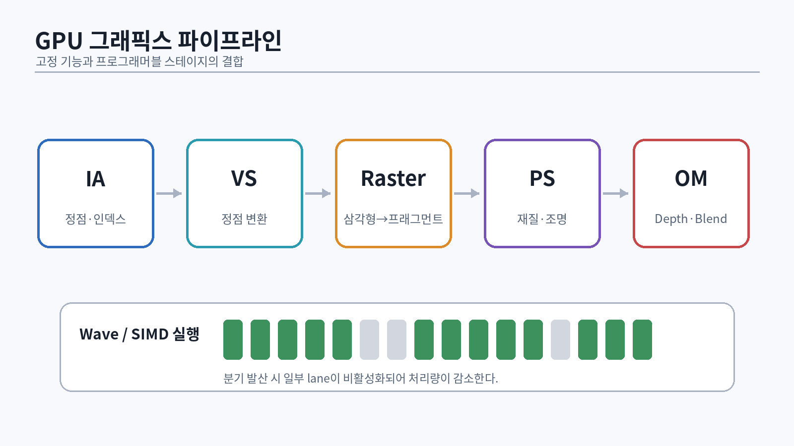
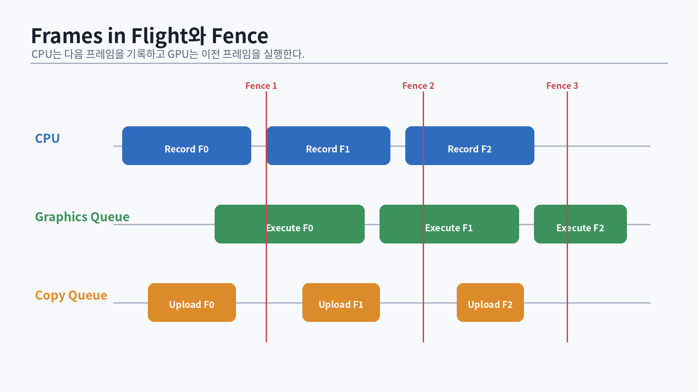

# 16. GPU 실행 모델: wave, latency, bandwidth

{#fig-gpu-pipeline width=96%}

CPU 코드는 소수의 복잡한 스레드가 큰 제어 흐름을 처리하는 데 강하다. GPU는 다수의 lane이 같은 명령을 실행하는 처리량 중심 구조다. HLSL의 thread 하나가 독립된 작은 CPU core라고 생각하면 잘못된 최적화를 하게 된다.

## 16.1 Wave와 분기 발산

Shader Model 6의 wave intrinsic은 같은 wave 안의 lane 간 통신을 제공한다. 실제 wave size는 하드웨어와 shader 속성에 따라 달라질 수 있으므로 32라는 가정에 의존하지 않는다.

```hlsl
float WaveAverage(float value)
{
    float sum = WaveActiveSum(value);
    return sum / WaveGetLaneCount();
}
```

분기 조건이 lane마다 다르면 하드웨어가 각 경로를 순차적으로 실행하고 해당하지 않는 lane을 마스킹할 수 있다. 따라서 짧은 산술을 제거하기 위해 큰 divergent branch를 넣는 것이 항상 이득은 아니다.

```hlsl
// 작은 계산은 branchless가 유리할 수 있지만, 항상 측정해야 한다.
float3 result = lerp(resultA, resultB, conditionMask);
```

## 16.2 Occupancy와 register pressure

한 compute unit에 동시에 resident할 수 있는 wave 수는 register, shared memory(group shared), thread group 크기 등으로 제한된다. register를 많이 쓰는 shader는 instruction 수가 적어도 latency hiding 능력이 떨어질 수 있다.

최적화 시 다음을 함께 본다.

- GPU duration
- waves/occupancy
- VGPR/SGPR 또는 register count
- cache hit rate
- texture/buffer throughput
- ALU utilization
- stall reason

## 16.3 대역폭과 arithmetic intensity

두 구현의 연산 수만 비교하지 않는다. 매 pixel마다 64바이트를 읽는 pass는 4K에서 큰 bandwidth를 요구한다.

$$
3840\times2160\times64 \approx 531\text{ MB/frame}
$$

60fps라면 이상적인 단순 계산만으로 약 31.9GB/s다. 실제로는 cache, compression, overdraw, multiple passes가 추가된다. G-buffer format을 정할 때 “몇 개의 render target인가”가 아니라 픽셀당 bytes와 read/write 횟수를 계산한다.

## 16.4 GPU 작업의 세 종류

- Graphics: raster pipeline과 render target/depth 사용
- Compute: 일반적인 thread group 실행
- Copy: resource copy와 upload/readback

D3D12는 각 작업을 command list에 기록해 queue에 제출한다. API는 명시적이지만 하드웨어가 진짜로 병렬 실행할지는 resource dependency와 device에 따라 달라진다 [@microsoft-d3d12-guide].

::: {.exercise}
1. ALU-heavy compute와 bandwidth-heavy compute 두 개를 만들고 PIX에서 차이를 비교한다.
2. `[numthreads(8,8,1)]`, `(16,16,1)`, `(32,8,1)`을 바꿔 duration과 occupancy를 기록한다.
3. 의도적으로 divergent branch를 만들고 lane efficiency를 관찰한다.
:::

# 17. Win32 애플리케이션 뼈대

D3D12 렌더러는 창, 메시지 루프, DPI, 입력, resize, suspend 같은 플랫폼 이벤트 위에서 동작한다. 플랫폼 코드를 renderer 내부에 섞지 않는다.

## 17.1 오류 처리

```cpp
class HrException final : public std::runtime_error {
public:
    HrException(HRESULT hr, std::string where)
        : std::runtime_error(std::move(where)), hr_(hr) {}
    [[nodiscard]] HRESULT Code() const noexcept { return hr_; }
private:
    HRESULT hr_;
};

inline void ThrowIfFailed(HRESULT hr,
                          std::source_location loc = std::source_location::current())
{
    if (FAILED(hr)) {
        std::ostringstream oss;
        oss << loc.file_name() << ':' << loc.line() << " HRESULT=0x"
            << std::hex << static_cast<unsigned long>(hr);
        throw HrException(hr, oss.str());
    }
}
```

API 호출을 한 줄로 묶으면 실패 위치를 찾기 어렵다. 개발 빌드에서는 object name과 marker를 적극적으로 사용한다.

## 17.2 메시지 루프

```cpp
int RunMessageLoop(App& app)
{
    MSG msg{};
    while (msg.message != WM_QUIT) {
        if (PeekMessageW(&msg, nullptr, 0, 0, PM_REMOVE)) {
            TranslateMessage(&msg);
            DispatchMessageW(&msg);
        } else {
            app.Tick();
        }
    }
    return static_cast<int>(msg.wParam);
}
```

resize 중에는 `WM_SIZE`가 연속 발생한다. back buffer를 매 메시지마다 즉시 재생성하면 비용과 상태 복잡도가 커진다. pending size를 저장하고 안전한 지점에서 GPU idle 또는 frame fence를 기다린 뒤 재생성한다.

## 17.3 고정 업데이트와 렌더 업데이트

```cpp
void App::Tick()
{
    const double now = timer_.NowSeconds();
    double dt = std::min(now - previous_, 0.25);
    previous_ = now;
    accumulator_ += dt;

    constexpr double fixed = 1.0 / 60.0;
    while (accumulator_ >= fixed) {
        world_.FixedUpdate(static_cast<float>(fixed));
        accumulator_ -= fixed;
    }

    const float alpha = static_cast<float>(accumulator_ / fixed);
    world_.RenderUpdate(alpha);
    renderer_.Render(world_);
}
```

physics/gameplay fixed step과 render cadence를 분리한다. TAA history, animation interpolation, motion vector는 이 시간 모델의 영향을 받는다.

# 18. Adapter, device, feature query

D3D12 초기화는 “첫 번째 adapter를 잡는다”로 끝나지 않는다. 소프트웨어 adapter, integrated/discrete GPU, hybrid laptop, remote session을 고려한다.

## 18.1 Factory와 adapter 선택

```cpp
ComPtr<IDXGIFactory7> CreateFactory(bool debug)
{
    UINT flags = debug ? DXGI_CREATE_FACTORY_DEBUG : 0;
    ComPtr<IDXGIFactory7> factory;
    ThrowIfFailed(CreateDXGIFactory2(flags, IID_PPV_ARGS(&factory)));
    return factory;
}
```

```cpp
ComPtr<IDXGIAdapter4> PickAdapter(IDXGIFactory7& factory)
{
    for (UINT i = 0;; ++i) {
        ComPtr<IDXGIAdapter4> adapter;
        if (factory.EnumAdapterByGpuPreference(
                i,
                DXGI_GPU_PREFERENCE_HIGH_PERFORMANCE,
                IID_PPV_ARGS(&adapter)) == DXGI_ERROR_NOT_FOUND) {
            break;
        }

        DXGI_ADAPTER_DESC3 desc{};
        ThrowIfFailed(adapter->GetDesc3(&desc));
        if (desc.Flags & DXGI_ADAPTER_FLAG3_SOFTWARE) {
            continue;
        }

        if (SUCCEEDED(D3D12CreateDevice(
                adapter.Get(), D3D_FEATURE_LEVEL_12_0,
                __uuidof(ID3D12Device), nullptr))) {
            return adapter;
        }
    }
    throw std::runtime_error("No suitable D3D12 adapter");
}
```

feature level은 API 전체 기능을 한 숫자로 완전히 설명하지 않는다. shader model, resource binding tier, raytracing tier, mesh shader tier, VRS, sampler feedback 등을 개별 query한다.

```cpp
D3D12_FEATURE_DATA_SHADER_MODEL sm{D3D_SHADER_MODEL_6_8};
while (FAILED(device.CheckFeatureSupport(
           D3D12_FEATURE_SHADER_MODEL, &sm, sizeof(sm)))) {
    if (sm.HighestShaderModel == D3D_SHADER_MODEL_6_0) break;
    sm.HighestShaderModel = static_cast<D3D_SHADER_MODEL>(
        static_cast<int>(sm.HighestShaderModel) - 1);
}
```

## 18.2 Capability 구조체

엔진 시작 시 query 결과를 한 구조체에 저장한다.

```cpp
struct GpuCaps {
    D3D_FEATURE_LEVEL featureLevel{};
    D3D_SHADER_MODEL shaderModel{};
    D3D12_RAYTRACING_TIER raytracing{};
    D3D12_MESH_SHADER_TIER meshShader{};
    D3D12_VARIABLE_SHADING_RATE_TIER vrs{};
    D3D12_SAMPLER_FEEDBACK_TIER samplerFeedback{};
    bool enhancedBarriers{};
};
```

feature별 fallback 경로를 설계한다. 지원하지 않는 하드웨어에서 assert로 종료하는 것과 기능을 끄는 것 중 제품 요구사항에 맞는 정책을 명시한다.

# 19. Command queue, allocator, list, fence

{#fig-frame-timeline width=96%}

D3D12의 command list는 GPU 명령을 기록하는 컨테이너다. command allocator는 기록에 필요한 메모리를 소유한다. allocator를 재사용하려면 해당 allocator로 기록한 GPU 작업이 끝났다는 보장이 필요하다.

## 19.1 Queue wrapper

```cpp
class CommandQueue {
public:
    CommandQueue(ID3D12Device& device, D3D12_COMMAND_LIST_TYPE type)
        : type_(type)
    {
        D3D12_COMMAND_QUEUE_DESC desc{};
        desc.Type = type;
        desc.Priority = D3D12_COMMAND_QUEUE_PRIORITY_NORMAL;
        desc.Flags = D3D12_COMMAND_QUEUE_FLAG_NONE;
        ThrowIfFailed(device.CreateCommandQueue(&desc, IID_PPV_ARGS(&queue_)));
        ThrowIfFailed(device.CreateFence(0, D3D12_FENCE_FLAG_NONE,
                                         IID_PPV_ARGS(&fence_)));
        event_ = CreateEventW(nullptr, FALSE, FALSE, nullptr);
        if (!event_) throw std::runtime_error("CreateEvent failed");
    }

    std::uint64_t Signal()
    {
        const auto value = ++nextFence_;
        ThrowIfFailed(queue_->Signal(fence_.Get(), value));
        return value;
    }

    void WaitCpu(std::uint64_t value)
    {
        if (fence_->GetCompletedValue() >= value) return;
        ThrowIfFailed(fence_->SetEventOnCompletion(value, event_));
        WaitForSingleObject(event_, INFINITE);
    }

private:
    D3D12_COMMAND_LIST_TYPE type_{};
    ComPtr<ID3D12CommandQueue> queue_;
    ComPtr<ID3D12Fence> fence_;
    HANDLE event_{};
    std::uint64_t nextFence_{};
};
```

실제 클래스는 destructor에서 event를 닫고, move 정책을 정하고, queue 간 GPU wait를 지원해야 한다.

## 19.2 Frames in flight

```cpp
struct FrameContext {
    ComPtr<ID3D12CommandAllocator> graphicsAllocator;
    std::uint64_t graphicsFence{};
    UploadRing frameUpload;
    DescriptorRing transientDescriptors;
};
```

현재 back buffer index와 frame context index는 우연히 같을 수 있지만 개념적으로 분리한다. swap chain buffer 수와 CPU frame latency 정책이 바뀔 수 있다.

## 19.3 CPU wait와 GPU wait

- CPU wait: `SetEventOnCompletion` 후 OS event 대기
- GPU queue wait: `queueA->Wait(fenceB, value)`

GPU wait로 해결할 수 있는 dependency를 CPU wait로 바꾸면 병렬성이 줄어든다. 반대로 자원 lifetime을 잘못 추론한 채 queue wait를 생략하면 드물게 데이터가 깨진다.

# 20. Swap chain과 present

DXGI flip model은 현대 Windows의 기본 선택이다 [@microsoft-flip-model]. D3D12 swap chain의 back buffer는 명시적으로 현재 index를 얻어 사용한다.

```cpp
DXGI_SWAP_CHAIN_DESC1 desc{};
desc.Width = width;
desc.Height = height;
desc.Format = DXGI_FORMAT_R8G8B8A8_UNORM;
desc.SampleDesc = {1, 0};
desc.BufferUsage = DXGI_USAGE_RENDER_TARGET_OUTPUT;
desc.BufferCount = 3;
desc.SwapEffect = DXGI_SWAP_EFFECT_FLIP_DISCARD;
desc.AlphaMode = DXGI_ALPHA_MODE_IGNORE;
desc.Flags = allowTearing ? DXGI_SWAP_CHAIN_FLAG_ALLOW_TEARING : 0;
```

## 20.1 Present 상태 전환

back buffer는 draw 전에 `RENDER_TARGET`, present 전에 `PRESENT` 상태여야 한다.

```cpp
Transition(cmd, backBuffer,
           D3D12_RESOURCE_STATE_PRESENT,
           D3D12_RESOURCE_STATE_RENDER_TARGET);

// clear + draw

Transition(cmd, backBuffer,
           D3D12_RESOURCE_STATE_RENDER_TARGET,
           D3D12_RESOURCE_STATE_PRESENT);
```

legacy barrier와 enhanced barrier 중 하나의 추상화를 만들되 같은 resource를 두 체계로 뒤섞지 않는다. Enhanced Barriers는 sync scope, access, layout을 분리해 더 세밀한 표현을 제공한다 [@microsoft-enhanced-barriers].

## 20.2 Resize 순서

1. 새 크기가 0이면 minimized 상태로 둔다.
2. 관련 GPU 작업 완료를 기다린다.
3. back buffer `ComPtr`와 RTV를 해제한다.
4. `ResizeBuffers` 호출
5. 새 back buffer와 RTV 생성
6. depth, history, render graph persistent resource 재생성
7. camera aspect와 viewport/scissor 갱신
8. TAA history invalidation

# 21. 첫 삼각형: 전체 흐름

첫 삼각형의 목표는 화면에 색을 띄우는 것이 아니라 다음 계약을 확인하는 것이다.

- device와 queue가 정상
- swap chain과 RTV 정상
- command allocator/list lifecycle 정상
- shader compile과 PSO 정상
- root signature와 input layout 정상
- resource state와 fence 정상

## 21.1 빈 root signature

```cpp
D3D12_ROOT_SIGNATURE_DESC rs{};
rs.Flags = D3D12_ROOT_SIGNATURE_FLAG_ALLOW_INPUT_ASSEMBLER_INPUT_LAYOUT;

ComPtr<ID3DBlob> blob;
ComPtr<ID3DBlob> errors;
ThrowIfFailed(D3D12SerializeRootSignature(
    &rs, D3D_ROOT_SIGNATURE_VERSION_1, &blob, &errors));

ComPtr<ID3D12RootSignature> rootSignature;
ThrowIfFailed(device->CreateRootSignature(
    0, blob->GetBufferPointer(), blob->GetBufferSize(),
    IID_PPV_ARGS(&rootSignature)));
```

Root Signature는 shader가 리소스를 접근하는 계약이다 [@microsoft-root-signatures]. 삼각형에서는 비어 있지만 이후 root constant, CBV, descriptor table, static sampler를 넣는다.

## 21.2 Shader

```hlsl
struct VSInput
{
    float3 position : POSITION;
    float3 color    : COLOR0;
};

struct VSOutput
{
    float4 position : SV_Position;
    float3 color    : COLOR0;
};

VSOutput VSMain(VSInput input)
{
    VSOutput o;
    o.position = float4(input.position, 1.0);
    o.color = input.color;
    return o;
}

float4 PSMain(VSOutput input) : SV_Target0
{
    return float4(input.color, 1.0);
}
```

초기 샘플은 Shader Model 5.1로 단순화할 수 있지만, 본 엔진은 DXC와 Shader Model 6.x 빌드 파이프라인을 사용한다. HLSL은 C와 유사하지만 CPU C++와 다른 실행 모델과 packing 규칙을 가진다 [@microsoft-hlsl].

## 21.3 PSO

D3D12는 shader, rasterizer, depth/stencil, blend, render target format 등 많은 상태를 PSO로 묶는다. 런타임에 무작정 PSO를 생성하면 hitch가 발생할 수 있으므로 key와 cache 전략이 필요하다.

```cpp
struct GraphicsPsoKey {
    ShaderId vs;
    ShaderId ps;
    VertexLayoutId vertexLayout;
    RenderStateId state;
    std::array<DXGI_FORMAT, 8> rtvFormats{};
    DXGI_FORMAT dsvFormat{};
};
```

# 22. Bootstrapping 파트 통과 시험

다음 오류를 의도적으로 만들고 debug layer/PIX에서 확인한다.

1. allocator를 fence 완료 전에 reset한다.
2. back buffer를 `PRESENT`에서 바로 clear한다.
3. RTV format과 PSO format을 다르게 만든다.
4. resize 전에 back buffer reference를 남긴다.
5. shader input semantic과 input layout을 다르게 한다.
6. fence value를 잘못 재사용한다.

::: {.check}
**통과 산출물**: 창 크기 조절과 Alt-Tab이 안정적인 삼각형, triple buffering, object naming, debug layer clean run, adapter/feature report, GPU capture 한 개.
:::
