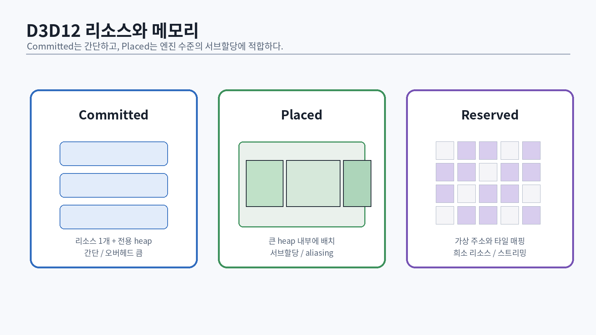
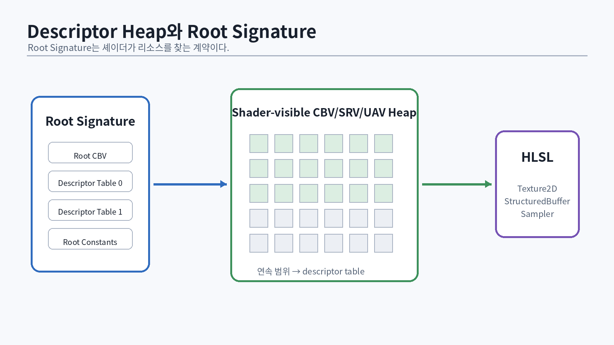

# 23. 리소스 모델: buffer, texture, heap

{#fig-resource-memory width=96%}

D3D12에서 resource는 GPU가 접근할 데이터의 형태이고 heap은 메모리의 물리적 저장소다. committed, placed, reserved resource의 차이를 이해해야 메모리 allocator와 transient resource를 설계할 수 있다 [@microsoft-memory-management; @microsoft-residency].

## 23.1 Committed resource

`CreateCommittedResource`는 resource와 전용 heap을 함께 만든다. 초기 구현과 장기 수명 texture에 편리하지만, 수많은 작은 resource를 만들면 allocation overhead와 fragmentation 관리가 불리하다.

```cpp
ComPtr<ID3D12Resource> CreateDefaultBuffer(
    ID3D12Device& device,
    std::uint64_t byteSize,
    D3D12_RESOURCE_FLAGS flags = D3D12_RESOURCE_FLAG_NONE)
{
    D3D12_HEAP_PROPERTIES heap{};
    heap.Type = D3D12_HEAP_TYPE_DEFAULT;

    D3D12_RESOURCE_DESC desc{};
    desc.Dimension = D3D12_RESOURCE_DIMENSION_BUFFER;
    desc.Width = byteSize;
    desc.Height = 1;
    desc.DepthOrArraySize = 1;
    desc.MipLevels = 1;
    desc.Format = DXGI_FORMAT_UNKNOWN;
    desc.SampleDesc = {1, 0};
    desc.Layout = D3D12_TEXTURE_LAYOUT_ROW_MAJOR;
    desc.Flags = flags;

    ComPtr<ID3D12Resource> resource;
    ThrowIfFailed(device.CreateCommittedResource(
        &heap,
        D3D12_HEAP_FLAG_NONE,
        &desc,
        D3D12_RESOURCE_STATE_COMMON,
        nullptr,
        IID_PPV_ARGS(&resource)));
    return resource;
}
```

## 23.2 Placed resource

큰 heap을 만들고 offset에 resource를 배치한다. allocator는 `GetResourceAllocationInfo`의 size/alignment를 존중해야 한다.

```cpp
const auto info = device.GetResourceAllocationInfo(
    0, 1, &resourceDesc);
const std::uint64_t offset = heapAllocator.Allocate(
    info.SizeInBytes, info.Alignment);

ThrowIfFailed(device.CreatePlacedResource(
    heap.Get(), offset, &resourceDesc,
    initialState, clearValue,
    IID_PPV_ARGS(&resource)));
```

수명이 겹치지 않는 transient resource는 같은 heap 영역을 alias할 수 있다. 이때 resource 간 aliasing barrier 또는 enhanced barrier에 해당하는 동기화를 넣는다.

## 23.3 Reserved resource

가상 resource를 만들고 실제 tile을 부분적으로 매핑한다. virtual texturing과 거대한 sparse texture에 유용하지만 모든 엔진의 첫 구현에 필요한 것은 아니다. sampler feedback은 실제 sampling 위치를 기록해 streaming 의사결정에 사용할 수 있다 [@microsoft-sampler-feedback].

## 23.4 Resource description을 값 객체로

API 구조체를 시스템 전체에 흩뿌리지 않는다.

```cpp
struct TextureDesc {
    std::uint32_t width{};
    std::uint32_t height{};
    std::uint16_t mipLevels{1};
    std::uint16_t arraySize{1};
    DXGI_FORMAT format{DXGI_FORMAT_R8G8B8A8_UNORM};
    D3D12_RESOURCE_FLAGS flags{};
};
```

엔진 desc에서 D3D12 desc로 변환하는 한 지점을 만들면 format policy, clear value, typeless view 처리, hash key를 통제할 수 있다.

# 24. Upload, readback, footprint

DEFAULT heap은 GPU 접근에 적합하지만 CPU가 직접 map할 수 없다. UPLOAD heap에 데이터를 쓰고 copy command로 DEFAULT resource에 옮긴다.

## 24.1 Upload buffer ring

```cpp
struct UploadAllocation {
    void* cpu{};
    D3D12_GPU_VIRTUAL_ADDRESS gpu{};
    std::uint64_t offset{};
    std::uint64_t size{};
};

class UploadRing {
public:
    UploadAllocation Allocate(std::uint64_t size,
                              std::uint64_t alignment)
    {
        const auto aligned = AlignUp(head_, alignment);
        if (aligned + size > capacity_) {
            throw std::bad_alloc{};
        }
        head_ = aligned + size;
        return {
            mapped_ + aligned,
            resource_->GetGPUVirtualAddress() + aligned,
            aligned,
            size
        };
    }

    void Reset() noexcept { head_ = 0; }
private:
    ComPtr<ID3D12Resource> resource_;
    std::byte* mapped_{};
    std::uint64_t capacity_{};
    std::uint64_t head_{};
};
```

이 ring은 frame context별로 두면 해당 frame fence 완료 후 reset할 수 있다. 장기 upload는 별도 copy queue staging allocator로 관리한다.

## 24.2 Texture footprint

Texture row pitch는 format의 단순 `width * bytesPerPixel`이 아닐 수 있으며 D3D12 alignment를 맞춰야 한다.

```cpp
D3D12_PLACED_SUBRESOURCE_FOOTPRINT footprint{};
UINT rows{};
UINT64 rowSize{};
UINT64 total{};
device.GetCopyableFootprints(
    &textureDesc,
    subresource,
    1,
    uploadOffset,
    &footprint,
    &rows,
    &rowSize,
    &total);
```

각 row를 `footprint.Footprint.RowPitch` 간격으로 복사한다. BC compressed texture는 block 단위 크기와 row count를 처리한다.

## 24.3 Readback의 목적

readback은 동기화 비용이 크다. 매 프레임 gameplay logic이 GPU 결과를 즉시 기다리는 구조는 피한다. timestamp, occlusion result, screenshot, unit test처럼 latency를 허용하거나 비동기적으로 소비한다.

# 25. Descriptor와 view

{#fig-descriptor-binding width=96%}

Resource 자체와 shader가 보는 view는 다르다. 같은 typeless texture에 SRV, RTV, DSV를 서로 다른 format으로 만들 수 있다. descriptor는 resource 접근 방식을 기술한다 [@microsoft-resource-binding].

## 25.1 Descriptor 종류

- CBV: constant buffer view
- SRV: shader resource view
- UAV: unordered access view
- RTV: render target view
- DSV: depth stencil view
- Sampler

RTV/DSV heap은 shader-visible일 필요가 없다. CBV/SRV/UAV와 sampler heap만 shader-visible heap을 사용할 수 있다.

## 25.2 CPU descriptor allocator

```cpp
struct DescriptorHandle {
    D3D12_CPU_DESCRIPTOR_HANDLE cpu{};
    std::uint32_t index{};
};

class CpuDescriptorPool {
public:
    DescriptorHandle Allocate()
    {
        if (free_.empty()) throw std::bad_alloc{};
        const auto index = free_.back();
        free_.pop_back();
        D3D12_CPU_DESCRIPTOR_HANDLE h = start_;
        h.ptr += static_cast<SIZE_T>(index) * stride_;
        return {h, index};
    }

    void Free(std::uint32_t index, std::uint64_t retireFence)
    {
        retired_.push_back({index, retireFence});
    }
};
```

GPU가 아직 참조하는 descriptor를 즉시 재사용하면 다른 resource를 보게 된다. resource와 마찬가지로 fence 기반 deferred free가 필요하다.

## 25.3 Shader-visible heap 전략

초기 구현은 프레임별 transient ring과 영구 descriptor 영역을 나눈다.

```text
[ persistent bindless descriptors | frame 0 transient | frame 1 transient | frame 2 transient ]
```

descriptor table을 매 draw마다 복사하는 방식은 단순하지만 CPU 비용이 커질 수 있다. bindless는 많은 resource를 큰 heap에 넣고 index로 접근하지만, lifetime, heap capacity, update-after-use 위험, feature tier를 관리해야 한다.

## 25.4 Root signature 비용

Root parameter는 root constant, root descriptor, descriptor table로 구성한다. root signature는 크기 제한이 있고 root 변경은 비용이 있다. 자주 바뀌는 작은 값과 큰 resource 집합을 구분한다.

```hlsl
struct DrawConstants {
    uint objectIndex;
    uint materialIndex;
    uint meshIndex;
    uint flags;
};
```

4개의 32-bit root constant로 draw index만 전달하고 실제 데이터는 structured buffer에서 가져오는 방식은 GPU-driven 구조와 잘 맞는다.

# 26. Resource state와 barrier

Barrier는 “이제 texture를 다른 용도로 쓴다”는 표식이 아니라, 이전 접근의 완료와 다음 접근의 가시성·layout을 정의하는 동기화다.

## 26.1 Legacy barrier tracker

```cpp
class ResourceStateTracker {
public:
    void Transition(ID3D12Resource* resource,
                    D3D12_RESOURCE_STATES before,
                    D3D12_RESOURCE_STATES after)
    {
        if (before == after) return;
        D3D12_RESOURCE_BARRIER b{};
        b.Type = D3D12_RESOURCE_BARRIER_TYPE_TRANSITION;
        b.Transition.pResource = resource;
        b.Transition.StateBefore = before;
        b.Transition.StateAfter = after;
        b.Transition.Subresource = D3D12_RESOURCE_BARRIER_ALL_SUBRESOURCES;
        pending_.push_back(b);
    }

    void Flush(ID3D12GraphicsCommandList& cmd)
    {
        if (pending_.empty()) return;
        cmd.ResourceBarrier(static_cast<UINT>(pending_.size()), pending_.data());
        pending_.clear();
    }
private:
    std::vector<D3D12_RESOURCE_BARRIER> pending_;
};
```

실전 tracker는 subresource별 상태, command list local state, global state merge, split barrier, queue ownership을 다뤄야 한다.

## 26.2 UAV barrier

UAV write 후 같은 resource를 다시 UAV로 읽거나 쓸 때 state가 같더라도 ordering이 필요할 수 있다.

```cpp
D3D12_RESOURCE_BARRIER b{};
b.Type = D3D12_RESOURCE_BARRIER_TYPE_UAV;
b.UAV.pResource = resource;
cmd.ResourceBarrier(1, &b);
```

모든 UAV 사이에 무조건 barrier를 넣으면 안전하지만 병렬성을 잃는다. data dependency가 있는지 분석한다.

## 26.3 Enhanced Barriers

Enhanced Barriers는 sync, access, layout을 분리하고 subresource range를 더 유연하게 표현한다 [@microsoft-enhanced-barriers]. 엔진 추상화는 “D3D12_RESOURCE_STATES 값”보다 다음 의미를 저장하는 편이 좋다.

```cpp
enum class AccessIntent {
    RenderTargetWrite,
    DepthWrite,
    ShaderRead,
    UavReadWrite,
    CopySource,
    CopyDest,
    Present
};
```

이 intent에서 legacy 또는 enhanced barrier로 변환하면 backend 교체가 쉬워진다.

# 27. HLSL과 DXC 빌드 파이프라인

Shader는 runtime 문자열이 아니라 빌드 산출물이다. include dependency, permutation, reflection, cache, debug symbol을 관리한다.

## 27.1 DXC command 예

```powershell
dxc.exe Pbr.hlsl `
  -E VSMain `
  -T vs_6_6 `
  -Fo build/shaders/Pbr.vs.dxil `
  -Fd build/shaders/Pbr.vs.pdb `
  -Zi -Qembed_debug `
  -HV 2021 `
  -enable-16bit-types `
  -I shaders/includes
```

Release에서는 최적화와 symbol policy를 별도로 둔다. shader hash에는 source, include content, defines, compiler version, target profile, flags를 포함한다.

## 27.2 Constant buffer packing

HLSL cbuffer는 16-byte register 단위 packing 규칙을 따른다.

```hlsl
cbuffer CameraCB : register(b0)
{
    float4x4 gViewProjection; // 64 bytes
    float3   gCameraPosition; // 12
    float    gTime;           // 같은 16-byte slot에 들어감
    float2   gInvResolution;  // 다음 slot
    float2   gJitter;
};
```

CPU 구조체는 `static_assert(sizeof(...))`, `offsetof`, reflection 검사를 사용한다.

## 27.3 StructuredBuffer와 ByteAddressBuffer

큰 scene data는 cbuffer보다 structured buffer가 적합하다.

```hlsl
struct MaterialGpu {
    float4 baseColor;
    float3 emissive;
    float roughness;
    float metallic;
    uint baseColorIndex;
    uint normalIndex;
    uint ormIndex;
    uint flags;
};

StructuredBuffer<MaterialGpu> gMaterials : register(t0, space1);
```

`ByteAddressBuffer`는 packing과 format을 직접 제어할 수 있지만 alignment와 endian/bit cast를 명확히 해야 한다.

## 27.4 Wave intrinsic의 안전한 사용

wave-level reduction은 group shared memory보다 빠를 수 있지만 wave 크기와 active mask를 고려한다. 알고리즘의 correctness가 특정 vendor wave size에 의존하지 않게 한다.

# 28. Pipeline State와 shader permutation

PSO는 많은 상태를 묶으므로 permutation 폭발이 발생할 수 있다.

나쁜 key:

```text
PBR × skinning × alpha × double-sided × shadow × fog × debug × quality × platform ...
```

개선 전략:

- runtime branch가 싼 옵션은 permutation에서 제거
- material feature를 texture/default value로 통합
- depth-only, shadow, velocity pass는 필요한 입력만 사용
- shader library와 pipeline library를 사용해 cache
- background PSO compilation과 warm-up 목록
- invalid combination을 빌드 단계에서 제거

## 28.1 PSO cache

```cpp
class PsoCache {
public:
    ID3D12PipelineState* GetOrCreate(const GraphicsPsoKey& key)
    {
        if (auto it = cache_.find(key); it != cache_.end()) {
            return it->second.Get();
        }
        auto pso = BuildGraphicsPso(key);
        auto* raw = pso.Get();
        cache_.emplace(key, std::move(pso));
        return raw;
    }
private:
    std::unordered_map<GraphicsPsoKey,
                       ComPtr<ID3D12PipelineState>,
                       GraphicsPsoKeyHash> cache_;
};
```

`GetOrCreate`를 render thread hot path에서 무제한 호출하지 않는다. missing PSO는 개발 빌드에서 눈에 띄는 fallback material을 사용하고 로그로 수집한다.

# 29. Mesh와 texture 업로드

## 29.1 Vertex layout

```cpp
struct VertexPNTT {
    DirectX::XMFLOAT3 position;
    std::uint32_t normalPacked;
    std::uint32_t tangentPacked;
    DirectX::XMFLOAT2 uv;
};
```

float3 normal과 tangent를 그대로 저장하면 24바이트 이상을 추가한다. packed 10:10:10:2, octahedral encoding 등을 검토할 수 있지만 먼저 기준 구현을 만든다.

## 29.2 Index format

mesh vertex 수가 65,535 이하라면 16-bit index가 bandwidth와 cache에 유리할 수 있다. importer에서 mesh를 분할할지 32-bit를 사용할지 정한다.

## 29.3 Texture format 정책

| 데이터 | 권장 예시 |
|---|---|
| Base color | BC7/BC1 `_SRGB` |
| Normal | BC5 UNORM |
| Roughness/Metallic/AO | BC7 또는 packed BC1/BC4 |
| HDR environment | BC6H 또는 FP16 |
| Depth | typeless resource + DSV/SRV view |

texture compressor의 품질과 build time은 asset pipeline 문제다. runtime renderer가 PNG/JPEG를 매번 해석하게 두지 않는다.

# 30. 리소스 파트 통과 시험

다음 시스템을 구현한다.

1. frame upload ring
2. copy queue 기반 texture upload
3. CPU descriptor pool과 shader-visible transient ring
4. resource state tracker
5. shader compile cache
6. mesh/texture/material handle
7. PSO cache

::: {.exercise}
- 같은 texture resource에 linear SRV와 sRGB SRV를 각각 만든다. 결과를 비교한다.
- descriptor를 fence 전에 재사용해 잘못된 texture가 보이는 failure test를 만든다.
- UAV barrier를 제거한 compute chain을 만들고 validation과 결과를 확인한다.
- committed와 placed resource 10,000개 생성 시간과 메모리 사용량을 비교한다.
- upload queue와 graphics queue를 GPU wait로 연결하고 CPU wait 버전과 비교한다.
:::

::: {.check}
**통과 산출물**: 여러 mesh와 texture를 비동기로 올리고, resize/scene reload 후 leak 없이 동작하며, debug layer가 깨끗한 textured cube 장면.
:::
