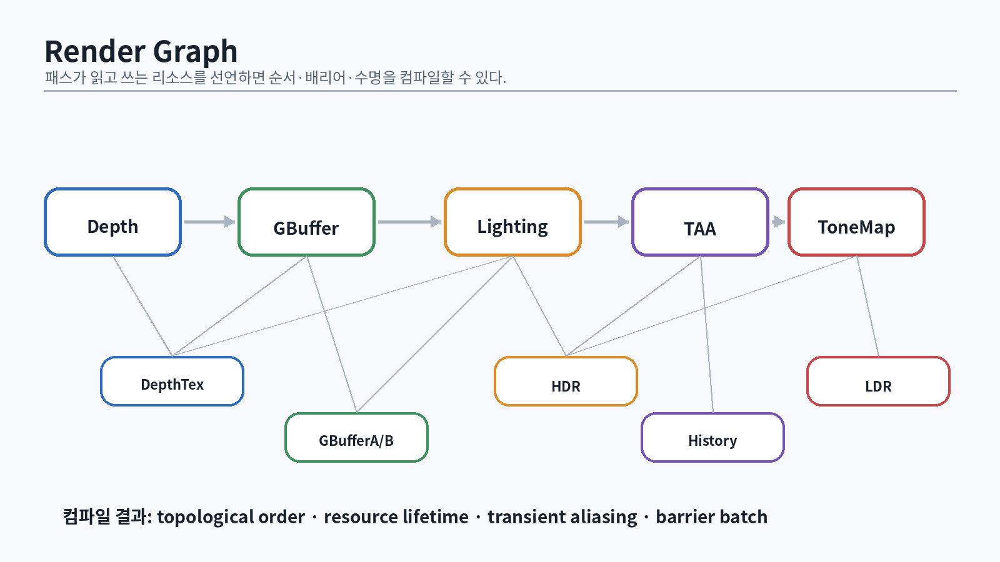

# 31. 엔진 계층과 의존 방향

{#fig-engine-architecture width=96%}

게임 엔진은 클래스가 많은 프로그램이 아니라 **수명과 데이터 흐름을 통제하는 시스템**이다. renderer가 gameplay object를 직접 순회하고, gameplay가 D3D12 descriptor를 보며, asset loader가 command list를 즉시 제출하기 시작하면 기능 추가마다 결합도가 폭발한다.

권장 계층은 다음과 같다.

```text
Game / Tools
    ↓
World / ECS / Animation
    ↓ render extraction
Renderer / Frame Graph / RHI
    ↓
D3D12 backend
    ↓
Win32 / DXGI
```

핵심은 world 상태와 render 상태를 분리하는 **render extraction**이다. gameplay thread가 mutable object graph를 수정하는 동안 render thread가 같은 객체를 raw pointer로 읽지 않는다.

```cpp
struct RenderInstance {
    Matrix4x4 world;
    Matrix4x4 previousWorld;
    MeshHandle mesh;
    MaterialHandle material;
    BoundingSphere bounds;
    std::uint32_t objectId;
};

struct RenderWorldSnapshot {
    std::span<const RenderInstance> instances;
    std::span<const LightGpu> lights;
    CameraGpu camera;
};
```

snapshot은 frame allocator에서 만들고 프레임 종료 후 폐기할 수 있다. 더 큰 엔진은 double buffering이나 persistent GPU scene을 사용한다.

## 31.1 RHI의 적정 크기

D3D12 wrapper를 만들 때 모든 API를 가리는 거대한 추상화는 피한다. 목표는 플랫폼 독립이라는 명분으로 GPU 개념을 삭제하는 것이 아니라, 엔진 정책을 명시하는 것이다.

좋은 추상화 예:

- `GpuBuffer`, `GpuTexture`, `GpuPipeline`
- `CommandContext`
- `DescriptorIndex`
- `RenderPassBuilder`
- `UploadBatch`
- `GpuFencePoint`

나쁜 추상화 예:

- 내부 상태를 알 수 없는 `Renderer::DrawEverything()`
- resource state를 숨기지만 hazard를 해결하지 않는 wrapper
- 매 호출마다 heap allocation하는 virtual interface
- D3D11 immediate-context 사고를 D3D12 위에 재현한 API

# 32. Frame context와 transient 수명

한 프레임에 필요한 임시 자원을 `FrameContext`에 모은다.

```cpp
struct FrameContext {
    ComPtr<ID3D12CommandAllocator> graphicsAllocator;
    ComPtr<ID3D12CommandAllocator> computeAllocator;
    LinearArena cpuArena;
    UploadRing upload;
    DescriptorRing descriptors;
    std::vector<RetiredObject> retired;
    std::uint64_t graphicsFence{};
    std::uint64_t computeFence{};
};
```

frame context를 재사용하기 전에 두 queue의 필요한 fence가 완료됐는지 확인한다. `retired`에는 이번 프레임에 교체했지만 GPU가 아직 읽을 수 있는 PSO, resource, descriptor를 넣는다.

## 32.1 Deferred destruction

```cpp
struct RetiredObject {
    std::uint64_t fence;
    ComPtr<IUnknown> object;
};

void CollectRetired(std::uint64_t completed,
                    std::vector<RetiredObject>& list)
{
    std::erase_if(list, [completed](const RetiredObject& x) {
        return x.fence <= completed;
    });
}
```

여러 queue가 같은 resource를 참조한다면 단일 fence value로 충분하지 않다. queue별 마지막 사용 지점이나 통합 timeline abstraction을 둔다.

## 32.2 프레임 메모리

per-frame 임시 vector가 매번 heap allocation하지 않게 `std::pmr::monotonic_buffer_resource` 또는 자체 linear arena를 사용할 수 있다.

```cpp
std::pmr::monotonic_buffer_resource frameMemory(
    backing.data(), backing.size());
std::pmr::vector<RenderItem> items{&frameMemory};
```

linear allocator는 해제 비용이 거의 없지만 individual free가 없다. 수명이 프레임을 넘는 객체를 넣으면 안 된다.

# 33. Render Graph

{#fig-render-graph width=96%}

Render graph는 pass와 resource dependency를 선언적으로 표현한다. Frostbite의 FrameGraph 발표는 pass/resource graph와 transient allocation을 이용해 복잡한 rendering feature를 모듈화하는 생산 사례를 보여준다 [@odonnell2017].

## 33.1 최소 API

```cpp
struct TextureHandle { std::uint32_t id; };
struct BufferHandle  { std::uint32_t id; };

class RenderGraphBuilder {
public:
    TextureHandle CreateTexture(const TextureDesc&, std::string_view name);
    TextureHandle Read(TextureHandle, AccessIntent);
    TextureHandle Write(TextureHandle, AccessIntent);
    void SetRenderTarget(TextureHandle);
    void SetDepth(TextureHandle, bool readOnly = false);
};

using ExecuteFn = std::function<void(RenderGraphContext&)>;

template<class SetupFn>
void AddPass(std::string_view name, SetupFn&& setup, ExecuteFn execute);
```

Pass 작성자는 “어떤 D3D12 state로 바꿀지”보다 읽기/쓰기 의도를 선언한다.

```cpp
graph.AddPass("Lighting",
    [&](RenderGraphBuilder& b) {
        data.depth   = b.Read(depth, AccessIntent::ShaderRead);
        data.gbuffer = b.Read(gbuffer, AccessIntent::ShaderRead);
        data.hdr     = b.Write(hdr, AccessIntent::RenderTargetWrite);
    },
    [=](RenderGraphContext& ctx) {
        DrawLighting(ctx, data);
    });
```

## 33.2 Compile 단계

Render graph compile은 다음을 수행한다.

1. pass/resource dependency edge 생성
2. 사용되지 않는 pass culling
3. topological sort
4. resource first/last use 계산
5. transient resource allocation과 aliasing
6. barrier와 queue synchronization 생성
7. debug visualization 생성

### Dependency 생성 예

resource의 마지막 writer와 현재 reader/writer를 연결한다.

```cpp
for (const Use& use : pass.uses) {
    auto& state = resourceState[use.resource];
    if (use.isRead && state.lastWriter) {
        AddEdge(*state.lastWriter, passId);
    }
    if (use.isWrite) {
        if (state.lastWriter) AddEdge(*state.lastWriter, passId);
        for (PassId reader : state.readers) AddEdge(reader, passId);
        state.readers.clear();
        state.lastWriter = passId;
    } else {
        state.readers.push_back(passId);
    }
}
```

cycle이 생기면 compile error로 pass 이름과 edge를 출력한다.

## 33.3 Transient aliasing

수명 구간이 겹치지 않는 texture A와 B는 같은 heap 영역을 쓸 수 있다.

```text
time →
A: [create ===== last use]
B:                         [create ===== last use]
```

format, alignment, heap flag compatibility를 확인하고 aliasing barrier를 넣는다. 메모리 절약과 barrier/complexity 증가 사이의 균형을 측정한다.

## 33.4 Pass merging과 async compute

Render graph가 있다고 자동으로 최적화되는 것은 아니다. pass merge, split barrier, async compute scheduling은 GPU와 workload에 따라 다르다. dependency가 적어 보여도 bandwidth contention 때문에 병렬 실행이 느릴 수 있다.

::: {.exercise}
1. 5개 pass와 6개 resource를 가진 graph를 DOT 파일로 출력한다.
2. dead pass culling을 구현한다.
3. resource lifetime을 interval chart로 출력한다.
4. transient aliasing 전후 peak heap 크기를 비교한다.
5. 의도적으로 cycle을 만들고 진단 메시지를 개선한다.
:::

# 34. 멀티스레드 command recording

D3D12는 여러 스레드에서 command list를 기록할 수 있다. 그러나 thread 수를 늘린다고 항상 CPU frame time이 줄지는 않는다. Amdahl의 법칙처럼 직렬 구간과 scheduling overhead가 전체 speedup을 제한한다 [@amdahl1967].

## 34.1 작업 분해

잘못된 분해:

```text
오브젝트 1개 = job 1개 = command list 1개
```

작업이 너무 작으면 allocator/list reset, scheduling, merge 비용이 더 크다. 보통 pass나 draw batch 단위로 묶는다.

```cpp
struct DrawChunk {
    std::uint32_t first;
    std::uint32_t count;
};

for (DrawChunk chunk : Partition(items.size(), workerCount, 256)) {
    jobs.Enqueue([&, chunk] {
        auto context = commandPool.Acquire();
        RecordOpaqueChunk(*context, items.subspan(chunk.first, chunk.count));
        completed.Push(std::move(context));
    });
}
```

## 34.2 Job system

간단한 thread pool부터 시작하되 다음 요구를 분리한다.

- fire-and-forget job
- counter/fence 기반 continuation
- parallel for
- worker-local scratch allocator
- shutdown과 exception policy
- thread affinity가 필요한 platform task

대규모 엔진은 fiber를 이용해 worker thread가 blocking wait 대신 다른 task를 실행하게 할 수 있다. Naughty Dog의 발표는 fiber 기반 scheduling의 실제 사례를 다룬다 [@naughty-dog-fibers2015]. 초기 미니 엔진에서 fiber부터 구현할 필요는 없다.

## 34.3 Descriptor와 allocator thread safety

각 worker가 독립 command allocator와 command list를 사용한다. shared descriptor allocator는 lock contention을 피하기 위해 thread-local block을 미리 할당할 수 있다.

# 35. 가시성, culling, draw sorting

CPU는 보이지 않는 객체를 GPU에 제출하지 않는 것이 좋지만, CPU culling 자체도 비용이다.

## 35.1 Frustum culling

sphere-frustum test는 빠르고 보수적이다.

```cpp
bool Visible(const BoundingSphere& s, std::span<const Plane, 6> planes)
{
    for (const Plane& p : planes) {
        if (Dot(p.normal, s.center) + p.d < -s.radius) {
            return false;
        }
    }
    return true;
}
```

AABB는 더 타이트하지만 transform과 test 비용이 커질 수 있다. hierarchical culling을 위해 BVH, loose octree, spatial grid를 고려한다.

## 35.2 Occlusion culling

지난 프레임 depth로 hierarchical Z buffer를 만들고 bounding box를 test할 수 있다. temporal coherence를 이용하지만 카메라가 빠르게 이동할 때 false occlusion을 피하도록 보수적으로 한다.

## 35.3 Sorting

Opaque draw는 상태 변경을 줄이고 front-to-back으로 early-Z를 활용한다. transparent는 대체로 back-to-front가 필요하다.

```cpp
std::uint64_t MakeOpaqueSortKey(const RenderItem& item)
{
    return (std::uint64_t(item.pipelineId) << 40) |
           (std::uint64_t(item.materialId) << 16) |
           std::uint64_t(item.depthBucket);
}
```

sort key는 workload에 맞게 설계한다. pipeline change가 비싼지, material descriptor가 비싼지, depth가 더 중요한지 PIX로 확인한다.

# 36. GPU scene과 GPU-driven rendering

{#fig-gpu-driven width=96%}

GPU scene은 object transform, bounds, material, mesh metadata를 GPU buffer에 유지한다. CPU는 변경분만 upload하고, compute shader가 가시성·LOD·draw argument를 생성한다.

## 36.1 데이터 구조

```hlsl
struct InstanceGpu {
    float3x4 world;
    float3x4 previousWorld;
    float4 boundsSphere;
    uint meshIndex;
    uint materialIndex;
    uint flags;
    uint pad;
};

StructuredBuffer<InstanceGpu> gInstances;
RWStructuredBuffer<uint> gVisibleInstanceIndices;
RWByteAddressBuffer gIndirectArgs;
```

## 36.2 Culling compute

```hlsl
[numthreads(64, 1, 1)]
void CullCS(uint3 dispatchId : SV_DispatchThreadID)
{
    uint id = dispatchId.x;
    if (id >= gInstanceCount) return;

    InstanceGpu inst = gInstances[id];
    if (!SphereInFrustum(inst.boundsSphere)) return;

    uint dst;
    InterlockedAdd(gVisibleCount[0], 1, dst);
    gVisibleInstanceIndices[dst] = id;
}
```

그 다음 visible list를 material/mesh로 binning하거나 indirect argument를 생성한다. atomic contention, prefix sum, buffer overflow를 고려한다.

## 36.3 ExecuteIndirect

`ExecuteIndirect`는 GPU가 만든 argument buffer로 draw/dispatch를 실행한다. command signature와 argument layout이 정확히 일치해야 한다. count buffer를 사용하면 visible draw 수만 실행할 수 있다.

## 36.4 Meshlet과 mesh shader

Mesh shader는 vertex/geometry shader 경로를 대체하는 더 유연한 pipeline을 제공한다 [@microsoft-mesh-shader]. mesh를 작은 meshlet으로 나누고 task/amplification 단계에서 culling한 뒤 mesh shader가 primitive를 출력한다.

Meshlet 생성 기준:

- 최대 vertex/triangle 수
- vertex reuse
- bounding sphere/cone
- material split
- LOD hierarchy

mesh shader가 모든 하드웨어에서 지원되는 것은 아니므로 classic indexed draw fallback을 유지한다.

# 37. 메모리 allocator와 budget

엔진 allocator는 CPU와 GPU를 분리한다.

## 37.1 CPU allocator

- linear arena: frame/temp
- pool/slab: 같은 크기 객체
- buddy: 큰 block 분할
- TLSF: bounded allocation time이 필요한 실시간 시스템 [@masmano2004]

Buddy allocator의 고전적 아이디어는 block을 2의 거듭제곱으로 분할하고 buddy를 merge하는 것이다 [@knowlt1965].

## 37.2 GPU allocator

- persistent heap: 장기 resource
- upload/readback ring
- transient render graph heap
- descriptor allocator
- residency/budget manager

AMD의 D3D12 Memory Allocator는 committed/placed resource와 pool, statistics를 제공하는 실용적 참고 구현이다 [@amd-d3d12ma]. 직접 구현하더라도 해당 라이브러리의 통계와 정책을 비교한다.

## 37.3 Memory budget

`IDXGIAdapter3::QueryVideoMemoryInfo`로 budget과 current usage를 확인한다. budget에 닿은 뒤 대응하는 것이 아니라 경고 임계값을 둔다.

```cpp
DXGI_QUERY_VIDEO_MEMORY_INFO info{};
ThrowIfFailed(adapter->QueryVideoMemoryInfo(
    0, DXGI_MEMORY_SEGMENT_GROUP_LOCAL, &info));

const double pressure = static_cast<double>(info.CurrentUsage) /
                        static_cast<double>(info.Budget);
```

streaming mip, shadow resolution, cache eviction 정책과 연결한다.

# 38. 렌더러 아키텍처 통과 시험

다음 설명과 구현이 가능해야 한다.

1. world snapshot이 필요한 이유
2. frame context와 GPU fence 수명
3. render graph dependency와 topological sort
4. resource aliasing 조건
5. CPU culling과 GPU culling의 비용 비교
6. multithreaded recording의 granularity
7. ExecuteIndirect 데이터 흐름
8. persistent/transient GPU memory 분리

::: {.check}
**통과 산출물**: render graph로 depth → opaque → lighting → tone map pass를 구성하고, graph visualization과 peak transient memory를 출력한다. 10,000 instance 장면에서 single-thread와 multithread command recording, CPU culling과 GPU culling을 각각 측정한다.
:::
