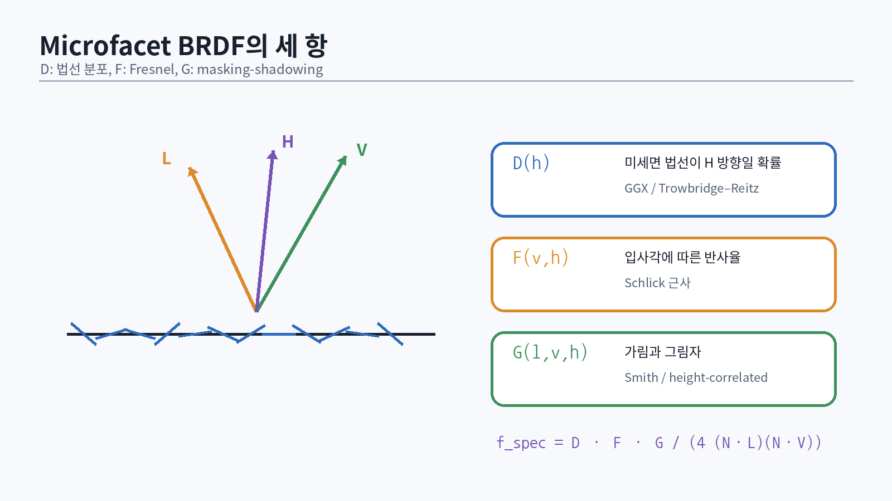

# 39. 조명 모델의 계보: Lambert에서 microfacet까지

실시간 렌더러의 셰이딩은 “빛을 예쁘게 보이게 하는 공식”이 아니라, 표면과 빛의 상호작용을 제한된 시간 안에 근사하는 모델이다. Phong과 Blinn–Phong은 직관적이고 저렴하지만 에너지 보존, 거칠기, 금속의 파장 의존 반사 같은 물리적 성질을 직접 표현하지 못한다 [@phong1975; @blinn1977]. Cook–Torrance microfacet 모델은 거친 표면을 미세한 거울 면의 통계로 보고, 현대 게임의 물리 기반 셰이딩(PBR)에 연결되는 구조를 제시했다 [@cook1981].

## 39.1 diffuse의 첫 근사

Lambert diffuse는 입사광과 표면 법선의 cosine만 사용한다.

$$
L_o = \frac{\rho}{\pi} L_i \max(0, \mathbf{n}\cdot\mathbf{l})
$$

`ρ/π`의 `π`는 반구 전체로 적분했을 때 diffuse 반사 에너지가 `ρ`가 되도록 정규화한다. 교육용 코드에서 `1/π`를 생략해도 화면은 나오지만, light intensity와 material parameter의 의미가 무너진다.

```hlsl
static const float InvPi = 0.31830988618f;

float3 EvaluateLambert(float3 baseColor,
                       float3 N,
                       float3 L,
                       float3 radiance)
{
    float NoL = saturate(dot(N, L));
    return baseColor * InvPi * radiance * NoL;
}
```

## 39.2 specular highlight가 뜻하는 것

Phong 계열은 반사 벡터 또는 half vector와 view 방향의 정렬을 지수승으로 강화한다.

```hlsl
float3 H = normalize(L + V);
float spec = pow(saturate(dot(N, H)), shininess);
```

이 식은 빠르고 학습에 유용하지만 `shininess`가 실제 표면 거칠기와 선형적으로 대응하지 않는다. 또한 diffuse와 specular를 별도로 더하면 총 반사 에너지가 입사 에너지를 초과할 수 있다.

## 39.3 물리 기반이라는 말의 최소 조건

게임에서 “PBR”은 완전한 물리 시뮬레이션이 아니다. 일반적으로 다음 규율을 뜻한다.

- 재료 파라미터가 조명 조건과 독립적이다.
- BRDF가 reciprocity와 에너지 보존을 대체로 만족한다.
- specular는 Fresnel에 따라 view angle에 의존한다.
- roughness는 highlight의 폭과 에너지 분포를 제어한다.
- HDR light, exposure, tone mapping과 함께 사용한다.
- 제작 파이프라인에서 base color, metallic, roughness의 범위를 검증한다.

Disney의 principled BRDF는 아티스트가 이해하기 쉬운 적은 수의 파라미터로 다양한 재질을 표현하는 방향을 정리했고 [@burley2012], Unreal Engine 4의 shading model은 이를 실시간 엔진 제약에 맞춰 metallic/roughness workflow와 split-sum IBL로 구현했다 [@karis2013]. Frostbite의 강의 노트는 조명 단위, 카메라 exposure, 재료 제작을 하나의 일관된 파이프라인으로 다루는 실무적 관점을 제공한다 [@lagarde2014].

::: {.exercise}
**비교 실험**

같은 구와 같은 HDR light에서 Lambert+Blinn–Phong과 GGX BRDF를 번갈아 렌더링한다. roughness를 0.05, 0.25, 0.5, 0.9로 바꾸고 다음을 기록한다.

1. highlight 폭
2. grazing angle에서의 반사
3. 밝기 보존 여부
4. tone mapping 전 HDR 최대값
:::

# 40. Rendering equation과 BRDF

Kajiya의 rendering equation은 한 점에서 나가는 radiance를 emission과 다른 방향에서 들어와 반사되는 radiance의 적분으로 표현한다 [@kajiya1986].

$$
L_o(x,\omega_o)=L_e(x,\omega_o)+
\int_{\Omega^+} f_r(x,\omega_i,\omega_o)
L_i(x,\omega_i)(\mathbf{n}\cdot\omega_i)d\omega_i
$$

각 항의 의미는 다음과 같다.

- `L_o`: 카메라 방향으로 나가는 radiance
- `L_e`: 표면 자체 emission
- `f_r`: BRDF, 입사 방향의 빛이 출력 방향으로 얼마나 분배되는가
- `L_i`: 주변 장면에서 입사하는 radiance
- `n·ω_i`: projected area
- `Ω+`: 표면 위쪽 반구

실시간 direct lighting은 적분을 light sample의 합으로 바꾼다.

```hlsl
float3 Lo = 0.0f;
for (uint i = 0; i < lightCount; ++i) {
    LightSample s = SampleLight(lights[i], worldPos);
    float visibility = EvaluateShadow(s, worldPos);
    Lo += EvaluateBRDF(material, N, V, s.L)
        * s.radiance
        * saturate(dot(N, s.L))
        * visibility;
}
```

## 40.1 BRDF의 두 제약

Reciprocity:

$$f_r(\omega_i,\omega_o)=f_r(\omega_o,\omega_i)$$

Energy conservation:

$$\int_{\Omega^+}f_r(\omega_i,\omega_o)(\mathbf{n}\cdot\omega_o)d\omega_o\le1$$

실시간 근사식이 항상 완벽하게 만족하는 것은 아니지만, 파라미터 범위와 normalization을 통해 크게 위반하지 않도록 한다.

## 40.2 radiance와 irradiance를 혼동하지 않기

- **Radiance**: 방향을 가진 빛의 밀도. 렌더러의 주요 운반량이다.
- **Irradiance**: 한 점에 반구 전체에서 들어오는 radiance를 cosine 가중 적분한 값이다.
- **Luminous intensity/luminance**: 인간 시각의 파장 감도를 반영한 photometric 양이다.

엔진에서 `float3 color * intensity`를 무차원 값으로만 취급하면 아티스트가 장면마다 숫자를 다시 맞춰야 한다. 최소한 directional/point/spot light의 intensity 단위를 문서화하고 exposure와 함께 검증한다 [@lagarde2014].

## 40.3 Monte Carlo estimator로 보는 IBL과 ray tracing

적분을 확률 밀도 함수 `p(ω)`로 sampling하면:

$$
\int f(\omega)d\omega \approx \frac{1}{N}
\sum_{k=1}^{N}\frac{f(\omega_k)}{p(\omega_k)}
$$

importance sampling은 BRDF 값이 큰 방향을 더 자주 뽑아 variance를 줄인다. 이 관점은 environment map prefilter, path tracing, DXR reflection, ReSTIR를 연결한다.

```hlsl
float3 EstimateSpecularIBL(uint sampleCount)
{
    float3 sum = 0;
    for (uint i = 0; i < sampleCount; ++i) {
        float2 Xi = Hammersley(i, sampleCount);
        SampleDirection s = SampleGGXVNDF(Xi, N, V, roughness);
        if (s.NoL > 0.0f) {
            float3 Li = Environment.SampleLevel(LinearSampler, s.L, 0).rgb;
            sum += Li * EvaluateSpecular(N, V, s.L) * s.NoL / s.pdf;
        }
    }
    return sum / sampleCount;
}
```

실시간 엔진은 이 계산을 매 픽셀 반복하지 않고 prefilter와 lookup table로 옮긴다.

# 41. Microfacet BRDF: D, F, G

{#fig-microfacet width=96%}

일반적인 microfacet specular BRDF는 다음 형태다.

$$
f_s=\frac{D(\mathbf{h})F(\mathbf{v},\mathbf{h})G(\mathbf{l},\mathbf{v},\mathbf{h})}
{4(\mathbf{n}\cdot\mathbf{l})(\mathbf{n}\cdot\mathbf{v})}
$$

- `D`: microfacet normal distribution
- `F`: Fresnel reflectance
- `G`: masking-shadowing geometry term
- `h`: half vector `normalize(l+v)`

## 41.1 GGX/Trowbridge–Reitz distribution

GGX는 긴 highlight tail이 있어 많은 재질에서 자연스럽고, 현대 게임 엔진에서 널리 사용된다 [@walter2007].

$$
D_{GGX}=\frac{\alpha^2}
{\pi((n\cdot h)^2(\alpha^2-1)+1)^2}
$$

```hlsl
float D_GGX(float NoH, float alpha)
{
    float a2 = alpha * alpha;
    float d = NoH * NoH * (a2 - 1.0f) + 1.0f;
    return a2 / max(PI * d * d, 1e-7f);
}
```

UI roughness를 그대로 `α`로 쓸지 `α=roughness²`로 remap할지는 엔진 표준이다. perceptual roughness의 중간값이 시각적으로 더 균등하게 보이도록 보통 제곱한다.

## 41.2 Fresnel-Schlick

정확한 dielectric Fresnel은 굴절률로 계산할 수 있지만 Schlick 근사가 저렴하고 충분히 정확하다 [@schlick1994].

$$
F=F_0+(1-F_0)(1-v\cdot h)^5
$$

```hlsl
float3 F_Schlick(float VoH, float3 F0)
{
    float f = Pow5(1.0f - VoH);
    return F0 + (1.0f - F0) * f;
}
```

- 일반 dielectric의 `F0`는 대략 0.02–0.08 범위다.
- 금속은 RGB `F0`가 base color에서 온다.
- grazing angle에서는 거의 1로 간다.

## 41.3 Smith masking-shadowing

미세면이 서로 가리는 효과를 `G`가 표현한다. 실시간에서는 correlated Smith GGX 형태를 많이 쓴다.

```hlsl
float V_SmithGGXCorrelated(float NoV, float NoL, float alpha)
{
    float a2 = alpha * alpha;
    float gv = NoL * sqrt(max(NoV * NoV * (1.0f - a2) + a2, 1e-7f));
    float gl = NoV * sqrt(max(NoL * NoL * (1.0f - a2) + a2, 1e-7f));
    return 0.5f / max(gv + gl, 1e-7f);
}
```

위 함수는 `G/(4 NoL NoV)`를 함께 반환하는 visibility 형태다. 함수 이름과 반환 정의를 명확히 하지 않으면 분모를 두 번 적용하는 버그가 생긴다.

## 41.4 하나로 조립하기

```hlsl
struct MaterialSample {
    float3 baseColor;
    float metallic;
    float perceptualRoughness;
    float3 normal;
};

float3 EvaluatePBR(MaterialSample m, float3 V, float3 L)
{
    float3 N = m.normal;
    float3 H = normalize(V + L);

    float NoV = saturate(dot(N, V));
    float NoL = saturate(dot(N, L));
    float NoH = saturate(dot(N, H));
    float VoH = saturate(dot(V, H));

    float alpha = max(m.perceptualRoughness * m.perceptualRoughness, 0.0025f);
    float3 dielectricF0 = 0.04f.xxx;
    float3 F0 = lerp(dielectricF0, m.baseColor, m.metallic);

    float D = D_GGX(NoH, alpha);
    float3 F = F_Schlick(VoH, F0);
    float Vis = V_SmithGGXCorrelated(NoV, NoL, alpha);

    float3 specular = D * Vis * F;
    float3 diffuseColor = m.baseColor * (1.0f - m.metallic);
    float3 diffuse = diffuseColor * INV_PI * (1.0f - F);
    return diffuse + specular;
}
```

`(1-F)`로 diffuse를 줄이는 것은 specular로 반사된 에너지를 중복 계산하지 않기 위한 근사다. multi-scattering microfacet compensation을 쓰지 않으면 거친 재질이 지나치게 어두워질 수 있다. 처음에는 위 기준 구현을 유지하고 이후 white furnace test로 개선한다.

## 41.5 White furnace test

모든 방향에서 radiance 1이 들어오는 흰 환경에 재질 구를 놓는다. 에너지를 생성하지 않는 BRDF라면 출력이 1을 크게 넘지 않아야 한다. 거칠기별로 지나치게 어두워지면 single-scattering 손실 또는 IBL 근사를 의심한다.

::: {.warning}
PBR 구현에서 “화면이 그럴듯하다”는 테스트가 아니다. NaN/Inf, roughness 0과 1, `NoV≈0`, 검은 환경, 흰 furnace, 금속/비금속 경계를 자동화된 scene으로 검증한다.
:::

# 42. Metallic/Roughness 재료 모델

## 42.1 파라미터 의미

| 입력 | 의미 | 권장 범위/주의 |
|---|---|---|
| Base Color | dielectric diffuse 또는 metal F0 | linear 공간에서 사용 |
| Metallic | 0 dielectric, 1 conductor | 혼합 픽셀 외에는 0/1에 가깝게 |
| Roughness | 미세면 분포의 거칠기 | 0을 그대로 허용하지 않음 |
| Normal | tangent-space normal | 압축 후 renormalize |
| AO | 간접 diffuse/다중 반사 차폐 근사 | direct light에 곱하지 않음 |
| Emissive | 자체 발광 radiance 성분 | exposure 전 HDR 값 |

Metallic workflow는 복잡한 굴절률 `η`, 흡수계수 `κ`를 직접 노출하지 않고 재질을 두 부류로 단순화한다. 금속에는 diffuse가 거의 없고, specular tint가 base color를 따른다. dielectric은 base color가 diffuse이고 specular `F0`는 낮다.

## 42.2 텍스처 packing

실무에서는 bandwidth와 descriptor 수를 줄이기 위해 채널을 묶는다.

```text
R: ambient occlusion
G: perceptual roughness
B: metallic
A: optional mask
```

그러나 packing은 데이터 의미와 compression artifact를 고려해야 한다. 서로 상관없는 채널을 BC1에 넣으면 cross-channel artifact가 생길 수 있다. BC5는 normal XY, BC7은 고품질 색/마스크, BC4는 단일 채널에 적합하다.

## 42.3 sRGB 규칙

- base color와 emissive 색 텍스처는 대개 sRGB decode가 필요하다.
- normal, roughness, metallic, AO는 linear 데이터다.
- back buffer가 sRGB인지 HDR format인지에 따라 마지막 encode 경로가 달라진다.

같은 texture file extension이라도 의미에 따라 view format을 다르게 만들 수 있다. asset metadata가 색공간을 소유해야 한다.

```cpp
DXGI_FORMAT ResolveSrvFormat(TextureSemantic semantic,
                             DXGI_FORMAT storage)
{
    if (semantic == TextureSemantic::BaseColor &&
        storage == DXGI_FORMAT_R8G8B8A8_TYPELESS) {
        return DXGI_FORMAT_R8G8B8A8_UNORM_SRGB;
    }
    return DXGI_FORMAT_R8G8B8A8_UNORM;
}
```

## 42.4 Material GPU layout

```cpp
struct alignas(16) MaterialGpu {
    Float4 baseColorFactor;
    Float3 emissiveFactor;
    float normalScale;
    float metallicFactor;
    float roughnessFactor;
    float alphaCutoff;
    std::uint32_t flags;
    std::uint32_t baseColorTexture;
    std::uint32_t normalTexture;
    std::uint32_t ormTexture;
    std::uint32_t emissiveTexture;
};
static_assert(sizeof(MaterialGpu) % 16 == 0);
```

bindless descriptor index를 material에 저장하면 draw별 descriptor table 변경을 줄일 수 있다. index validation과 fallback texture를 반드시 둔다.

# 43. Normal mapping과 tangent basis

## 43.1 TBN basis

Tangent-space normal map의 `(0.5,0.5,1)`은 decode 후 `(0,0,1)`이며 표면의 geometric normal과 일치한다. tangent `T`, bitangent `B`, normal `N`으로 만든 basis가 world 방향으로 변환한다.

```hlsl
float3 DecodeNormal(float3 encoded)
{
    return normalize(encoded * 2.0f - 1.0f);
}

float3 TransformTangentNormal(float3 nTS,
                              float3 N,
                              float4 tangent)
{
    float3 T = normalize(tangent.xyz);
    float3 B = normalize(cross(N, T)) * tangent.w;
    return normalize(nTS.x * T + nTS.y * B + nTS.z * N);
}
```

MikkTSpace와 같은 일관된 tangent 생성 규칙을 importer와 baker가 공유해야 seam과 mirrored UV 문제가 줄어든다 [@mikkelsen2008].

## 43.2 비균일 scale과 normal matrix

position은 model matrix로 변환하지만 normal은 inverse transpose를 사용한다.

$$
N' = (M^{-1})^T N
$$

비균일 scale이 없고 orthonormal basis를 보장한다면 상단 3×3만 써도 되지만, 엔진 API가 그 전제를 명시해야 한다.

## 43.3 Normal map filtering

mipmapping으로 여러 normal이 평균되면 vector 길이가 줄고, 그 안에는 표면 분산 정보가 숨어 있다. 단순 renormalize는 specular aliasing을 유발할 수 있다. Toksvig filtering은 normal variance를 roughness에 반영하는 초기 접근 중 하나다 [@toksvig2005]. 현대 엔진은 normal variance, geometric roughness, texture LOD를 결합해 specular anti-aliasing을 수행한다.

```hlsl
float AdjustRoughnessFromNormalVariance(float roughness,
                                        float3 unnormalizedMeanNormal)
{
    float meanLength = saturate(length(unnormalizedMeanNormal));
    float variance = max(0.0f, 1.0f - meanLength);
    return saturate(sqrt(roughness * roughness + variance));
}
```

# 44. Image-Based Lighting

직접광만으로는 물체가 주변 환경을 반사하지 않아 고립되어 보인다. IBL은 environment map을 입사 radiance로 사용한다.

## 44.1 Diffuse irradiance

Lambert diffuse에서는 view 방향과 무관하므로 environment를 cosine convolution한 irradiance cubemap 또는 낮은 차수 spherical harmonics로 표현할 수 있다. 저주파 irradiance를 SH로 압축하는 이론은 Ramamoorthi와 Hanrahan의 분석에 기반한다 [@ramamoorthi2001]. PRT는 visibility와 lighting transport까지 basis에 투영하는 방향을 확장했다 [@sloan2002].

9개 SH coefficient를 사용하는 2차 근사:

```hlsl
float3 EvaluateSH9(float3 n, float3 sh[9])
{
    float x = n.x, y = n.y, z = n.z;
    return
        sh[0] * 0.282095f +
        sh[1] * (0.488603f * y) +
        sh[2] * (0.488603f * z) +
        sh[3] * (0.488603f * x) +
        sh[4] * (1.092548f * x * y) +
        sh[5] * (1.092548f * y * z) +
        sh[6] * (0.315392f * (3.0f * z * z - 1.0f)) +
        sh[7] * (1.092548f * x * z) +
        sh[8] * (0.546274f * (x * x - y * y));
}
```

## 44.2 Specular prefilter와 split-sum

Specular IBL 적분은 view와 roughness에 의존한다. UE4 계열 split-sum approximation은 다음 둘로 나눈다 [@karis2013].

1. roughness별로 GGX importance sampling한 prefiltered environment cubemap
2. `NoV`와 roughness에 따른 BRDF integration LUT

런타임:

```hlsl
float3 R = reflect(-V, N);
float mip = roughness * maxReflectionMip;
float3 prefiltered = PrefilteredEnv.SampleLevel(LinearClamp, R, mip).rgb;
float2 brdf = BrdfLut.Sample(LinearClamp, float2(NoV, roughness)).rg;
float3 specularIBL = prefiltered * (F0 * brdf.x + brdf.y);
```

이 근사는 environment와 BRDF 항을 완전히 분리할 수 없다는 한계가 있다. 특히 거친 표면, grazing angle, normal map에서 오차가 보인다. 먼저 표준 근사를 구현하고 reference path tracer와 비교한다.

## 44.3 Parallax-corrected reflection probe

단순 cubemap sample은 probe 중심에서만 기하학적으로 맞는다. 박스형 실내에서는 ray-box intersection으로 sample 방향을 보정한다.

```hlsl
float3 BoxProjectedDirection(float3 worldPos,
                             float3 R,
                             float3 probePos,
                             float3 boxMin,
                             float3 boxMax)
{
    float3 invR = rcp(R);
    float3 t0 = (boxMin - worldPos) * invR;
    float3 t1 = (boxMax - worldPos) * invR;
    float3 tMax = max(t0, t1);
    float t = min(tMax.x, min(tMax.y, tMax.z));
    float3 hit = worldPos + R * t;
    return hit - probePos;
}
```

probe blending, visibility leak, dynamic object 반영은 별도 문제다. 화면 공간 반사나 ray tracing을 추가해도 probe는 fallback으로 남는다.

# 45. Area light와 LTC

점광원은 면적이 0이므로 hard highlight와 hard shadow를 만든다. 실제 조명기구는 면적이 있고 roughness에 따라 highlight 모양이 달라진다. Linearly Transformed Cosines(LTC)는 microfacet BRDF lobe를 선형 변환된 cosine distribution으로 근사해 polygonal area light 적분을 실시간에 계산한다 [@heitz2016ltc].

LTC 구현 구성:

1. offline fit LUT 두 장 생성 또는 검증된 데이터 사용
2. roughness, `NoV`로 inverse matrix와 amplitude lookup
3. polygon vertex를 shading point 기준으로 변환
4. spherical polygon의 edge integral 계산
5. horizon clipping과 two-sided 처리

```hlsl
float3 EvaluateRectLTC(MaterialSample m,
                       float3 P, float3 N, float3 V,
                       RectLight light)
{
    float NoV = saturate(dot(N, V));
    float2 uv = float2(m.perceptualRoughness, sqrt(1.0f - NoV));
    float4 t = LtcMatrixLut.SampleLevel(LinearClamp, uv, 0);
    float2 amp = LtcAmplitudeLut.SampleLevel(LinearClamp, uv, 0).rg;
    float3x3 Minv = BuildLtcInverse(t);
    float integral = IntegrateClippedRect(P, N, V, light, Minv);
    return light.radiance * integral * amp.x;
}
```

초기 엔진에서는 LTC를 필수로 넣지 않아도 된다. 그러나 “BRDF 적분을 lookup과 좌표변환으로 바꾸는” 사고를 배우기에 좋은 고급 과제다.

# 46. 셰이딩 검증과 디버그 뷰

PBR 버그는 최종 이미지에서 원인을 찾기 어렵다. 다음 debug view를 키 하나로 전환할 수 있어야 한다.

- world normal / tangent / bitangent
- base color / metallic / roughness / AO
- linear depth / motion vector
- `NoL`, `NoV`, `NoH`, `VoH`
- diffuse only / specular only / direct only / indirect only
- light count / cluster index
- mip level / texture residency
- NaN/Inf/negative detector
- overdraw / quad occupancy

```hlsl
float4 DebugFinite(float3 value)
{
    bool invalid = any(isnan(value)) || any(isinf(value));
    bool negative = any(value < 0.0f);
    if (invalid) return float4(1, 0, 1, 1);
    if (negative) return float4(1, 1, 0, 1);
    return float4(value, 1);
}
```

## 46.1 Reference renderer

작은 CPU path tracer 또는 compute path tracer를 같은 material parameter로 구현하면 raster PBR을 비교할 수 있다. 목표는 production path tracer가 아니라 다음 검증이다.

- Lambert normalization
- Fresnel curve
- GGX importance sampling과 PDF
- environment prefilter bias
- white furnace energy

PBRT는 radiometry, BSDF, sampling, light transport를 구현 수준으로 연결하는 권위 있는 참고서다 [@pbrt4].

## 46.2 셰이더 unit test

GPU shader도 입력/출력을 작은 compute dispatch로 검증할 수 있다.

```hlsl
[numthreads(64, 1, 1)]
void TestBrdfCS(uint3 tid : SV_DispatchThreadID)
{
    BrdfCase c = Cases[tid.x];
    float3 result = EvaluatePBR(c.material, c.V, c.L);
    Results[tid.x] = result;
}
```

CPU가 결과를 readback하고 tolerance를 비교한다. golden image만으로는 특정 함수의 회귀 원인을 격리하기 어렵다.

# 47. PBR 파트 통과 시험

::: {.exercise}
**개념 시험**

1. radiance와 irradiance의 차이를 식과 단위 관점에서 설명한다.
2. microfacet BRDF의 `D`, `F`, `G`가 각각 어떤 현상을 모델링하는지 설명한다.
3. roughness를 제곱해 `α`로 사용하는 이유를 설명한다.
4. 금속 재질에서 diffuse가 거의 없는 이유를 설명한다.
5. normal map이 sRGB texture가 아닌 이유를 설명한다.
6. tangent basis의 handedness가 필요한 경우를 예로 든다.
7. split-sum IBL의 두 항과 근사 오차를 설명한다.
8. white furnace test가 무엇을 검증하는지 설명한다.
9. specular aliasing이 발생하는 원인 두 가지와 완화법을 제시한다.
10. LTC가 area light를 어떻게 저렴하게 만드는지 개념적으로 설명한다.
:::

::: {.exercise}
**구현 시험**

1. GGX `D`, Schlick `F`, correlated Smith `V`를 HLSL로 구현한다.
2. metallic/roughness material과 directional light를 렌더링한다.
3. tangent-space normal map과 비균일 scale을 올바르게 처리한다.
4. irradiance cubemap 또는 SH9 diffuse IBL을 추가한다.
5. prefiltered cubemap과 BRDF LUT를 생성한다.
6. roughness 5단계, metallic 2단계 material grid를 만든다.
7. PBR debug view 8개를 구현한다.
8. PIX에서 PBR pass의 texture bandwidth와 pixel shader cost를 기록한다.
:::

**통과 기준:** 식을 암기하는 데 그치지 않고, 각 항을 제거했을 때 이미지가 어떻게 변하는지 예측하고 debug capture로 확인할 수 있어야 한다.
