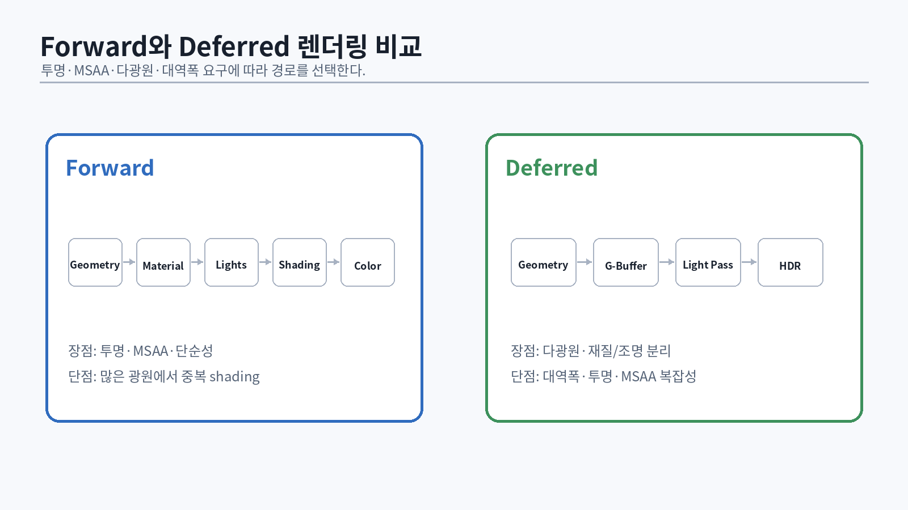
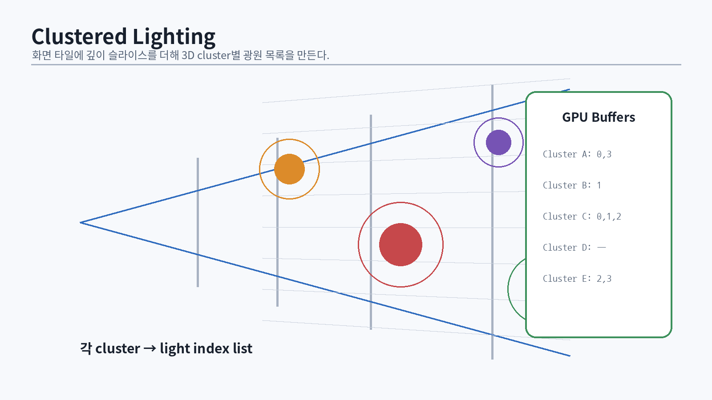
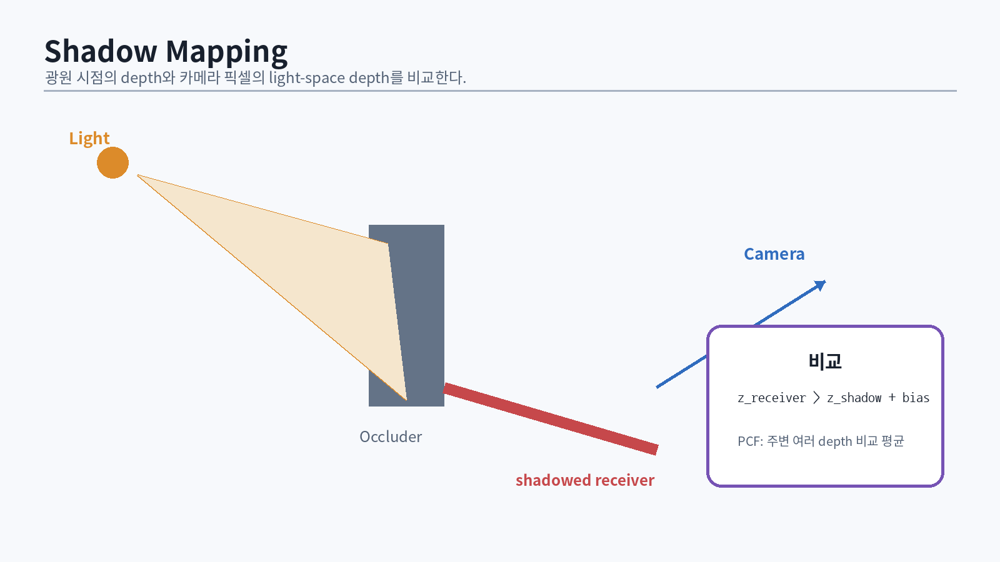

# 48. Forward, Deferred, Forward+

{#fig-forward-deferred width=96%}

조명 파이프라인의 선택은 “어느 방식이 더 최신인가”가 아니라 장면의 light 수, material 다양성, MSAA, transparency, bandwidth, 플랫폼에 대한 결정이다.

## 48.1 Forward rendering

Forward renderer는 geometry를 rasterize하면서 material과 lighting을 동시에 계산한다.

```text
geometry → vertex shader → pixel shader(material + lights) → HDR target
```

장점:

- 구조가 단순하고 transparency와 MSAA에 자연스럽다.
- G-buffer bandwidth가 없다.
- material shader의 자유도가 높다.

단점:

- 각 object/pixel이 많은 light를 반복 평가할 수 있다.
- light list를 만들지 않으면 복잡도가 커진다.

## 48.2 Deferred rendering

Deferred renderer는 먼저 G-buffer에 geometry/material 속성을 기록하고, 화면 공간 lighting pass에서 light를 계산한다.

```text
geometry → G-buffer
G-buffer + light volumes/tiles → HDR lighting
```

예시 G-buffer:

```text
RT0: baseColor.rgb + flags
RT1: octahedral normal.xy + roughness + metallic
RT2: emissive / baked lighting / material extras
Depth: reversed-Z depth
```

장점:

- visible pixel에만 lighting을 수행한다.
- 많은 local light를 다루기 쉽다.
- material과 lighting 디버그가 분리된다.

단점:

- 큰 G-buffer bandwidth와 memory가 필요하다.
- transparency는 별도 forward pass가 필요하다.
- MSAA와 다양한 material model이 복잡해진다.

## 48.3 Forward+

Forward+는 depth prepass 뒤 화면을 tile로 나누고 compute shader로 tile별 light list를 만든 다음, forward shading이 자신의 tile light만 평가한다 [@harada2012].

```text
depth prepass → tile light culling → forward material shading
```

이 방식은 forward의 material flexibility와 light culling을 결합한다. VR/MSAA, stylized material, transparency가 중요한 엔진에서 유리할 수 있다.

## 48.4 선택 기준

| 조건 | 우선 검토 |
|---|---|
| opaque 중심, 수백 local light | deferred/clustered deferred |
| MSAA와 transparency 비중 큼 | Forward+ |
| 모바일 tile-based GPU | bandwidth를 측정한 Forward/Deferred |
| 매우 다양한 shading model | Forward+ 또는 hybrid |
| path tracing과 raster 혼합 | 얇은 G-buffer + compute lighting |

아키텍처는 하나를 종교처럼 고르는 것이 아니라, common visibility/material data를 공유하는 hybrid로 진화한다.

# 49. Tiled와 Clustered light culling

{#fig-clustered width=96%}

2D tile은 화면 x/y만 나누므로 깊이 범위가 큰 tile에 불필요한 light가 많이 들어갈 수 있다. Clustered shading은 view frustum을 x/y/z cell로 나눠 light assignment 정확도를 높인다 [@olsson2012].

## 49.1 cluster index

화면 좌표와 view-space depth로 cluster를 계산한다.

```hlsl
uint3 ComputeClusterCoord(float2 pixel, float viewZ)
{
    uint x = min((uint)(pixel.x / TileSizeX), ClusterCountX - 1);
    uint y = min((uint)(pixel.y / TileSizeY), ClusterCountY - 1);

    float zNorm = log2(max(viewZ, NearZ) / NearZ) /
                  log2(FarZ / NearZ);
    uint z = min((uint)(zNorm * ClusterCountZ), ClusterCountZ - 1);
    return uint3(x, y, z);
}
```

logarithmic z slicing은 카메라 가까이에 더 촘촘한 slice를 배치한다.

## 49.2 light assignment 두 방식

### Cluster-centric

각 cluster thread가 모든 light와 교차 검사한다.

- 구현이 단순하다.
- `clusters × lights`가 커지면 비싸다.

### Light-centric

각 light의 screen/depth bounds를 계산하고 겹치는 cluster에 append한다.

- 큰 light에서 많은 atomic append가 발생한다.
- prefix sum으로 count와 offset을 분리하면 deterministic list를 만들 수 있다.

```hlsl
// Phase 1: count
InterlockedAdd(ClusterLightCount[cluster], 1);

// Prefix scan on counts -> offsets

// Phase 2: fill
uint local;
InterlockedAdd(ClusterWriteCursor[cluster], 1, local);
LightIndices[ClusterOffset[cluster] + local] = lightIndex;
```

## 49.3 bounds intersection

정확한 cone/frustum 교차는 비용이 높다. 초기 구현은 다음 순서가 좋다.

1. point light를 view-space sphere로 근사
2. spot light를 bounding sphere로 먼저 reject
3. 필요하면 cone-AABB 또는 cone-frustum 정밀 검사
4. directional light는 global list

과도한 false positive는 pixel shader 비용으로 나타난다. 정밀 검사 비용과 light list 길이를 PIX에서 비교한다.

## 49.4 overflow 정책

고정 길이 light list는 overflow 시 silently corrupt하면 안 된다.

```hlsl
if (localIndex < MaxLightsPerCluster) {
    ClusterLightIndices[offset + localIndex] = lightIndex;
} else {
    InterlockedAdd(DebugCounters[ClusterOverflow], 1);
}
```

개발 빌드는 overflow cluster를 빨간색으로 시각화한다. production에서는 larger global pool, capped contribution, fallback list 등 명시적 정책을 둔다.

# 50. Light 모델과 감쇠

## 50.1 Directional light

태양처럼 장면 크기에 비해 매우 먼 광원은 모든 점에서 같은 방향과 irradiance를 갖는다. 거리 감쇠는 없고 shadow cascade가 주요 비용이다.

## 50.2 Point light

물리적으로 isotropic point source의 irradiance는 inverse-square law를 따른다.

$$E = \frac{I}{r^2}$$

`r=0` singularity와 finite range를 처리한다.

```hlsl
float SmoothDistanceAttenuation(float distanceSq,
                                float invRadiusSq)
{
    float factor = saturate(1.0f - distanceSq * invRadiusSq);
    float smooth = factor * factor;
    return smooth / max(distanceSq, 1e-4f);
}
```

radius cutoff는 물리적으로 완전하지 않지만 culling과 제작 편의를 위해 필요하다. cutoff 부근이 보이지 않게 smooth window를 사용한다.

## 50.3 Spot light

```hlsl
float SpotAttenuation(float3 LfromLight,
                      float3 lightDir,
                      float cosInner,
                      float cosOuter)
{
    float cd = dot(normalize(LfromLight), lightDir);
    return saturate((cd - cosOuter) /
                    max(cosInner - cosOuter, 1e-4f));
}
```

IES profile을 추가하면 실제 조명기구의 angular distribution을 표현할 수 있다. IES texture의 coordinate convention과 photometric normalization을 명시한다.

## 50.4 Rect/line light

초기에는 representative point 또는 multi-sample approximation을 사용할 수 있고, 고급 구현은 LTC를 사용한다. shadow는 area light 크기에 맞춰 PCSS, ray tracing, 여러 shadow sample로 근사한다.

# 51. Shadow mapping의 원리

{#fig-shadow-mapping width=96%}

Shadow map은 light 관점에서 가장 가까운 depth를 저장하고, camera pass에서 현재 점의 light-space depth와 비교한다. Williams의 shadow map은 rasterization을 이용한 범용 visibility 근사다 [@williams1978].

## 51.1 두 pass

```text
1. light view/projection으로 depth render
2. camera shading에서 world position을 light clip으로 변환
3. shadow texture의 stored depth와 비교
```

```hlsl
float EvaluateHardShadow(float4 lightClip)
{
    float3 ndc = lightClip.xyz / lightClip.w;
    float2 uv = ndc.xy * float2(0.5f, -0.5f) + 0.5f;
    float receiverDepth = ndc.z;
    float stored = ShadowMap.SampleLevel(PointClamp, uv, 0).r;
    return receiverDepth <= stored ? 1.0f : 0.0f;
}
```

실제 comparison direction은 standard-Z/reversed-Z, light projection convention에 따라 달라진다. 함수 이름을 `IsLit`으로 두고 테스트 scene으로 검증한다.

## 51.2 Shadow acne와 peter-panning

동일한 표면을 light pass와 camera pass에서 다른 sampling/rasterization으로 평가하므로 self-shadow acne가 생긴다. bias를 크게 하면 물체가 지면에서 뜨는 peter-panning이 생긴다.

Bias 구성:

- constant depth bias
- slope-scaled bias
- normal offset
- receiver-plane depth bias

```hlsl
float3 biasedWorldPos = worldPos + geometricNormal * normalBias;
```

bias는 world unit, shadow texel size, cascade depth range와 연결해야 한다. 모든 장면에 하나의 magic number를 쓰지 않는다.

## 51.3 PCF

Percentage-Closer Filtering은 주변 depth comparison 결과를 평균해 edge를 부드럽게 한다 [@reeves1987]. depth 값을 먼저 bilinear filtering하는 것이 아니라 **비교 결과**를 filtering한다.

```hlsl
float ShadowPCF(float3 uvz, float2 texelSize)
{
    float sum = 0;
    [unroll]
    for (int y = -1; y <= 1; ++y) {
        [unroll]
        for (int x = -1; x <= 1; ++x) {
            sum += ShadowMap.SampleCmpLevelZero(
                ShadowCmp, uvz.xy + float2(x, y) * texelSize, uvz.z);
        }
    }
    return sum / 9.0f;
}
```

Poisson disk rotation, separable kernel, gather instruction 등을 사용해 품질/비용을 조정한다.

# 52. Cascaded Shadow Maps

Directional light에 하나의 shadow map을 쓰면 카메라 근처의 texel density가 부족하다. CSM은 view frustum을 깊이 구간으로 나누고 cascade별 light projection을 만든다.

## 52.1 Split 선택

Uniform split과 logarithmic split을 혼합한다.

$$
C_i = \lambda C_i^{log} + (1-\lambda)C_i^{uniform}
$$

```cpp
std::vector<float> ComputeCascadeSplits(float nearZ, float farZ,
                                        uint32_t count, float lambda)
{
    std::vector<float> result(count + 1);
    result[0] = nearZ;
    for (uint32_t i = 1; i < count; ++i) {
        float p = static_cast<float>(i) / count;
        float logSplit = nearZ * std::pow(farZ / nearZ, p);
        float uniformSplit = nearZ + (farZ - nearZ) * p;
        result[i] = std::lerp(uniformSplit, logSplit, lambda);
    }
    result[count] = farZ;
    return result;
}
```

## 52.2 Stabilization

카메라가 조금 움직일 때 shadow projection이 texel보다 작은 단위로 움직이면 shimmering이 발생한다. light-space projection center를 shadow texel grid에 snap한다.

```cpp
float texelWorldSize = cascadeExtent * 2.0f / shadowResolution;
centerLS.x = std::floor(centerLS.x / texelWorldSize) * texelWorldSize;
centerLS.y = std::floor(centerLS.y / texelWorldSize) * texelWorldSize;
```

fit-to-cascade와 fit-to-scene의 tradeoff, cascade blend 영역, caster bounds를 별도로 설계한다.

## 52.3 Cascade selection

- view depth로 cascade 선택
- cascade overlap에서 두 결과 blend
- derivative discontinuity와 branching 비용 측정

개발 뷰에서 cascade별 색을 표시한다.

# 53. Variance 계열과 soft shadow

Variance Shadow Maps(VSM)는 depth와 depth squared의 moment를 저장하고 Chebyshev inequality로 visibility를 상한 근사한다 [@donnelly2006]. texture filtering이 가능해 큰 blur에 유리하지만 light bleeding이 발생한다.

```hlsl
float ChebyshevUpperBound(float2 moments, float receiver)
{
    if (receiver <= moments.x) return 1.0f;
    float variance = max(moments.y - moments.x * moments.x, 1e-5f);
    float d = receiver - moments.x;
    return variance / (variance + d * d);
}
```

완화법:

- minimum variance
- light bleeding reduction remap
- EVSM의 exponential warp
- moment shadow maps

## 53.1 PCSS 개념

Percentage-Closer Soft Shadows는 blocker search로 평균 blocker depth를 찾고, penumbra 크기를 추정한 뒤 가변 반경 PCF를 수행한다.

```text
blocker search → penumbra estimate → variable-radius PCF
```

sample 수가 많고 temporal noise/shimmering이 생길 수 있다. area light shadow의 품질 목표가 높다면 ray tracing과 denoising을 검토한다.

# 54. Ambient Occlusion

AO는 반구 방향의 visibility가 얼마나 막혔는지 근사한다. 실제 indirect lighting을 대체하지 않으며 direct light 전체에 곱하면 물리적으로 틀리고 장면이 더러워진다.

## 54.1 SSAO의 한계

Screen-space AO는 depth/normal buffer만 보므로:

- 화면 밖 occluder를 모른다.
- 얇은 물체와 depth discontinuity에 halo가 생긴다.
- 반경이 world scale과 projection에 의존한다.
- temporal noise와 blur가 필요하다.

## 54.2 GTAO

Ground-Truth Ambient Occlusion은 horizon 기반의 더 정확한 screen-space approximation과 실시간 구현을 제시한다 [@jimenez2016gtao]. 구현 단계:

1. view-space position/normal 복원
2. 여러 screen-space 방향에서 horizon angle 탐색
3. analytical visibility integration
4. spatial denoise
5. temporal accumulation

```hlsl
float3 ReconstructViewPosition(float2 uv, float depth,
                               float4x4 invProjection)
{
    float4 clip = float4(uv * float2(2, -2) + float2(-1, 1), depth, 1);
    float4 view = mul(invProjection, clip);
    return view.xyz / view.w;
}
```

AO buffer는 half-resolution으로 계산할 수 있지만 depth-aware upsample을 사용한다. bent normal을 계산하면 diffuse IBL sample 방향을 개선할 수 있다.

# 55. Reflection 계층

현실적인 엔진은 한 종류의 reflection으로 모든 표면을 해결하지 않는다.

1. prefiltered sky/environment
2. local reflection probes
3. screen-space reflection(SSR)
4. planar reflection
5. DXR reflection

## 55.1 SSR

SSR은 view-space 또는 Hi-Z에서 reflection ray를 march한다.

```text
start at shaded point
→ reflected direction in view space
→ project samples to screen
→ compare ray depth against scene depth
→ binary refine hit
```

문제:

- 화면 밖 데이터 없음
- 뒤에 가려진 표면 없음
- rough reflection의 cone footprint 처리
- grazing angle에서 긴 ray

fallback probe와 confidence mask가 필수다.

## 55.2 Hierarchical Z

Depth pyramid는 2×2 reduction으로 mip을 만든다. standard/reversed-Z에 따라 min/max 연산이 달라진다. SSR, occlusion culling, contact shadow, cluster depth bounds가 공유할 수 있다.

```hlsl
[numthreads(8, 8, 1)]
void BuildHiZ(uint3 id : SV_DispatchThreadID)
{
    float d0 = Src.Load(int3(id.xy * 2 + uint2(0,0), 0));
    float d1 = Src.Load(int3(id.xy * 2 + uint2(1,0), 0));
    float d2 = Src.Load(int3(id.xy * 2 + uint2(0,1), 0));
    float d3 = Src.Load(int3(id.xy * 2 + uint2(1,1), 0));
    Dst[id.xy] = max(max(d0, d1), max(d2, d3)); // reversed-Z example
}
```

# 56. Volumetric lighting과 fog

공기 중 산란은 깊이감과 조명 분위기를 만든다. 단순 exponential height fog부터 froxel volumetric까지 단계적으로 구현한다.

## 56.1 Height fog

밀도:

$$\rho(y)=\rho_0 e^{-k(y-y_0)}$$

카메라 ray를 따라 적분해 transmittance와 in-scattering을 근사한다. 먼저 analytical height fog를 구현하면 volumetric의 기준이 된다.

## 56.2 Froxel volume

화면 x/y와 logarithmic depth로 3D grid를 만들고 각 froxel에 다음을 저장한다.

- extinction
- scattering color
- local light contribution
- shadowed visibility

front-to-back integration:

```hlsl
float3 scattering = 0;
float transmittance = 1;
for (uint z = 0; z < FroxelCountZ; ++z) {
    Froxel f = Volume[uint3(pixelFroxel, z)];
    float sliceT = exp(-f.extinction * f.stepLength);
    scattering += transmittance * f.scattering * (1.0f - sliceT)
                / max(f.extinction, 1e-5f);
    transmittance *= sliceT;
}
```

temporal reprojection과 jittered sampling으로 비용을 줄인다. 빛의 phase function은 isotropic에서 시작해 Henyey–Greenstein으로 확장한다.

# 57. 조명·그림자 파트 통과 시험

::: {.exercise}
**설계 문제**

1. 4K, 수백 point light, 불투명 중심 장면에서 Forward+와 Deferred를 비교한다.
2. cluster z slicing을 선형 대신 logarithmic으로 하는 이유를 설명한다.
3. light list overflow를 탐지하고 production에서 처리하는 정책을 설계한다.
4. inverse-square attenuation과 finite radius cutoff를 함께 쓰는 이유를 설명한다.
5. shadow acne와 peter-panning의 공통 원인과 상충 관계를 설명한다.
6. CSM stabilization이 shimmering을 줄이는 원리를 설명한다.
7. VSM의 light bleeding이 왜 생기는지 설명한다.
8. AO를 direct light에 곱하면 안 되는 이유를 설명한다.
9. SSR 실패를 confidence와 fallback으로 처리하는 구조를 설계한다.
10. volumetric froxel과 clustered light grid를 공유할 수 있는 부분을 찾는다.
:::

::: {.exercise}
**구현 마일스톤**

- 16×16 tile Forward+ 또는 clustered deferred
- 1 directional + 256 point lights
- light count heatmap과 overflow counter
- 4 cascade shadow map + cascade debug view
- 3×3/5×5 PCF와 bias tuning UI
- half-resolution GTAO + bilateral upsample
- SSR 또는 local reflection probe
- 기본 height fog

PIX에서 light culling, shadow, lighting pass 각각의 GPU duration을 캡처하고 light 수와 해상도 변화에 따른 scaling graph를 만든다.
:::
