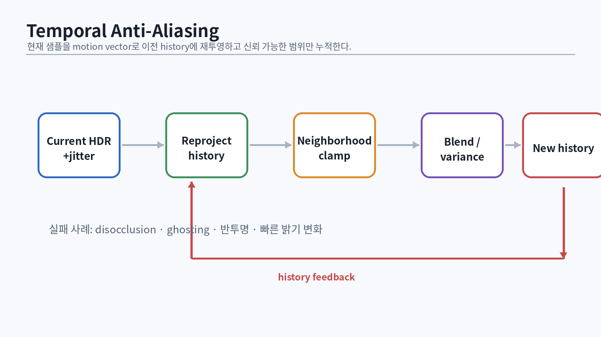

# 58. HDR 파이프라인과 Exposure

렌더러 내부 조명은 display range를 초과하는 HDR 값이다. 태양, 실내 조명, 어두운 구석을 같은 장면에 두려면 계산 공간과 표시 공간을 분리해야 한다.

```text
lighting HDR
→ temporal/volumetric/bloom 등 HDR 후처리
→ exposure
→ tone mapping
→ color grading
→ display encoding(SDR/HDR)
```

## 58.1 Exposure value

카메라 exposure를 photographic parameter로 표현할 수 있다.

$$
EV_{100}=\log_2\left(\frac{N^2}{t}\frac{100}{S}\right)
$$

- `N`: f-number
- `t`: shutter time
- `S`: ISO

게임에서는 완전한 물리 카메라 대신 exposure compensation과 auto exposure를 사용해도 된다. 중요한 것은 light intensity와 exposure가 하나의 일관된 scale을 갖는 것이다 [@lagarde2014].

```hlsl
float ExposureFromEV100(float ev100)
{
    // 엔진 기준 calibration에 맞춰 상수를 문서화한다.
    return 1.0f / exp2(ev100);
}
```

## 58.2 Histogram auto exposure

평균 luminance는 매우 밝은 픽셀 몇 개에 흔들린다. 로그 luminance histogram을 만들고 percentile 범위를 선택한다.

```hlsl
[numthreads(16,16,1)]
void BuildHistogram(uint3 id : SV_DispatchThreadID)
{
    float3 hdr = SceneColor.Load(int3(id.xy, 0)).rgb;
    float lum = max(dot(hdr, float3(0.2126, 0.7152, 0.0722)), 1e-5f);
    float logLum = log2(lum);
    uint bin = (uint)saturate((logLum - MinLogLum) * InvLogRange) * 255;
    InterlockedAdd(Histogram[bin], 1);
}
```

노출 변화는 시간적으로 smoothing한다.

```cpp
float AdaptExposure(float current, float target,
                    float deltaSeconds, float speedUp, float speedDown)
{
    float speed = target > current ? speedUp : speedDown;
    float alpha = 1.0f - std::exp(-speed * deltaSeconds);
    return std::lerp(current, target, alpha);
}
```

카메라 cut, pause, photo mode에서는 history reset 정책이 필요하다.

# 59. Tone Mapping과 Color Grading

Tone mapping은 HDR scene-referred color를 display-referred 범위로 압축한다. Reinhard operator는 간단한 전역 tone mapping의 대표적 예다 [@reinhard2002].

$$
C_{out}=\frac{C}{1+C}
$$

```hlsl
float3 Reinhard(float3 x)
{
    return x / (1.0f + x);
}
```

하지만 production에서는 shoulder, toe, mid-gray, hue preservation을 조절하는 filmic curve를 사용한다.

## 59.1 ACES 계열 근사

```hlsl
float3 AcesFitted(float3 x)
{
    const float a = 2.51f;
    const float b = 0.03f;
    const float c = 2.43f;
    const float d = 0.59f;
    const float e = 0.14f;
    return saturate((x * (a * x + b)) / (x * (c * x + d) + e));
}
```

이것은 전체 ACES color management system이 아니라 display curve 근사다. 책과 코드에서 이름을 `AcesApprox`처럼 정확히 붙인다.

## 59.2 Luminance-preserving tone mapping

RGB 채널별 curve는 고채도 highlight에서 hue shift를 만들 수 있다. luminance에 curve를 적용하고 색 비율을 유지하는 방법을 비교한다.

```hlsl
float3 ToneMapLuminance(float3 color)
{
    float lum = max(dot(color, float3(0.2126, 0.7152, 0.0722)), 1e-6f);
    float mapped = lum / (1.0f + lum);
    return color * (mapped / lum);
}
```

## 59.3 3D LUT

Color grading은 exposure/tone mapping 이후 3D LUT로 적용할 수 있다. strip texture를 사용할 때는 좌표와 slice interpolation을 정확히 처리한다.

```hlsl
float3 ApplyColorLut(Texture3D<float4> lut, float3 color)
{
    float size = LutSize;
    float3 uvw = saturate(color) * ((size - 1.0f) / size) + 0.5f / size;
    return lut.SampleLevel(LinearClamp, uvw, 0).rgb;
}
```

SDR과 HDR10/scRGB 출력은 transfer function과 mastering metadata가 다르다. 첫 엔진에서는 SDR sRGB를 확실히 맞추고, HDR은 별도 milestone으로 둔다.

# 60. Anti-Aliasing의 지도

Aliasing은 연속 신호를 불충분한 sample로 재구성할 때 생긴다. geometry edge뿐 아니라 texture, specular, shadow, transparency, temporal animation에도 발생한다.

## 60.1 방법 비교

| 방법 | 장점 | 약점 |
|---|---|---|
| MSAA | geometry edge에 정확, temporal blur 적음 | deferred/alpha/specular aliasing 해결 제한 |
| FXAA | 매우 저렴 | blur, subpixel temporal 안정성 부족 |
| SMAA | edge pattern에 더 정교 | shader/texture aliasing은 제한 |
| TAA | subpixel/temporal 안정성, reconstruction 가능 | ghosting, blur, history 관리 복잡 |
| Supersampling | 기준 품질 | 비용 큼 |

SMAA는 morphology 기반 edge detection과 pattern search로 MLAA를 실시간 GPU에 적합하게 발전시켰다 [@jimenez2012smaa]. 그러나 현대 고품질 엔진의 핵심은 대개 temporal accumulation이다.

## 60.2 Sample jitter

Projection matrix에 subpixel offset을 넣어 매 프레임 다른 위치를 sample한다.

```cpp
Float2 Halton23(uint32_t index)
{
    return { RadicalInverse(index, 2), RadicalInverse(index, 3) };
}

Matrix4x4 ApplyProjectionJitter(Matrix4x4 projection,
                                Float2 sample,
                                uint32_t width, uint32_t height)
{
    Float2 jitter = { (sample.x - 0.5f) * 2.0f / width,
                      (sample.y - 0.5f) * 2.0f / height };
    projection.m[0][2] += jitter.x;
    projection.m[1][2] += jitter.y;
    return projection;
}
```

행렬 convention에 따라 원소 위치가 다르다. CPU unit test와 화면의 static grid로 확인한다.

# 61. Temporal Anti-Aliasing

{#fig-taa width=96%}

Karis의 실시간 high-quality temporal supersampling 발표는 jitter, reprojection, neighborhood clamp, history blending을 실무적으로 연결했다 [@karis2014taa].

## 61.1 핵심 단계

1. 현재 frame을 jittered projection으로 렌더링
2. motion vector로 이전 history 위치 계산
3. depth/normal/object ID로 history 유효성 검사
4. 현재 neighborhood 범위로 history clamp
5. current와 history blend
6. history buffer에 저장

```hlsl
float2 previousUv = currentUv - motionVector;
float3 history = History.SampleLevel(LinearClamp, previousUv, 0).rgb;
float3 current = CurrentColor.Load(int3(pixel, 0)).rgb;

NeighborhoodStats stats = GatherNeighborhood(CurrentColor, pixel);
history = ClipToAabb(history, stats.minColor, stats.maxColor);

float feedback = ComputeFeedback(current, history, velocity, reactiveMask);
float3 output = lerp(current, history, feedback);
```

## 61.2 Motion vector

object의 current와 previous clip position에서 계산한다.

```hlsl
float2 ClipToUv(float4 clip)
{
    float2 ndc = clip.xy / clip.w;
    return ndc * float2(0.5f, -0.5f) + 0.5f;
}

float2 motion = ClipToUv(currentClip) - ClipToUv(previousClip);
```

필수 데이터:

- current/previous view-projection
- current/previous object transform
- skinned vertex의 current/previous bone palette
- camera jitter의 일관된 처리

정적 object라도 카메라가 움직이면 motion vector가 0이 아니다.

## 61.3 Disocclusion

이전 프레임에 보이지 않던 표면이 드러나면 history를 버려야 한다.

```hlsl
float prevDepth = PreviousDepth.SampleLevel(PointClamp, previousUv, 0);
float expectedPrevDepth = ReprojectDepth(currentWorldPos, PrevViewProj);
bool disoccluded = abs(prevDepth - expectedPrevDepth) > DepthThreshold(expectedPrevDepth);
```

normal 차이, object ID, stencil category도 사용한다. depth threshold는 view-space scale과 경사면을 고려한다.

## 61.4 Neighborhood clipping

RGB min/max box는 color outlier에 민감하다. YCoCg 같은 luminance/chroma 공간에서 variance clipping을 사용할 수 있다.

```hlsl
float3 ClipHistoryVariance(float3 history,
                           float3 mean, float3 sigma,
                           float gamma)
{
    float3 lo = mean - gamma * sigma;
    float3 hi = mean + gamma * sigma;
    return clamp(history, lo, hi);
}
```

## 61.5 Reactive mask

particle, transparency, emissive animation, 화면 공간 효과는 motion vector와 history가 잘 맞지 않는다. reactive mask는 해당 픽셀의 history weight를 낮춘다.

```hlsl
feedback *= 1.0f - reactiveMask;
```

## 61.6 Sharpening

TAA blur를 sharpening으로 숨기면 ringing과 noise가 생길 수 있다. 먼저 jitter, velocity, history rejection을 고친 뒤 conservative sharpen을 적용한다.

# 62. Temporal Upsampling과 Dynamic Resolution

TAA를 output resolution reconstruction으로 확장하면 내부 해상도를 낮추고 이전 프레임 sample을 재사용할 수 있다.

```text
render 67–83% resolution
→ jittered sample
→ depth/velocity/reactive masks
→ reconstruct output resolution
→ sharpen
```

## 62.1 Dynamic resolution controller

GPU frame time이 budget을 넘으면 scale을 낮추고, 충분한 여유가 있으면 천천히 올린다.

```cpp
float UpdateResolutionScale(float scale, float gpuMs,
                            float targetMs, float dt)
{
    float error = targetMs - gpuMs;
    float desired = std::clamp(scale + error * 0.01f, 0.5f, 1.0f);
    float speed = desired < scale ? 4.0f : 0.5f;
    return std::lerp(scale, desired, 1.0f - std::exp(-speed * dt));
}
```

allocation은 매 프레임 size가 바뀌지 않도록 최대 크기 texture를 유지하거나 quantized resolution bucket을 사용한다.

## 62.2 History reset 조건

- 큰 resolution change
- camera cut/teleport
- FOV/near plane 급변
- shader/material debug mode 변경
- scene load
- exposure discontinuity

history reset을 pass마다 따로 두면 일관성이 무너진다. `TemporalHistoryManager`가 generation을 관리한다.

# 63. Bloom, Depth of Field, Motion Blur

## 63.1 Bloom

Bloom은 밝은 광원이 렌즈/센서에서 퍼지는 효과를 근사한다. tone mapping 후 threshold로 자르면 exposure 변화에 따라 불안정할 수 있다. HDR pre-exposed space에서 downsample pyramid를 만들고 blur/up-sample한다.

```hlsl
float3 PrefilterBloom(float3 c, float threshold, float knee)
{
    float brightness = max(c.r, max(c.g, c.b));
    float soft = saturate((brightness - threshold + knee) / (2.0f * knee));
    soft = soft * soft * knee;
    float contribution = max(brightness - threshold, soft) /
                         max(brightness, 1e-5f);
    return c * contribution;
}
```

downsample filter가 firefly를 퍼뜨리지 않게 median/clamp를 고려한다.

## 63.2 Depth of Field

Circle of confusion(CoC)은 focus distance와 aperture에 따라 계산한다. 실시간 구현은 near/far CoC를 분리하고 gather/scatter blur를 근사한다.

문제:

- foreground가 background로 새는 halo
- transparency와 hair
- 큰 bokeh의 sample cost
- TAA history와 순서

첫 구현은 half-resolution gather blur와 max CoC 제한으로 시작한다.

## 63.3 Motion Blur

motion vector를 따라 sample한다.

```hlsl
float3 MotionBlur(float2 uv, float2 velocity)
{
    float3 sum = 0;
    const int SampleCount = 8;
    for (int i = 0; i < SampleCount; ++i) {
        float t = (i + 0.5f) / SampleCount - 0.5f;
        sum += SceneColor.SampleLevel(LinearClamp, uv + velocity * t, 0).rgb;
    }
    return sum / SampleCount;
}
```

카메라와 object velocity를 구분할 수 있어야 하고, foreground/background 경계에서 depth-aware clamp가 필요하다.

# 64. Transparency와 Order-Independent Transparency

일반 alpha blending은 순서에 의존한다.

$$C_{out}=C_s\alpha_s+C_d(1-\alpha_s)$$

따라서 back-to-front sorting이 필요하지만 서로 교차하는 geometry, particle 수, per-triangle order에는 한계가 있다.

## 64.1 Premultiplied alpha

```text
stored RGB = original RGB × alpha
blend: One, InvSrcAlpha
```

premultiplied alpha는 filtering edge와 additive/alpha 혼합 표현에 유리하다. texture authoring과 blend state가 일치해야 한다.

## 64.2 Weighted blended OIT

McGuire와 Bavoil의 weighted blended OIT는 fragment를 정렬하지 않고 weighted color/alpha accumulation으로 근사한다 [@mcguire2013oit].

```hlsl
float weight = ComputeWeight(alpha, linearDepth);
AccumColor += float4(premulColor * weight, alpha * weight);
Revealage *= (1.0f - alpha);
```

resolve:

```hlsl
float3 transparent = Accum.rgb / max(Accum.a, 1e-5f);
float alpha = 1.0f - Revealage;
float3 result = transparent * alpha + opaque * (1.0f - alpha);
```

정확한 order-independent solution은 아니며 강한 색/불투명 층에서 오차가 난다. hair, glass, particle 요구에 따라 PPLL, depth peeling, stochastic transparency를 비교한다.

## 64.3 Alpha test와 coverage

foliage는 alpha blend보다 alpha test/alpha-to-coverage가 적합할 수 있다. TAA 환경에서는 stochastic alpha test와 temporal accumulation을 활용할 수 있다. mip level에 따라 coverage가 보존되도록 alpha mip을 조정한다.

# 65. Post-process graph와 품질 tier

후처리를 함수 호출 순서로 하드코딩하면 temporal dependency와 resolution transition이 꼬인다. Render graph에 다음 metadata를 둔다.

- input/output color space
- render resolution/output resolution
- temporal history dependency
- async compute 가능 여부
- exposure 전/후 여부
- camera cut reset hook

예시 순서:

```text
opaque lighting
→ volumetric composite
→ transparency
→ TAA/upscale
→ motion blur / DoF
→ bloom
→ exposure
→ tone map
→ color grading
→ UI composite
```

실제 순서는 아트 목표와 각 효과의 가정에 따라 달라진다. 문서에 이유를 남긴다.

## 65.1 품질 tier

```cpp
struct PostQuality {
    float renderScale;
    uint32_t taaHistorySamples;
    uint32_t bloomMipCount;
    uint32_t dofSamples;
    bool volumetricTemporal;
    bool highQualityTransparency;
};
```

quality tier는 무작위 boolean 묶음이 아니라 GPU budget과 이미지 품질의 계약이다. 장면별 자동 switching은 hysteresis를 둔다.

# 66. 이미지 품질 테스트

## 66.1 Canonical scenes

- subpixel fence와 전선: geometry aliasing
- checkerboard plane: texture minification
- 작은 rough metal: specular aliasing
- 밝은 emissive moving object: TAA ghosting
- thin translucent layers: OIT
- camera cut/teleport: history reset
- dark room + bright window: exposure/tone mapping
- rotating fan: motion blur/velocity

## 66.2 객관적 비교

완벽한 perceptual metric은 없지만 다음을 함께 사용한다.

- supersampled reference image
- per-pixel absolute/relative error
- temporal difference heatmap
- edge stability video
- ghost trail length
- GPU time와 memory

```cpp
float RelativeError(Float3 a, Float3 b)
{
    float denom = std::max(Length(b), 1e-4f);
    return Length(a - b) / denom;
}
```

static screenshot만으로 temporal 품질을 평가하지 않는다. 60fps video와 frame-by-frame inspection을 남긴다.

# 67. 이미지 품질 파트 통과 시험

::: {.exercise}
**설명 문제**

1. HDR lighting과 display encoding을 분리해야 하는 이유를 설명한다.
2. auto exposure에 log histogram을 사용하는 이유를 설명한다.
3. tone mapping과 gamma encoding의 차이를 설명한다.
4. MSAA가 specular aliasing을 해결하지 못하는 이유를 설명한다.
5. TAA motion vector에 previous object transform이 필요한 이유를 설명한다.
6. disocclusion과 reactive mask가 각각 해결하는 문제를 설명한다.
7. dynamic resolution과 temporal history allocation 정책을 설계한다.
8. bloom threshold가 exposure와 상호작용하는 방식을 설명한다.
9. premultiplied alpha의 장점을 식으로 설명한다.
10. weighted blended OIT의 근사 한계를 설명한다.
:::

::: {.exercise}
**구현 시험**

- 256-bin luminance histogram과 auto exposure
- 두 개 이상의 tone mapper 비교 UI
- jitter + velocity + TAA + neighborhood clipping
- camera cut/history reset 자동 테스트
- dynamic resolution 4단계
- bloom pyramid
- premultiplied transparency
- weighted blended OIT 선택 과제
- canonical scene 영상과 PIX 비용표
:::
