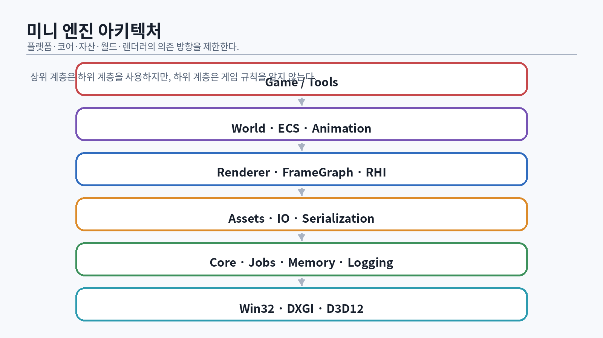
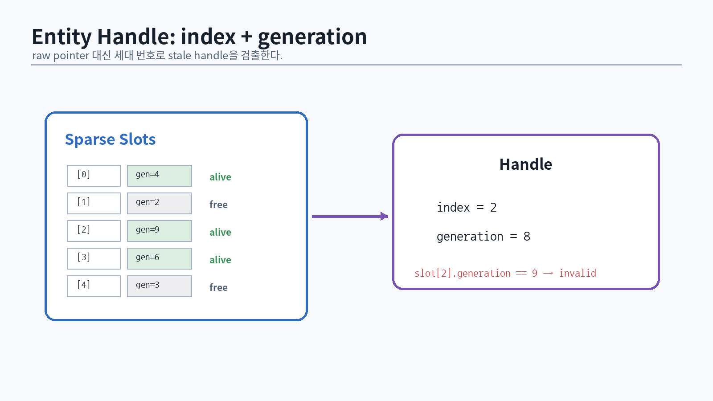

# 68. 게임 엔진은 수명과 데이터의 운영체제다

렌더러가 프레임을 그린다고 엔진이 되는 것은 아니다. 엔진은 다음을 안정적으로 연결한다.

- entity와 component의 수명
- scene/transform/animation
- asset import, cook, streaming, versioning
- job scheduling과 frame phase
- renderer extraction과 GPU resource lifetime
- editor와 runtime의 경계
- 저장/로드, hot reload, crash recovery

{#fig-engine-systems width=96%}

엔진 코드는 단일 기능보다 **변경 비용**을 최적화한다. 모든 시스템이 서로의 concrete class를 직접 호출하면 초기 데모는 빠르지만, asset reload·multithreading·dedicated server·editor preview를 추가할 때 구조가 무너진다.

# 69. Entity, Component, Handle

{#fig-entity-handle width=94%}

raw pointer를 장기간 identity로 쓰면 객체 삭제와 memory relocation에 취약하다. index와 generation을 조합한 handle은 stale reference를 탐지한다.

```cpp
struct Entity {
    std::uint32_t index{};
    std::uint32_t generation{};

    friend bool operator==(Entity, Entity) = default;
};

class EntityPool {
public:
    Entity Create();
    bool Destroy(Entity entity);
    bool IsAlive(Entity entity) const;

private:
    std::vector<std::uint32_t> generations_;
    std::vector<std::uint32_t> freeList_;
    std::vector<bool> alive_;
};
```

```cpp
bool EntityPool::IsAlive(Entity e) const
{
    return e.index < generations_.size()
        && alive_[e.index]
        && generations_[e.index] == e.generation;
}
```

삭제할 때 generation을 증가시킨다. 32-bit generation overflow는 매우 긴 실행에서 가능하므로 wrap 정책과 invalid value를 정한다.

## 69.1 Component storage

### Sparse set

```text
sparse[entity index] -> dense index
entities[dense index]
components[dense index]
```

- component iteration이 연속적이다.
- add/remove가 빠르다.
- entity별 component 존재 검사가 O(1)이다.

```cpp
template<class T>
class SparseSet {
public:
    bool Contains(Entity e) const;
    T& Emplace(Entity e, T value = {});
    void Remove(Entity e);
    T* TryGet(Entity e);

private:
    static constexpr std::uint32_t Invalid = UINT32_MAX;
    std::vector<std::uint32_t> sparse_;
    std::vector<Entity> denseEntities_;
    std::vector<T> denseValues_;
};
```

remove 시 dense 마지막 요소와 swap하고 sparse mapping을 갱신한다. 외부가 component pointer를 오래 보관하면 swap-remove로 무효화되므로 access policy가 필요하다.

### Archetype/chunk

같은 component 조합의 entity를 chunk에 모은다. query iteration과 cache locality는 좋지만 component add/remove가 archetype 이동이 되어 복잡하다. 작은 학습 엔진은 sparse set부터 시작하고, profiler가 구조적 병목을 증명할 때 archetype을 구현한다.

## 69.2 ECS의 실패 패턴

- 모든 것을 component로 만들어 간단한 객체도 간접참조가 많아짐
- virtual `Update()`를 entity마다 호출해 데이터 지향 이점 상실
- system 간 write dependency가 문서화되지 않음
- entity ID를 save file에 그대로 저장해 session마다 의미가 달라짐
- editor undo/redo와 runtime storage를 섞음

ECS는 목적이 아니라 data access pattern을 명시하는 도구다.

# 70. Transform hierarchy와 Scene Graph

Transform은 parent-child 관계, local/world matrix, dirty propagation을 관리한다.

```cpp
struct TransformComponent {
    Float3 localPosition{0,0,0};
    Quaternion localRotation{};
    Float3 localScale{1,1,1};
    Matrix4x4 world{};
    Matrix4x4 previousWorld{};
    Entity parent{};
    Entity firstChild{};
    Entity nextSibling{};
    std::uint32_t localVersion{};
    std::uint32_t worldVersion{};
};
```

## 70.1 Dirty propagation

parent 변경 시 모든 descendant를 즉시 순회하면 편집기에서 큰 hierarchy 변경이 비싸다. version 기반 lazy update 또는 dirty root queue를 사용할 수 있다.

```cpp
void UpdateWorld(Entity e, const Matrix4x4& parentWorld)
{
    auto& t = transforms_.Get(e);
    t.previousWorld = t.world;
    t.world = parentWorld * ComposeTRS(t.localPosition,
                                       t.localRotation,
                                       t.localScale);
    for (Entity child = t.firstChild; IsValid(child);
         child = transforms_.Get(child).nextSibling) {
        UpdateWorld(child, t.world);
    }
}
```

깊은 재귀를 피하려면 iterative stack을 쓴다. cycle이 생기지 않도록 `SetParent`에서 ancestor 검사를 한다.

## 70.2 Render transform과 physics transform

physics fixed step과 render variable step이 다르면 transform source를 구분한다.

- physics authoritative current/previous pose
- render interpolation pose
- animation root motion
- network reconciliation

“TransformComponent 하나를 모두가 수정”하면 race와 jitter가 생긴다. phase별 write owner를 정한다.

# 71. Frame Loop와 Phase

고정 simulation step과 rendering을 분리한다.

```cpp
while (running) {
    platform.PumpEvents();
    timer.Tick();
    accumulator += timer.DeltaSeconds();

    while (accumulator >= fixedDt) {
        input.SampleForSimulation();
        gameplay.FixedUpdate(fixedDt);
        physics.Step(fixedDt);
        accumulator -= fixedDt;
    }

    float alpha = accumulator / fixedDt;
    world.UpdatePresentation(alpha);
    renderer.Extract(world);
    renderer.Render();
}
```

## 71.1 Spiral of death

simulation이 실시간보다 느리면 accumulator가 계속 쌓인다. 최대 step 수를 제한하고 overflow를 기록한다.

```cpp
uint32_t steps = 0;
while (accumulator >= fixedDt && steps < maxSteps) {
    Simulate(fixedDt);
    accumulator -= fixedDt;
    ++steps;
}
if (steps == maxSteps && accumulator >= fixedDt) {
    telemetry.simulationOverrun++;
    accumulator = std::fmod(accumulator, fixedDt);
}
```

## 71.2 Phase dependency

```text
Input
→ Gameplay intent
→ Animation graph
→ Physics
→ Transform finalization
→ Render extraction
→ Render submission
```

실제 게임은 일부 animation/physics feedback이 있으므로 DAG로 dependency를 명시한다. job system은 이 DAG를 병렬 실행하는 도구다.

# 72. Job System

Naughty Dog의 fiber 기반 job system 발표는 게임 엔진에서 blocking task와 dependency를 효율적으로 다루는 한 production 사례다 [@naughty-dog-fibers2015]. 학습 엔진은 처음부터 fiber를 넣기보다 작은 work-stealing pool과 counter부터 구현한다.

## 72.1 최소 job API

```cpp
using JobFn = void(*)(void*);

struct JobHandle {
    std::shared_ptr<std::atomic_uint32_t> counter;
};

class JobSystem {
public:
    JobHandle Dispatch(std::uint32_t count,
                       std::uint32_t groupSize,
                       std::function<void(std::uint32_t)> fn);
    void Wait(const JobHandle& handle);
};
```

per-job `std::function`과 `shared_ptr`는 allocation이 많으므로 최종 구현에서는 fixed-size job record와 counter pool을 사용한다. 위 API는 의미를 먼저 검증하기 위한 단계다.

## 72.2 Work stealing

각 worker는 local deque를 갖는다.

- owner: LIFO pop으로 cache locality
- thief: FIFO steal로 오래된 큰 작업을 가져감
- global queue: 외부 thread submission

```text
worker 0 deque ← local jobs
worker 1 empty → steal from worker 0 front
```

## 72.3 False sharing

worker별 counter가 같은 cache line에 있으면 서로 다른 값을 써도 cache line이 왕복한다.

```cpp
struct alignas(64) WorkerStats {
    std::atomic_uint64_t executed{};
    std::byte padding[64 - sizeof(std::atomic_uint64_t)]{};
};
```

실제 cache line 크기와 struct layout을 확인한다. 무조건 padding하는 것이 아니라 profiler로 contention을 확인한다.

## 72.4 Waiting

worker thread가 child job을 기다리며 sleep하면 deadlock 또는 underutilization이 생길 수 있다. wait 중 다른 job을 실행하는 help-waiting을 구현한다.

```cpp
void JobSystem::Wait(const JobHandle& h)
{
    while (h.counter->load(std::memory_order_acquire) != 0) {
        if (!ExecuteOneAvailableJob()) {
            std::this_thread::yield();
        }
    }
}
```

memory ordering은 job이 쓴 데이터가 counter 0 관찰 뒤 보이도록 release/acquire 관계를 만든다.

# 73. Asset Pipeline: Source에서 Runtime까지

상용 엔진의 asset은 원본 파일을 런타임이 직접 읽는 것이 아니라 import/cook 단계를 거친다.

```text
source asset (FBX, glTF, PNG, EXR)
→ importer
→ normalized intermediate representation
→ platform cook/compression
→ runtime package
→ streaming/upload
```

## 73.1 Asset identity

파일 경로만 ID로 쓰면 rename에 취약하다. GUID와 content hash를 분리한다.

```cpp
struct AssetId { std::array<std::byte, 16> bytes; };
struct ContentHash { std::array<std::byte, 32> bytes; };
```

- AssetId: 논리적 identity, 참조에 사용
- ContentHash: 내용 변경 탐지와 cache key
- path: editor presentation 및 source lookup

## 73.2 Dependency graph

material은 texture와 shader를, scene은 mesh/material을 참조한다. cook 시스템은 dependency DAG를 만들고 변경된 node만 재빌드한다.

```text
Character.fbx
├─ Skeleton.asset
├─ Mesh_LOD0.asset
├─ Mesh_LOD1.asset
└─ Animation clips...

Hero.material
├─ BaseColor.texture
├─ Normal.texture
└─ PBR shader permutation
```

cycle을 탐지하고 dependency reason을 출력한다.

## 73.3 Versioned binary format

```cpp
struct AssetHeader {
    std::uint32_t magic;
    std::uint16_t formatVersion;
    std::uint16_t assetType;
    std::uint64_t payloadBytes;
    std::uint64_t dependencyCount;
    ContentHash sourceHash;
};
```

C++ struct를 그대로 fwrite하면 padding, endianness, compiler ABI에 의존한다. 명시적 field serialization과 bounds check를 사용한다.

# 74. Mesh Import와 Processing

## 74.1 Vertex deduplication

position index만 같다고 같은 vertex가 아니다. normal/UV/tangent/material seam에서 분리해야 한다.

```cpp
struct VertexKey {
    uint32_t position;
    uint32_t normal;
    uint32_t texcoord;
    uint32_t tangent;
    friend bool operator==(const VertexKey&, const VertexKey&) = default;
};
```

## 74.2 Index optimization

- post-transform vertex cache 최적화
- overdraw 순서 최적화
- vertex fetch reorder
- meshlet clustering

최적화 전후에 ACMR/ATVR, overdraw, vertex buffer locality를 측정한다.

## 74.3 LOD

LOD는 단순 triangle 감소가 아니라 silhouette, normal, UV, skin weight, material boundary를 보존해야 한다. 화면 공간 오차를 metadata로 저장한다.

```cpp
float ProjectedErrorPixels(float objectError,
                           float distance,
                           float projectionScale)
{
    return objectError * projectionScale / std::max(distance, 1e-4f);
}
```

hysteresis 또는 cross-fade로 popping을 줄인다.

# 75. Texture Pipeline과 Streaming

## 75.1 Offline texture 처리

- 색공간과 semantic 결정
- mip generation
- normal map renormalization/roughness adjustment
- platform compression(BCn)
- alpha coverage preservation
- virtual texture tile 분할 선택

mip filter는 모든 texture에 같지 않다. normal, roughness, UI, height, mask의 의미가 다르다.

## 75.2 Streaming state

```cpp
enum class ResidencyState : uint8_t {
    Unloaded,
    IoPending,
    CpuReady,
    UploadPending,
    Resident,
    EvictPending,
    Failed
};
```

상태 전환은 thread-safe하고 cancel 가능해야 한다. gameplay thread가 파일 IO를 기다리지 않는다.

## 75.3 DirectStorage

DirectStorage는 높은 처리량의 storage→GPU asset delivery를 위한 API를 제공하며, Windows의 DirectStorage 문서와 샘플을 기준으로 queue, request, decompression 경로를 검토한다 [@microsoft-directstorage]. 먼저 일반 async IO와 upload ring을 구현한 뒤 병목이 확인되면 추가한다.

```text
NVMe file
→ DirectStorage queue
→ decompression(CPU/GPU 지원 경로)
→ GPU resource/buffer
→ fence/ready state
```

API를 사용한다고 자동으로 빠르지 않다. package layout, request batching, decompression format, residency가 함께 맞아야 한다.

# 76. Resource Manager와 Hot Reload

## 76.1 Handle indirection

asset handle이 현재 runtime object를 가리키는 indirection table을 둔다.

```cpp
struct TextureHandle { uint32_t index; uint32_t generation; };

struct TextureSlot {
    std::atomic<GpuTexture*> current;
    uint32_t generation;
    AssetId asset;
};
```

hot reload 시 새 resource를 준비한 뒤 atomic swap하고, 이전 resource는 마지막 GPU fence 이후 파괴한다.

## 76.2 Two-phase publication

1. background: file read, decode, shader compile
2. render thread: GPU resource create/upload
3. ready fence 완료
4. handle table publish
5. old resource retire

중간 실패 시 기존 resource를 유지하고 오류를 editor에 표시한다.

## 76.3 Shader hot reload

PSO는 shader bytecode와 root signature, render target format 등에 의존한다. shader 하나 변경 시 dependency를 따라 PSO를 재생성한다.

```text
HLSL include graph
→ compiled shader key
→ PSO cache keys
→ affected materials/passes
```

compile error가 나면 renderer 전체를 중단하지 말고 마지막 성공 버전을 유지한다.

# 77. Animation System

## 77.1 Skeleton과 pose

```cpp
struct Joint {
    int32_t parent;
    Matrix4x4 inverseBind;
};

struct LocalPose {
    std::span<Float3> translations;
    std::span<Quaternion> rotations;
    std::span<Float3> scales;
};
```

local pose를 hierarchy 순서로 누적해 model-space joint matrix를 만들고 inverse bind를 곱해 skinning palette를 만든다.

```cpp
for (uint32_t j = 0; j < jointCount; ++j) {
    Matrix4x4 local = ComposeTRS(t[j], r[j], s[j]);
    model[j] = joints[j].parent >= 0
        ? model[joints[j].parent] * local
        : local;
    skin[j] = model[j] * joints[j].inverseBind;
}
```

## 77.2 Linear blend skinning

```hlsl
float4 skinnedPos = 0;
float3 skinnedNormal = 0;
[unroll]
for (uint i = 0; i < 4; ++i) {
    float w = input.weights[i];
    uint joint = input.joints[i];
    skinnedPos += w * mul(Bones[joint], float4(input.position, 1));
    skinnedNormal += w * mul((float3x3)Bones[joint], input.normal);
}
```

큰 회전에서 candy-wrapper artifact가 발생한다. Dual quaternion skinning은 회전/변환 blend의 shape 보존을 개선한다 [@kavan2008]. scale/shear 처리는 별도다.

## 77.3 Animation graph

node 예:

- clip player
- blend 1D/2D
- state machine
- additive layer
- mask/layer blend
- IK
- pose cache

evaluation을 두 단계로 분리한다.

1. update: 시간, 상태 전환, event
2. evaluate: 필요한 pose 계산

보이지 않는 character는 update rate를 낮추고 pose evaluation을 생략할 수 있다. gameplay-critical socket과 root motion 요구는 별도 처리한다.

## 77.4 GPU skinning과 previous pose

TAA/motion blur를 위해 이전 bone palette가 필요하다. 선택지:

- vertex shader에서 current/previous palette 두 번 skin
- compute skinning으로 current/previous vertex buffer 생성
- deform cache 유지

character 수, vertex 재사용 pass, memory bandwidth를 측정해 결정한다.

# 78. Serialization, Save, Undo

## 78.1 Runtime save와 editor scene은 다르다

- editor scene: 모든 authoring data, 안정적 GUID, human diff 고려
- runtime save: 진행 상태, version migration, 보안/크기 고려
- network snapshot: bandwidth와 determinism 고려

하나의 serializer로 모든 목적을 억지로 해결하지 않는다.

## 78.2 Schema evolution

```cpp
if (version < 3) {
    // old 'glossiness' -> new 'roughness'
    material.roughness = 1.0f - old.glossiness;
}
```

migration test fixture를 보관한다. 최신 버전 파일만 테스트하면 오래된 save를 깨뜨린다.

## 78.3 Command 기반 undo/redo

```cpp
class ICommand {
public:
    virtual ~ICommand() = default;
    virtual void Do(EditorWorld&) = 0;
    virtual void Undo(EditorWorld&) = 0;
};
```

대량 property edit는 transaction으로 묶는다. asset reload와 undo stack의 reference validity를 GUID로 유지한다.

# 79. Engine/Renderer 경계: Render Extraction

world component를 renderer가 직접 읽지 않고 compact render data를 추출한다.

```cpp
void RenderExtractor::Extract(const World& world,
                              FrameArena& arena,
                              RenderScene& out)
{
    auto query = world.Query<TransformComponent, MeshRendererComponent>();
    out.instances.reserve(query.Count());

    for (auto [entity, transform, meshRenderer] : query) {
        if (!meshRenderer.visible) continue;
        out.instances.push_back(RenderInstance{
            .world = transform.world,
            .previousWorld = transform.previousWorld,
            .mesh = meshRenderer.mesh,
            .material = meshRenderer.material,
            .bounds = TransformBounds(meshRenderer.localBounds,
                                      transform.world),
            .objectId = entity.index
        });
    }
}
```

장점:

- render thread가 gameplay locks를 피한다.
- GPU-friendly sorting/compaction을 한 곳에서 한다.
- replay와 deterministic capture가 쉬워진다.
- server build에서 renderer dependency를 제거할 수 있다.

비용은 data copy다. 큰 scene은 persistent GPU scene과 dirty update로 확장한다.

# 80. 엔진 시스템 통과 시험

::: {.exercise}
**구현 과제**

1. generation handle entity pool을 구현하고 stale handle test를 작성한다.
2. sparse-set component storage를 구현한다.
3. transform hierarchy의 cycle 방지와 dirty propagation을 구현한다.
4. fixed-step simulation과 render interpolation을 구현한다.
5. 4-thread job system과 help-waiting을 구현한다.
6. content hash 기반 incremental asset cook를 만든다.
7. mesh/texture runtime binary format을 versioned serialization한다.
8. async texture streaming state machine을 구현한다.
9. shader hot reload에서 마지막 성공 PSO를 유지한다.
10. skeletal animation과 previous pose motion vector를 구현한다.
11. render extraction snapshot을 만들고 gameplay/render thread를 분리한다.
:::

::: {.exercise}
**면접 설명 과제**

- ECS와 scene graph의 역할 차이
- raw pointer 대신 generation handle을 쓰는 이유
- sparse set에서 remove 후 pointer가 무효화되는 이유
- job counter의 release/acquire 필요성
- asset ID와 content hash의 차이
- hot reload resource를 즉시 파괴하면 안 되는 이유
- GPU skinning과 compute skinning의 tradeoff
- render extraction이 race를 줄이는 방식
:::

**통과 기준:** 10만 entity scene에서 transform/query 시간을 측정하고, asset reload 중 렌더링이 중단되지 않으며, stale handle·잘못된 파일·GPU upload 실패를 테스트로 재현해야 한다.
