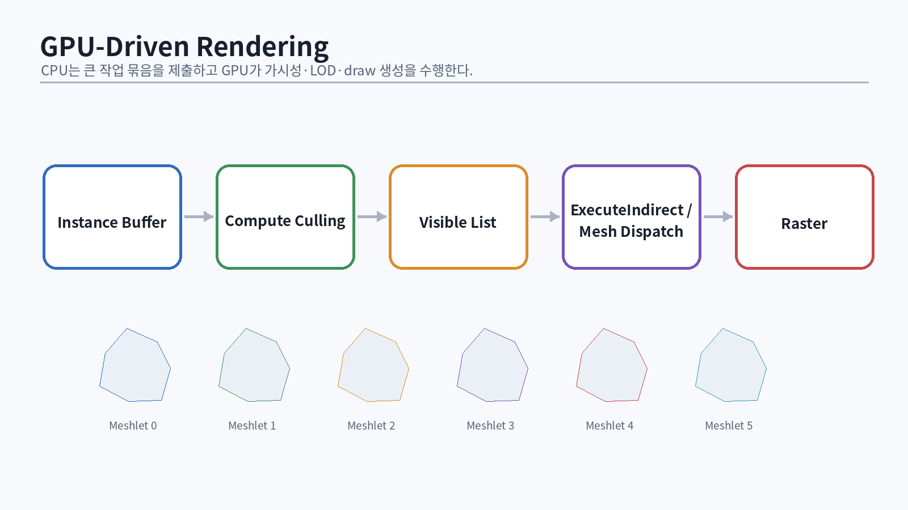
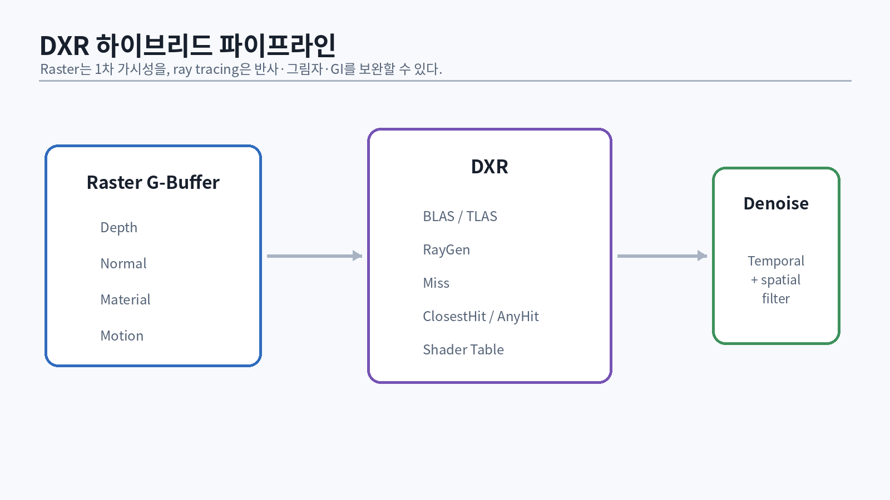

# 81. Compute Shader를 엔진의 도구로 사용하기

Compute shader는 “그래픽스가 아닌 계산”을 하는 별도 세계가 아니다. 같은 GPU 메모리와 cache, wave, synchronization 규칙 위에서 실행된다. 렌더러에서는 다음에 사용한다.

- light culling
- skinning/deformation
- particle simulation
- prefix scan, sort, compaction
- mip/Hi-Z 생성
- post-process와 denoise
- GPU-driven visibility
- ray tracing 보조 데이터

## 81.1 Thread group 설계

```hlsl
[numthreads(8, 8, 1)]
void MainCS(uint3 dispatchId : SV_DispatchThreadID,
            uint3 groupId : SV_GroupID,
            uint3 localId : SV_GroupThreadID,
            uint localIndex : SV_GroupIndex)
{
    // ...
}
```

고려 요소:

- wave 크기와 group size
- group shared memory 사용량
- register pressure와 occupancy
- memory access coalescing
- branch divergence
- dispatch overhead

`8×8=64`는 좋은 출발점이지만 자동 정답은 아니다. shader와 GPU별로 PIX의 occupancy, wave duration, cache metric을 본다.

## 81.2 Group shared reduction

```hlsl
groupshared float Shared[64];

[numthreads(64,1,1)]
void ReduceCS(uint local : SV_GroupIndex,
              uint global : SV_DispatchThreadID)
{
    Shared[local] = Input[global];
    GroupMemoryBarrierWithGroupSync();

    for (uint stride = 32; stride > 0; stride >>= 1) {
        if (local < stride) {
            Shared[local] += Shared[local + stride];
        }
        GroupMemoryBarrierWithGroupSync();
    }

    if (local == 0) Output[SV_GroupID.x] = Shared[0];
}
```

실전에서는 wave intrinsic으로 group shared/barrier 횟수를 줄일 수 있다.

```hlsl
float waveSum = WaveActiveSum(value);
```

wave size를 고정 가정하지 않고 `WaveGetLaneCount()` 또는 target feature를 검증한다.

# 82. Prefix Sum, Compaction, Sorting

GPU-driven 엔진의 기반은 “조건을 만족한 항목을 연속 리스트로 만드는” compaction이다.

## 82.1 Scan

입력 count `[2,0,3,1]`의 exclusive prefix sum은 `[0,2,2,5]`다. 총합은 6이다. 이 offset을 사용하면 각 항목이 충돌 없이 output range를 쓴다.

```text
count per cluster
→ exclusive scan
→ offsets
→ fill light indices
```

대규모 scan은 block scan → block sums scan → offset add의 계층 구조로 구현한다.

## 82.2 Stream compaction

```hlsl
bool visible = TestFrustum(instance);
uint flag = visible ? 1 : 0;
Flags[id] = flag;
// scan Flags -> Offsets
if (visible) VisibleIndices[Offsets[id]] = id;
```

atomic append는 간단하지만 순서가 비결정적이고 contention이 생길 수 있다. count/scan/fill은 pass가 늘지만 deterministic하고 capacity 계산이 쉽다.

## 82.3 Radix sort

depth/material key로 draw를 정렬할 때 comparison sort보다 radix sort가 GPU에 적합하다.

```cpp
uint32_t MakeDrawKey(uint16_t pipeline,
                     uint16_t material,
                     uint16_t depthBucket)
{
    return (uint32_t(pipeline) << 22)
         | (uint32_t(material) << 10)
         | depthBucket;
}
```

key bit 배치는 우선순위와 범위를 문서화한다. opaque는 PSO/material coherence, transparent는 depth order가 더 중요하다.

# 83. Async Compute와 Multi-Queue

D3D12는 graphics, compute, copy queue를 명시적으로 사용한다. 여러 queue가 있다고 자동으로 병렬 실행되는 것은 아니다. GPU의 hardware scheduling, resource dependency, bandwidth contention에 따라 overlap이 달라진다.

## 83.1 좋은 후보

- graphics가 depth/geometry를 처리하는 동안 독립적인 particle simulation
- shadow rendering과 일부 skinning
- 후반 graphics idle 구간의 denoise/post compute
- copy queue의 texture upload

## 83.2 나쁜 후보

- graphics 결과를 즉시 읽는 짧은 compute pass
- 같은 bandwidth-heavy resource를 동시에 접근
- queue sync 비용보다 짧은 dispatch
- 전체 GPU가 이미 saturated인 경우

```cpp
// compute queue signals completion
computeQueue->Signal(computeFence.Get(), computeValue);
// graphics queue waits before consuming output
graphicsQueue->Wait(computeFence.Get(), computeValue);
```

CPU wait와 GPU queue wait를 혼동하지 않는다. queue wait는 GPU timeline dependency다.

## 83.3 Scheduling experiment

PIX timing capture에서 다음을 비교한다.

1. 모든 pass graphics queue
2. AO만 async compute
3. AO+light culling async compute
4. skinning까지 async compute

총 GPU frame time, overlap, cache/bandwidth contention을 기록한다. pass 개별 duration이 늘어도 overlap으로 총 시간이 줄 수 있고, 반대도 가능하다.

# 84. GPU-Driven Rendering

{#fig-gpu-driven width=96%}

CPU가 object마다 draw call을 제출하는 구조는 많은 object에서 command overhead와 visibility latency가 커진다. GPU-driven renderer는 persistent GPU scene, compute culling, indirect command generation으로 작업을 옮긴다.

## 84.1 GPU scene

```hlsl
struct InstanceGpu {
    float3x4 world;
    float3x4 previousWorld;
    uint meshIndex;
    uint materialIndex;
    uint flags;
    uint objectId;
    float4 bounds;
};

StructuredBuffer<InstanceGpu> Instances : register(t0);
StructuredBuffer<MeshGpu> Meshes : register(t1);
```

CPU는 dirty instance만 upload한다. stable index와 free-list/generation을 사용한다.

## 84.2 Visibility stages

1. frustum culling
2. occlusion culling with previous/current Hi-Z
3. LOD selection
4. meshlet/cone culling
5. material/pipeline binning
6. indirect argument generation

occlusion 결과에 temporal hysteresis를 두지 않으면 한 프레임 늦은 Hi-Z와 camera motion에서 popping이 발생한다.

## 84.3 ExecuteIndirect

D3D12의 `ExecuteIndirect`는 GPU가 만든 argument buffer로 draw/dispatch를 실행한다.

```cpp
D3D12_INDIRECT_ARGUMENT_DESC args[2]{};
args[0].Type = D3D12_INDIRECT_ARGUMENT_TYPE_CONSTANT;
args[0].Constant.RootParameterIndex = 0;
args[0].Constant.DestOffsetIn32BitValues = 0;
args[0].Constant.Num32BitValuesToSet = 1;
args[1].Type = D3D12_INDIRECT_ARGUMENT_TYPE_DRAW_INDEXED;
```

command signature와 root signature의 계약이 정확해야 한다. count buffer를 사용해 visible command 수만 실행한다.

## 84.4 GPU-driven의 숨은 비용

- culling dispatch와 scan/sort 비용
- indirect argument memory bandwidth
- material divergence
- debug/replay 난이도
- GPU crash에서 생성 command 추적
- 작은 scene에서 CPU 방식보다 느릴 수 있음

“draw call 수”만 줄이는 것이 목표가 아니라 CPU frame 안정성과 scene scale을 측정한다.

# 85. Meshlet과 Mesh Shader

Mesh shader pipeline은 전통적인 input assembler/vertex/geometry 단계를 amplification shader와 mesh shader로 대체할 수 있다. Microsoft의 mesh shader 사양은 thread group이 mesh primitive와 vertex output을 직접 생성하는 모델을 정의한다 [@microsoft-mesh-shader].

## 85.1 Meshlet

mesh를 작은 cluster로 분할한다.

```cpp
struct Meshlet {
    uint32_t vertexOffset;
    uint32_t vertexCount;
    uint32_t primitiveOffset;
    uint32_t primitiveCount;
    BoundingSphere bounds;
    NormalCone cone;
};
```

일반적으로 meshlet은 제한된 vertex/primitive 수를 갖고 local index를 사용한다. 실제 제한은 feature query와 target에 맞춘다.

## 85.2 Amplification + Mesh

```hlsl
[shader("amplification")]
[numthreads(32,1,1)]
void ASMain(uint tid : SV_GroupThreadID,
            uint group : SV_GroupID)
{
    bool visible = CullMeshletGroup(group, tid);
    uint count = WaveActiveCountBits(visible);
    DispatchMesh(count, 1, 1, payload);
}
```

```hlsl
[shader("mesh")]
[numthreads(128,1,1)]
[outputtopology("triangle")]
void MSMain(...)
{
    SetMeshOutputCounts(vertexCount, primitiveCount);
    // decode vertices and primitives
}
```

기존 indexed draw보다 항상 빠르지 않다. meshlet preprocessing, attribute decode, culling 효율, GPU architecture에 따라 달라진다.

# 86. Variable Rate Shading와 Sampler Feedback

## 86.1 VRS

Variable Rate Shading은 한 pixel shader invocation이 여러 pixel을 덮도록 shading rate를 조절한다. Microsoft D3D12 VRS 문서는 per-draw, image-based rate 등의 tier를 정의한다 [@microsoft-vrs].

사용 예:

- peripheral VR 영역
- motion blur 영역
- low-frequency volumetric
- depth of field blur 영역

edge/highlight/UI에 coarse rate를 쓰면 품질 저하가 크다. material/velocity/contrast 기반 shading-rate image를 구성한다.

## 86.2 Sampler Feedback

Sampler Feedback은 실제로 어떤 texture mip/region이 sample됐는지 기록해 streaming과 virtual texturing 결정을 돕는다 [@microsoft-sampler-feedback].

```text
shader samples texture
→ feedback map records min mip / region
→ CPU/GPU analyzes requests
→ IO/decompression/upload
→ residency update
```

feedback latency와 camera 예측이 필요하다. 요청 후 도착까지 placeholder/coarser mip이 존재해야 한다.

# 87. Work Graphs

D3D12 Work Graphs는 GPU가 node graph 안에서 후속 work를 생성하도록 하는 실행 모델이다. Microsoft의 current specification과 samples를 기준으로 feature tier와 shader model 지원을 확인해야 한다 [@microsoft-work-graphs].

가능한 사용:

- irregular geometry/material processing
- procedural expansion
- adaptive simulation
- multi-stage GPU pipelines의 CPU dispatch 감소

그러나 초기 엔진의 필수 요소가 아니다. Work Graphs를 배우기 전에 indirect dispatch, prefix scan, persistent GPU data, synchronization을 이해해야 한다.

::: {.warning}
Work Graphs와 최신 Shader Model 기능은 OS, Agility SDK, driver, GPU 지원이 동시에 필요할 수 있다. 책의 예제는 런타임 feature query와 fallback을 전제로 한다. 지원 여부를 제품명으로 추측하지 않는다.
:::

# 88. Ray Tracing의 기초

{#fig-dxr width=96%}

Whitted ray tracing은 primary ray에서 reflection/refraction/shadow ray를 재귀적으로 추적하는 구조를 제시했다 [@whitted1980]. DXR은 ray generation, acceleration structure, hit/miss shader와 inline ray query를 D3D12에 통합한다 [@microsoft-dxr].

## 88.1 Ray 식

$$p(t)=o+t d,\quad t\ge0$$

triangle intersection 결과는 hit distance `t`, barycentric coordinate, instance/primitive ID를 제공한다.

## 88.2 Acceleration structure

- BLAS: geometry의 bottom-level 구조
- TLAS: instance transform과 BLAS reference의 top-level 구조

```text
Meshes → BLAS build/compact
Instances + transforms → TLAS build/update
Ray dispatch/query → TLAS traversal → BLAS traversal
```

build scratch, result, update 허용 여부, compaction, lifetime을 resource manager에 통합한다. Karras의 병렬 BVH construction은 GPU에서 계층 구조를 만드는 대표적 연구다 [@karras2012]. traversal 성능은 ray coherence와 node layout에도 영향을 받는다 [@aila2009].

## 88.3 DXR pipeline과 inline ray query

Pipeline 방식:

- ray generation shader
- miss shader
- closest-hit/any-hit/intersection shader
- shader binding table(SBT)

Inline RayQuery:

```hlsl
RayQuery<RAY_FLAG_CULL_BACK_FACING_TRIANGLES> q;
q.TraceRayInline(Scene, flags, mask, ray);
while (q.Proceed()) {
    // optional candidate handling
}
bool hit = q.CommittedStatus() == COMMITTED_TRIANGLE_HIT;
```

shadow/AO처럼 caller shader 안에서 결과만 필요한 경우 inline query가 단순할 수 있다. material-specific hit shading과 재귀 ray에는 pipeline이 유리할 수 있다.

## 88.4 SBT 안전성

SBT record는 shader identifier와 local root arguments를 정렬 규칙에 맞춰 저장한다. 수동 byte offset 오류가 흔하다.

```cpp
struct ShaderRecordWriter {
    std::byte* cursor;
    uint32_t stride;
    void Write(std::span<const std::byte> identifier,
               std::span<const std::byte> localArgs);
};
```

record stride, table alignment, local root signature size를 assertion한다.

# 89. Hybrid Ray-Traced Effects

## 89.1 Ray-traced shadow

각 pixel에서 light로 shadow ray를 1개 쏘면 hard shadow가 된다. area light에서 여러 sample을 쏘면 noise가 생기므로 temporal/spatial denoise가 필요하다.

## 89.2 Reflection

reflection ray hit에서 필요한 정보:

- hit position/normal
- material ID와 texture LOD
- direct/indirect shading
- miss environment

ray cone 또는 ray differential 없이 texture mip을 고르면 shimmer가 생긴다. 첫 구현은 roughness에 따른 conservative mip bias로 시작하고 한계를 문서화한다.

## 89.3 RTAO/GI

1 sample/pixel은 noise가 크다. G-buffer와 temporal reuse를 활용해 low-spp estimator를 안정화한다. reference path tracer를 별도 모드로 두어 bias를 비교한다.

# 90. Temporal Denoising과 SVGF

SVGF는 sparse noisy path-traced signal을 temporal accumulation, variance estimation, edge-aware wavelet filtering으로 안정화한다 [@schied2017].

```text
noisy sample
→ reprojection/history validation
→ temporal moments accumulation
→ variance estimate
→ A-trous edge-aware filter
→ final
```

## 90.1 Temporal moments

luminance 1차/2차 moment:

```hlsl
float m1 = luminance;
float m2 = luminance * luminance;
float2 moments = lerp(float2(m1,m2), prevMoments, historyWeight);
float variance = max(0.0f, moments.y - moments.x * moments.x);
```

history length이 짧은 disocclusion 영역은 spatial neighborhood로 variance를 보완한다.

## 90.2 A-trous filter

filter step width를 1,2,4,8로 늘리며 edge-aware weight를 사용한다.

```hlsl
float weight = kernel
             * exp(-abs(depthN - depthC) * phiDepth)
             * pow(saturate(dot(normalN, normalC)), phiNormal)
             * exp(-abs(lumN - lumC) / max(phiColor * sigma, 1e-4f));
```

너무 강한 filter는 light leak과 detail loss를 만든다. feature별 normal/depth/material gating을 조정한다.

# 91. ReSTIR 개념

ReSTIR는 reservoir sampling을 이용해 많은 light candidate 중 좋은 sample을 temporal/spatial하게 재사용하여 direct lighting sample 효율을 높인다 [@bitterli2020].

## 91.1 Reservoir

각 candidate `i`의 weight `w_i`를 streaming 방식으로 누적하면서 하나를 확률적으로 선택한다.

```cpp
struct Reservoir {
    LightSample selected;
    float weightSum{};
    uint32_t sampleCount{};
};

void Update(Reservoir& r, const LightSample& candidate,
            float weight, float random01)
{
    r.weightSum += weight;
    r.sampleCount++;
    if (random01 * r.weightSum < weight) {
        r.selected = candidate;
    }
}
```

실제 ReSTIR는 target PDF, proposal PDF, visibility, normalization weight를 정확히 다뤄야 한다. 위 코드는 reservoir sampling 직관만 보여준다.

## 91.2 Reuse의 위험

- 이전 pixel/frame의 sample이 현재 target distribution과 다름
- visibility 재평가 비용
- bias/unbiased variant
- firefly와 reservoir weight 폭주
- dynamic light/geometry history invalidation

논문 식을 그대로 복사하기 전에 estimator가 무엇을 추정하는지, 각 PDF가 어느 measure인지 적는다.

# 92. Path Tracing Reference Mode

학습 엔진에 느린 reference path tracer를 넣으면 raster/hybrid 효과를 검증할 수 있다.

## 92.1 기본 알고리즘

```cpp
Radiance TracePath(Ray ray, Rng& rng)
{
    Radiance L = 0;
    Throughput beta = 1;

    for (uint32_t bounce = 0; bounce < MaxBounces; ++bounce) {
        Hit hit = Intersect(ray);
        if (!hit) {
            L += beta * Environment(ray.direction);
            break;
        }

        L += beta * hit.material.emission;
        DirectSample direct = SampleOneLight(hit, rng);
        L += beta * EvaluateDirect(hit, direct);

        BsdfSample bs = SampleBsdf(hit, -ray.direction, rng);
        if (bs.pdf <= 0 || IsBlack(bs.f)) break;
        beta *= bs.f * abs(dot(hit.normal, bs.wi)) / bs.pdf;

        if (bounce >= 3) {
            float survive = min(MaxComponent(beta), 0.95f);
            if (rng.Next() > survive) break;
            beta /= survive;
        }
        ray = SpawnRay(hit, bs.wi);
    }
    return L;
}
```

이 코드는 개념용이다. robust offset, MIS, delta distribution, texture filtering, spectral/color handling이 추가로 필요하다. PBRT는 전체 구현의 기준 참고다 [@pbrt4].

## 92.2 Multiple Importance Sampling

light sampling과 BSDF sampling을 결합해 각 방식의 약점을 줄인다. balance 또는 power heuristic을 사용한다.

$$w_a=\frac{p_a^2}{p_a^2+p_b^2}$$

direct light에서 작은 밝은 광원은 light sampling이, glossy reflection에서 environment highlight는 BSDF sampling이 유리할 수 있다.

# 93. 고급 GPU 파트 통과 시험

::: {.exercise}
**구현 단계**

1. group reduction과 exclusive scan을 구현한다.
2. GPU stream compaction으로 visible instance list를 만든다.
3. radix sort로 draw key를 정렬한다.
4. async compute 실험 3개를 PIX timeline으로 비교한다.
5. persistent GPU scene과 dirty upload를 구현한다.
6. ExecuteIndirect로 10만 instance를 그린다.
7. 선택: meshlet 생성과 mesh shader 경로를 구현한다.
8. 선택: VRS image 또는 sampler feedback demo를 만든다.
9. BLAS/TLAS build와 inline ray-traced shadow를 구현한다.
10. SVGF-style temporal+spatial denoise를 구현한다.
11. 선택: ReSTIR DI 논문의 작은 장면을 재현한다.
12. reference path tracer로 PBR/IBL 결과를 비교한다.
:::

::: {.exercise}
**논문 읽기 질문**

- Kajiya의 rendering equation에서 path tracing estimator가 어떻게 유도되는가?
- GGX VNDF sampling의 PDF는 어느 방향 measure인가?
- Clustered shading이 tiled shading의 worst case를 어떻게 줄이는가?
- SVGF의 variance가 spatial filter radius에 어떻게 쓰이는가?
- ReSTIR reservoir가 보존하는 통계량은 무엇인가?
- FrameGraph의 resource lifetime 분석과 GPU transient aliasing의 관계는 무엇인가?
:::

**통과 기준:** 최신 기능을 나열하는 것이 아니라 feature query, fallback, memory, synchronization, PIX capture, 품질 오차를 함께 설명할 수 있어야 한다.
