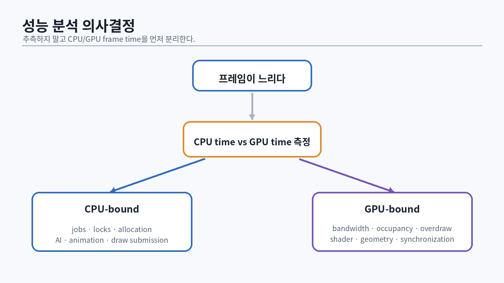

# 94. 디버깅 시스템을 먼저 설계한다

GPU 버그는 재현이 어렵고, 잘못된 resource state나 out-of-bounds write가 수 프레임 뒤 다른 pass에서 나타날 수 있다. 엔진에 다음 진단 기능을 처음부터 넣는다.

- D3D12 debug layer와 선택적 GPU-based validation
- 모든 GPU 객체의 debug name
- PIX event/marker
- DRED breadcrumbs와 page-fault data
- CPU/GPU timestamp profiler
- frame capture용 deterministic camera/scene
- shader NaN/Inf detector와 debug views
- resource/descriptor lifetime log

Microsoft의 PIX 문서는 GPU capture와 timing capture를 구분하고, event marker를 사용해 workload를 해석하는 방법을 제공한다 [@microsoft-pix-gpu; @microsoft-pix-timing]. DRED는 device removal 시 breadcrumb와 page-fault 정보를 제공한다 [@microsoft-dred].

## 94.1 HRESULT와 context

```cpp
class HrException : public std::runtime_error {
public:
    HrException(HRESULT hr, std::string_view expression,
                std::source_location where = std::source_location::current());
    HRESULT Code() const noexcept { return hr_; }
private:
    HRESULT hr_;
};

#define DX_CHECK(expr) \
    do { HRESULT _hr = (expr); if (FAILED(_hr)) \
        throw HrException(_hr, #expr); } while(false)
```

에러 메시지에 expression, file/line, HRESULT symbolic name, adapter, recent GPU event를 포함한다.

## 94.2 Debug name

```cpp
void SetGpuName(ID3D12Object* object, std::wstring_view name)
{
    if (object) object->SetName(std::wstring(name).c_str());
}
```

자동 생성 이름 예:

```text
Texture[Shadow.Cascade2.2048x2048.D32]
Buffer[GpuScene.Instances.8MB]
PSO[DeferredLighting.PBR.Debug0]
```

# 95. PIX Capture 읽는 순서

{#fig-profiling-tree width=96%}

## 95.1 먼저 frame budget을 정한다

| 목표 FPS | frame budget |
|---:|---:|
| 30 | 33.33 ms |
| 60 | 16.67 ms |
| 90 | 11.11 ms |
| 120 | 8.33 ms |

CPU와 GPU가 각자 budget 안에 있어도 present queueing과 latency가 나쁠 수 있다. 평균뿐 아니라 p95/p99 frame time과 hitch를 기록한다.

## 95.2 CPU-bound/GPU-bound 구분

- GPU duration이 frame interval을 채우고 graphics queue가 바쁘면 GPU-bound 가능성
- GPU queue 사이에 큰 idle gap이 있고 CPU submission이 늦으면 CPU-bound 가능성
- present/vsync/frame cap 때문에 둘 다 idle일 수 있음
- async queue overlap과 copy wait를 timeline에서 확인

간단한 진단 실험:

1. 해상도를 50%로 낮춘다. 시간이 크게 줄면 pixel/GPU 관련 가능성이 높다.
2. render pass를 끄되 simulation은 유지한다.
3. object/light/animation 수를 절반으로 줄인다.
4. GPU timestamp와 CPU scope를 동시에 비교한다.

## 95.3 GPU capture 절차

1. 느린 frame을 timing capture로 찾는다.
2. 같은 재현 조건에서 GPU capture를 뜬다.
3. event hierarchy와 pass duration을 본다.
4. pipeline state, resource, descriptor를 검증한다.
5. pixel history/mesh/shader debug로 잘못된 픽셀을 추적한다.
6. 병목 가설 하나를 세운다.
7. 단일 변경 후 다시 timing capture한다.

“capture에서 빨간 숫자”를 무작정 줄이지 않는다. 전체 frame의 critical path를 본다.

# 96. GPU 병목 분류

## 96.1 Vertex/Geometry bound

징후:

- 해상도 감소 효과가 작다.
- triangle/vertex 수 감소로 시간이 크게 줄어든다.
- vertex shader와 primitive processing이 긴 구간을 차지한다.

대응:

- frustum/occlusion culling
- LOD/meshlet
- skinning 최적화
- vertex format 압축
- post-transform cache 개선
- tessellation/geometry shader 제거 검토

## 96.2 Pixel bound

징후:

- 해상도에 거의 비례해 비용 감소
- 큰 fullscreen pass 또는 높은 overdraw
- 복잡한 pixel shader, 많은 texture sample

대응:

- early depth/depth prepass
- overdraw 감소
- half/quarter-resolution 효과
- shader branch/permutation 정리
- texture bandwidth/format 개선
- VRS/dynamic resolution

## 96.3 Bandwidth bound

징후:

- ALU를 줄여도 개선이 작다.
- render target/texture format 축소 시 개선
- 큰 G-buffer, 여러 history, UAV read/write

대응:

- packed formats
- pass fusion 또는 reduced intermediate
- on-chip locality 고려
- sample count와 resolution 감소
- compression 가능한 texture 사용
- cache-friendly access

## 96.4 Latency/Occupancy bound

- register pressure가 높아 active waves가 적음
- random memory access와 long dependency chain
- 작은 dispatch에서 occupancy가 낮음

대응:

- live variable/range 축소
- group size 실험
- wave intrinsic
- data layout 변경
- independent work 증가

# 97. Draw Call, State Change, Descriptor 비용

D3D12는 D3D11보다 CPU overhead를 줄일 수 있지만 draw가 무료는 아니다. 비용 요소:

- visibility/build/sort CPU 작업
- command recording
- root parameter/descriptor 변경
- PSO 변경
- driver/runtime validation과 submission
- GPU state/cache disruption

## 97.1 측정 시나리오

동일 triangle 수로 다음을 비교한다.

1. 1 draw × 1,000,000 triangles
2. 1,000 draw × 1,000 triangles
3. 100,000 draw × 10 triangles
4. ExecuteIndirect

CPU record time, queue submission, GPU time을 분리한다.

## 97.2 Root signature 비용

root constant와 root descriptor는 빠르지만 root signature DWORD budget을 소비한다. descriptor table은 indirection이 있지만 많은 descriptor를 묶는다 [@microsoft-root-signatures; @microsoft-resource-binding].

권장:

- frame/view constant는 root CBV 또는 작은 root constant
- material/resource는 bindless index 또는 descriptor table
- draw마다 큰 descriptor table 재작성 금지
- static sampler 활용

# 98. Texture와 Cache 분석

## 98.1 Mip 선택

mip이 너무 높으면 blur, 너무 낮으면 aliasing/bandwidth 증가다. debug view로 sampled mip을 색칠한다.

```hlsl
float mip = Texture.CalculateLevelOfDetail(AnisoSampler, uv);
return MipDebugColor(mip);
```

## 98.2 Anisotropic filtering

grazing angle surface에서 footprint가 비등방적이므로 anisotropic filtering이 필요하다. 모든 texture에 max anisotropy를 적용하면 비용이 늘 수 있다. material category와 platform tier를 정한다.

## 98.3 Cache-friendly access

- adjacent threads가 adjacent memory를 읽게 한다.
- structure size/alignment를 줄인다.
- random bindless texture access가 wave 내에서 크게 갈리면 cache 효율이 떨어질 수 있다.
- material sorting과 texture arrays/atlases를 비교한다.

# 99. CPU 성능: Data와 Allocation

## 99.1 p95/p99를 본다

평균 2ms인 시스템이 1초마다 30ms hitch를 만들면 게임 경험은 나쁘다. telemetry:

```cpp
struct FrameMetric {
    double cpuFrameMs;
    double gpuFrameMs;
    double simulationMs;
    double renderSubmitMs;
    uint64_t allocations;
    uint64_t ioBytes;
};
```

ring buffer로 수집하고 percentile을 계산한다.

## 99.2 Allocation 추적

frame allocator를 벗어난 heap allocation을 tag별로 기록한다.

```cpp
void* Allocate(std::size_t bytes, MemoryTag tag,
               std::source_location where);
```

개발 빌드에서 call stack을 sample한다. “allocation count 0”이 항상 목표는 아니지만, hot loop의 예측 불가능한 allocation은 제거한다.

## 99.3 Structure of Arrays

```cpp
struct ParticleAoS {
    Float3 position;
    Float3 velocity;
    float life;
    uint32_t color;
};

struct ParticlesSoA {
    std::vector<Float3> positions;
    std::vector<Float3> velocities;
    std::vector<float> lives;
};
```

update가 position/velocity/life만 접근하면 SoA가 cache와 SIMD에 유리할 수 있다. rendering upload가 interleaved vertex를 원하면 변환 비용을 측정한다.

## 99.4 Amdahl의 법칙

전체 시간에서 5%인 코드를 10배 빠르게 해도 최대 개선은 제한된다 [@amdahl1967].

$$S=\frac{1}{(1-p)+p/s}$$

`p=0.05`, `s=10`이면 전체 speedup은 약 1.047배다. profiler의 큰 항목부터 다룬다.

# 100. 동기화와 Lock Contention

## 100.1 Mutex 대기 측정

lock 자체의 호출 수보다 hold time과 wait time이 중요하다.

```cpp
class ProfiledMutex {
public:
    void lock();
    void unlock();
private:
    std::mutex mutex_;
    std::atomic_uint64_t waitNs_{};
};
```

## 100.2 Lock-free의 함정

lock-free 구조는 memory reclamation(ABA, hazard pointer, epoch), ordering, false sharing이 복잡하다. contention이 증명되지 않았다면 작은 mutex/queue가 더 안전할 수 있다.

## 100.3 Frame ownership

- gameplay writes world during simulation phase
- extraction reads after barrier
- renderer owns snapshot thereafter
- asset publication happens at defined sync point

ownership phase를 명확히 하면 많은 fine-grained lock이 필요 없다.

# 101. Resource Lifetime와 GPU Hazard 디버깅

## 101.1 흔한 오류

- GPU가 읽는 upload memory를 CPU가 재사용
- descriptor slot을 fence 완료 전 덮음
- resource를 다른 queue가 쓰는 동안 읽음
- UAV write 뒤 barrier 누락
- aliasing heap 전환 누락
- present/back buffer state 오류

## 101.2 Lifetime log

```text
Frame 1042: Texture #882 created
Frame 1045: last graphics use fence=8192
Frame 1045: hot-reload replacement published
Frame 1045: old texture retired fence=8192
Frame 1048: graphics completed=8192, destroyed
```

crash report에 관련 resource와 fence timeline을 붙인다.

## 101.3 Enhanced barriers

D3D12 enhanced barriers는 sync, access, layout을 더 세분화한 모델을 제공한다 [@microsoft-enhanced-barriers]. legacy barrier와 개념 대응을 먼저 이해하고, 엔진 내부 `AccessIntent`에서 backend barrier로 compile한다.

```cpp
struct BarrierIntent {
    PipelineStage beforeStage;
    Access beforeAccess;
    Layout beforeLayout;
    PipelineStage afterStage;
    Access afterAccess;
    Layout afterLayout;
};
```

# 102. Device Removed와 DRED

GPU device removal 원인:

- TDR(long-running shader)
- invalid memory access
- descriptor corruption
- driver reset/update
- hardware/thermal issue
- application synchronization bug

처리 순서:

1. failing HRESULT와 `GetDeviceRemovedReason`
2. DRED auto-breadcrumbs
3. page fault VA와 existing/recently freed allocation
4. 마지막 PIX marker/frame ID
5. resource lifetime log
6. 최소 재현 scene

```cpp
void DumpDred(ID3D12Device* device);
```

DRED 정보는 crash 시점에 수집해 파일로 남긴다. device가 제거된 뒤 복잡한 allocation/logging에 의존하지 않도록 crash path를 단순화한다.

# 103. Shader 디버깅과 수치 안정성

## 103.1 NaN 전파

normalize(0), sqrt(negative), divide-by-zero, invalid texture data가 NaN을 만든다. NaN은 blending과 temporal history에 퍼진다.

```hlsl
float3 SafeNormalize(float3 v)
{
    float lenSq = dot(v, v);
    return lenSq > 1e-12f ? v * rsqrt(lenSq) : float3(0,0,1);
}
```

## 103.2 GPU assertion

```hlsl
RWStructuredBuffer<uint> DebugCounters;

void GpuAssert(bool condition, uint code)
{
    if (!condition) {
        uint old;
        InterlockedAdd(DebugCounters[code], 1, old);
    }
}
```

처음 발생한 pixel/object 정보를 별도 buffer에 atomic compare-exchange로 저장할 수 있다.

## 103.3 Shader permutation validation

모든 permutation을 런타임에서 처음 발견하지 않는다. offline/CI에서 compile matrix를 돌린다.

```text
material model × alpha mode × skinning × shadow × debug × platform
```

무작정 조합하면 permutation explosion이 생긴다. dynamic branch, specialization, pipeline library를 비용과 함께 선택한다.

# 104. Regression Testing

## 104.1 Golden image

고정 camera/seed/time에서 reference image를 저장하고 tolerance로 비교한다.

```cpp
struct ImageDiffResult {
    double meanAbsoluteError;
    double maxError;
    double changedPixelRatio;
};
```

GPU/driver별 floating-point 차이가 있으므로 exact byte compare는 제한적이다. 구조적 mask와 perceptual threshold를 사용한다.

## 104.2 Performance regression

CI 또는 nightly benchmark:

- scene name
- commit
- GPU/driver/clock mode
- CPU/GPU p50/p95
- pass durations
- VRAM committed/resident
- shader/PSO cache hit

thermal/clock variation을 줄이고 여러 번 실행한다. 3% 같은 작은 변화는 통계적 noise인지 확인한다.

## 104.3 Capture replay

render extraction snapshot과 asset hashes를 저장하면 동일 frame을 반복 재생할 수 있다. gameplay가 변해도 renderer regression을 격리한다.

# 105. 최적화 Case Study

## 105.1 10만 object CPU 병목

초기:

```text
CPU frame 24ms
- visibility 8ms
- sort 5ms
- command recording 7ms
- other 4ms
GPU 10ms
```

실험:

1. SoA bounds + SIMD frustum: visibility 8→2.8ms
2. radix key sort: 5→1.6ms
3. multithreaded recording: 7→3.0ms
4. GPU culling/indirect: CPU 3.0→0.8ms, GPU +0.7ms

최종 CPU 8.2ms, GPU 10.7ms. 병목이 GPU로 이동했다. 여기서 더 CPU 최적화하는 것은 우선순위가 낮다.

## 105.2 4K deferred bandwidth 병목

초기 G-buffer 4×RGBA16F + depth, lighting 6.4ms.

개선:

- normal oct encode R16G16
- baseColor R8G8B8A8 sRGB
- material mask R8G8B8A8
- emissive 별도 selective pass
- half-resolution AO

lighting 4.1ms, memory 감소. 그러나 packing/decode ALU와 precision artifact를 테스트해야 한다.

## 105.3 TAA ghosting

증상: 밝은 sword trail이 캐릭터 뒤에 남음.

원인 격리:

- velocity debug: sword mesh previous bones 누락
- disocclusion mask: object ID mismatch 없음
- reactive mask: emissive 변화 미반영

수정:

1. previous skin palette 유지
2. emissive delta 기반 reactive mask
3. history weight 상한 감소

screenshot이 아니라 moving sequence로 검증한다.

# 106. 성능·디버깅 통과 시험

::: {.exercise}
**실무형 과제**

1. CPU/GPU scope profiler와 Chrome trace 또는 자체 timeline export를 구현한다.
2. PIX marker를 render graph pass와 자동 연동한다.
3. DRED crash report 파일을 구현한다.
4. object 1k/10k/100k benchmark를 만든다.
5. 1080p/1440p/4K GPU scaling 표를 만든다.
6. G-buffer format을 두 가지로 바꿔 bandwidth를 비교한다.
7. shader에 의도적 NaN을 넣고 debug detector로 찾는다.
8. descriptor 조기 재사용 버그를 재현하고 fence retirement로 고친다.
9. golden image test 10개와 performance scene 5개를 CI에 등록한다.
10. 최적화 보고서를 가설→측정→변경→결과→부작용 형식으로 쓴다.
:::

**통과 기준:** “느려 보인다”가 아니라 capture와 숫자로 critical path를 지목하고, 단일 변경의 효과를 재측정하며, 품질·메모리·복잡성 부작용을 함께 보고해야 한다.
