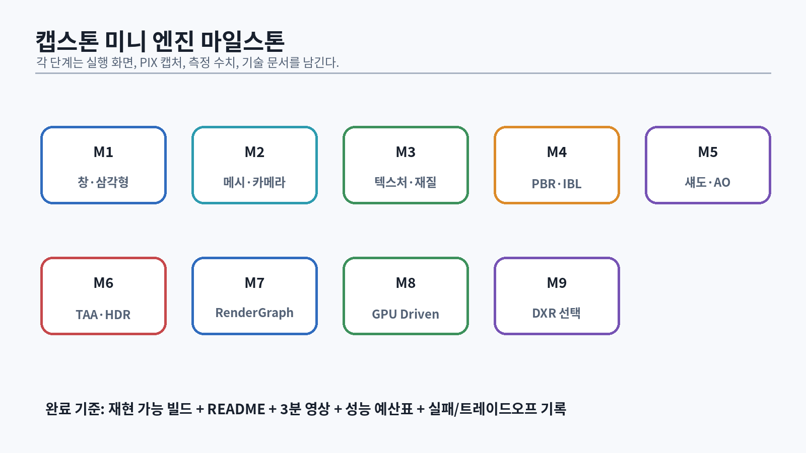

# 107. 최종 프로젝트: 직접 만드는 DX12 미니 엔진

{#fig-capstone width=96%}

최종 프로젝트 이름은 예시로 `Aster Engine`이라 한다. 목표는 기능 목록을 최대화하는 것이 아니라, **작은 장면을 안정적으로 그리는 완결된 엔진과 검증 자료**를 만드는 것이다.

## 107.1 필수 기능

### Core/Platform

- Win32 window, resize, input, high-resolution timer
- logging, assertion, HRESULT context
- CMake presets와 reproducible build
- unit test executable

### D3D12 backend

- adapter/feature query
- graphics/copy queue, 선택적 compute queue
- frames-in-flight와 fence
- descriptor allocator
- upload/readback allocator
- resource state/barrier tracking
- swap chain, depth, HDR scene target

### Renderer

- mesh/material/texture
- camera, frustum culling
- GGX metallic/roughness PBR
- IBL
- Forward+ 또는 clustered deferred
- directional + local lights
- CSM + PCF
- HDR exposure/tone map
- TAA와 motion vector
- render graph

### Engine

- generation entity handle
- transform hierarchy
- sparse-set components
- asset ID/cook/runtime load
- job system
- render extraction
- editor 또는 debug UI

### 품질/진단

- debug views 10개 이상
- PIX markers와 timing report
- DRED report
- canonical test scenes
- README, architecture diagram, 3분 영상

## 107.2 선택 기능

한 개만 깊게 선택한다.

- GPU-driven rendering + ExecuteIndirect
- mesh shader/meshlet
- DXR reflection/shadow + denoise
- volumetric lighting
- animation graph + GPU skinning
- virtual texture/streaming
- area light LTC

선택 기능을 여러 개 반쯤 구현하는 것보다 하나를 capture와 기술 문서까지 완성한다.

# 108. 저장소 구조와 모듈 계약

```text
AsterEngine/
├─ CMakeLists.txt
├─ CMakePresets.json
├─ cmake/
├─ assets_src/
├─ assets_cooked/
├─ shaders/
│  ├─ Common/
│  ├─ PBR/
│  ├─ Lighting/
│  ├─ Post/
│  └─ RayTracing/
├─ src/
│  ├─ AsterCore/
│  ├─ AsterPlatformWin32/
│  ├─ AsterRhi/
│  ├─ AsterD3D12/
│  ├─ AsterRenderGraph/
│  ├─ AsterRenderer/
│  ├─ AsterWorld/
│  ├─ AsterAssets/
│  ├─ AsterEditor/
│  └─ Sandbox/
├─ tests/
├─ tools/
│  ├─ AssetCooker/
│  └─ ShaderCompiler/
├─ benchmarks/
└─ docs/
```

의존 방향:

```text
Sandbox/Editor
  → World/Assets/Renderer
  → RenderGraph/RHI
  → D3D12/Platform
  → Core
```

`Core`가 D3D12를 include하면 안 된다. `World`가 descriptor index를 직접 관리하지 않는다. 모듈 경계는 CMake target과 include visibility로 강제한다.

# 109. 16개 마일스톤

## M1. 수학과 테스트

산출물:

- vector/matrix/quaternion
- view/projection/reversed-Z
- transform round-trip tests

통과:

- local→clip 계산을 수작업 예와 비교
- inverse error tolerance 기록

## M2. Win32와 D3D12 triangle

- debug layer
- adapter query report
- resize-safe swap chain
- triangle

통과:

- resize/minimize/restore 100회
- validation error 0

## M3. Frame context

- 2–3 frames in flight
- allocator/list reset
- fence wait
- GPU object retirement

통과:

- artificial GPU delay에서 corruption 없음

## M4. Resource system

- committed buffer/texture
- upload batch
- descriptor allocator
- barrier tracker

통과:

- 100 textures async upload
- fence 전 재사용 테스트

## M5. Mesh와 camera

- indexed mesh
- camera controller
- depth test/reversed-Z
- frustum culling

통과:

- 10k object benchmark

## M6. Material/PBR

- base color/normal/ORM
- GGX direct light
- debug material grid

통과:

- white furnace와 NaN test

## M7. IBL

- irradiance/SH
- prefiltered specular
- BRDF LUT

통과:

- roughness grid와 reference compare

## M8. Light culling

- Forward+ 또는 clustered
- local light list
- heatmap/overflow

통과:

- 1/16/64/256/1024 light scaling chart

## M9. Shadows

- CSM
- PCF
- stabilization

통과:

- cascade color view, camera pan shimmer test

## M10. Render graph

- pass/resource declaration
- topological sort
- culling
- transient lifetime/barriers

통과:

- graph visualization
- 의도적 cycle/error report

## M11. HDR/Post

- histogram exposure
- tone mapping
- bloom

통과:

- 실내/실외 전환 video

## M12. Temporal

- previous transform
- velocity
- TAA
- history reset

통과:

- canonical ghosting scenes

## M13. Engine data

- entity/component/transform
- job system
- render extraction

통과:

- 100k entities, stale handle tests

## M14. Asset pipeline

- source import
- cook/version/hash
- async load/hot reload

통과:

- broken asset fallback, shader compile error recovery

## M15. 선택 기능

하나를 논문/공식 사양과 함께 구현한다.

## M16. 최적화와 포트폴리오

- PIX timing capture
- performance budget
- architecture document
- demo build/video

# 110. Performance Budget

예시 60fps/1440p budget:

| 구간 | 목표 |
|---|---:|
| CPU simulation | 2.0 ms |
| CPU extraction/culling | 1.5 ms |
| CPU command recording | 2.0 ms |
| GPU depth/G-buffer | 2.5 ms |
| GPU shadows | 2.0 ms |
| GPU lighting | 3.0 ms |
| GPU temporal/post | 3.0 ms |
| GPU 기타/여유 | 4.0 ms |

합은 단순 합산이 아닐 수 있다. CPU/GPU overlap과 async queue를 timeline으로 표시한다. 예산은 장면별 worst-case와 p95를 가진다.

# 111. 코드 리뷰 Gate

각 pull request에서 확인한다.

## C++/수명

- 소유자가 명확한가?
- frame을 넘는 pointer/reference가 안전한가?
- move/copy semantics가 의도와 맞는가?
- hot path allocation이 있는가?
- error path와 partial construction이 안전한가?

## D3D12

- resource state와 queue ownership이 맞는가?
- descriptor/resource를 fence 전에 재사용하지 않는가?
- alignment/format/sample count가 검증되는가?
- feature query와 fallback이 있는가?
- debug name/PIX marker가 있는가?

## Shader

- coordinate/color space가 명시되는가?
- NaN/zero denominator를 처리하는가?
- divergence, texture sample, bandwidth 비용이 측정됐는가?
- temporal history invalidation이 있는가?
- debug view가 있는가?

## 테스트/문서

- 실패 case test가 있는가?
- capture/수치가 있는가?
- tradeoff가 기록됐는가?
- 외부 코드/논문의 출처와 라이선스가 명시되는가?

# 112. 포트폴리오 README 템플릿

```markdown
# Aster Engine

## 30초 소개
DirectX 12 기반 학습용 실시간 렌더링 엔진. ...

## 영상과 실행 파일
- 3분 데모 영상
- Windows x64 release
- GPU 요구사항과 fallback

## 핵심 구현
- Render Graph
- Clustered lighting
- GGX PBR/IBL
- CSM/TAA
- 선택 기능

## 아키텍처
[diagram]

## 기술적 문제 1: ...
가설 / 조사 / 해결 / 결과 / 부작용

## 성능
테스트 PC, 해상도, 장면, PIX capture

## 논문/참고자료
각 기능과 구현 차이

## 빌드
Visual Studio, Windows SDK, CMake, DXC

## 한계와 다음 단계
```

채용 담당자가 3분 안에 다음을 알 수 있어야 한다.

- 무엇을 직접 구현했는가
- 왜 그 구조를 선택했는가
- 실제로 동작하는가
- 성능을 측정했는가
- 실패와 한계를 이해하는가

# 113. 기술 문서 템플릿

```text
제목:
문제 정의:
목표/비목표:
사용자 또는 엔진 요구:
설계 대안:
선택안과 이유:
데이터 구조/API:
수명과 동기화:
GPU/CPU 비용 모델:
실패 모드:
검증 계획:
측정 결과:
알려진 한계:
참고 논문/사양:
```

논문을 인용할 때 “이 논문을 사용했다”가 아니라 다음을 적는다.

- 논문의 원래 문제와 가정
- 구현한 부분
- 생략하거나 바꾼 부분
- 실시간 엔진 제약에서의 근사
- 결과와 reference 비교

# 114. 일본 게임회사 면접용 설명 틀

사용자는 일본 취업을 목표로 하므로 핵심 용어를 일본어로도 말할 수 있어야 한다.

| 한국어 | 일본어 면접 표현 |
|---|---|
| 리소스 수명 | リソースのライフタイム |
| 소유권 | 所有権 |
| 동기화 | 同期処理 |
| 배리어 | リソースバリア |
| 병목 | ボトルネック |
| 측정 | 計測 |
| 재현 조건 | 再現条件 |
| 드로우콜 | ドローコール |
| 가시성 판정 | 可視性判定 / カリング |
| 물리 기반 렌더링 | 物理ベースレンダリング |
| 그림자 떨림 | シャドウのちらつき |
| 시간적 누적 | 時間方向の蓄積 |
| 절충 | トレードオフ |

답변 구조:

```text
課題は何だったか
→ どのように計測したか
→ 原因をどう切り分けたか
→ なぜその設計を選んだか
→ 数値がどう改善したか
→ どんな副作用・限界があるか
```

예:

```text
10万個のインスタンスでCPU側の可視性判定と
コマンド記録がボトルネックになっていました。
PIXとCPUプロファイラで切り分けた結果、...
```

# 115. “마스터” 판정표

## Level 1: 구현자

- 공식 샘플 없이 triangle/resource/upload를 재구현
- PBR, shadow, TAA의 기준 버전 완성
- validation error를 스스로 해결

## Level 2: 분석자

- PIX로 CPU/GPU 병목 분류
- 품질/성능 tradeoff 실험
- 논문의 estimator와 근사를 설명

## Level 3: 설계자

- render graph, asset pipeline, job system의 수명/의존성을 설계
- feature fallback과 platform budget을 정의
- 다른 엔지니어가 사용할 API와 debug path 제공

## Level 4: 출시 경험자

- 여러 GPU/driver에서 문제 해결
- memory pressure, device removed, shader cache, hitch 대응
- QA/아트/기획과 품질 기준 운영

이 책과 프로젝트는 Level 1–2를 강하게 만들고 Level 3의 기반을 제공한다. Level 4는 실제 제품 개발과 출시가 필요하다.

# 116. 최종 구술 시험

다음 질문에 코드/그림/수치로 답한다.

1. D3D12에서 command allocator를 GPU 완료 전에 reset하면 왜 안 되는가?
2. descriptor와 resource lifetime이 왜 별개인가?
3. render graph가 barrier를 어떻게 생성하는가?
4. reversed-Z가 precision을 개선하는 이유는 무엇인가?
5. GGX BRDF의 D/F/G는 각각 무엇인가?
6. clustered light culling overflow를 어떻게 처리하는가?
7. shadow bias와 peter-panning의 tradeoff는 무엇인가?
8. TAA history가 언제 유효하지 않은가?
9. sparse-set remove가 component pointer를 왜 무효화하는가?
10. GPU-driven rendering이 작은 scene에서 손해일 수 있는 이유는?
11. async compute가 pass duration을 늘려도 frame을 줄일 수 있는 이유는?
12. ray-traced reflection의 texture LOD 문제는 무엇인가?
13. SVGF의 variance가 왜 필요한가?
14. hot reload한 PSO를 즉시 파괴하면 왜 위험한가?
15. 성능 개선을 재현 가능한 실험으로 어떻게 보고하는가?

**최종 통과 조건:** 질문의 정의를 말하는 데 그치지 않고, 자신의 엔진 코드 위치·PIX 캡처·실패 사례를 연결해 설명한다.
